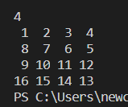

# Java Algorithm

---

## 숫자 사각형.

1. 입력된 수(N) 만큼 `N행 , N열` 형태로 연속으로 출력되는 숫자 사각형을 출력하시오.

     ```java
     //입력 : 4
     //출력 :  1  2  3  4
     //	      5  6  7  8
     //        9 10 11 12
     //       13 14 15 16    
     ```

     * 중첩 반목문을 이용. (`for or while`)

     ```java
     import java.util.Scanner;
     
     public class NumberRect_01 {
     	public static void main(String[] args) {
     		Scanner scan = new Scanner(System.in);
     		int n = scan.nextInt();
     		// 2차원 배열을 선언하여 수를 저장.
     		int arr[][] = new int[n][n];
     		
             // 이중 중첩문(for 문) 을 이용하여 2차원 배열을 순회.
     		for(int i = 0; i < n; i++) {
     			for(int j = 0; j < n ; j++) {
                     // 2차원 배열에 순서대로 수 저장.
     				arr[i][j] = (i*n)+j+1;
     			}
     		}
             
     		// 배열 출력
     		for(int i = 0; i < n; i++) {
     			for(int j = 0; j < n ; j++) {
     				System.out.printf("%2d ",arr[i][j]);
     			}
                 // 개행
     			System.out.println();
     		}
     		
     		
     	}
     }
     ```

     * 결과

     

2. 입력된 수(N) 만큼 `N행 , N열` 형태로 아래의 결과처럼 출력되는 숫자 사각형을 출력하시오.

     ```java
     //입력 : 4
     //출력 :  1  2  3  4
     //	      8  7  6  5
     //        9 10 11 12
     //       16 15 14 13    
     ```

     * 중첩 반복문 이용.

     ```java
     public class NumberRect_02 {
     	public static void main(String[] args) {
     		Scanner scan = new Scanner(System.in);
     		int n = scan.nextInt();
     		
     		int arr[][] = new int[n][n];
     		
     		for(int i = 0; i < n; i++) {
                 // (0,2,4...)번째 줄
                 if(i%2==0)
     			    for(int j = 0; j < n ; j++) {
     				    arr[i][j] = (i*n) + j + 1;
                     }
                 // (1,3,5...)번째 줄
                 else{
                     for(int j = n-1; j >=0 ; j--) {
                         // 역순으로 숫자 저장.
                         // n 의 크기에 따라 숫자값 지정!
     				    arr[i][j] = (i*n) + ( n - j );
                     }
             }
                 
     		}
     		
     		for(int i = 0; i < n; i++) {
     			for(int j = 0; j < n ; j++) {
     				System.out.printf("%2d ",arr[i][j]);
     			}
     			System.out.println();
     		}
     		
     		
     	}
     }
     ```

     * 결과

     

3. 입력된 수(N) 만큼 `N행 , N열` 형태로 아래의 결과처럼 출력되는 숫자 사각형을 출력하시오.

     ```java
     //입력 : 4
     //출력 :  1  5  9 13
     //	      2  6 10 14
     //        3  7 11 15
     //        4  8 12 16  
     ```

     * 중첩 반복문 사용

     ```java
     package com.algorithm.number_rect;
     
     import java.util.Scanner;
     
     public class NumberRect_03 {
     	public static void main(String[] args) {
     		Scanner scan = new Scanner(System.in);
     		int n = scan.nextInt();
     		
     		int arr[][] = new int[n][n];
     		
     		for(int i = 0; i < n; i++) {
              		// 1번 문제에서 배열의 j 와 i 의 위치를 바꾸어 순서를 정함.  
     			    for(int j = 0; j < n ; j++) {
     				    arr[j][i] = (i*n) + j + 1;
                     }           
                     
             }
                 
     		
     		
     		for(int i = 0; i < n; i++) {
     			for(int j = 0; j < n ; j++) {
     				System.out.printf("%2d ",arr[i][j]);
     			}
     			System.out.println();
     		}
     		
     		
     	}
     }
     
     ```

     * 결과

     

4. 입력된 수(N) 만큼 `N행 , N열` 형태로 아래의 결과처럼 출력되는 숫자 사각형을 출력하시오.

     ```java
     //입력 : 4
     //출력 :   1  2   3  4
     //	      2  4   6  8
     //        3  6   9 12
     //        4  8  12 16  
     ```

     * 중첩 반복문 사용.

     ```java
     package com.algorithm.number_rect;
     
     import java.util.Scanner;
     
     public class NumberRect_04 {
     	public static void main(String[] args) {
     		Scanner scan = new Scanner(System.in);
     		int n = scan.nextInt();
     		
     		int arr[][] = new int[n][n];
     		
     		for(int i = 0; i < n; i++) {
                
     			    for(int j = 0; j < n ; j++) {
                         // 0번째 1의 배수 
                         // 2번째줄 2의 배수...
                         // n번째줄 n의 배수
     				    arr[i][j] = (i+1)*(j+1);
                     }           
                     
             }
                 
     		
     		
     		for(int i = 0; i < n; i++) {
     			for(int j = 0; j < n ; j++) {
     				System.out.printf("%2d ",arr[i][j]);
     			}
     			System.out.println();
     		}
     		
     		
     	}
     }
     
     ```

     * 결과
     
     