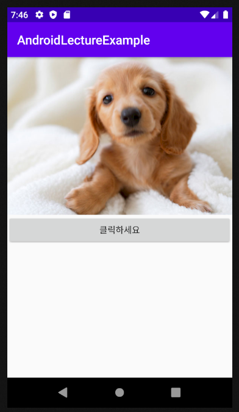
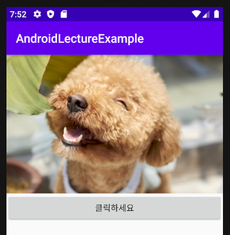
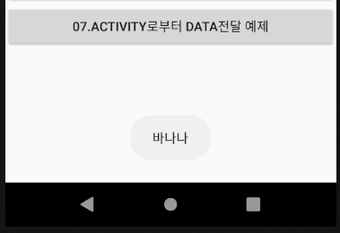

# 2020-03-19

---

## 이벤트

1. 이벤트를 통한 이미지 변경

   * 이미지 저장 위치 : `res / drawble` 폴더
   * 저장된 이미지는 확장자와 상관없이 이름으로 구별함.(모두 상수취급) => 확장자가 달라도 이름이 같으면 구별할 수 없다.
   * 이미지 변경을 이용할 xml 파일 작성

   ```xml
   <?xml version="1.0" encoding="utf-8"?>
   <LinearLayout xmlns:android="http://schemas.android.com/apk/res/android"
       android:layout_width="match_parent"
       android:layout_height="match_parent"
       android:orientation="vertical">
   
       <ImageView
           android:id="@+id/_03_01_iv"
           android:layout_width="wrap_content"
           android:layout_height="wrap_content"
           android:adjustViewBounds="true"
           android:scaleType="fitCenter"
           android:src="@drawable/dog2"/>
       <!--이미지를 중앙에 위치하게 놓는 속성. src는 확장자는 포함이 안된다. 이름이 달라야함.(상수로 사용하기 떄문.)-->
       <Button
           android:layout_width="match_parent"
           android:layout_height="wrap_content"
           android:text="@string/buttonString"
           android:id="@+id/_03_02_imageChangeBtn"/>
   
   </LinearLayout>
   ```

   

   * `Activity` 에서 버튼 클릭에 대한 이벤트를 추가.
     * 먼저 사용될 `ImageView` 객체를 가져옴.
     * 내용을 변경하기 위해서 `final`을 이용하여 상수로 선언하거나 `Class`내의 `Field` 변수로 선언하여 사용가능.

   ```java
   public class Example03_Event2Activity extends AppCompatActivity {
   
       private ImageView iv; //Field 변수. heap 영역에 저장됨.
       Boolean flag=true; // 이미지 토글을 사용하기위해 flag변수를 선언함.
       @Override
       protected void onCreate(Bundle savedInstanceState) {
           super.onCreate(savedInstanceState);
           setContentView(R.layout.activity_example03_event); 
           //final ImageView iv = (ImageView)findViewById(R.id._03_01_iv); 상수선언시 코드
           iv = (ImageView)findViewById(R.id._03_01_iv);
   ```

   * 버튼에 대한 이벤트 작성

   ```java
   Button btn = (Button)findViewById(R.id._03_02_imageChangeBtn);
           // findViewById앞에 this.이 생략되있음. 현재 Activity에서 찾음. 다른 Activity로 지정하면 다른 Activity에서 찾는다.
           btn.setOnClickListener(new View.OnClickListener(){
               @Override
               public void onClick(View v) {
                   if(flag) {
                       iv.setImageResource(R.drawable.dog1);
                       // 이미지 변경 method. 매개변수 : 상수값.(이미지resource)
                   }else{
                       iv.setImageResource(R.drawable.dog2);
                   }
                   flag=!flag;
               }
           });
   ```

   * id를 통해 객체를 가져올때 `findViewById` 매서드는 앞에 `this.`이 생략되어있다. 

   * 이는 가져올 `id` 값이 현재사용중인 `Activity`를 의미한다.

   * 결과

     * 버튼 누르기전

     

     * 버튼 누른후

     

   

### Activity 이벤트

* Activity는 자체적으로 `Touch`이벤트를 처리하는 매서드가 존재한다.
* `onTouchEvent`를 `override`를 해주어 사용!

#### Toast message

* 알림창.

* `Toast` 클래스 이용.

  ```java
  package com.example.androidlectureexample;
  
  import androidx.appcompat.app.AppCompatActivity;
  
  import android.os.Bundle;
  import android.view.MotionEvent;
  import android.widget.Toast;
  
  public class Example04_TouchEventActivity extends AppCompatActivity {
  
      @Override
      protected void onCreate(Bundle savedInstanceState) {
          super.onCreate(savedInstanceState);
          setContentView(R.layout.activity_example04__touch_event);
      }
  
      //onClick에서 view v는 클릭한 객체가 들어옴.
      // onTouchEvent에서는 Touch한 객체의 정보가 들어온다. (터치한 좌표 등.)
      @Override
      public boolean onTouchEvent(MotionEvent event) {
          // Toast message를 이용해보자.
          Toast.makeText(this,"ㅏㅏㅏㅏㅏㅏㅏㅏㅏㅏ",
                  Toast.LENGTH_SHORT).show(); // static method (Activity(컨택스트)객체, Character Sequence, 지속시간)
          // 지속시간은 Toast 객체가 상수로 갖고 있다. LENGTH_SHORT, LENGTH_LONG
          // 컨텍스트는 Activity가 갖고 있음. is a 관계.
          // show() 매서드를 통해 화면에 띄움!
          return super.onTouchEvent(event);
      }
  }
  
  ```

* 화면 터치하면

  

* 터치 이벤트는 눌렀을때, 유지할때, 터치를 때었을때 3가지 모두 반응.

* `onTouchEvent` 에서 `log`가 두번 실행(터치했을때, 손가락을 땠을때.) 

  

  

#### Swipe 터치 이벤트

* `Touch` 이벤트의 눌렀을때 땠을때 두 터치 이벤트를 사용하여 `Swipe` 기능을 구현할 수 있다.
* `event` 객체를 이용하여 터치 순간의 객체의 정보를 받을 수 있다. 
* 


---

> Java lambda식 : 식이 간단하게 표현한 것.
>
> 


---

## Activity 간 Data 교환

### 1. 데이터 전송

* Aler창 (dialog) 를 이용하여 문자열을 입력받고 입력받은 문자열을 다음 `Activity`로 전달.

* 사용자가 문자열을 입력할 수 있는 widget을 하나 생성 (`MainActivity`에서 진행.)

* `builder` 를 통해 `AlertDialog` 를 생성한다.

* `EditText` 객체를 이용하여 입력받을 문자열을 받는다.

* 전달 전에 `Intent`에 `EditText`를 `putExtra()` 매서드를 이용하여 부착하여 전달한다.

  ```java
  utton _06_SendMessageBtn =
                  (Button) findViewById(R.id._06_SendMessageBtn);
          _06_SendMessageBtn.setOnClickListener(new View.OnClickListener() {
              @Override
              public void onClick(View v) {
               // Aler창 (dialog) 를 이용하여 문자열을 입력받고 입력받은 문자열을 다음 `Activity`로 전달.
  
                  // 사용자가 문자열을 입력할 수 있는 widget을 하나 생성
                  final EditText edittext = new EditText(MainActivity.this); //(컨텍스트 객체)
                  // AlertDialog를 하나 생성.
                  AlertDialog.Builder builder =
                          new AlertDialog.Builder(MainActivity.this);// Diaglog 만드는놈. 컨텍스트 추가
                  builder.setTitle("Activity 데이터 전달"); //제목
                  builder.setMessage("다음 Activity에 전달할 내용을 입력하세요");
                  builder.setView(edittext); // 입력상자
                  builder.setPositiveButton("전달", new DialogInterface.OnClickListener() {
                      @Override
                      public void onClick(DialogInterface dialog, int which) {
                          // 전달을 눌렀을때 수행되는 이벤트 처리작업을 하면된다.
                          Intent i = new Intent();
                          ComponentName cname = new ComponentName("com.example.androidlectureexample",
                "com.example.androidlectureexample.Example06_SendMessageActivity");
                          i.setComponent(cname);
                          // 데이터를 전달해서 Activity를 시작해야 한다.
                          i.putExtra("sendMSG",
                                  edittext.getText().toString()); // getText()는 문자열이 아닌 Character Sequence로 가져옴.
                          startActivity(i);
                      }
  
                  }); // (텍스트, 이벤트핸들러)
                  builder.setNegativeButton("취소", new DialogInterface.OnClickListener() {
                      @Override
                      public void onClick(DialogInterface dialog, int which) {
                          // 취소버튼이기 때문에 특별한 이벤트 처리가 필요없다.
                      }
                  });
                  builder.show();
              }
  ```

### 2. 데이터 수신

* 전달된 `Intent`를 획득.

  ```java
  package com.example.androidlectureexample;
  
  import androidx.appcompat.app.AppCompatActivity;
  
  import android.content.Intent;
  import android.os.Bundle;
  import android.view.View;
  import android.widget.Button;
  import android.widget.TextView;
  
  public class Example06_SendMessageActivity extends AppCompatActivity {
  
      @Override
      protected void onCreate(Bundle savedInstanceState) {
          super.onCreate(savedInstanceState);
          setContentView(R.layout.activity_example06_send_message);
  
          // xml에 정의되어 있는 component의 reference를 획득.
          TextView tv = (TextView)findViewById(R.id._06_01_msgTv);
          Button clseBtn = (Button)findViewById(R.id._06_02_closeBtn);
          // 이 Activity에게 전달된 Intent를 획득
          Intent i = getIntent();
          String msg = (String)(i.getExtras().get("sendMSG")); // get의 return 형태는 Object형태
          tv.setText(msg);
  
          clseBtn.setOnClickListener(new View.OnClickListener(){
              @Override
              public void onClick(View v) {
                  Example06_SendMessageActivity.this.finish(); // Activity 종료하는 method
              }
          });
      }
  }
  ```

### 3. Data를 들고오기.

* 버튼을 통해 `Activity` 이동후, 이동한 `Activity`에서 `Data`를 가져오는 예제.

* 먼저 `MainActivity`에서 데이터를 가져올 `Activity`로 이동할 때 기존에 사용했던 `startActivity` 매서드와는 달리 `startActivityForResult` 매서드를 이용하여 `Activity`를 이동.

  * `startActivityForResult`매서드를 이용하면 이동한 `Activity`로 부터 다시 되돌아왔을때 받아오는 `Data`가 있음을 의미한다.
  * `startActivityForResult` 매서드는 매개변수로 `Intent`와 `requestCode`가 있어야한다.
  * 여기서 `requestCode`는 유니크한 숫자로 어느 `Activity`에서 통신이 이루어 졌는지 알기 위한 코드이다.

  ```java
  Button _07_DataFromBtn =
                  (Button) findViewById(R.id._07_DataFromBtn);
          _07_DataFromBtn.setOnClickListener(new View.OnClickListener() {
              @Override
              public void onClick(View v) {
                  Intent i = new Intent();
                  ComponentName cname = new ComponentName("com.example.androidlectureexample",
                          "com.example.androidlectureexample.Example07_DataFromActivity");
                  i.setComponent(cname);
                  // 새로 생성되는 Activity로부터 데이터를 받아오기 위한 용도
                  // 두번째 Activity가 finsh되는 순간 데이터를 받아옴.
                  startActivityForResult(i,3000); //(Intent,requestCode) Code는 숫자의미x 유니크한값으로 맘대로 지정.
                  //requestCode : 호출한 Activity를 판별하기 위한 코드.
              }
          });
  ```

  

1. `xml `

   * `Spinner` 를 통해 리스트를 만들예정.
   * `Spinner`안에 들어갈 내용은 Activity 에서 부착할 예정.

   ```xml
   <?xml version="1.0" encoding="utf-8"?>
   <LinearLayout xmlns:android="http://schemas.android.com/apk/res/android"
       android:layout_width="match_parent"
       android:layout_height="match_parent"
       android:orientation="vertical">
       <Spinner
           android:layout_width="match_parent"
           android:layout_height="wrap_content"
           android:id="@+id/_07_01_mySpiner" />
       <Button
           android:layout_width="match_parent"
           android:layout_height="wrap_content"
           android:text="이전 Activity로 데이터전송"
           android:id="@+id/_07_02_SendBtn"/>
   
   </LinearLayout>
   ```

2. 사용할 Activity

   * `Spinner`에서 선택된 내용을 받아올 변수 `result`를 `Filed`변수로 선언!

   ```java
   public class Example07_DataFromActivity extends AppCompatActivity {
       private String result;
   ```

   * `Spinner`에 표현될 데이터를 `ArrayList`를 이용하여 생성.

   ```java
   final ArrayList<String> list = new ArrayList<String>();
           list.add("포도");
           list.add("딸기");
           list.add("바나나");
           list.add("사과");
   ```

   * 사용할 `Spinner`객체를 선언

   ```java
    Spinner spinner = (Spinner)findViewById(R.id._07_01_mySpiner);
   ```

   

   * `Spinner`에 내용을 추가할 때!
   * `Adapter`를 이용하여 들어갈 내용을 넣을수 있다.
     * `Adapter`의 종류는 다양함 -> 여기서는 Dropdown을 이용.
   * `ArrayList`를 이용하여 `Adapter`에 추가할 내용들을 받아서 주입시킨다.
     * 사용하는 `Adapter` : `ArrayAdapter`

   ```java
   ArrayAdapter adapter = new ArrayAdapter(getApplicationContext(),
                   android.R.layout.simple_spinner_dropdown_item,list);
   // Activity의 method중에서 getApplicationContext() method를 이용하여 사용될 Context를 가져올 수 있다.
   // ArrayAdapter(컨텍스트객체, 스피너종류(상수), 사용할 데이터)
   ```

   * 작성한 `Adapter`를 `Spiner`에 부착시켜준다.

   ```java
   // Adapter를 통해 데이터를 Spinner에 부착.
           spinner.setAdapter(adapter);
   ```

3. Activity 에서 선택된 스피너 객체를 가져오기 위해서 선택된 스피너의 정보를 가져올 수 있는 이벤트가 필요하다.

   * `setOnItemSelectedListener` 를 통해 `Spinner`에 대한 선택 이벤트를 처리할 수 있다.

   ```java
   spinner.setOnItemSelectedListener(new AdapterView.OnItemSelectedListener() {
               @Override
               public void onItemSelected(AdapterView<?> parent, View view, int position, long id) {
                   // position : 여러개의 아이템중 몇번째를 선택한지에 대한 위치.
                   result = list.get(position);
                   Log.i("SELECTED",result+"가 선택되었어요!!");
               }
   
               @Override
               public void onNothingSelected(AdapterView<?> parent) {
   
                   // 익명이너클래스로 선언했기 때문에 오버라이딩을 해야하지만
                   // 사용하지 않아서 작성은 안함.
               }
           });
   ```

   * 이벤트 처리시 익명 이너클래스를 이용하여 처리.
   * `OnItemSelectedListener` 인터페이스는 2개의 `method`를 오버라이딩 해야한다.
     1. `onItemSelected method` : `Spinner`선택에 관련된 매서드.
        * 매개변수중 `position` 변수가 `Spinner` 안의 여러개의 아이템중 선택된 아이템의 순서를 표현함.(0부터)
        * `result` 변수에 선택된 `Spinner`의 포지션에 맞는 데이터를 `list`객체에서 찾아 저장한다.
     2. `onNothingSelected method` : `Spinner`가 선택되지 않았을 떄 사용하는 매서드이나 이번 예제에서는 사용하지 않아 비어있는 매서드로 오버라이딩을 함.
   * 버튼을 누르면 저장된 `result` 변수를 이전 `Activity`로 전달하기 위해 버튼 이벤트 처리.

   ```java
   Button sendBtn = (Button)findViewById(R.id._07_02_SendBtn);
           sendBtn.setOnClickListener(new View.OnClickListener(){
               @Override
               public void onClick(View v) {
                   Intent returnIntent = new Intent();
                   returnIntent.putExtra("ResultValue",result);
                   //Activity 결과로 셋팅하겠다는 의미.
                   setResult(7000,
                           returnIntent); //resultCode, 전달할 Data
                   Example07_DataFromActivity.this.finish(); // 그냥 닫으면 됨.
                   // Main에서 startActivityForResult로 현재 Activity를 가져왔기 때문에 닫으면 Data가 전송됨.
               }
           });
   ```

   * 익명 이너클래스를 사용하여 `onClick`이벤트를 부여함.
     * 여기서 보내줄 `result` 데이터는 `Intent`객체를 이용하여 전송한다.
     * 이전 `Activity`에서 `startActivityForResult`를 통해 현재 `Activity`로 이동했으니 그에대한 응답으로 넘겨줄 데이터를 `setResult`매서드를 이용한다.
     * `setResult` 매서드도 `Activity`판별을 위해 `resultCode`값을 부여한다.
   * `Example07_DataFromActivity` 전체코드

   ```java
   package com.example.androidlectureexample;
   
   import androidx.appcompat.app.AppCompatActivity;
   
   import android.content.Intent;
   import android.os.Bundle;
   import android.util.Log;
   import android.view.View;
   import android.widget.AdapterView;
   import android.widget.ArrayAdapter;
   import android.widget.Button;
   import android.widget.ScrollView;
   import android.widget.Spinner;
   
   import java.util.ArrayList;
   
   public class Example07_DataFromActivity extends AppCompatActivity {
       private String result;
   
       @Override
       protected void onCreate(Bundle savedInstanceState) {
           super.onCreate(savedInstanceState);
           setContentView(R.layout.activity_example07_data_from);
   
           // Spinner 안에 표현될 데이터 만들기.
           // 우리 예제에서는 Spinner안에 표현될 데이터를 문자열로 지정.
           final ArrayList<String> list = new ArrayList<String>();
           list.add("포도");
           list.add("딸기");
           list.add("바나나");
           list.add("사과");
   
           // Spinner의 reference를 획득
           Spinner spinner = (Spinner)findViewById(R.id._07_01_mySpiner);
           // Spinner를 이용하기 위해 Adapter가 필요함.(Adapter의 종류가 다양하다.)
           // (컨텍스트객체 가져옴(뭔진 모르겠지만..), 스피너의 타입(상수),사용할데이터)
           ArrayAdapter adapter = new ArrayAdapter(getApplicationContext(),
                   android.R.layout.simple_spinner_dropdown_item,list);
           // Adapter를 통해 데이터를 Spinner에 부착.
           spinner.setAdapter(adapter);
   
           // spinner의 event처리.
           spinner.setOnItemSelectedListener(new AdapterView.OnItemSelectedListener() {
               @Override
               public void onItemSelected(AdapterView<?> parent, View view, int position, long id) {
                   // position : 여러개의 아이템중 몇번째를 선택한지에 대한 위치.
                   result = list.get(position);
                   Log.i("SELECTED",result+"가 선택되었어요!!");
               }
   
               @Override
               public void onNothingSelected(AdapterView<?> parent) {
   
                   // 익명이너클래스로 선언했기 때문에 오버라이딩을 해야하지만
                   // 사용하지 않아서 작성은 안함.
               }
           });
   
           Button sendBtn = (Button)findViewById(R.id._07_02_SendBtn);
           sendBtn.setOnClickListener(new View.OnClickListener(){
               @Override
               public void onClick(View v) {
                   Intent returnIntent = new Intent();
                   returnIntent.putExtra("ResultValue",result);
                   //Activity 결과로 셋팅하겠다는 의미.
                   setResult(7000,
                           returnIntent); //resultCode, 전달할 Data
                   Example07_DataFromActivity.this.finish(); // 그냥 닫으면 됨.
                   // Main에서 startActivityForResult로 현재 Activity를 가져왔기 때문에 닫으면 Data가 전송됨.
               }
           });
       }
   }
   
   ```

4. 받아온 데이터를 `MainActivity`에서 `Dialog`를 이용하여 확인하기

   * `Activity` 객체 내에 존재하는 `onActivityResult` 란 `callback method`를 오버라이딩 하여 확인이 가능하다.

   ```java
   @Override
       protected void onActivityResult(int requestCode, int resultCode, @Nullable Intent data) {
           super.onActivityResult(requestCode, resultCode, data);
           if(requestCode==3000 && resultCode == 7000){
               String msg = (String)data.getExtras().get("ResultValue");
               Toast.makeText(this,msg,Toast.LENGTH_SHORT).show();
           }
   ```

   * `onActivityResult` 매서드 내에서 `requestCode`와 `resultCode`를 판별하여 특정 로직을 수행한다.

     * 가져온 데이터는 매서드 내의 `data`라는 `Intent`객체 내에 존재한다.
     * `data` 객체 내에 존재하는 키값이 `ResultValue`로 되어있는 `Data`를 가져와 `msg`변수에 저장한후 `Toast Message`를 이용하여 화면에 보여줌.

     

     * 버튼을 누르면!!

     

   

---

## Thread

### 개념

* `Multiprocessing`
  * `Task(일,작업,프로그램 1개)`를 실행하는 실제 `core(processor)`가 두개 이상인 것.
  * 같은 시간에서 여러개의 `core`가 여러개 있어서 동시에 연산처리 진행.
* `MultiTasking`
  * 하나의 `core`가 `Time slicing(시분할)` 을 이용하여 여러개의 `Task`를 마치 동시에 수행되는 것처럼 보이게 하는 기법.
  * 여러개의 프로그램을 시분할 능력으로 여러 프로그램을 순서대로 실행하여 마치 동시에 실행하는 것 처럼 보이는 것.
* `MultiThreading`
  * 하나의 `Task`을 여러개의 `Sub Task`로 분할하여 동시간대에, 혹은 마치 동시간에 실행되는 것처럼 만드는 기법. 
  * 예) 1부터 100까지 더하는 루프를 갖은 프로그램을 10개로 나누어 1~10, 11~20.. 으로 더하는 프로그램으로 나누어 10개로 나누어진 프로그램을 동시에 실행.
  * 이론상으로 `Task` 속도가 10배 늘어난 것과 같음.
  * `Thread`는 독립적인 실행 흐름이다.

