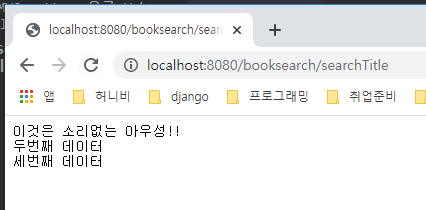

# 2020-03-24

---

## Web Application & Android App

### 1. 사용할 `DataBase` 스키마  확인.

   * 사용하는 `DBMS` : `MySQL`
   * 구축되어 있는 `Database` : `library` 라는 이름의 `DB`
   * `library Database` 안에 `book table`을 이용.
   * 데이터 확인 `Toad`
     * `mysql server`를 기동 : `mysqld` 

   

   * 현재 사용할 수 있는 계정의 `ID/PW : rdata/rdata`
   * 사용할 `Table Schema` 확인

   

   * `Table`의 `column명, primary key, data type` 등을 확인.

### 2. 도서검색 `Web Application` 구현

   * 일반적인 Web Application 작성.
   * `Servlet jsp`기반으로 `MVC`패턴으로 작성.
   * 사용하는 WAS : `Tomcat 7.0`
   * `Eclipse` 로 작업진행.

#### 1. `Dynamic Web Project` 생성

* 프로젝트 이름  : `BookSearchForAndroid`
* `Context Root` : `booksearch` >> Web 상에서 우리 프로젝트를 지칭하기 위해서 사용되는 논리적인 이름. 코드상에서 사용되는 이름. => 한글이나 특수문자 사용 불가능.


#### 2. `MVC pattern`으로 `Web Applicaton`을 구현.

* Web프로젝트 안에 여러가지 기능을 만들예정.

##### `Servelt`을 이용해서 아래기능을 구현.

  * Web에서 동작하는 `Java program` 중 하나 => `Servlet` (정확한 정의는 아니다.)

  1. 첫번째로 작성할 `Servlet` : keyword를 입력받아서 해당키워드가 들어있는 책의 제목들을 찾아서 출력하는 프로그램.

     * 패키지 이름: `com.test`

     * 클래스 이름 : `BookTitleSearchServlet`

     * `url mappint` : `/searchTitle` >> 지금 만들고 있는 웹 프로그램(servlet)을 클라이언트가 웹 상에서 지칭하기 위해 사용하는 논리적인 이름. `url mapping`은 `/` 로 시작한다.

       

     * `Servlet Code` 자동으로 생성.

     * 이 `Servlet`을 `web`에서 호출하는 방식은 크게 2가지 있다.

       1. `GET` : `browser(chrome)`를 이용하여 URL을 입력또는 URL lnk 클릭후 호출하는 방식.
          * 프로그램에게 데이터를 전달하기 위해서 URL을 이용.
          * 편하게 사용이 가능.
          * 전달하는 데이터 크기의 한계.
          * 보안성이 없다. url에 전송하는 데이터가 보임.
       2. `POST` : HTML `<form>` 에서 method를 `post`로 명시하여 호출하는 방식.
          * protoco의 head안에 전달하는 데이터가 포함되어 전달.
          * 전달하는 데이터의 크기에 제한이 없다.
          * 보안성이 상대적으로 있다.
       
     * 이 프로그램에서는 `GET`방식을 이용하여 `Servlet`을 호출.

       * Servlet 안에 `doGet` 매서드를 작성.

       ```java
       // 입력, 로직, 출력의 코드가 하나의 method안에 옹기종기 모여있게 된다. => Model1 방식.
       	// Model1 방식은 처음 작성하기에는 쉽고 빠른 방식이지만 추후에 유지보수가 안된다.
       	// Medel1 방식에서 Medel2방식으로 전환. -> MVC pattern을 이용.
       	protected void doGet(HttpServletRequest request, HttpServletResponse response)
       			throws ServletException, IOException {
       		// Get 방식으로 'Servlet' 이 호출되면 이 매서드가 호출된다.
       		// 1. 입력받고 ( 입력을 받는 방식도 정해져있다.)
       		// 2. 로직처리하고 ( 일반적인 로직처리 + DB처리 )
       		// 3. 출력
       		// 3-1. 클라이언트에 처리된 결과에 대한 종류, 인코딩에 대한 정보를 알려줘야함.
       		// 일반 문자역이 결과로 출력되고 사용하는 인코딩은 유니코드임을 나타내줌.
       		response.setContentType("text/plain; charset=utf-8");// MimeType
       		// 3-2. 클라이언트에게 결과를 보내주기 위한 데이터 통로를 열어야 한다.
       		PrintWriter out = response.getWriter();
       		// 3-3. 데이터 통로(Stream)을 통해서 데이터를 출력!!
       		out.println("이것은 소리없는 아우성!!");
       		out.println("두번째 데이터");
       		out.println("세번째 데이터");
       		// 3-4. 보낼 데이터가 다 준비되면 특정 method를 이용해서 진짜 보냄.
       		out.flush();
       		// 3-5. 처리가 끝났으니 통로를 닫음.
       		out.close();
       	}
       ```

     * Tomcat을 이용하여 우리 Web program을 Web에 deploy 시켜야 클라이언트가 사용할수 있다.

       * 클라이언트가 우리 프로그램을 호출하기 위한 URL
       * `http://localhost:8080/booksearch/searchTitle`

     

     * 위와 같은 코드는 `Model1` 방식으로 초기에 작성하기에는 편하나 유지보수가 안된다.
     * 이를 해결하기 위해 `Model2` 방식을 사용하며 그중 채태된 패턴이 바로 `MVC pattern`

  2. `MVC pattern`이용 `(Model - View - Controller)`

       1. `Controller` : 클라이언트가 보내주는 입력을 받고 처리된 최종 결과를 출력.
       2. `Service` : 로직을 처리하는 역할. `-> Model`
       3. `DAO (Data Access Object)` : 모든 Database의 처리.  `-> Model`
       4. `DTO (Data Transfer Object)` : `VO (Value Object)` ,  `DO (Domain Object)` , `Entity` `-> Model`
       5. `View` : 보여질 `HTML` 문서. 주로 `JSP` 이용. (요즘은 `JSON` 형태로 문자열로 넘겨주어 View를 작성 안하기도함)

     

     

     1. Controller 작성.

        * controller package 작성후 그 안에 controller의 역할을 하는 Servlet을 생성
        * `BookSearchTitleByKeywordServlet`
        * `url mapping` : `/searchTitlebyKeyword`

        

        ```java
        protected void doGet(HttpServletRequest request, HttpServletResponse response)
        			throws ServletException, IOException {
        		// 이부분을 작성한다.
        		// 1. 클라이언트가 보내주는 입력을 받는다.
        		// 입력은 무조건 String으로 받는다.
        		String keyword = request.getParameter("keyword"); // (key값) 클라이언트와 연결되는 부분.
        															// 클라이언트에게 keyword 라는 key값을 받아야함.
        
        		// 2. 로직처리를 하는 객체를 생성해서 그 객체(Service)한테 일을 시킨다.
        		// 그리고 결과를 다시 받아온다.
        		// 로직처리하는 객체(Service)가 존재해야 한다. 일반 자바 class.
        		BookService service = new BookService();
        		ArrayList<String> result = service.getBookTitle(keyword);
        
        		// 3. 처리된 결과를 클라이언트에게 출력한다.
        		response.setContentType("text/plain; charset=utf-8");
        		PrintWriter out = response.getWriter();
        
        		// 받아온 값 출력
        		for (String title : result) {
        			out.println(title);
        		}
        		out.flush();
        		out.close();
        
        	}
        ```

     2. Service 작성.

        * `Service`는 무조건 `business logic` 처리만 담당한다.

        ```java
        package com.test.service;
        
        import java.util.ArrayList;
        
        import com.test.dao.BookDAO;
        
        // 이 class는 Service class 이기 때문에 무조건 business logic 처리만 담당한다.
        public class BookService {
        
        	// keyword를 이용하여 책 제목의 ArrayList를 구해오는 method.
        	public ArrayList<String> getBookTitle(String keyword) {
        		// DB처리를 제외한 따로 처리해야 하는 로직코드가 없다.
        		
        		// DB 처리코드가 나와야 한다. 하지만 Service는 DB처리를 직접 하지 않는다.
        		// DB 처리를 하는 객체를 만들어서 그 객체에게 Database처리를 시키낟.
        		BookDAO dao = new BookDAO();
        		ArrayList<String> result = dao.select(keyword);
        		// 그 결과를 받아온다.
        		
        		return result;
        	}
        
        }
        ```

     3. DAO 작성

        

        * 사용되는 `1.Library`와 `JNDI`를 이용하기 위한 `2.xml`파일.

        

        

        ```java
        package com.test.dao;
        
        import java.sql.Connection;
        import java.sql.PreparedStatement;
        import java.sql.ResultSet;
        import java.util.ArrayList;
        
        import javax.naming.Context;
        import javax.naming.InitialContext;
        import javax.sql.DataSource;
        
        // Database 처리 전문 class.
        // JDBC의 처리 순서.
        // 1. 내가 사용하는 DBMS에 Driver Loading.
        // 2. Connection (Database 연결).
        // 3. Statement 생성.
        // 4. Query 실행(SQL문을 실행).
        // 5. 결과처리.
        // 6. 사용한 Resource 해제(Database close).
        
        // Transaction (일의 최소단위)
        // 이체 ( A로부터 B한테 5000원 이체)
        // 1. A게좌에 5000원이 있는지 select.
        // 2. B계좌가 존재하는지 확인 select.
        // 3. A계좌의 잔액에서 5000원 차감 update
        // 4. B계좌의 잔액에서 5000원 증가 update
        // ===> 왜 코드상에서 Transaction을 설정해야 하는가?!
        
        public class BookDAO {
        
        	// 단위 Database 처리를 담당.
        	public ArrayList<String> select(String keyword) {
        		// JDBC에 대한 기본 처리를 하자.
        		// Database 연결과 Driver Loading 은 JNDI를 이용.
        		// 제공된 context.xml 파일을 WebContent/META-INF 폴더안에 저장.
        		Connection con = null;
        
        		// 결과가 저장될 ArrayList를 생성.
        		ArrayList<String> result = new ArrayList<>();
        
        		try {
        			// Database 연결.
        			Context initContext = new InitialContext();
        			DataSource ds = (DataSource) initContext.lookup("java:comp/env/jdbc/mySQLDB");
        			// Database Connection 획득.
        			con = ds.getConnection();
        
        			// SQL 문장 작성.
        			String sql = "select btitle from book where btitle like ?";
        
        			// 작성한 SQL문장을 Database에서 실행시키기 위해서 PrepareStatement 생성.
        			PreparedStatement pstmt = con.prepareStatement(sql);
        
        			// ? 를 채워서 SQL 문장을 완성.
        			pstmt.setString(1, "%" + keyword + "%");
        
        			// SQL문장을 실행한 후 결과를 ResultSet으로 받아오기.
        
        			ResultSet rs = pstmt.executeQuery();
        
        			while (rs.next()) {
        				result.add(rs.getString("btitle"));
        			}
        
        			// 나중에 연결된 것부터 닫기.
        			rs.close();
        			pstmt.close();
        			con.close();
        
        		} catch (Exception e) {
        			System.out.println(e);
        		}
        
        		return result;
        	}
        
        }
        ```

        

     > 코드상에서 `Transaction`을 설정해야 하는 이유!
     >
     > * `Transaction`을 설정하면 `DBMS` 에서 `ACID`를 보장받을수 있다.
     > * `ACID ( Automicity, Consistency, Isolation, Durability )`
     >   * `Atomicity `: All or Nothing => `Transaction`이 다 진행되거나 하나라도 안되면 기존것 모두 무효화.
     >   * `Consistency` : 데이터의 일관성, 일치성을 보장.(돈 이체시 빠진만큼 이체되는 곳에 돈 증가.)
     >   * `Isolation` : 하나의 데이터를 작업할때 다른 데이터가 영향을 받지 않는다. (영화예매시 같은자리 동시에 예매 불가능.)
     >   * `Durability` : 코드처리가 끝나면 결과가 DB에 저장되는 것을 보장.
     > * `Transaction`을 이용하면 위의 `ACID` 기능을 `DBMS`가 알아서 적용해준다.

     

     

     4. `JACKSON` Library 를 이용하여 받은 데이터를 `JSON` 형태로 만들기.

        * 기본적인 시작은 `ObjectMapper` 객체로 시작.

        ```java
        // In Controller...
        
        		// 일반 문자열 형태가 아니라 JSON 형태로 데이터를 전달해야 한다.
        		// JSON으로 결과데이터를 변경하기 위해서 JACKSON library를 이용.
        
        		// Jackson library를 이용하기 위해서 ObjectMapper를 생성.
        		ObjectMapper mapper = new ObjectMapper();
        		// ArrayList 형태의 데이터를 String 배열형태의 JSON으로 변환.
        		String jsonString = mapper.writeValueAsString(result);
        
        		response.setContentType("text/plain; charset=utf-8");
        		PrintWriter out = response.getWriter();
        
        		// 받아온 값 출력
        		out.println(jsonString);
        		out.flush();
        		out.close();
        ```

        

