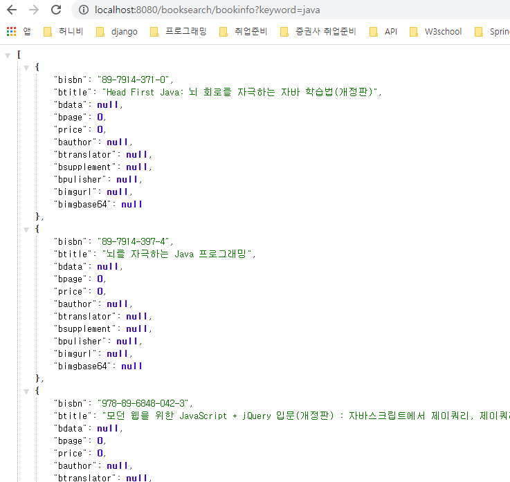
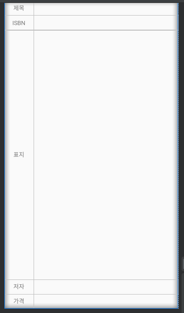

# 2020-03-25
---
## Android Day 07

### 도서검색 프로그램 (확장)

1. Android App 작성을 시작
2. 검색버튼을 눌렀을 때 호출할 Web Program을 작성.
   * 검색어에 대한 책제목 + 책에 대한 `ISBN` 가져와야 한다.


#### Web Program 수정

1. `Controller` 추가. `(Servlet)`

   * class 명 : `BookInfoByKeywordServlet`
   * url mapping : `/bookinfo`

   ```java
   // doGet() method를 작성하여 프로그램 시작. Controller의 역할 -> 어떠한 로직을 수행할지.
   protected void doGet(HttpServletRequest request, HttpServletResponse response) throws ServletException, IOException {
   		// 1. 클라이언트가 보내주는 입력을 받는다.
   		String keyword = request.getParameter("keyword");
   		// 2. 로직처리를 진행. => Service 라고 불리는 로직처리 객체를 이용.
   		BookService service = new BookService();
   		//    로직처리 객체를 이용해서 일을 시킨다. => 특정 method를 호출.
   		//	  검색어를 이용해서 책의 제목과 ISBN 번호를 알아오는 일을 시킨다.
   		//    데이터 전달객체(VO, DTO)를 이용해야 데이터 전달이 편하다.
   		ArrayList<BookVO> result = service.getBookInfo(keyword);
   		// 3. 결과를 얻어온 후 
   		//    결과 데이터를 JSON으로 만들어야 한다.
   		//    JSON 문자열을 만들어서 Android App 에게 Stream 을 이용하여 출력.
   		ObjectMapper mapper = new ObjectMapper();
   		// ArrayList 형태의 데이터를 String 배열형태의 JSON으로 변환.
   		String jsonData = mapper.writeValueAsString(result);
   		
       	// 받은 json 문자열을 web에 출력
   		response.setContentType("text/plain; charset=utf-8");
   		PrintWriter out = response.getWriter();
   		out.print(jsonData);
   		out.flush();
   		out.close();
   	}
   ```

2. `VO` 추가.

   * 책의 세부정보를 담을 수 있는 객체를 생성.
   * 객체 1개마다 책 1권의 데이터를 저장할 수 있다.
   * `VO`를 만드는 기본 원칙은 `Database Table` 기반으로 생성한다.
   * default 생성자 필요함.
   * private field를 사용하기 위한 특수한 형태의 method가 필요함. `setter, getter`

   ```java
   package com.test.vo;
   
   // 이 클래스의 객체는 책으 세부정보를 담을 수 있는 객체이다.
   // 갹채 1개마다 책 1권의 데이터를 저장할 수 있다.
   // VO를 만드는 기본 원칙은 Database Table 기반으로 생성한다.
   public class BookVO {
   
   	private String bisbn;
   	private String btitle;
   	private String bdata;
   	private int bpage;
   	private int price;
   	private String bauthor;
   	private String btranslator;
   	private String bsupplement;
   	private String bpulisher;
   	private String bimgurl;
   	private String bimgbase64;
   
   	// constructor
   	public BookVO() { // 패키지에 상관없이 사용가능하도록 public을 부여한다.
   	} // 인자도 없고 하는일도 없는 default 생성자.
   	
   	// private field를 사용하기 위한 특수한 형태의 method 필요함. setter, getter
   
   	public String getBisbn() {
   		return bisbn;
   	}
   
   	public void setBisbn(String bisbn) {
   		this.bisbn = bisbn;
   	}
   
   	public String getBtitle() {
   		return btitle;
   	}
   
   	public void setBtitle(String btitle) {
   		this.btitle = btitle;
   	}
   
   	public String getBdata() {
   		return bdata;
   	}
   
   	public void setBdata(String bdata) {
   		this.bdata = bdata;
   	}
   
   	public int getBpage() {
   		return bpage;
   	}
   
   	public void setBpage(int bpage) {
   		this.bpage = bpage;
   	}
   
   	public int getPrice() {
   		return price;
   	}
   
   	public void setPrice(int price) {
   		this.price = price;
   	}
   
   	public String getBauthor() {
   		return bauthor;
   	}
   
   	public void setBauthor(String bauthor) {
   		this.bauthor = bauthor;
   	}
   
   	public String getBtranslator() {
   		return btranslator;
   	}
   
   	public void setBtranslator(String btranslator) {
   		this.btranslator = btranslator;
   	}
   
   	public String getBsupplement() {
   		return bsupplement;
   	}
   
   	public void setBsupplement(String bsupplement) {
   		this.bsupplement = bsupplement;
   	}
   
   	public String getBpulisher() {
   		return bpulisher;
   	}
   
   	public void setBpulisher(String bpulisher) {
   		this.bpulisher = bpulisher;
   	}
   
   	public String getBimgurl() {
   		return bimgurl;
   	}
   
   	public void setBimgurl(String bimgurl) {
   		this.bimgurl = bimgurl;
   	}
   
   	public String getBimgbase64() {
   		return bimgbase64;
   	}
   
   	public void setBimgbase64(String bimgbase64) {
   		this.bimgbase64 = bimgbase64;
   	}
   }
   ```

3. `Service` 매서드 추가 : `getBookInfo()`

   ```java
   	// 키워드를 이용해서 책 제목과 책의 고유번호 (ISBN)을 얻어와서 ArrayList 형태로 구해오는 method.
   	public ArrayList<BookVO> getBookInfo(String keyword) {
   		// 크게 다른 로직처리할 것이 없다.
   		// DB처리 -> Database처리는 DAO가 담당.
   		BookDAO dao = new BookDAO();
   		ArrayList<BookVO> result = dao.selectInfo(keyword);
   		
   		return result;
   	}
   ```

4. `DAO` 에서 `SQL`문을 수행할 매서드 추가 : `selectInfo()`

   ```java
   public ArrayList<BookVO> selectInfo(String keyword) {
   		// 전형적인 Database 처리코드가 나와야 한다.
   
   		Connection con = null;
   
   		// 결과가 저장될 ArrayList를 생성. (BookVO를 이용한 ArrayList)
   		ArrayList<BookVO> result = new ArrayList<BookVO>();
   
   		try {
   			// Database 연결.
   			Context initContext = new InitialContext();
   			DataSource ds = (DataSource) initContext.lookup("java:comp/env/jdbc/mySQLDB");
   			// Database Connection 획득.
   			con = ds.getConnection();
   
   			// SQL 문장 작성.
   			String sql = "select btitle,bisbn from book where btitle like ?";
   
   			// 작성한 SQL문장을 Database에서 실행시키기 위해서 PrepareStatement 생성.
   			PreparedStatement pstmt = con.prepareStatement(sql);
   
   			// ? 를 채워서 SQL 문장을 완성.
   			pstmt.setString(1, "%" + keyword + "%");
   
   			// SQL문장을 실행한 후 결과를 ResultSet으로 받아오기.
   
   			ResultSet rs = pstmt.executeQuery();
   
   			while (rs.next()) {
   				BookVO vo = new BookVO();
   				vo.setBtitle(rs.getString("btitle"));
   				vo.setBisbn(rs.getString("bisbn"));
   				result.add(vo);
   			}
   
   			// 나중에 연결된 것부터 닫기.
   			rs.close();
   			pstmt.close();
   			con.close();
   
   		} catch (Exception e) {
   			System.out.println(e);
   		}
   
   		return result;
   	}
   ```

5. 결과

   

#### Android App 코딩

* Web Application 과 연동해야 하는 Android App

* Network 기능을 이용해서 Web Application 에서 데이터를 받아와야 한다.

* Network 연결은 Activity 에서 작업하면 안되고 별도의 Thread 를 만들어서 처리해야 한다.

* Activity 와 Thread 가 데이터를 주고받기 위해서 Handler 가 필요하다.

* Thread 가 handler 를 통해서 Activity 에게 데이터를 전달하게된다. (sendMessage)

* Activity 가 Data 를 받으면 Handler 안에 handlerMessage 가 호출되는 구조.

  ```java
  public class Example13_DetailBookSearchActivity extends AppCompatActivity {
  
      @Override
      protected void onCreate(Bundle savedInstanceState) {
          super.onCreate(savedInstanceState);
          setContentView(R.layout.activity_example13_detail_book_search);
  
          // 사용하는 widget의 reference 획득.
          Button detailSearchBtn = (Button) findViewById(R.id._13_02_detailSearchBtn);
          final EditText detailSearchTitle =
                  (EditText) findViewById(R.id._13_01_detailSearchTitle);
          final ListView detailSearchList =
                  (ListView) findViewById(R.id._13_03_detailSearchList);
  
          // Web Application 과 연동해야 하는 Android App
          // Network 기능을 이용해서 Web Application 에서 데이터를 받아와야 한다.
          // Network 연결은 Activity 에서 작업하면 안되고 별도의 Thread 를 만들어서 처리해야 한다.
          // Activity 와 Thread 가 데이터를 주고받기 위해서 Handler 가 필요하다.
          // Thread 가 handler 를 통해서 Activity 에게 데이터를 전달하게된다. (sendMessage)
          // Activity 가 Data 를 받으면 Handler 안에 handlerMessage 가 호출되는 구조.
  
          @SuppressLint("HandlerLeak") final Handler handler = new Handler(){
              @Override
              public void handleMessage(@NonNull Message msg) {
                  super.handleMessage(msg);
                  Bundle bundle = msg.getData();
                  BookVO[] booklist = (BookVO[])bundle.getSerializable("BOOKLIST");
  
                  // ArrayAdapter 를 만들어서 ListView 에 책제목만 출력하기.
                  // 책제목에 대한 String[] 이 필요하다.
                  // Book[] 로 부터 String[]를 뽑아내야 한다.
                  // 책의 갯수만큼 String 배열을 만든다.
                  String[] titles = new String[booklist.length];
                  int i=0;
                  // ArrayList 안의 VO 들을 반복하면서
                  // 제목만 뽑아서 String[] 에 저장
                  for(BookVO vo : booklist){
                      titles[i++] = vo.getBtitle();
                  }
                  ArrayAdapter adapter = new ArrayAdapter(getApplicationContext(),
                          android.R.layout.simple_list_item_1,
                          titles);
                  detailSearchList.setAdapter(adapter);
              }
          };
          // Button 을 클릭하면 Thread를 생성해서 일을 시킨다.
          detailSearchBtn.setOnClickListener(new View.OnClickListener() {
              @Override
              public void onClick(View v) {
                  // Thread 를 생성
                  MyBookInfo runnable = 
                      new MyBookInfo(handler,detailSearchTitle.getText().toString());
                  Thread t = new Thread(runnable);
                  t.start();
              }
          });
  
      }
  
  }
  ```

* Thread 가 실행할 Runnable class 생성.

  ```java
  class MyBookInfo implements Runnable {
  
      private Handler handler;
      private String keyword;
  
      public MyBookInfo() {
      }
  
      public MyBookInfo(Handler handler, String keyword) {
          this.handler = handler;
          this.keyword = keyword;
      }
  
      @Override
      public void run() {
          // Thread 가 시작되면 수행하는 작업을 여기에 작성한다.
          // Web application 을 호출해서 JSON 결과를 가져와서 Activity 에게 전달.
  
          String url = "http://70.12.60.97:8080/booksearch/bookinfo?keyword="+keyword;
          try {
              // URL 객체생성.
              URL obj = new URL(url);
              // URL 갹체를 이용하여 접속.
              HttpURLConnection con = (HttpURLConnection) obj.openConnection();
              // Web Application 호출방식 설정.
              con.setRequestMethod("GET");
  
              int responseCode = con.getResponseCode();
              Log.i("BookSearch", "서버로 부터 전달된 code : " + responseCode);
  
              // 연결 성공후 데이터를 받아오기 위한 통로 생성.
              BufferedReader br = new BufferedReader(
                      new InputStreamReader(con.getInputStream()));
  
              // 서버가 보내주는 데이터를 읽어서 하나의 문자열로 만든다.
              String readLine = "";
              StringBuffer responseTxt = new StringBuffer();
              while ((readLine = br.readLine()) != null) {
                  responseTxt.append(readLine);
              }
  
              br.close();     // 통로사용이 끝났으니 해당 resource 자원을 해제.
  
              Log.i("BookSearch", "얻어용 내용은 : " + responseTxt.toString());
  
              // JACKSON library 사용
              ObjectMapper mapper = new ObjectMapper();
              BookVO[] resultArr = mapper.readValue(responseTxt.toString(), BookVO[].class); // String array class 로 바꾸라는 형태.
              Bundle bundle = new Bundle();
              
              // bundle 객체에 객체배열을 넣는다.
              bundle.putSerializable("BOOKLIST", resultArr);
  
              Message msg = new Message();
              msg.setData(bundle);
              handler.sendMessage(msg);
  
  
          } catch (Exception e) {
              Log.i("BookSearch", e.toString());
          }
  
  
  
      }
  }
  ```

* BookVO 객체가 필요하므로 코드 밑에 Web에서 사용했던 VO 객체를 추가해줌.

  * 코드는 웹에서 쓴 코드와 동일함.

  

* `ListView`에 대한 이벤트 처리가 필요함.

  ```java
  @SuppressLint("HandlerLeak") final Handler handler = new Handler() {
              @Override
          public void handleMessage(@NonNull Message msg) {
                  super.handleMessage(msg);
                  //....생략
  				
                  // 이벤트 추가!
              detailSearchList.setOnItemClickListener(new AdapterView.OnItemClickListener() {
                      @Override
                public void onItemClick(AdapterView<?> parent, View view, int position, long id) {
                          Log.i("myitem","선택한 위치는 : "+position);
                          Log.i("myitem",booklist[position].getBisbn());
                          Log.i("myitem",booklist[position].getBtitle());
                          
                      }
                  });
              }
          };
  ```

* 이벤트 처리에 대해 알았으니..

  * 새로운 Activity를 생성.
  * Activity의 화면을 구성.
  * Activity 안에서 코드작업.
  * Thread를 만들어서 => network처리를 해야한다.
  * Web Application 호출
    * ISBN 번호를 제공해서 책의 세부내용을 JSON으로 받아와야함.(Web Application 하나 필요함.)
    * 받아온 정보를 출력 !

  ```java
  @SuppressLint("HandlerLeak") final Handler handler = new Handler() {
           @Override
        public void handleMessage(@NonNull Message msg) {
                  super.handleMessage(msg);
                  
            		//....생 략....
  			   
                  // 리스트 한개 클릭시 이벤트 처리.
  		detailSearchList.setOnItemClickListener(new AdapterView.OnItemClickListener() {
                      @Override
                 public void onItemClick(AdapterView<?> parent, View view, int position, long id) {
                          Log.i("myitem", "선택한 위치는 : " + position);
                          Log.i("myitem", booklist[position].getBisbn());
                          Log.i("myitem", booklist[position].getBtitle());
  					 // 클릭하면 화면 전환을 위해 Intent 객체 이용.
                          Intent i = new Intent();
                     	  // Intent 객체에 넘겨줄 ISBN을 넣어줌.
                          i.putExtra("ISBN",booklist[position].getBisbn());
                     	  // 넘어갈 Activity 화면 설정.   
                        ComponentName cname = new ComponentName("com.example.androidlectureexample",
                                  "com.example.androidlectureexample.Example14_DetailBookInfo");
                          i.setComponent(cname);
                        // Activity 전환  
                        startActivity(i);
                      }
                  });
              }
          };
  ```

* ISBN 을 keyword로 주어 책의 제목, ISBN, 표지url, 저자, 가격 을 `JSON` 형태로 가져올수 있는 `Web Application`을 작성.

  * `Controller(Servlet)`

  ```java
  protected void doGet(HttpServletRequest request, HttpServletResponse response)
  			throws ServletException, IOException {
  		// 이부분을 작성한다.
  		// 1. 클라이언트가 보내주는 입력을 받는다.
  		// 입력은 무조건 String으로 받는다.
  		String keyword = request.getParameter("keyword"); 
           // (key값) 클라이언트와 연결되는 부분.
  	     // 클라이언트에게 keyword 라는 key값을 받아야함.
  
  		// 2. 로직처리를 하는 객체를 생성해서 그 객체(Service)한테 일을 시킨다.
  		// 그리고 결과를 다시 받아온다.
  		// 로직처리하는 객체(Service)가 존재해야 한다. 일반 자바 class.
  		BookService service = new BookService();
  		ArrayList<String> result = service.getBookTitle(keyword);
  
  		// 3. 처리된 결과를 클라이언트에게 출력한다.
  		// 일반 문자열 형태가 아니라 JSON 형태로 데이터를 전달해야 한다.
  		// JSON으로 결과데이터를 변경하기 위해서 JACKSON library를 이용.
  
  		// Jackson library를 이용하기 위해서 ObjectMapper를 생성.
  		ObjectMapper mapper = new ObjectMapper();
  		// ArrayList 형태의 데이터를 String 배열형태의 JSON으로 변환.
  		String jsonString = mapper.writeValueAsString(result);
  
  		response.setContentType("text/plain; charset=utf-8");
  		PrintWriter out = response.getWriter();
  
  		// 받아온 값 출력
  		out.println(jsonString);
  		out.flush();
  		out.close();
  	}
  ```

  * `Service`
    * 위에 작성한 Service와 동일
    * `dao`를 통해 결과값을 저장할 객체를 선언.

  ```java
  	public ArrayList<BookVO> getBookDetail(String keyword) {
  
          BookDAO dao = new BookDAO();
  		ArrayList<BookVO> result = dao.selectAllInfo(keyword);
  		return result;
          
  	}
  ```

  * `DAO`
    * `SQL` 문을 처리하는 코드 작성.

  ```java
  	public ArrayList<BookVO> selectAllInfo(String keyword) {
  		Connection con = null;
  
  		// 결과가 저장될 ArrayList를 생성. (BookVO를 이용한 ArrayList)
  		ArrayList<BookVO> result = new ArrayList<BookVO>();
  
  		try {
  			// Database 연결.
  			Context initContext = new InitialContext();
  			DataSource ds = (DataSource) initContext.lookup("java:comp/env/jdbc/mySQLDB");
  			// Database Connection 획득.
  			con = ds.getConnection();
  
  			// SQL 문장 작성.
  			String sql = "select btitle,bisbn,bimgurl,bauthor,bprice,bimgbase64 from book where bisbn like ?";
  
  			// 작성한 SQL문장을 Database에서 실행시키기 위해서 PrepareStatement 생성.
  			PreparedStatement pstmt = con.prepareStatement(sql);
  
  			// ? 를 채워서 SQL 문장을 완성.
  			pstmt.setString(1, "%" + keyword + "%");
  
  			// SQL문장을 실행한 후 결과를 ResultSet으로 받아오기.
  
  			ResultSet rs = pstmt.executeQuery();
  
  			while (rs.next()) { // SQL 문을 통해 받아온 정보를 BookVO 객체에 저장.
  				BookVO vo = new BookVO();
  				vo.setBtitle(rs.getString("btitle"));
  				vo.setBisbn(rs.getString("bisbn"));
  				vo.setBimgurl(rs.getString("bimgurl"));
  				vo.setBauthor(rs.getString("bauthor"));
  				vo.setPrice(Integer.valueOf(rs.getString("bprice")));
  				vo.setBimgbase64(rs.getString("bimgbase64"));
  				result.add(vo);
  			}
  			
  
  			// 나중에 연결된 것부터 닫기.
  			rs.close();
  			pstmt.close();
  			con.close();
  
  		} catch (Exception e) {
  			System.out.println(e);
  		}
  
  		return result;
  	}
  ```

  * 여기까지 `Web Application`

* 이제 `Activity` 를 코드로 구성.

  * 전환된 화면에서 전 화면에서 넘겨준 `Intent` 객체에서 넣어준 `ISBN` 값을 받아와 `Web Application`을 통해 `JSON` 정보를 얻어온다.

  * 새로운 `DetailBookInfo` 에 대한 `layout`

  ```java
  <?xml version="1.0" encoding="utf-8"?>
  <LinearLayout xmlns:android="http://schemas.android.com/apk/res/android"
      xmlns:tools="http://schemas.android.com/tools"
      android:layout_width="match_parent"
      android:layout_height="match_parent"
      android:orientation="horizontal">
  
      <LinearLayout
          android:layout_width="match_parent"
          android:layout_height="match_parent"
          android:layout_weight="5"
          android:orientation="vertical">
  
          <TextView
              android:layout_width="match_parent"
              android:layout_height="match_parent"
              android:layout_weight="5"
              android:gravity="center_vertical"
              android:text="제목"
              android:textAlignment="center"
              tools:ignore="RtlCompat" />
  
          <TextView
              android:layout_width="match_parent"
              android:layout_height="match_parent"
              android:layout_weight="5"
              android:gravity="center_vertical"
              android:text="ISBN"
              android:textAlignment="center"
              tools:ignore="RtlCompat" />
  
          <TextView
              android:layout_width="match_parent"
              android:layout_height="match_parent"
              android:layout_weight="1"
              android:gravity="center_vertical"
              android:text="표지"
              android:textAlignment="center"
              tools:ignore="RtlCompat" />
  
          <TextView
              android:layout_width="match_parent"
              android:layout_height="match_parent"
              android:layout_weight="5"
              android:gravity="center_vertical"
              android:text="저자"
              android:textAlignment="center"
              tools:ignore="RtlCompat" />
  
          <TextView
              android:layout_width="match_parent"
              android:layout_height="match_parent"
              android:layout_weight="5"
              android:gravity="center_vertical"
              android:text="가격"
              android:textAlignment="center"
              tools:ignore="RtlCompat" />
  
      </LinearLayout>
  
      <LinearLayout
          android:layout_width="match_parent"
          android:layout_height="match_parent"
          android:layout_weight="1"
          android:orientation="vertical">
  
  
          <TextView
              android:id="@+id/_14_01_title"
              android:layout_width="match_parent"
              android:layout_height="match_parent"
              android:layout_weight="5"
              android:gravity="center_vertical"
              android:textAlignment="center"
              tools:ignore="RtlCompat"
              android:scrollbars="vertical"
              />
  
  
          <TextView
              android:id="@+id/_14_02_isbn"
              android:layout_width="match_parent"
              android:layout_height="match_parent"
              android:layout_weight="5"
              android:gravity="center_vertical"
              android:text="ISBN"
              android:textAlignment="center"
              tools:ignore="RtlCompat" />
  
          <ImageView
              android:id="@+id/_14_03_img"
              android:layout_width="match_parent"
              android:layout_height="match_parent"
              android:layout_weight="1"
              android:scaleType="fitXY"/>
  
          <TextView
              android:id="@+id/_14_04_author"
              android:layout_width="match_parent"
              android:layout_height="match_parent"
              android:layout_weight="5"
              android:gravity="center_vertical"
              android:text="저자"
              android:textAlignment="center"
              tools:ignore="RtlCompat" />
  
          <TextView
              android:id="@+id/_14_05_price"
              android:layout_width="match_parent"
              android:layout_height="match_parent"
              android:layout_weight="5"
              android:gravity="center_vertical"
              android:text="가격"
              android:textAlignment="center"
              tools:ignore="RtlCompat" />
  
  
      </LinearLayout>
  
  
  </LinearLayout>
  ```

  

  * 검색된 리스트를 클릭했을 때 이동될 Activity java code 작성.

  ```java
  public class Example14_DetailBookInfo extends AppCompatActivity {
      Handler handler1 = new Handler();
  
      @Override
      protected void onCreate(Bundle savedInstanceState) {
          super.onCreate(savedInstanceState);
          setContentView(R.layout.activity_example14_detail_book_info);
  
          Intent i = getIntent();
          String isbn = (String) i.getExtras().get("ISBN");
          Log.i("what", "ISBN : " + isbn);
  
          final TextView titleTv = (TextView) findViewById(R.id._14_01_title);
          final TextView isbnTv = (TextView) findViewById(R.id._14_02_isbn);
          final ImageView imgIv = (ImageView) findViewById(R.id._14_03_img);
          final TextView authorTv = (TextView) findViewById(R.id._14_04_author);
          final TextView priceTv = (TextView) findViewById(R.id._14_05_price);
  
          titleTv.setMovementMethod(new ScrollingMovementMethod());
  
          @SuppressLint("HandlerLeak") final Handler handler = new Handler() {
              @Override
              public void handleMessage(@NonNull Message msg) {
                  super.handleMessage(msg);
                  Bundle bundle = msg.getData();
                  BookVO[] bookdetail = (BookVO[]) bundle.getSerializable("BOOKLIST");
                  final String myUrl = bookdetail[0].getBimgurl();
  
                  Thread t2 = new Thread(new Runnable(){
                      @Override
                      public void run() {    // 오래 거릴 작업을 구현한다
                          try {
                              // 걍 외우는게 좋다 -_-;
                              URL url = new URL(myUrl);
                              InputStream is = url.openStream();
                              final Bitmap bm = BitmapFactory.decodeStream(is);
                              handler1.post(new Runnable() {
  
                                  @Override
                                  public void run() {  // 화면에 그려줄 작업
                                      imgIv.setImageBitmap(bm);
                                  }
                              });
                              imgIv.setImageBitmap(bm); //비트맵 객체로 보여주기
                          } catch (Exception e) {
  
                          }
  
                      }
              });
                  t2.start();
  
                  titleTv.setText(bookdetail[0].getBtitle());
                  isbnTv.setText(bookdetail[0].getBisbn());
                  authorTv.setText(bookdetail[0].getBauthor());
                  priceTv.setText(String.valueOf(bookdetail[0].getPrice()) + "원");
                  //imgIv.setImageBitmap();
  
  
              }
          };
          DetaliBookInfo runnable = new DetaliBookInfo(handler, isbn);
          Thread t = new Thread(runnable);
          t.start();
  
  
      }
  
  
  }
  
  
  class DetaliBookInfo implements Runnable {
  
      private Handler handler;
      private String keyword;
  
      public DetaliBookInfo() {
      }
  
      public DetaliBookInfo(Handler handler, String keyword) {
          this.handler = handler;
          this.keyword = keyword;
      }
  
      @Override
      public void run() {
          String url = "http://70.12.60.97:8080/booksearch/bookDetail?keyword=" + keyword;
          try {
              // URL 객체생성.
              URL obj = new URL(url);
              // URL 갹체를 이용하여 접속.
              HttpURLConnection con = (HttpURLConnection) obj.openConnection();
              // Web Application 호출방식 설정.
              con.setRequestMethod("GET");
  
              int responseCode = con.getResponseCode();
              Log.i("BookSearch", "서버로 부터 전달된 code : " + responseCode);
  
              // 연결 성공후 데이터를 받아오기 위한 통로 생성.
              BufferedReader br = new BufferedReader(
                      new InputStreamReader(con.getInputStream()));
  
              // 서버가 보내주는 데이터를 읽어서 하나의 문자열로 만든다.
              String readLine = "";
              StringBuffer responseTxt = new StringBuffer();
              while ((readLine = br.readLine()) != null) {
                  responseTxt.append(readLine);
              }
  
              br.close();     // 통로사용이 끝났으니 해당 resource 자원을 해제.
  
              Log.i("BookSearch", "얻어용 내용은 : " + responseTxt.toString());
  
              // JACKSON library 사용
              ObjectMapper mapper = new ObjectMapper();
              BookVO[] resultArr = mapper.readValue(responseTxt.toString(), BookVO[].class); // String array class 로 바꾸라는 형태.
              Bundle bundle = new Bundle();
  
              // bundle 객체에 객체배열을 넣는다.
              bundle.putSerializable("BOOKLIST", resultArr);
  
              Message msg = new Message();
              msg.setData(bundle);
              handler.sendMessage(msg);
  
  
          } catch (Exception e) {
              Log.i("BookSearch", e.toString());
          }
      }
  }
  ```

  

