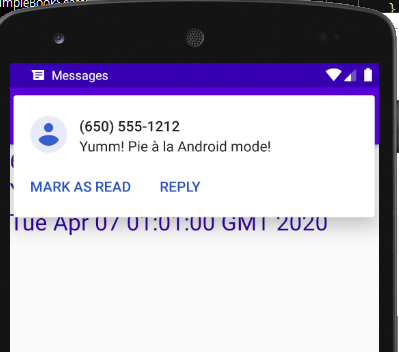
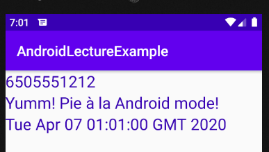

# 2020-04-06

---

## Review

* 안드로이드 주요 4가지 component
  1. Activity (사용자와의 interaction)
  2. Service (Thread를 이용해서 로직처리)
  3. Broadcast Receiver 
     * Broadcast : 일련의 신호.

---

# Broadcast Receiver

* `Broadcast` : `signal`
  * `Broadcast` 는 `Android system` 자체에서 발생할 수도 있고 사요자 `App` 에서 임의로 발생시킬 수도 있다.
  * 이 신호는 폰 전체 모든 App에 신호가 간다.
  * `Broadcast message`를 받고 싶다면 `Broadcast Receiver`를 만들어서 등록해야 한다.
* 등록방법
  1. AndroidManifext.xml file 에 명시.
  2. 코드상에서 Receiver 를 만들어서 등록

## 코드상에서 등록

* `Broadcast Receiver` 객체를 만들어서 `IntentFilter`와 함께 시스템에 등록한후 사용한다.


* `Receiver` 등록 코드

1. `IntentFilter` 생성.

   ```java
   IntentFilter intentFilter = new IntentFilter();
   intentFilter.addAction("MY_BROADCAST_SIGNAL"); 
   // 어떤 신호를 받은 것인지 명시. Action 이름
   ```

2. `Broadcast Receiver` 객체 생성. (선언은 Field변수로 선언함.)

   ```java
   bReceiver = new BroadcastReceiver() {
       @Override
       public void onReceive(Context context, Intent intent) {
           // 이 Receiver 가 신호를 받게되면 이 부분이 호출된다.
           // 로직처리를 여기에서 해야한다.
           if (intent.getAction().equals("MY_BROADCAST_SIGNAL")) {
               Toast.makeText(getApplicationContext(),
                       "신호가 왔어요!",
                       Toast.LENGTH_SHORT).show();
           }
       }
   };
   ```

3. `Filter`와 함꼐 `Broadcast Receiver`를 등록한다.

   ```java
   registerReceiver(bReceiver, intentFilter); 
   // intentFilter 로 걸러진 신호만 Receiver 가 받는다.
   ```

* `Receiver` 해제 코드

  ```java
  Button _18_02_br_unRegisterBtn = findViewById(R.id._18_02_br_unRegisterBtn);
  _18_02_br_unRegisterBtn.setOnClickListener(new View.OnClickListener() {
      @Override
      public void onClick(View v) {
          unregisterReceiver(bReceiver); // 해당 Receiver 를 해제. 신호가 발생해도 Receiver 가 받을수 없게됨.
      }
  });
  ```

* `Broadcast` 를 발생코드

  ```java
  Button _18_03_sendBroadcastBtn = findViewById(R.id._18_03_sendBroadcastBtn);
  _18_03_sendBroadcastBtn.setOnClickListener(new View.OnClickListener() {
     @Override
     public void onClick(View v) {
        // 버튼을 누르면 Broadcast 를 임의로 발생!
        Intent i = new Intent("MY_BROADCAST_SIGNAL");
     // 신호를 발생시키는 것은 intent 를 갖고 신호를 발생시킨다. Intent 는 Action 을 부여하면서 생성가능함.
        sendBroadcast(i);
      }
  });
  ```

## 문자메세지 처리.

1. 현재 진행중인 App 은 휴대단말로 온 문자메시지를 처리하려고 한다.

   * 문자메시지 처리는 상당히 개인적인 정보이다. => 보안처리가 필요함. (2가지)
   * AndroidManifest.xml 파일에 기본 보안에 대한 설정이 필요하다.

   ```xml
   <uses-permission android:name="android.permission.RECEIVE_SMS" />
   ```

2. Broadcast Receiver Component 를 하나 생성.

   * 생성하면 AndroidManifest.xml 에 receiver tag가 생성됨.
   * tag 안에서 IntentFilter를 명시해 줘야한다.

   ```xml
   <receiver
       android:name=".Example19Sub_SMSBroadcastReceiver"
       android:enabled="true"
       android:exported="true">
               <intent-filter>
                   <action android:name="android.provider.Telephony.SMS_RECEIVED"/>
               </intent-filter>
   </receiver>
   ```

   > 문자가 오면 이 문자를 `Broadcast Receiver` 가 받아서 화면에 표현하기 위해 `Activity`에게 전달하는 구조이다.

3. Activity 가 실행되면 보안설정 부터 해야한다.

   * 마쉬멜로우 버전이후 부터는 강화된 보안정책을 따라야 한다.
   * 아래는 SMS에 대한 권한설정에 대한 코드이다.

   ```java
           if (Build.VERSION.SDK_INT >= Build.VERSION_CODES.M) {
               // 만약 우리가 사용하는 기기가 M 이상이면
               // 사용자 권한 중 SMS 받기 권한이 설정되어 있는지 Check
               int permissionResult = ActivityCompat.checkSelfPermission(
                       getApplicationContext(),
                       Manifest.permission.RECEIVE_SMS);
               if (permissionResult == PackageManager.PERMISSION_DENIED) {
                   // 권한이 없으면
                   // 1. App 을 처음 실행해서 권한을 물어본 적이 없는경우.
                   // 2. 권한 허용에 대해서 사용자에게 물어는 봤으나 사용자가
                   // 거절을 선택한 경우
   
                   // 왜 권한이 없을까? (2가지 Case)
                   if (shouldShowRequestPermissionRationale(Manifest.permission.RECEIVE_SMS)) {
                       // true => 권한을 거부한 적이 있는 경우.
                       // 일반적으로 dialog 같은걸 이용하여 다시 물어본다.
                       AlertDialog.Builder dialog =
                               new AlertDialog.Builder(Example19_BRSMSActivity.this);
                       dialog.setTitle("권한이 필요해요!");
                       dialog.setMessage("SMS 수신기능이 필요합니다. 수락할까요?");
                       dialog.setPositiveButton("yes", new DialogInterface.OnClickListener() {
                           @Override
                           public void onClick(DialogInterface dialog, int which) {
                               requestPermissions(
                                       new String[]{Manifest.permission.RECEIVE_SMS},
                                       100);
   
                           }
                       });
                       dialog.setNegativeButton("no", new DialogInterface.OnClickListener() {
                           @Override
                           public void onClick(DialogInterface dialog, int which) {
                               // 권한설정을 하지 않는다는 의미이므로
                               // 아무런 작업을 할 필요가 없다.
                           }
                       });
                       // 만들어진 dialog 를 화면에 띄운다.
                       dialog.create().show();
   
                   } else {
                       // false => 한번도 물어본적이 없는 경우.
                       // 여러 권한을 동시에 사용자에게 요청할 수 있기때문에
                       // 인자가 String 배열로 들어간다.
                       requestPermissions(
                               new String[]{Manifest.permission.RECEIVE_SMS},
                               100);
                   }
   
               } else {
                   // 권한이 있으면
                   Log.i("SMSTest", "보안설정 통과!!");
               }
           } else {
               // 만약 우리가 사용하는 기기가 M(마쉬멜로우) 미만이면
               // AndroidManifest.xml 에서 permission tag 만 이용하면 된다.
               Log.i("SMSTest", "보안설정 통과!!");
           }
   ```

4. 보안설정이 잘 되어 있다면 특정 `signal(Broadcast)` 이 발생하면 해당 `Broadcast`를 받을 수 있다.

   * `Example19Sub_SMSBroadcastReceiver.java`

   ```java
   package com.example.androidlectureexample;
   
   import android.content.BroadcastReceiver;
   import android.content.Context;
   import android.content.Intent;
   import android.os.Build;
   import android.os.Bundle;
   import android.telephony.SmsMessage;
   import android.util.Log;
   
   import java.util.Date;
   
   public class Example19Sub_SMSBroadcastReceiver extends BroadcastReceiver {
   
       @Override
       public void onReceive(Context context, Intent intent) {
           // Broadcast 를 받으면 이 method 가 호출된다.
           // SMS 가 도착하면 해당 method 가 호출된다.
           Log.i("SMSTest", "SMS 가 도착했어요!!!");
           // 만약 SMS signal 을 받을 수 있으면
           // 전화번호, 문자내용을 뽑아서 Activity 에게 전달하면 된다.
           // 전달받은 Intent 안에 보낸사람의 전화번호, 메시지 내용, 날짜.
           // 정보가 들어있다.
   
           // Intent 안에 포함되어 있는 정보를 추출한다.
           Bundle bundle = intent.getExtras();
   
           // Bundle 안에 key,value ㅎ여태로 데이터가 여러개 저자되어 있다.
           // SMS 의 정보는 "pdus" 라는 key 값으로 저정되어 있다.
           // 거의 시간상 동시에 여러개의 SMS 가 도착할 수 있다.
           // 객체 1개가 메시지 1개를 의미.
   
           Object[] obj = (Object[]) bundle.get("pdus");
   
           SmsMessage[] message = new SmsMessage[obj.length];
           // 우리 예제에서는 1개의 SMS 만 전달된다고 가정하고 진행.
           // Object 객체 형태를 SmsMessage 객체 형태로 converting.
           if (Build.VERSION.SDK_INT >= Build.VERSION_CODES.M) {
               String format = bundle.getString("format");
               message[0] = SmsMessage.createFromPdu((byte[]) obj[0], format);
           } else {
               message[0] = SmsMessage.createFromPdu((byte[]) obj[0]);
           }
           // 보낸사람 전화번호를 SmsMessage 객체에서 추출.
           String sender = message[0].getOriginatingAddress();
           // SMS 문자내용을 추출
           String msg = message[0].getMessageBody();
           // SMS 받은 시간을 추출.
           String reDate = new Date(message[0].getTimestampMillis()).toString();
   
           Log.i("SMSTest","전화번호 : " +sender );
           Log.i("SMSTest","내용 : " + msg);
           Log.i("SMSTest","시간 : " + reDate);
   
           // 데이터를 잘 받아왓으면 해당 Data 를 Activity 에게 전달한다.
           Intent i = new Intent(context,
                   Example19_BRSMSActivity.class);
           // 기존에 이미 생성되어 있는 activity 에게 전다해야 하므로 flag 를 설정.
           i.addFlags(Intent.FLAG_ACTIVITY_CLEAR_TOP);
           i.addFlags(Intent.FLAG_ACTIVITY_SINGLE_TOP);
           i.addFlags(Intent.FLAG_ACTIVITY_NEW_TASK);
           // Intent 에 Data 를 저장해서 보낸다.
           i.putExtra("sender",sender);
           i.putExtra("msg",msg);
           i.putExtra("reDate",reDate);
   
           context.startActivity(i); // context 를 이용해 activity 를 시작.
       }
   }
   
   ```

5. `Broadcast Receiver` 에서 `Activity` 로 데이터가 `Intent` 를 통해서 데이터가 전달된다.

   * 전달된 `Intent`는 해당 `Activity` 에서 `onNewIntent()` 메서드를 통해 받는다.

   ```java
       @Override
       protected void onNewIntent(Intent intent) {
           super.onNewIntent(intent);
           // Broadcast receiver 가 보내준 intent 를 받는다.
           // intent 안에 들어있는 정보를 꺼내서 화면에 출력.
   
           String sender = intent.getExtras().getString("sender");
           String msg = intent.getExtras().getString("msg");
           String reDate = intent.getExtras().getString("reDate");
   
           _19_smsSenderTv.setText(sender);
           _19_smsMessageTv.setText(msg);
           _19_smsDateTv.setText(reDate);
   
       }
   ```

6. 결과

   

   

---

# Notification

* `Notification` : 알림에 대한 설정.

* `Broadcast Receiver`를 이용하여 특정 `Broadcast`에 대한 Notification 을 만든다.
  * Ex) 문자메세지 도착시 안드로이드 폰 상단에 나타나는 창.

* 아래 예시에서는 `AndroidManifest.xml`을 이용하지 않고 `Activity`에서 직접 `Broadcast Receiver`를 선언하여 작성 하였다.

1. `IntentFilter` 를 이용하여 `Action` 을 설정한다.

   ```java
   // Boradcast Receiver 를 등록하는 작업.
   IntentFilter filter = new IntentFilter();
   filter.addAction("MY_NOTI_SIGNAL");
   ```

2. `Broadcast`를 받을 `Receiver`를 생성한다.

   ```java
   br = new BroadcastReceiver() {
       @Override
       public void onReceive(Context context, Intent intent) {  
       }
   };
   ```

   * 이제 핸드폰에서 `Broadcast` 를 받게되면 `onReceive` 매서드가 실행되어진다.

3. `onReceive` 매서드 안에서 `Notification`을 띄우기 위한 코드를 작성한다.

   * `Notification` 을 사용할 때 `Oreo버전(8버전)` 이상에서는 반드시 `Channel` 을 사용해야 한다.

   ```java
   br = new BroadcastReceiver() {
       @Override
       public void onReceive(Context context, Intent intent) {  
   
            // Notification 을 띄워본다.
            // 1. Notification(알림) 을 띄우려면 Notification Manager 가 있어야 한다.
           NotificationManager nManager =
          (NotificationManager) context.getSystemService(
    						         Context.NOTIFICATION_SERVICE);
   
            // 2. Android Oreo(8버전) 이전, 이후에 따라서 약간의 코드차이가 발생한다.
            //    Oreo 버전 이후에는 Channel 이라는걸 이용해야 한다.
            //    Channel 이 나온 이유 : 알림의 종류가 많다.
            //     - 별로 중요하지 않은 알림인 경우 단순 소리만 나게끔 처리.
            //     - 중요한 알림인 경우 진동까지 같이 나게끔 처리.
            // 체널 사용시 필요한 3가지 ID,NAME,importance
   		String channelID = "MY_CHANNEL";
            String channelName = "MY_CHANNEL_NAME";
            int importance = NotificationManager.IMPORTANCE_HIGH;
   
            if (Build.VERSION.SDK_INT >= Build.VERSION_CODES.O) {
              // 현재 사용하는 Android 버전이 Oreo(8버전) 이상인 경우
              // 반드시 channel 생성.
                   NotificationChannel nChannel = new NotificationChannel(channelID,
                                       channelName, importance);
                         // 이렇게 알림채널을 만든후에 설정을 붙인다.
                         nChannel.enableVibration(true); // 진동여부.
                         nChannel.setVibrationPattern(new long[]
                                       {100, 200, 100, 200}); // 진동 패턴시간(mill second)
                         nChannel.enableLights(true); // 불빛
                         nChannel.setLockscreenVisibility(
                         Notification.VISIBILITY_PRIVATE); // 잠김화면에서도 Notification 이 동작
   
                         nManager.createNotificationChannel(nChannel);
                         }
           
              // Nofication 을 생성. 만들기 위해서는 Builder 를 이용해야 한다.
              NotificationCompat.Builder builder =
                        new NotificationCompat.Builder(
                                  context.getApplicationContext(),
                                           channelID);
           
              // Notification 을 띄우기 위해서 Intent 가 필요하다.
              Intent nIntent = new Intent(
                                  getApplicationContext(),
                                  Example20_BRNotiActivity.class);
   
              // Notification 이 Activity 위에 띄워야 하기때문에 설정 필요.
              nIntent.addFlags(Intent.FLAG_ACTIVITY_SINGLE_TOP);
              nIntent.addFlags(Intent.FLAG_ACTIVITY_CLEAR_TOP);
   
              // 중복되지 않는 상수값을 얻기 위해서 사용.
              int requestID = (int) System.currentTimeMillis();
   
              // PendingIntent 를 생성해서 사용해야 한다.
              // 위에서 만든 Intent 를 가지고 PendingIntent 를 생성.
               PendingIntent pIntent =
                          PendingIntent.getActivity(getApplicationContext(),
                                            requestID, nIntent,
                                           PendingIntent.FLAG_UPDATE_CURRENT);
   
              // builder 를 이용해서 최종적으로 Notification 을 생성.
              builder.setContentTitle("Noti제목");
              builder.setContentText("Noti내용");
           
              // 알림의 기본 사운드, 기본 진동 설정
              builder.setDefaults(Notification.DEFAULT_ALL);
              builder.setAutoCancel(true); // 알림 터치시 반응 후 삭제
           
              // 알림의 기본음으로 설정
              builder.setSound(RingtoneManager.getDefaultUri(
                                 RingtoneManager.TYPE_NOTIFICATION
                                ));
           
              // 작은 아이콘 설정
              builder.setSmallIcon(android.R.drawable.btn_star);
              builder.setContentIntent(pIntent);
           
              // 실제로 Notification 을 띄우는 코드.
              nManager.notify(0, builder.build());
           }
      };
   ```

4. 다른 버튼 이벤트를 통해 `Broadcast`를 발생시킨다.

   ```java
   Button _20_sendSignalBtn = findViewById(R.id._20_sendSignalBtn);
   _20_sendSignalBtn.setOnClickListener(new View.OnClickListener() {
        @Override
        public void onClick(View v) {
            Intent i = new Intent("MY_NOTI_SIGNAL");
            sendBroadcast(i);
        }
    });
   ```

5. 해당 `Activity` 에 들어가 등록버튼을 통해 `Broadcast Receiver`를 등록 시켜준후 발생 버튼을 터치하여 `Broadcast`를 발생시킨다.

   * 결과

   

   * 실제 폰으로 실행 했을 경우 `Channel`을 통해 설정해 준 진동도 함께 울리게 된다.


