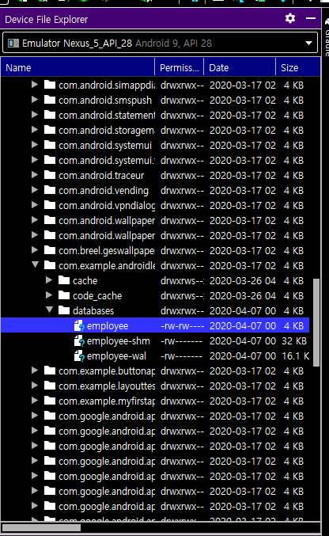
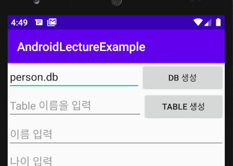
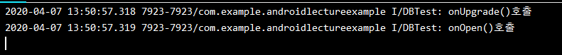

# 2020-04-07

---

Android Day 11

# Android Database

* `Android` 안에는 `DBMS`가 내장되어 있다. : `SQLite` -> `Embedded` 형태
* 각각의 `App` 이 `App` 마다 하나씩 `DB` 를 갖고 있는 형태이다.
* `SQLite` 는 `db` 생성시 파일형태로 생성된다.
* `DB` 확인은 `SQLitebrowser`를 이용하여 확인.

## SQLite

### Database 생성

* SQLite 는 SQLiteDatabase 객체를 이용하여 만들수 있다.

  ```java
  	private EditText _21_dbNameEt; // database 이름입력 EditText
      private SQLiteDatabase database; // 생성된 database
      @Override
      protected void onCreate(Bundle savedInstanceState) {
          super.onCreate(savedInstanceState);
          setContentView(R.layout.activity_example21_sqlite_basic);
  
  
          _21_dbNameEt = findViewById(R.id._21_dbNameEt);
  
          Button _21_dbCreateBtn = findViewById(R.id._21_dbCreateBtn);
          _21_dbCreateBtn.setOnClickListener(new View.OnClickListener() {
              @Override
              public void onClick(View v) {
                  // Database 생성
                  String dbName = _21_dbNameEt.getText().toString();
                 // MPDE_PRIVATE : 0 값 읽고 쓰기가 가능한 일반적인 형태의 DB 를 생성하거나 open하는 의미.
                  database = openOrCreateDatabase(dbName,
                          MODE_PRIVATE,null);
                  Log.i("DBTest","DB 생성!");
              }
          });
      }
  ```

* `DB`를 생성하게 되면 `데이터베이스이름` 이라는 파일로 생성이된다.

* 저장위치 : `/data/data/우리App/`


* 안드로이드 스튜디오 내에서 `Device File Explorer` 로 가상 디바이스의 파일을 확인할 수 있다.



* `App` 파일 안에 `DB`를 파일로 갖고 있다.
* 해당 db를 Save As 를 통해 컴퓨터로 가져올 수 있다.

### Table 생성.

* sql 문장을 이용하여 Table 을 생성한다.

  ```java
  _21_tableCreateBtn.setOnClickListener(new View.OnClickListener() {
              @Override
              public void onClick(View v) {
                  // table 이름을 들고온다.
                  String tableName = _21_tableNameEt.getText().toString();
  
                  if (database == null) {
                      Log.i("DBTest", "DB 먼저 생성해주세요");
                      return;
                  }
                  // 현재 Database 에 대한 reference 가 존재!
                  // SQL 을 이용해서 Database 안에 Table 을 생성하면 된다.
                  // SQL 문 관용적으로 예약어는 대문자로
                  String sql = "CREATE TABLE IF NOT EXISTS " +
                          tableName + "( _id INTEGER PRIMARY KEY AUTOINCREMENT, " +
                          "name TEXT, " +
                          "age INTEGER, " +
                          "mobile TEXT)";
                  // 완성된 SQL 을 어떤 database 에서 실행시킬 것인지를 결정해서 실행.
                  database.execSQL(sql);
  
                  Log.i("DBTest", "Table 생성 완료");
              }
          });
  ```

  

### Data insert, select

* insert 또한 SQLiteDatabase 클래스의 execSQl() 매서드에 sql 문장을 인자로 받아 사용할 수 있다.

  ```java
   // insert 처리
          Button _21_empInsertBtn = findViewById(R.id._21_empInsertBtn);
          _21_empInsertBtn.setOnClickListener(new View.OnClickListener() {
              @Override
              public void onClick(View v) {
                  // 입력된 사용자를 table 에 insert
                  String name = _21_empNameEt.getText().toString();
                  int age = new Integer(_21_empAgeEt.getText().toString()).intValue();
                  String mobile = _21_empMobileEt.getText().toString();
  
                  if (database == null) {
                      Log.i("DBTest", "DB 먼저 생성해주세요");
                      return;
                  }
                  String sql = "INSERT INTO emp(name,age,mobile) VALUES " +
                          "('" + name + "'," + age + ",'" + mobile + "')";
  
                  database.execSQL(sql);
                  Log.i("DBTest", "데이터 입력 완료");
  
                  _21_empNameEt.setText("");
                  _21_empAgeEt.setText("");
                  _21_empMobileEt.setText("");
              }
          });
  ```

* select 의 경우 insert, create 와 달리 execSql이 아닌 rqwQuery() 매서드를 이용하여 사용할 수 있다.

  * select 로 받아온 결과는 Cursor 객체를 이용하여 데이터를 읽을 수 있다.

  ```java
   // select 처리
          Button _21_empSelectBtn = findViewById(R.id._21_empSelectBtn);
          _21_empSelectBtn.setOnClickListener(new View.OnClickListener() {
              @Override
              public void onClick(View v) {
                  _21_resultTv.setText("");
                  String sql = "SELECT _id, name, age, mobile FROM emp";
                  // JDBC 와 상당히 유사하다.
                  if (database == null) {
                      Log.i("DBTest", "DB 먼저 열어주세요");
                      return;
                  }
                  // execSQL() : select 계열이 아닌 SQL 문장을 실행할때 사용.
                  // rawQuery() : select 계열의 SQL 문장을 실행할때 사용
                  // 커서는 위치를 가르키는 포인터 => 컬럼을 가르키는 포인터
                  Cursor cursor = database.rawQuery(sql, null);
  
                  while (cursor.moveToNext()) {
                      int id = cursor.getInt(0);
                      String name = cursor.getString(1);
                      int age = cursor.getInt(2);
                      String mobile = cursor.getString(3);
  
                      String result = "레코드 : " + id + ", " + name + ", " + age + ", " + mobile;
                      _21_resultTv.append(result+"\n");
                  }
              }
          });
  ```

  

> 실제 사용할 때는 openCreateDatabase() 매서드 보단 다른 class 를 이용하여 사용한다.
>
> SQLite Helper 를 사용한다.


## SQLite Helper

* SQLite Helper 를 사용하면 위와 다른 방식으로 db 를 생성함.
* DatabaseOpenHelper 를 이용하려면 별도의 class 를 정의해야 한다.

### DatabaseOpenHelper

* 해당 클래스는 `SQLiteOpenHelper` 를 상속받아 만든다.

* 해당 클래스는 몇개의 Overriding 이 필요하다.

* 해당 클래스는 default 생성자가 없으므로 생성자또한 작성해야 한다.

  ```java
  class MyDatabaseHelper extends SQLiteOpenHelper {
     
      MyDatabaseHelper(Context context, String dbName, int version) { 
     	    super(context, dbName, null, version); // (컨텍스트, db이름, Factory, 버전정보)
      }
      
      // 선택적으로 overiding onOpen()
      public void onOpen(SQLiteDatabase db) {
          super.onOpen(db);
          // 데이터베이스가 Open 될때 자동으로 호출
          Log.i("DBTest", "onOpen()호출");
      }
  
      // 필수 Overriding onCreate(),onUpgrade()
      @Override
      public void onCreate(SQLiteDatabase db) {
  		 //데이터베이스가 존재하지 않아서 생성할때 호출
          Log.i("DBTest", "onCreate()호출");
          // 데이터베이스 생성(테이블 생성)하는 코드가 나온다.
          String sql = "CREATE TABLE IF NOT EXISTS " +
                  "person( _id INTEGER PRIMARY KEY AUTOINCREMENT, " +
                  "name TEXT, " +
                  "age INTEGER, " +
                  "mobile TEXT)";
          // 완성된 SQL 을 어떤 database 에서 실행시킬 것인지를 결정해서 실행.
          db.execSQL(sql);
  
          Log.i("DBTest", "Table 생성 완료");
      }
  
      @Override
      public void onUpgrade(SQLiteDatabase db, int oldVersion, int newVersion) {
  		// 데이터베이스 버전이 바뀌어서 데이터베이스를 수정할때 호출
          Log.i("DBTest", "onUpgrade()호출");
      }
  }
  ```

* SQLiteOpenHelper 구동원리

  * 만약 dbName 으로 만든 데이터베이스가 없으면 해당 데이터베이스를 생성할 때 version 정보를 같이 명시.
  *  onCreate() callback -> onOpen() 호출.
  *  만약 dbName 으로 만든 데이터베이스가 이미 존재하면
  *  onOpen() 호출
  *  만약 dbName 으로 만든 데이터베이스가 이미 존재하는데 만약 version 값이 기본 만들었을때의 version값과 다르면 onUpgrade() 호출

  >  onUpgrade() => 기존 데이터베이스의 스키마를 변경하는 작업을 진행.
  >
  > 초창기에 앱을 만들어서 배포할때 DB 스키마를 생성.
  >
  > 앱을 업그레이드해서 다시 배포할때 DB 스키마를 다시 생성하기 위해서 사용된다.
  >
  > 이전 DB 를 Drop 시키고 새로운 DB 를 만드는 작업을 진행.

* Helper 를 이용하여 생성하면 아래와 같이 코드를 사용할수 있다.

  ```java
  Button _22_dbCreateBtn = findViewById(R.id._22_dbCreateBtn);
  
          _22_dbCreateBtn.setOnClickListener(new View.OnClickListener() {
              @Override
              public void onClick(View v) {
                  EditText et = findViewById(R.id._22_dbNameEt);
                  // 사용자가 입력한 Database 이름을 가져온다.
                  String dbName = et.getText().toString();
                  // Database 생성. 생성한 후 open 수행.
                  // 만약 Database 가 있으면 open 만 실행.
  
                  // Helper class 를 이용해서 database 를 생성 및 open 을 수행.
                 MyDatabaseHelper helper = new MyDatabaseHelper(Example22_SQLiteHelperActivity.this,
                          dbName, 1);
  
                  // helper 를 통해서 database reference 를 획득.
                  database = helper.getWritableDatabase();
                  // 1. 새로운 데이터베이스를 만들기
                  // helper 가 생성되면서 데이터베이스가 만들어지고
                  // onCreate() -> onOpen() 호출됨.
              }
          });
  ```

* 어플을 통해 db를 만들면 onCreate() -> onOepn()  수행.

  

  

* 한번 더 누르면 onOpen() 만 수행.

  

* 버전이 바뀌었을 경우 db를 만들면 onUpgrade() -> onOpen() 호출

  

---

## Content Provider

* 원래 App 에서 생성되는 DB 는 해당 App 에서만 사용이 가능하다.
* 다른 App 에서는 다른 App의 DB에 접근 할 수 없다.
* Content Provider 를 이용하면 다른 App 의 DB 에 접근이 가능하게 해준다.
* CP 를 이용해서 다른 App 의 데이터에 접근하는데 일반적으로 Database 에 접근하는 방식을 이용한다.
* 그 이유는 CP 가 CRUD 를 기반으로 하고 있기 때문이다.

1. 데이터베이스(SQLite)를 이용하기 때문에 `SQLiteOpenHelper class` 를 이용해서 DB 를 이용한다.

   ```java
   class PersonDatabaseHelper extends SQLiteOpenHelper {
   
       PersonDatabaseHelper(Context context) {
           super(context, "person.db", null, 1);
       }
       @Override
       public void onCreate(SQLiteDatabase db) {
           // 데이터베이스가 초기에 만들어지는 시점에
           // Table 도 같이 만든다.
   
           String sql = "CREATE TABLE IF NOT EXISTS " +
                   "person( _id INTEGER PRIMARY KEY AUTOINCREMENT, " +
                   "name TEXT, " +
                   "age INTEGER, " +
                   "mobile TEXT)";
           db.execSQL(sql);
   
           Log.i("DBTest", "Table 생성 완료");
       }
   
       @Override
       public void onUpgrade(SQLiteDatabase db, int oldVersion, int newVersion) {
           // 일단 제외.
       }
   }
   ```

   * `PersonDatabaseHelper` 객체를 만들면 `Database` 가 생성되고 `Table` 이 만들어 진다.

2. `Content Provider` 하나 생성. (class 형태.) (New - Other 에 위치함.)

   

   * 생성시 `URI Authorities` 가 중요함. 
   * `URI Authorities` : 다른 App 에서 찾을 때 사용되는 `URI`형식으로 작성되는 값.
   * Content Provider 는 기본적으로 CRUD 기반.

3. 몇가지 필요한 상수 정의가 필요함

   1. URI 형식 ()

      1. 

   2. `permission`

      * AndroidManifest.xml 에서 아래와 같이 권한을 설정한다.

      ```xml
      <permission android:name="com.exam.person.provider.READ_DATABASE"
              android:protectionLevel="normal"/>
      <permission android:name="com.exam.person.provider.WRITE_DATABASE"
              android:protectionLevel="normal"/>
      
      .....생략
      
      		<receiver
                  android:name=".Example19Sub_SMSBroadcastReceiver"
                  android:enabled="true"
                  android:exported="true">
                  <intent-filter>
                      <action android:name="android.provider.Telephony.SMS_RECEIVED" />
                  </intent-filter>
              </receiver>
                  
      ```

   3. 위와 같이 permission 을 지정하면 어플 실행시 `CP` 가 존재하면 바로 실행함.

      

      * 위와 같이 진행되는 이유는 provider는 System이 자체적으로 관리하는 클래스 이기 때문.
      * 따라서 provider 에서 onCreate() 매서드를 이용하여 DB 와 Table 을 생성하면 다른 App 에서 사용할 수 있게 된다.
      * 또한 DB 와 Table 생성은 `PersonDatabaseHelper` 객체에서 진행되므로 onCreate() 매서드 안에서 `PersonDatabaseHelper` 클래스를 선언하여 사용하면 된다.

   4. `PersonDatabaseHelper` 선언 (`in Provider`)

      ```java
      private SQLiteDatabase database; // Database 를 사용하려면 이게 있어야 한다.(DB Handle)Field 변수
      
      @Override
          public boolean onCreate() {
              Log.i("DBTest", "CP 의 onCreate() 실행");
              // 여기에서 Database 생성 및 Table 생성에 관한 코드가 나오면 된다.
              // Database reference 를 획득하는 코드도 나오면 된다.
              PersonDatabaseHelper helper = new PersonDatabaseHelper(getContext());
              database = helper.getWritableDatabase();
              
              return false;
          }
      ```

4. `insert` 진행 (`in 23 Activity`)

   ```java
    Button _23_empInsertBtn = findViewById(R.id._23_empInsertBtn);
           _23_empInsertBtn.setOnClickListener(new View.OnClickListener() {
               @Override
               public void onClick(View v) {
                   // 원래는 입력된 데이터를 가지고 와서 CP 를 이용해서 입력처리!
                   // CP 를 찾아야 한다.
                   String uriString = "content://com.exam.person.provider/person";
                   // 문자를 uri 로 만듬.
                   Uri uri = new Uri.Builder().build().parse(uriString);
   
                   // HashMap 형태로 데이터베이스에 입력할 데이터를 저장.
                   ContentValues values = new ContentValues();
                   values.put("name","홍길동");
                   values.put("age",20);
                   values.put("mobile","010-1111-5555");
   				
         // getContentResolver() : ContentProvider 과 대응되는 것. ContentProvider 를 찾는다.
                   getContentResolver().insert(uri,values); 
                   
                   Log.i("DBTest","데이터 입력 완료");
               }
           });
   ```

   

