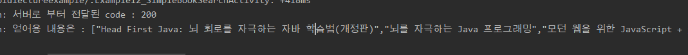
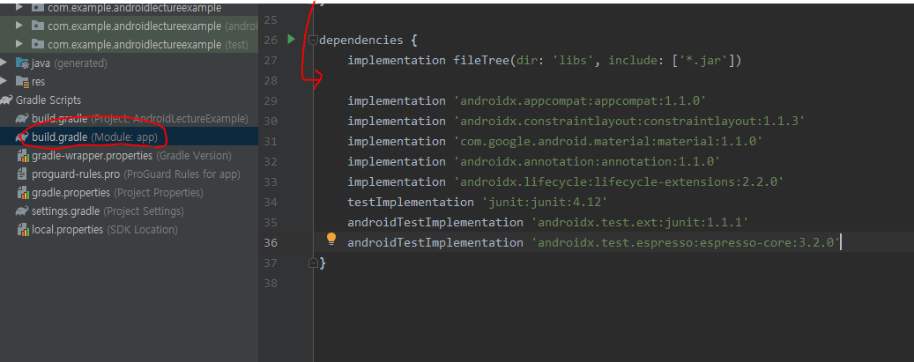
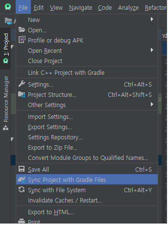

# 2020-03-23

---

# Android Day05

## 도서검색 어플리케이션

1. `ListView` 컴포넌트를 이용.

   * `Layout`

   ```xml
   <?xml version="1.0" encoding="utf-8"?>
   
   
       <LinearLayout xmlns:android="http://schemas.android.com/apk/res/android"
           android:layout_width="match_parent"
           android:layout_height="match_parent"
           android:orientation="vertical">
   
           <LinearLayout
               android:layout_width="match_parent"
               android:layout_height="wrap_content"
               android:orientation="horizontal">
   
               <EditText
                   android:id="@+id/_12_01_searchTitle"
                   android:layout_width="wrap_content"
                   android:layout_height="wrap_content"
                   android:layout_weight="5" />
   
               <Button
                   android:id="@+id/_12_02_searchBtn"
                   android:layout_width="wrap_content"
                   android:layout_height="wrap_content"
                   android:layout_weight="1"
                   android:text="Search" />
           </LinearLayout>
       
           <ListView
               android:id="@+id/_12_03_searchList"
               android:layout_width="match_parent"
               android:layout_height="match_parent" />
   
       </LinearLayout>
   
   ```

   


* `EditText` : 상수 또는 `Field`변수로 처리

* `Web Application`을 통해 네트워크 통신을 이용하여 데이터를 가져오는 처리 = 시간이 오래걸림 

  * `Thread`로 처리해야함.
  * `Thread`와 데이터를 주고받기 위해 처리를 위해 `Handler` 사용!

  ```java
  public class Example12_SimpleBookSearchActivity extends AppCompatActivity {
  
      @Override
      protected void onCreate(Bundle savedInstanceState) {
          super.onCreate(savedInstanceState);
          setContentView(R.layout.activity_example12_simple_book_search);
  
          // 검색버튼에 대한 reference 획득 및 이벤트 처리.
          Button searchBtn = (Button) findViewById(R.id._11_02_startBtn);
          // 검색입력상자에 대한 reference 획득.
          final EditText searchTitle = (EditText) findViewById(R.id._12_01_searchTitle);
          // 결과 ListView 에 대한 reference 획득.
          final ListView searchList = (ListView) findViewById(R.id._12_03_searchList);
  
          // Network 연결 (Web Application 호출)을 해야 하기 떄문에
          // UI Thread (Activity) 에서 이 작업을 하면 안된다.
          // => Thread 로 해결해야 한다.
          //=> Thread 와 데이터를 주고받기 위해서 Handler 이용.
  
          // Handler 객체를 생성.
          @SuppressLint("HandlerLeak") final Handler handler = new Handler(){
              // Thread 에 의해서 추후에 sendMessage 가 호출되는데
              // sendMessage 에 의해서 전달된 데이터를 처리하기 위해서
              // handleMessage 를 overriding 하면서 instance 를 생성.
              @Override
              public void handleMessage(@NonNull Message msg) {
                  super.handleMessage(msg);
                  // Thread 가 보내준 데이터로 ListView 를 채우는 코드
  
              }
          };
      }
  }
  ```

* `Button` 에 대한 이벤트 처리 (`Thread` 생성)

* `Runnable` 객체를 만들때 데이터를 받기위해 인자를 받아야함. (`Handler`와 `EditText`안의 문자.)

  ```java
   searchBtn.setOnClickListener(new View.OnClickListener() {
              @Override
              public void onClick(View v) {
                  // Thread 를 생성
                  BookSearchRunnable runnable = 
                          new BookSearchRunnable(handler, searchTitle.getText().toString());
                  Thread t = new Thread(runnable);
                  t.start();
              }
          });
  ```

* `Thread` 를 생성하기 위한 Runnable interface 를 구현한 class 를 정의 (`Activity` 외부에 작성)

  ```java
  class BookSearchRunnable implements Runnable{
     private Handler handler;
     private String keyword;
    
      BookSearchRunnable(){} // default constructor (기본 생성자.)
      
      BookSearchRunnable(Handler handler,String keyword){
          this.handler = handler;
          this.keyword = keyword;
      }
  }
  ```

* 생성자 함수를 작성하지 않으면 기본적으로 기본생성자가 있다.

* 그러나 새로운 생성자를 만들경우 기본생성자는 생기지 않는다.

* 기본생성자가 없는 경우 class 재사용성에 좋지 않다.

* 모든 class는 기본생성자를 일반적으로 갖고 있다.


* `run()` 매서드역할 :  Web Application 을 호출. 결과를 받아서 그 결과를 예쁘게 만든 후 handler 를 통해서 activity 에게 전달.


## 기타 준비사항.

1. DB 기동.
2. Web Application 작성.


---

* 아래와 같은 오류가 발생! 

  

* 안드로이드 보안에 관련된 Exception.

* 안드로이드 보안 허용.

  * 인터넷 접속 허용에 관한 Tag를 AndroidManifest.xml에 작성.

  ```xml
  <uses-permission android:name="android.permission.INTERNET"/>
  ```

* 또한 안드로이드 9 (Pie) 버전부터 보안이 강화되었다.

  * 웹 프로토콜에 대한 기본 protocol 이 http 에서 https 로 변경이 되었다.
  * 따라서 보안성이 없는 protocol (http)을 이용할 경우 약간의 설정 추가가 필요하다.

  ```xml
  <!--application Tag 안에서-->
  <application
          android:usesCleartextTraffic="true"
  ```

---

데이터 가져오기

* 서버와의 연결객체를 이용하여 서버와의 데이터 통로를 하나 열어야 한다.

* `Java Stream`

* 기본적인 연결 통로를 이용해서 조금더 효율적인 연결통로로 다시 만들어 사용.

  ```java
  BufferedReader br = new BufferedReader(
                      new InputStreamReader(con.getInputStream()));
  ```

* 서버가 보내주는 데이터를 읽어서 하나의 문자열로 만들어 준다.

  ```java
  String readLine = "";
              StringBuffer responseTxt = new StringBuffer();
              while ((readLine = br.readLine()) != null) { // 서버와 연결하여 다음줄이 null 이 아니면 계속 저장.
                  responseTxt.append(readLine);
  
              }
  ```

* 자원반납

  ```java
  br.close(); 
  ```

  

* 가져온 값은 문자열로 가져온다.

  * `[  ]` 형태로 보여 배열로 보일수 있지만 `[ , ]` 두 기호 모두 문자열 상태로 가져와 가져온 데이터는 배열이 아닌 `문자열(String)` 형태이다. 


* 가져온 데이터(문자열)를 자료구조화 시켜서 안드로이드 앱에 적용
  * 일반적으로 서버쪽 웹 프로그램은 `XM`L이나 혹은 `JSON`으로 결과 데이터를 제공한다.
  * 여기서 받은 데이터도 `JSON` 형식
  * 받은 `JSON` 을 `Java`의 자료구조로 변경해야 한다.
  * `JSON parsing library`를 가져다가 좀 편하고 쉽게 `JSON`을 `handling` 할수 있다.
  * 가장 대표적인 `JSON` 처리 `library`중 하나인 `JACKSON library`를 이용.

1. `JSON library`설치

   * `Gradle`을 이용하여 설치

   

   * 여기에 `JACKSON` 라이브러리 추가

   ```xml
       implementation 'com.fasterxml.jackson.core:jackson-core:2.9.7'
       implementation 'com.fasterxml.jackson.core:jackson-annotations:2.9.7'
       implementation 'com.fasterxml.jackson.core:jackson-databind:2.9.7'
   ```

   * 아래의 메뉴로 `Gradle` 적용

   

2. 사용법

   ```java
         //JSON library 사용
            ObjectMapper mapper = new ObjectMapper();
            String[] resultArr = mapper.readValue(responseTxt.toString(),String[].class); 
   	 // String array class 로 바꾸라는 형태.
   ```

3. 최종 결과 데이터를 `Activity`에게 전달해야 한다. (`UI Thread`에게 전달해서 화면제어를 하기 위함.)

   1. `Bundle` 에 전달할 데이터를 붙임.

      ```java
      Bundle bundle = new Bundle();
      bundle.putStringArray("BOOKLIST",resultArr);
      ```

      

   2. `Message` 를 만들어서 `Bundle` 을 `Message`에 부착.

      ```java
       Message msg = new Message();
       msg.setData(bundle);
      ```

      

   3. `Handler`를 이용하여 `Message`를 `Activity`에 전달.

      ```java
      handler.sendMessage(msg);
      ```

4. `Activity`에서 사용.

   * `handleMessage()` 메서드 안에서 사용.

   ```java
   @SuppressLint("HandlerLeak") final Handler handler = new Handler() {
               // Thread 에 의해서 추후에 sendMessage 가 호출되는데
               // sendMessage 에 의해서 전달된 데이터를 처리하기 위해서
               // handleMessage 를 overriding 하면서 instance 를 생성.
               @Override
               public void handleMessage(@NonNull Message msg) {
                   super.handleMessage(msg);
                   // Thread 가 보내준 데이터로 ListView 를 채우는 코드
                   // Thread 가 보내준 Message 에서 Bundle을 꺼낸다.
                   Bundle bundle = msg.getData();
                   // Bundle 에서 key 값을 이용해 데이터를 추출.
                   String[] bookList = (String[])bundle.get("BOOKLIST");
               	// ListView 사용은 Spinner 사용과 비슷하다.
                   // ListView 에 데이터를 설정하려면 Adapter 가 필요하다.
                   // Adapter 에 데이터를 설정하여 이 Adapter 를 ListView 에 부착시킨다.
                   ArrayAdapter adapter = 
                           new ArrayAdapter(getApplicationContext(),
                        android.R.layout.simple_list_item_1,bookList); // 컨텍스트, 리스트종류, 데이터
                   // ListView에 위에서 생성한 adapter를 부착.
                   searchList.setAdapter(adapter);                
               }
           };
   ```


---

> MySQL 이용툴.
>
> oracle SQLDeveloper 를 이용.
>
> Toad Edge 이용.

## 연습문제

1. `ListView`의 특정 책을 클릭(터치) 하면 해당책의 세부정보 (표지이미지, 제목, 저자, 가격, ISBN)를 새로운 `Activity`로 출력!
   1. 웹 프로그램도 작성하기. (DB 참조해서)
   2. 특정 책에대한 세부정보를 얻어오는 Web Application이 필요하다.
      * 현재 데이터(데이터베이스)가 어떤 구조로 되어 있는지를 확인!
      * `MySQL`을 사용하고 있는데 데이터 구조를 살펴보기 위해서 `SQLDeveloper`를 이용해서 테이블 살펴보기.
2. `Custom List View` 확장

* 