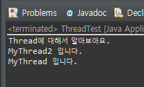
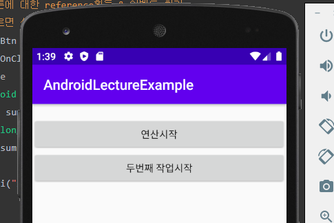
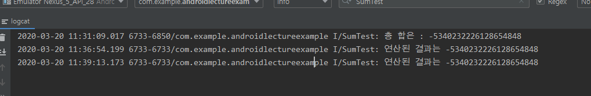
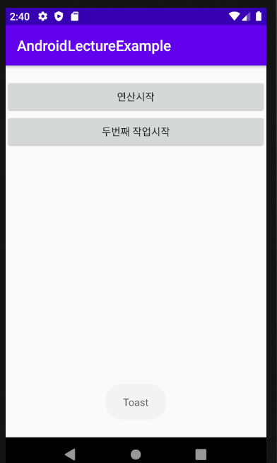

# 2020-03-20

---

## Thread

>### Java Program의 main() -> program의 시작지점.
>
>* main()이 종료되면 프로그램이 종료됨.
>* 이런 관점에서 보면 우리 프로그램은 실행흐름이 단 1개만 존재한다.
>* 이러한 실행흐름 = `Thread`
>* 우리가 기존 사용한 프로그램 = 단일 스레드 프로그램.
>  * 단일 스레드 프로그램은 여러 사람이 사용하기에 좋지 않다.
>* main() thread에서 별도의 실행흐름(thread)을 파생시킬수 있다.
>* Tomcat이 내부적으로 알아서 Thread를 진행해서 웹 진행시에는 사용한 기억이 없음...!

* Thread가 사용되는 경우
  1. 대용량의 데이터를 분산해서 처리해야 되는 경우.
  2. 다수의 클라이언트를 처리하는 서버프로그램


* `Java Thread`
  * 프로그램의 `entry point`
  * 프로그램은 해당 프로그램에서 사용되는 모든 `Thread`가 종료되는 시점에 프로그램이 종료된다.
  * 프로그램은 여러개의 `Thread`의 집합이라 생각해도 된다.
  * 자바에서 `Thread`는 `instance(객체)` 로 표현된다 
  * `Thread` 를 만들기 위한 `Class`가 존재한다. => `Thread class`
* `Thread` 생성방식
  1. 상속을 이용하여 생성
     * 상속 장점 : 재사용성. 
     * 단점 : 두개의 클래스 관계가 매우 밀접한 관계 `(tightly coupled)` 독립적인 사용 불가능.
  2. `interface`를 구현하여 생성

### 1. 상속을 이용한 방법

* `Thread class`를 상속받아서 사용.

  ```java
  package com.test;
  class MyThread extends Thread{
  	@Override
  	public void run() {
  		super.run();
  		System.out.println("MyThread 입니다.");
  	}
  }public class ThreadTest {
  	public static void main(String[] args) {
  		Thread t = new MyThread();	// t: thread instance
  	    // thread를 실행시키려면 start() method를 사용.
  	    t.start(); // non blocking method
  	    System.out.println("Thread에 대해서 알아보아요.");
  	}
  }
  ```

* `non blocking method` : 매서드가 끝나지 않아도 다음 문장이 진행되는 `method`

* `blocking method` : 해당 `method`가 끝난후에 다음 문장 진행되는 `method`

  * 기본적인 `method`들은 `blocking method`임.

### 2. Interface를 이용한 방법

* `Runnable` 인터페이스를 이용하여 생성한다.

* `Runnable`자체는 `Thread`아님.

  ```java
  class MyRunnable implements Runnable{
  	@Override
  	public void run() {
  	System.out.println("MyThread2 입니다.");
  	}
  }
  ```

* 사용시에 Runnable을 Thread 객체 매개변수로 넣어 선언하면서 사용한다.

  ```java
  public class ThreadTest {
  	
  	public static void main(String[] args) {
  		
  	    Thread t = new MyThread();	// t: thread instance
  	    MyRunnable runnable = new MyRunnable();
  	    Thread t1 = new Thread(runnable); // 인자로 넣어서 Thread생성.
  	    // thread를 실행시키려면 start() method를 사용.
  	    t.start(); // non blocking method
  	    t1.start();
  	    System.out.println("Thread에 대해서 알아보아요.");
  	}
  
  }
  ```

  

### Android 에서 Thread

* 연산이 오래걸리는 코드 작성.

  ```java
  package com.example.androidlectureexample;
  
  import androidx.appcompat.app.AppCompatActivity;
  
  import android.os.Bundle;
  import android.util.Log;
  import android.view.View;
  import android.widget.Button;
  import android.widget.TextView;
  
  public class Example08_ANRActivity extends AppCompatActivity {
  
      @Override
      protected void onCreate(Bundle savedInstanceState) {
          super.onCreate(savedInstanceState);
          setContentView(R.layout.activity_example08_anr);
  
          // TextView에 대한 reference를 획득.
          final TextView sumTv = (TextView)findViewById(R.id._08_01_sumTv);
  
          // 첫번째 버튼에 대한 reference획득 & 이벤트 처리.
          // 버튼을 누르면 상당히 오랜시간 연산이 수행.
          Button startBtn = (Button)findViewById(R.id._08_02_startBtn);
          startBtn.setOnClickListener(new View.OnClickListener(){
              @Override
              public void onClick(View v) {
                  long sum = 0;
                  for(long i=0;i<10000000000L;i++){
                      sum += i;
                  }
                  Log.i("SumTest","연산된 결과는 "+sum);
              }
          });
          // 두번째 버튼에 대한 reference획득 & 이벤트 처리.
          // Toast message를 출력
          Button secondBtn = (Button)findViewById(R.id._08_03_startBtn);
          secondBtn.setOnClickListener(new View.OnClickListener(){
              @Override
              public void onClick(View v) {
                  Toast.makeText(Example08_ANRActivity.this,"버튼이 클릭되었다.",
                          Toast.LENGTH_SHORT).show();
              }
          });
      }
  }
  
  ```

* 위 어플 실행시 연산시작 버튼을 누르면 연산이 오래 진행됨. 5초이상 연산이 진행되면 ANR이 진행됨.

  

  

* 결과적으로 사용자와의 `interaction`이 중지된다.

* `Activity`가 `block`된 것처럼 보인다. -> `ANR ( Application Not Responding )`

* `ANR`현상을 피해야 한다.


* Activity 의 최우선 작업은 사용자와의 interaction 이다.
* Activity 에서는 시간이 오래 걸리는 작업은 하면 안된다.
* 대표적인 시간이 오래 걸리는 작업 : `DB 처리`, `대용량 파일처리`, `Logic 처리` 
* `Thread`로 만들어 실행을 진행시키면 된다.


* `Activity` 도 하나의 `Thread` 이다 ! (독립적인 실행흐름) => `UI Thread`

* 로직처리는 `background Thread`를 이용해서 처리해야 한다.

* 생성할 `Thread` 클래스는 따로 `class` 파일을 만들거나 아니면 `Activity`안에서 `inner class`로 만들어 사용한다.

  ```java
  Button startBtn1 = (Button) findViewById(R.id._09_02_startBtn);
          startBtn1.setOnClickListener(new View.OnClickListener() {
              @Override
              public void onClick(View v) {
                  // Thread 를 만들어서 실행
                  MyRunnable runnable = new MyRunnable();
                  Thread t = new Thread(runnable);
                  t.start();
              }
          });
  
  ```

* 사용은 아래처럼 사용

  ```java
  Button startBtn1 = (Button)findViewById(R.id._09_02_startBtn);
          startBtn1.setOnClickListener(new View.OnClickListener(){
              @Override
              public void onClick(View v) {
                  // Thread 를 만들어서 실행
                  MyRunnable runnable = new MyRunnable();
                  Thread t = new Thread(runnable);
                  t.start();
              }
          });
  ```

* 위와 같이 작성하면 연산시작 버튼을 눌러도 ANR 상태가 되지 않는다.

  

  

> 스마트 폰 개발자 옵션중 OEM 잠금해제를 키면
>
> 백업하면 모든 정보가 날라간다!

---

## Progress Bar

* Progress Bar widget

  ```xml
  <ProgressBar
          android:layout_width="match_parent"
          android:layout_height="wrap_content"
          android:id="@+id/_10_04_counterProgress"
          style="@android:style/Widget.ProgressBar.Horizontal"
          android:progress="25"/>
  ```

* 잘못된 방식.

  ```java
  package com.example.androidlectureexample;
  
  import androidx.appcompat.app.AppCompatActivity;
  
  import android.os.Bundle;
  import android.os.Trace;
  import android.view.View;
  import android.widget.Button;
  import android.widget.ProgressBar;
  import android.widget.TextView;
  
  public class Example10_CounterLogProgressActivity extends AppCompatActivity {
  
      private TextView tv;
      private ProgressBar pb;
  
      @Override
      protected void onCreate(Bundle savedInstanceState) {
          super.onCreate(savedInstanceState);
          setContentView(R.layout.activity_example10_counter_log_progress);
          tv = (TextView) findViewById(R.id._10_01_sumTv);
          pb = (ProgressBar) findViewById(R.id._10_04_counterProgress);
  
          Button startBtn = (Button) findViewById(R.id._10_02_startBtn);
          startBtn.setOnClickListener(new View.OnClickListener() {
              @Override
              public void onClick(View v) {
                  // Thread를 만들어서 처리하도록 해야 해요.
                  CounterRunnable runnable = new CounterRunnable();
                  Thread t = new Thread(runnable);
                  t.start();
              }
          });
  
      }
      // Android UI component(Widget)는 thread safe 하지 않는다.
      class CounterRunnable implements Runnable {
  
          @Override
          public void run() {
              // 숫자를 더해가면서 progressbar를 진행시킨다.
              long sum = 0;
              for (long i = 0; i < 10000000000L; i++) {
                  sum += i;
                  if (i % 100000000 == 0) {
                      //Long loop = i / 100000000;  // autoboxing
                      long loop = i / 100000000;
                      pb.setProgress((int) loop);
                  }
              }
              tv.setText("합계는 : " + sum);
          }
      }
  }
  
  ```

  * `Android UI component(Widget)`는 `thread safe` 하지 않는다.
  * `Android UI component`는 오직 `UI Thread( Activity )`에 의해서만 제어되어야 한다.
  * 화면제어(`UI component-widget`)는 오직 `UI Thread( Activity )`에 의해서만 제어될 수 있다.
  * **외부 `Thread( UI Thread가 아닌)`에서 `UI component`를 직접 제어할 수 없다.**
  * `Handler`를 이용해서 이 문제를 해결해야 한다.

### Handler

* `Message` 를 주고받는 객체.
* `Handler`를 통해 `Thread`가  `Message`를 보내면 `Activity`가 받는다.
* `Thread`와 `Activity` 사이에 `Message`를 주고 받는 객체이다.


* 외부 `Thread`와 `UI Thread(Activity)` 사이에서 `Data` 교환.

  * `onCreate()` 내에서는 `Activity(UI Thread)`에서의 화면을 구성. 
  * 외부 `Thread`에서는 `UI Component`에 대한 제어를 하면 안된다. -> `Thread safe` 하지 않기 때문.
  * `Activity` 와 외부 `Thread` 사이에서 `Data` 교환은 `Message` 객체를 통해 주고 받을수 있다.
  * `Message` 객체는 `Handler`객체를 통해 `Activity`와 외부 `Thread` 사이를 이동한다.
  * `Handler` 객체는 `Activity` 안에서 생성해 줌과 동시에 `handleMessage()` 매서드를 오버라이딩 해준다.(`Thread`에서도 사용해 주기 위해 상수(`final`)로 생성)
  * 버튼 이벤트로 `Thread` 동작시 `Thread` 를 생성할 때 위에서 생성한 `Handler` 객체를 인자로 주면서 생성한다.
  * `Thread` 내에서 `Handler` 객체 안에 `Data`를 넣을때 `Message` 객체의 형태로 `Data`를 넣을 수 있다.
  * 하지만 일반 데이터 형태는 `Message` 객체로 직접 넣을수 없어 `Bundle`객체를 거처서 넣는다.
  * 외부`Thread`에서 `Message`를 넣는 `sendMessage()` 매서드가 실행 될때마다 `Activity` 내에 `Handler` 객체의 `handlerMessage()`가 실행이 된다.
  * `handlerMessage()` 매서드 내에서 외부 `Thread`에서 받아온 데이터를 이용하여 화면제어가 가능하다. 

  ```java
  package com.example.androidlectureexample;
  
  import androidx.annotation.NonNull;
  import androidx.appcompat.app.AppCompatActivity;
  
  import android.annotation.SuppressLint;
  import android.os.Bundle;
  import android.os.Handler;
  import android.os.Message;
  import android.view.View;
  import android.widget.Button;
  import android.widget.ProgressBar;
  import android.widget.TextView;
  
  public class Example11_CounterLogHandlerActivity extends AppCompatActivity {
  
      @Override
      protected void onCreate(Bundle savedInstanceState) {
          super.onCreate(savedInstanceState);
          setContentView(R.layout.activity_example11_counter_log_handler);
  
          // TextView 에 대한 reference 를 가져와서
          final TextView tv = (TextView)findViewById(R.id._11_01_sumTv);
          // ProgressBar 에 대한 reference 를 가져와서
          final ProgressBar pb = (ProgressBar)findViewById(R.id._11_04_counterProgress);
  
          // 데이터를 주고받는 역할을 수행하는 Handler객체를 하나 생성.
          // Handler 객체는 메시지를 전달하는 method와
          // 메시지를 전달받아서 로직처리하는 method 2개를 사용.
          @SuppressLint("HandlerLeak") // Handler객체의 누수방지.
          final Handler handler = new Handler(){ // 매서드를 Override 하면서 선언할 수 있음.
              @Override
              public void handleMessage(@NonNull Message msg) { // Handler 가 메시지를 받으면 이 메서드가 실행됨.
                  super.handleMessage(msg);
                  //받은 메시지를 이용해서 화면처리!
                  Bundle bundle = msg.getData();
                  String count = bundle.getString("count");
                  pb.setProgress(Integer.parseInt(count));
              }
          };
  
          // 연산시작 버을 클릭했을 때 로직처리하는 Thread 를 생성해서 실행
          Button startBtn = (Button)findViewById(R.id._11_02_startBtn);
          startBtn.setOnClickListener(new View.OnClickListener(){
              @Override
              public void onClick(View v) {
                  // Thread 를 생성.
                  // Thread 에게 Activity 와 데이터 통신을 할 수 있는 Handler 객체를 전달해야한다.
                  MySumThread runnable = new MySumThread(handler);
                  Thread t = new Thread(runnable);
                  t.start();
  
              }
          });
      }
  }
  // 연산을 담당하는 Thread 를 위한 Runnable interface 구현한 class
  class MySumThread implements Runnable{
      private Handler handler;
  
      public MySumThread(Handler handler){
          this.handler = handler;
      }
  
      @Override
      public void run() {
          // 로직처리
          // 숫자를 더해가면서 progressbar를 진행시킨다.
          long sum = 0;
          for (long i = 0; i <= 1000000000L; i++) {
              sum += i;
              if (i % 10000000 == 0) {
                  //Long loop = i / 100000000;  // autoboxing
                  long loop = i / 10000000;
                  //pb.setProgress((int) loop);
                  // msg 를 만들어서 handler 를 이용해 Activity 에게 msg 를 전달.
                  // Bundle 객체를 하나 만들어야 한다. Map 구조.
                  Bundle bundle = new Bundle();
                  bundle.putString("count",String.valueOf(loop));
                  // 이 Bundle 을 가질 수 있는 Message 객체를 생성.
                  Message msg = new Message();
                  msg.setData(bundle);
                  handler.sendMessage(msg); // msg 전송
              }
          }
          
      }
  }
  
  ```

  


