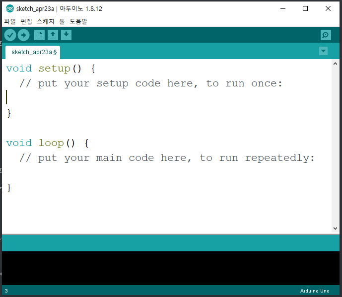

# 2020-04-23

# Arduino

* Arduino(아두이노) 이탈리아어
* 이탈리아에서 만든 오픈소스 하드웨어
* 강한친구, 강력한 친구, 절친한 친구 란 의미.
* 아두이노는 컴퓨터가 아니다. -> OS 설치나 기타 여러가지 응용프로그램을 설치할 수 없다.
* 아두이노는 단순한 마이크로 컨트롤러이다.

## 아두이노가 뜬 배경

* 아두이노가 각광받기 시작한 이유는 `IoT`와 맞물려 있기 때문이다.
* `IoT(Internet of Things)` : 사물 인터넷
  * 일반적인 사물에 통신장비를 결합하고 고도의 통신기술을 이용하여 특별한 작업을 수행하는 장비를 지칭한다.
* 사물인터넷을 구현하기 위해서 그 안에 들어가는 Controller가 가져야하는 조건
  1. 가격이 저렴
  2. 프로그램 작성과 프로그램 이식이 쉬워야 한다.
  3. 센서와 액추에이터를 쉽게 사용할 수 있어야 한다.
* 아두이노는 브랜드명. 그안에 여러개의 버전이 존재


* 아두이노 모델
  * 가장 대표적인 모델(버전) : `Uno`
  * 크기가 크지만 꽤나 복잡한 처리를 할 수 있는 버전 : `Mega`
  * 크기가 아주 작은 버전 : `Mini`
  * 버전이 존재하고 우리 목적에 맞게 선택해서 사용하면 된다.


* 전류와 전압
  * 전압 => + 에서 -로 흐른다.
  * 기억해야 하는 전기상식
    * 옴의 법칙
      * 전압 : V (Voltage) 단위  V(볼트)
      * 전류 : I (Intensity) 단위 A(암페어)
      * 저항 : R (Resistance) 단위 옴
      * I = V / R

## 센서와 액추에이터

* 센서 : 일반적으로 주위환경에 대한 정보를 수집
  * 온도센서, 습도센서, 거리센서, 밝기센서 등
* 액추에이터 : 아두이노가 어떤 활동을 할 수 있도록 도와주는 전자부품
  * 모터, 스피커, LED 등
* 저항은 전기를 열로 바꿔주는 전자부품
* 저항의 값을 알아내는 방법이 존재한다.

## 빵판

* BreadBoard(빵판)
  * 여러개의 전자기기를 연결하다보면 헤더소켓이 부족하다.
  * 헤더소켓을 확장시켜서 사용할 목적으로 이용한다.


## 아두이노의 제어

* 디지털방식과 아날로그 방식이 존재한다.
  * 디지털 : 전류 흐름/ 안흐름
  * 아날로그 : 세기 제어가 가능하다.
* 아두이노 보드에는 헤더소켓이라고 부르는 점퍼와이어를 꼽을 수 있는 홈이 있다. => 핀(pin)
  * 디지털 핀으로 총 13개의 핀이 존재함.
  * 디지털의 0,1 번핀은 컴퓨터와 시리얼통신을 하기위한 핀. 
  * [다운로드](https://www.arduino.cc/en/Main/Software)


## IDE

* 아두이노 기기에 코드를 넣기위한 IDE(Tool)가 필요함
* 프로그램 코드를 작성해서 아두이노에 이식.



* `setup()` 함수 : 실행 되었을 때 1번 실행
  * 보통 초기화 코드를 작성.
* `loop()` 함수 : `setup()` 함수가 실행된 후 `loop()` 함수가 계속 반복수행됨.
  * 코드는 c를 기반으로 동작한다.


## 아두이노 코딩

1. 핀번호 설정.

   * 처음 아두이노를 사용할 때 setup() 함수를 이용하여 pin 번호의 초기화가 필요하다.

   * `pinMode()` 함수를 이용하여 설정이 가능하다.

   * 업로드 시 해당 아두이노의 버전과 포트번호를 툴 탭에서 보드와 탭을 통해 지정해줘야 업로드가 가능하다.

      

2. 시리얼통신 (보드 -> 컴퓨터)

   * Borad rate : 시리얼을 보내는 속도.

   * 보내는 속도와 받는속도가 같아야 한다.

     

   * 해당 레이트만큼 setup() 함수에 설정을 해준다.

     ```c
     void setup() {
       // put your setup code here, to run once:
       // 위 화면에 보드레이트와 같게 만듬.
       Serial.begin(9600);
     }
     
     void loop() {
       // put your main code here, to run repeatedly:
       // 시리얼 모니터에 문자열 출력
       Serial.println("Hello World!");
       delay(1000);
     }
     ```

   * 결과 : Serial 모니터를 통해 확인.

     

   * 1초마다 "Hello World!" 문자가 출력된다.

3. 시리얼통신 (컴퓨터 -> 보드 -> 컴퓨터)

   1. 

# 라떼팬더

* 싱글보드 컴퓨터
* 아두이노보드와 연결하여 사용가능.

> 라즈베리파이는 OS 설치와 응용프로그램 설치가 가능하다.
>
> 라즈베리는 마이크로 컨트롤러와 싱글보드 컴퓨터가 함께 있는 형태,


