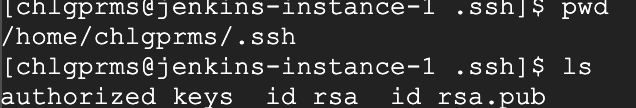
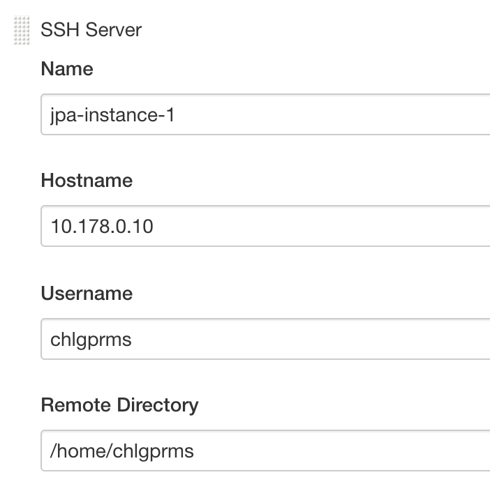
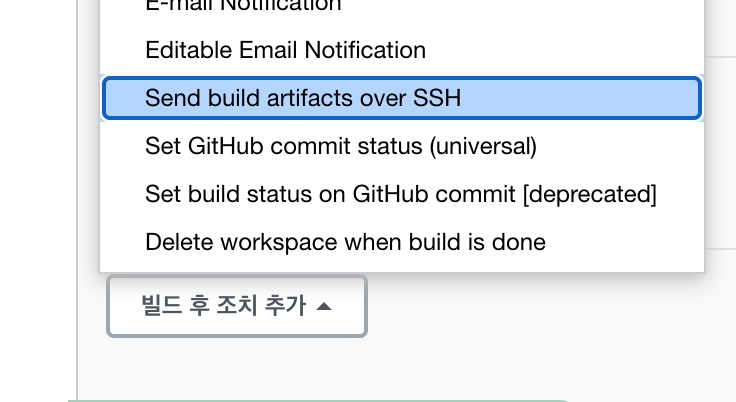

# Jenkins를 이용하여 도커파일 배포하기


## gcp 인스턴스에 jenkins 설치하기


```cmd
sudo yum install wget
sudo yum install maven #java 포함되어 있음
sudo yum install git
sudo yum install docker

# 패키지 추카
sudo wget -O /etc/yum.repos.d/jenkins.repo https://pkg.jenkins.io/redhat-stable/jenkins.repo
sudo rpm --import https://pkg.jenkins.io/redhat-stable/jenkins.io.key
sudo yum install jenkins
# 잰킨스 데몬 실행
sudo systemctl start jenkins
sudo systemctl status jenkins

sudo cat /var/lib/jenkins/secrets/initialAdminPassword
```

* status 확인후 running 상태이면 해당 gcp인스턴스 외부 ip:8080으로 접속하면 젠킨스 초기설정 화면이 나타남. (포트가 막혀있다면 방화벽 열어주기)
* 초기설정을 진행한다. 

## 리버스 프록시설정

* 젠킨스 인스턴스에서 공개키 암호키를 설정한후 해당 인스턴스의 공개키를 베포할 인스턴스에게 나눠주어 오로지 젠킨스만 해당인스턴스에 접근이 가능하도록 설정할 예정. (ssh연결)

* ssh키 만들기

```cmd
ssh_keygen -t rsa -f ~/.ssh/id_rsa
```

* 생성된 키 정보는 `~/.ssh/`에서 확인 가능하다.
* `id_rsa` : 공개키 , `id_rsa.pub` : 암호키



* 공개키를 베포할 인스턴스에 저장해야 한다.
* 베포할 인스턴스에 접속하여 `~/.ssh/id_rsa` 폴더 안에 `authorized_keys` 파일에 잰킨스인스턴스에서 복사한 공개키를 입력해준다.
* 입력후 해당 파일의 권한을 변경해 준다

```cmd
chmod 700 ~/.ssh
chmod 600 ~/.ssh/authorized_keys
```


> gcp 에서는 위에 과정없이 ssh를 설정하는 기능을 제공해 준다.
>
> gcp 클라우드에서 왼쪽 메뉴 맨 아래 `설정 - 메타데이터` 메뉴에 들어가면
>
> ssh키를 설정하는 곳이있다. 해당 부분에 젠킨스 인스턴스의 공개키를 등록하게 되면 해당 gcp에서 생성하는 모든 인스턴스에 해당 공개키가 공유된다. 
>
> **단 위와 같이 공개키를 공유한 경우에도 위에 해당 파일의 권한은 변경해 주어야 한다.**

* 입력후 Jenkins 홈으로 돌아와 `Jenkins관리 - 시스템 설정` 메뉴를 클릭.

* `Publish over SSH` 메뉴를 찾아 아래 `Key` 영역에 암호키를 입력한다.

* `SSH Servers` 에는 베포할 인스턴스의 정보를 입력한다.

  

* `Name` : 사용자 지정이름.
* `HostName` : 베포할 인스턴스 아이피 ( 젠킨스와 같은 네트워크상에 존재하여 내부 ip를 입력해줌.)
* `UserName` : 인스턴스에 접속해 있는 유저이름.
* `Remote Directory` : 내가 사용할 디렉토리 위치 (현재는 홈 디렉토리로 지정함)


## 베포스크립트 작성

* 새로운Item -> 이름 지정, Freestyle Project 선택후 ok버튼 클릭

* 빌드 후 조치 메뉴에서 ssh메뉴로 설정

  

  > 고급 - Verbose output in console 을 체크하면 로그를 자세히 출력할 수 있다.
  >
  > 

* Exec command 에 도커 빌드 커맨드를 입력한다.

  ```cmd
  docker run -p 외부포트:내부포트 chkchk610/spring-boot-jpa-practice
  ```

* 실행 전 인스턴스를 처음 실행했다면 아래의 커맨드 수행이 선행되어야 함.

  1. 8080 번 포트 사용시 sudo는 의미없다.

