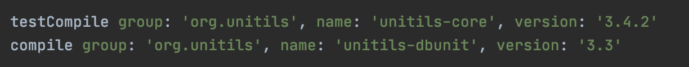
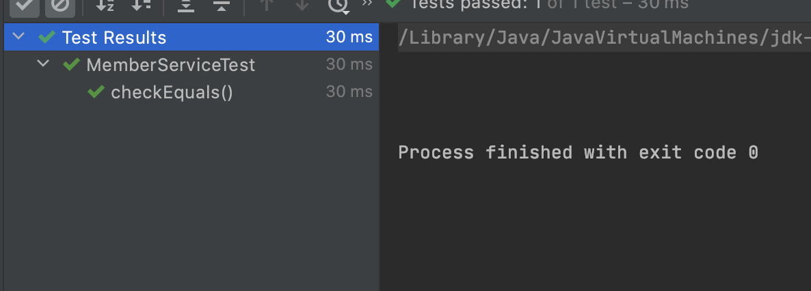

# 6장

## Unitils

단위 테스트 지원 라이브러리.




### 1. assertEquals 객체비교 에러

* 동일성과 동치성

  * 동일성: 두 객체가 같은 객체인가를 판단.
  * 동치성: 두 객체가 표현하고자 하는 상태가 서로 일치한가 판단.

* JUnit의 assertEauals는 동일성을 비교함.

  ```java
  		@Test
      void equalsTest(){
             Member m1 = new Member();
             Member m2 = new Member();
  
             m1.setName("a");
             m1.setId(1l);
             m2.setName("a");
             m2.setId(1l);
  
          	assertEquals(m1,m2);
  
      }
  ```

  

  

* Unitils 를 이용하면 위와 같은 비교를 깔끔하게 설정 가능하다.


### Unitils 라이브러리

* gradle

  ```groovy
  testCompile group: 'org.unitils', name: 'unitils-core', version: '3.4.2'
  ```

* Reflection Assertion

  ```java
  import static org.unitils.reflectionassert.ReflectionAssert.*; 
  ...
  assertReflectionsEquals(예상객체, 실제객체);
  assertReflectionsEquals([메시지], 예상객체, 실제객체);
  ```

* 메세지 적는것을 권장함.

  ```java
      @Test
      void equalsTest(){
             Member m1 = new Member();
             Member m2 = new Member();
  
             m1.setName("a");
             m1.setId(1l);
             m2.setName("a");
             m2.setId(1l);
          assertReflectionEquals("다른 객체",m1,m2);
  
      }
  ```

  

* Lenient Assertion
  * LENIENT_ORDER : 컬렉션, 배열 비교시 순서 무시.
  * IGNORE_DEFAULTS : 객체의 필드 중 기본값(타입의 기본값)은 비교안함. (0, null, false) 
    * 이때 사용되는 객체의 순서가 중요함. 예상객체의 기본값을 비교안함. 실제객체에 필드값은 비교함.
  * LENIENT_DATES : 시간이나 날짜타입은 비교 안함.
  * assertLenientEquals도 있는데 위에 두개중 LENIENT_DATES만 제외된 메서드임.


### Property Assertions

* 객체 특정 필드에 예상하는 값이 제대로 할당됐는지 확인하는 방법.

* 가장 간단한 방법 -> getter 메소드를 이용.

* 하지만 getter 메소드가 제공되지 않는 경우.

* 이때 사용되는 것이 Java 의 기능중 리플렉션을 이용하는것. -> 직접 만들지 말고 assertPropertyLenientEquals를 이용.

  ```java
  	@Test
      void propertyLenientsEqualsTest(){
          Member member = Repository.getMember();
          assertPropertyLenientEquals("name","a",member);
      }
  ```

* 위의 비교는 JavaBeans 규칙을 따르는 식으로 비교함. -> 만약 객체에 getter가 생기면 getter로 비교. 없으면 리플랙션으로 비교.


### Unitils 모듈


* DB 관련 기능, Hibernate, JPA, Spring, Mock Object 에 유용한 기능.


* 흔한 DB TDD 구현 순서
  1. 조회 계열 기능을 먼저 TDD로 구현
  2. 추가/수정/삭제 등은 해당 조회 기능을 이용해 검증하도록 작성.
* 이는 Test 성공/실패 판단을 findById에 전적으로 의존함. -> 조회 기능 에러시 모든 기능이 에러


TDD 로 작업된 소스에서 어느 한부분을 고쳤더니 여러 개의 테스트 케이스가 동시에 실패한다면, 위 상황을 의심해 볼 수 있다.


### 테스트케이스 작성의 기본 원칙

* 테스트 케이스는 다른 부분에서 영향받는 부분이 최소화되어 있어야 한다.


@DataSet : 클래스이름.xml 이라는 파일을 기본 데이터셋으로 인식하고 DB로 읽어들인다.

```java
@RunWith(UnitilsJUnit4TestClassRunner.class)
@DataSet
public class DatabaseRepositoryTest{
  	
  @Test
  public void testFindById() throws Exception{
    Repository repository = new DatabaseRepository();
    Seller actualSeller = repository.findById("3Root");
    
    assertPropertyLenientEquals("id","3Root",actualSeller);
    assertPropertyLenientEquals("name","근근근",actualSeller);
    assertPropertyLenientEquals("email","newchk610@gmail.com",actualSeller);
   }
}
```

xml파일

```xml
<?xml version='1.0' encoding='UTF-8'?>
<dataset>
 <seller ID="3Root" NAME="근근근" EMAIL="newchk610@gmail.com"/>
 <seller ID="buymore" NAME="김용진" EMAIL="shopper@nineseller.com"/>
　<seller ID="mattwhew" NAME="이종수" EMAIL="admin@maximumsale.net"/>
</dataset>
```

@DataSet("seller.xml") 로 특정 xml파일을 로드 가능.

매서드 단위로도 사용가능함. (이때는 xml을 명시해주기)

```java
@Test
@DataSet("DatabaseRepositoryTest.testAddNewSeller.xml")
public void testAddNewSeller() throws Exception{
  	Seller newSeller = new Seller("hssm","이동욱","scala@hssm.kr");
  	Repository repository = new DatabaseRepository();
  ...
}
```

메소드 레벨로 데이터셋을 지정하는 경우가 많아지면 데이터셋 관리가 또 하나의 부담이 될 수 있다.


### DataSet 로드 전략 

default 값은 `CleanInsert`

1. unitils.properties 파일이용.

   ```proper
   DbUnitModule.DataSet.loadStrategy.default=org.unitilsdbunit.datasetloadstrategy.InsertLoadStrategy
   ```

   

2. Annotation 이용.

   ```java
   @DataSet(loadStrategy = InsertLoadStrategy.class)
   ```

데이터셋 지원전략

1. CleanInsertLoadStrategy : 대상 테이블의 내용을 모두 지우고 데이터셋의 내용을 INSERT 한다.
2. InsertLoadStrategy : 데이터셋을 INSERT만 한다.
3. RefreshLoadStrategy : 데이터셋의 내용으로 DB를 갱신한다. 이미 존재하는 데이터는 UPDATE, 없는 데이터는 INSERT.
4. UpdateLoadStrategy : DB에 존재하는 데이터를 UPDATE.


#### @TestDataSource

* 본래 Unitils는 설정파일에 지정된 DB관련 값을 이용하여 자동으로 DB 연결을 만들어 테스트를 진행한다. 
* DataSource 에 직접 접근해야 할때 사용. DAO 에 setDataSource를 이용하여 DatabaseUnitils.getDataSource()를 주입하는 것과 같은 역할을 한다. 


### @ExpectedDataSet

* 결과값을 비교할때 테스트 코드를 다음과 같이 작성하였었다.

  ```java
  @Test
  public void testAddNewSeller() throws Exception{
    Seller newSeller = new Seller("chk","근근근","3root@naver.com");
    Repository repository = new DatabaseRepository();
    repository.add(newSeller);
    
    ITable actualTable = connection.createQueryTable("SELLER","select * from seller");
    IDataSet expectedDataSet = new FlatXmlDataSetBuilder()
      																.build(new File("expected_seller.xml"));
    ITable expectedTable = expectedDataSet.getTable("seller");
    
    Assrtion.assertEquals(expectedTable, actualTable);
  }
  ```

* 위의 코드에서 xml을 불러 expectedTable 을 만드는 과정을 간략화 할 수 있다.

  ```java
  @Test
  @ExpectedDataSet("expected_seller.xml")
  public void testAddNewSeller() throws Exception{
    Seller newSeller = new Seller("chk","근근근","3root@naver.com");
    Repository repository = new DatabaseRepository();
    repository.add(newSeller);
  }
  ```

* 직접 예상 데이터 셋을 지정하지 않는다면 Unitils는 기본적으로 '클래스이름.메서드이름-result.xml' 이라는 데이터셋을 찾는다.

* 메서드 레벨의 데이터셋을 사용하면 데이터셋이 많아져 관리 힘듬.


---

# 7. 개발 영역에 따른 TDD 작성 패턴


1. Constructor Test

2. DTO 스타일의 객체

3. 닭과 달걀 메소드 테스트

4. 배열 테스트

5. 객체 동치성 테스트

6. 컬렉션 테스트


### 웹 어플리케이션 TDD

MVC 모델 기본 원칙.

모델

모델과 뷰를 완전하게 분리하는 방식으로 사용하자.


뷰 TDD 생략

컨트롤러 TDD

* 의존성을 줄인 컨트롤러 테스트 케이스 작성.

원래 서블릿은 Request, Response는 서블릿 표준 스팩상 개발자가 마음대로 내부 상태를 변경할 수 없다.

테스트 라이브러리는 이를 극복할 수 있다.


모델 TDD

* 도메인 모델에 대한 TDD 
* 서비스 모델에 대한 TDD 


데이터 베이스 TDD 전략


