# 2020-03-17
---
# Android
---

## 주요내용

* 안드로이드를 구성하고 있는 주요 component
  * Activiry : 한장의 App 화면
  * Service :
  * Broadcast Receiver
  * Content Provider
* 이러한 Component 동작방식에 대한 이해.
* Android Framework의 동작원리.

---

## 개발환경설정

* 안드로이드 개발언어
  * Java 
  * Kotlin
* 필요 Software
  * JDK (Java)
  * Adroid Studio (IDE) -> IntelliJ 기반 IDE
  * AVD ( Android Virtual Device ) : 가상 모바일 머신. or 실제폰 이용하여 앱을 실행.

---

## Android ?

* Google이 개발한 휴대기기용 (스마트폰, 태블릿) 플랫폼
* 안드로이드 안에는
  * OS(Linux Kernel)
  * 미들웨어
  * 핵심 어플리케이션 ( 전화, 갤러리, 카메라, browser, 메시지 )
  * 이런 것들이 포함되어 있는 모바일 디바이스를 위한 소프트웨어 스택(계층구조)이다.

### - 특징

1. 오픈소스 : 소스코드기 모든 개발자에세 개방.
2. 자바언어로 개발 : Java& Kotlin.
3. 앱간의 자유로운 연동.
4. ART Runtime 탑재 -> 성능 매우 뛰어남. 성능에 대한 이슈는 없다.

### - 버전

* 2007년도 초기 SDK를 발표.
* 안드로이드 버전 1.5 -> 2.0 -> 2.2 -> 3.0 -> ....
* 디저트 이름으로 코드명을 붙여서 사용.
  * 컵케익 도넛 이클레어 허니컴 아이스크림샌드위치.....
* 현제 우리가 사용하는 버전 : 8 (오레오)-> 9 (현재:파이) -> 10(Q) -> 11()
  * 10부터는 그냥 안드로이트 10으로 칭함.

* 안드로이드가 빠르게 시장점유율을 높일 수 있는 이유.
  * 오픈소스(무료)
  * Eco system 이 잘 되어 있다.

### FrameWork

* 안드로이드는 `Framework`이다.

> `Library` vs `FrameWork`
>
> `Library`는 특정 기능을 쉽고 편하게 구현할 수 있다. => 작성자가 코드를 구성. => 유지보수가 어려움.
>
> `FrameWork`는 컴포넌트들이 동작하는 방식이 정해져 있다. => 프레임워크를 이해해야 사용할수 있음. (시간이 걸림) => 유지보수가 좋음.

### 4가지 주요 컴포넌트

* 각 컴포넌트의 동작방식을 이해하여 사용!

#### 1. Activity
   * Android App의 화면 1개
   * `UI(User Interface)`를 담당하는 컴포넌트.
   * 부하가 큰 Logic처리 지양. load가 많이 걸리는 작업처리 하면 안됨.
   * 사용자 `Event` 처리에 포커스.

#### 2. Service

* 내부 Logic처리를 담당. 
  * 예) DB 연결, 네트워크 연결, 음악어플 음악재생
* 사용자와의 Interaction은 담당하지 않는다.
* 일반적으로 Background에서 로직처리를 담당.
* 기능적인 담당.

#### 3. Broadcast Receiver

* 신호를 받아 적절하게 처리.
  * 예) 베터리 부족 신호, Wifi 접속 신호, PC 에 USB 연결 신호
* 안드로이드 시스템에서 발생되는 여러가지 Broadcast(신호) 를 받아서 적절한 처리를 하는 컴포넌트.

#### 4. Content Provider & Resolver

* 모든 안드로이드 App은 sandbox model을 이용.
  * sandbox model : 하나의 App이 관리하는 resource는 그 App만 사용할 수 있다.
* App간에 데이터를 공유하는 방법.

---
## Android Studio
### Android Studio 설치

* [Android Studio](https://developer.android.com/studio)

  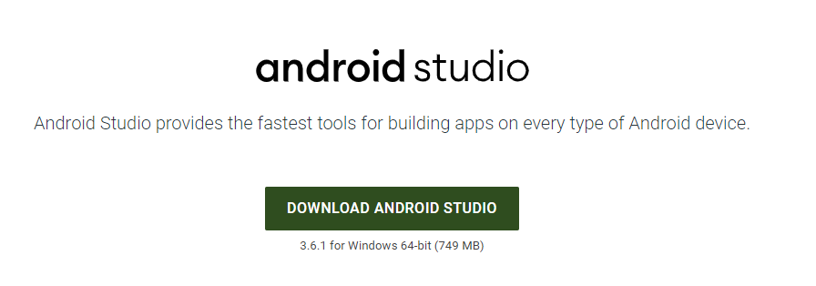

* Default로 설치.

* 설치 완료후 실행시.

  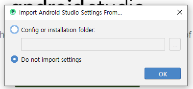
  
  * Default 설치시 안드로이드 최신버전이 설치 (10버전)

>* 삭제할경우!
>
>   * 제어판에서 삭제하는데 폴더,환경설정파일은 남아있음.
>   * 수동으로 특정 폴더들을 삭제해야함.

---

### 환경설정

* 구버전 사용을 위해 SDK Manager를 이용하여 설치.

  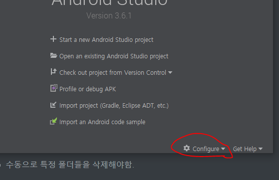

  * 여기서 SDK manager 선택

    

* 필요한 버전을 체크 `9.0`, `8.0`

* SDK Tools 에서 Google Play service 선택.

  

  

### AVD Manager

  * 가상디바이스 관리 매니저.

  * 여러개 만들수 있음.

    

  * `Nexus 5` 로 사용 : 표준적으로 사용하는 Form

    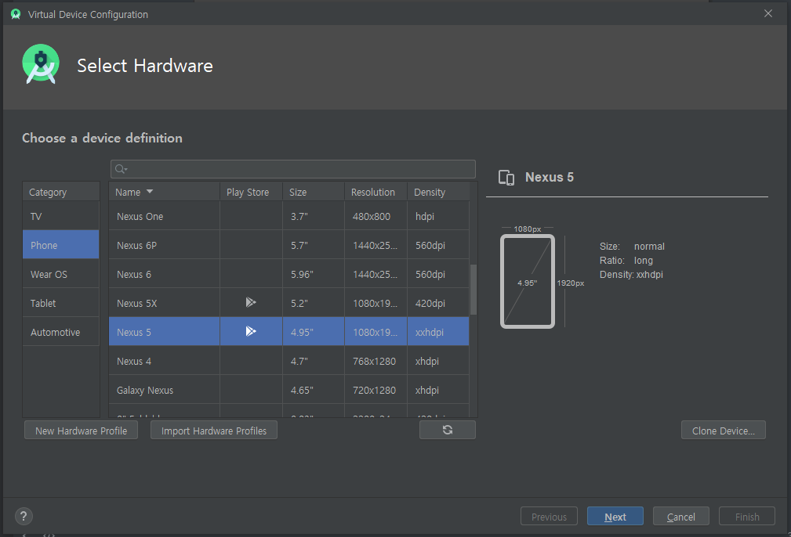

  * System Image 넣기 (안드로이드 설치)

  * 안드로이드 버전 선택

  * 가상의 핸드폰에 OS를 설치.

    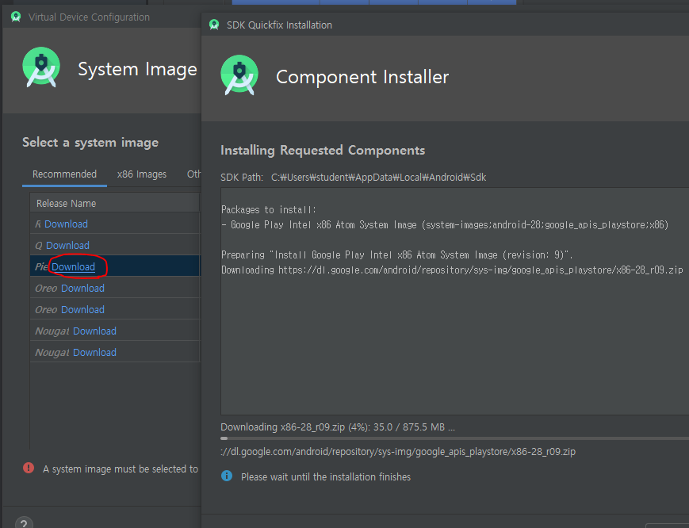
  
  * 가상화 기술설치
  
    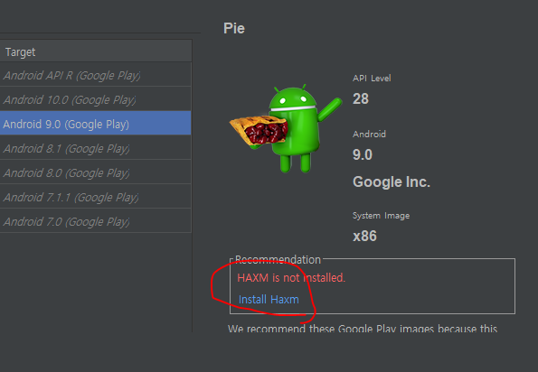
  
  * API Level : 버전마다 Level이 다름
  
    
  
  * 가상 디바이스 이름부여
  
    
  
  * 위처럼 가상디바이스 여러개 설치가능.
  
    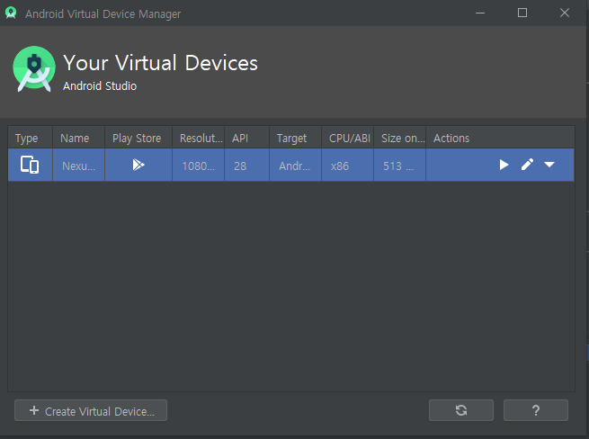
  
  * 시작버튼으로 시작.
  
    
  
    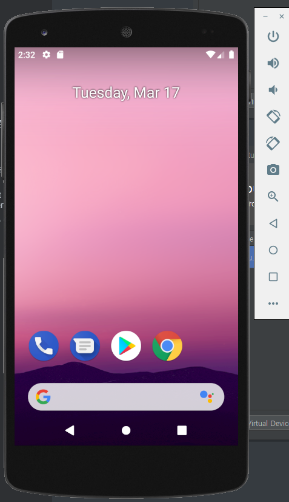

### Studio 생성


* Empty Activity로 생성

* 이름 , 패키지 지정 (패키지 이름이 같으면 같은 어플)

* 일반적으로 패키지 이름은 유니크 한 값으로 만듬. 패키지 이름은 도메인의 역순으로 잡는다.

* 언어는 `Java` or `Kotlin`

* `Minimum SDK` : 최소로 실행될수 있는 안드로이드 버전.

  * 보통 4.0때로 잡음. (4.0.3 IceCreamSandwich)
  * 설정한 Minimum보다 낮은 버전의 폰으로는 play store에서 검색이 안됨.

  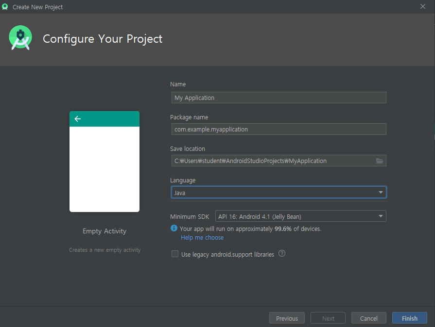

* 안드로이드에서는 `Build Tool`로 `Gradle` 을 사용. (Spring에서 Maven 역할)

  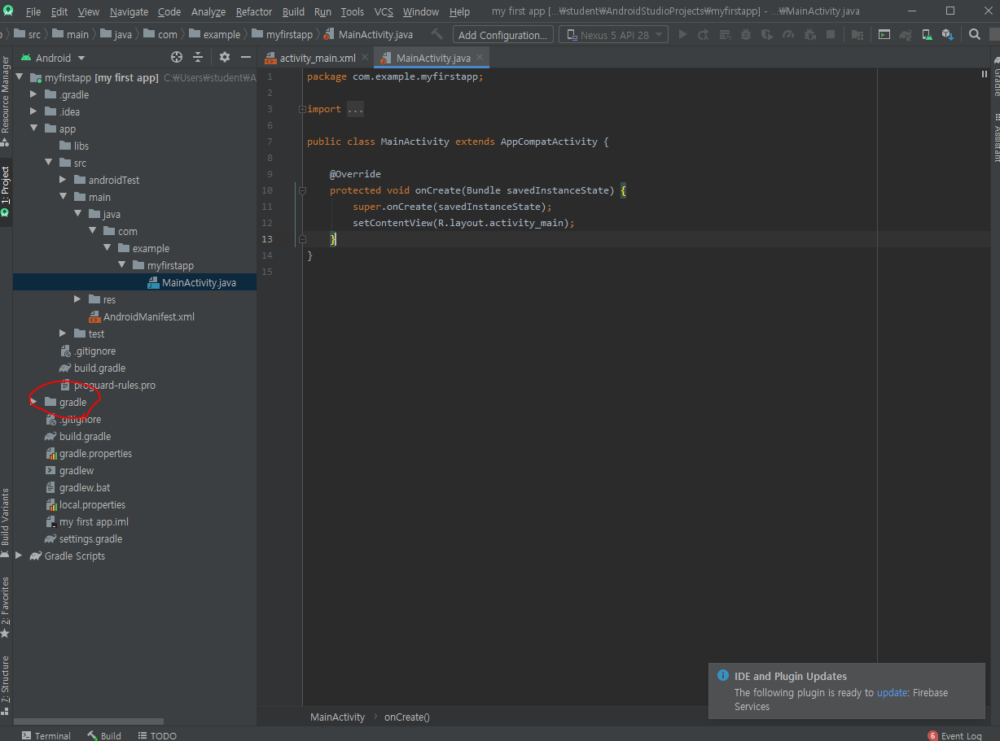

* build tap을 통해 build 상태 확인가능

  

* 폰트크기 바꾸려면.. file - setting - editor - font

  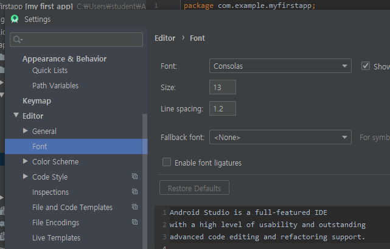

* 폴더 `View` 형식을 여러가지로 볼수 있다.

  

* 주로 사용할 View는 Android View를 기본으로 사용할 예정.

  

* 설정화일을 보기 위해서는 Project View로 확인.

  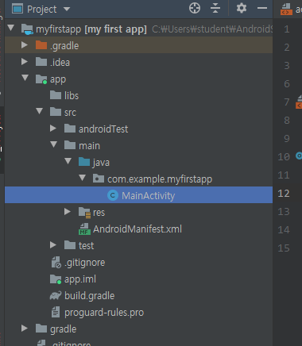

### 어플리케이션 실행방법

* 프로젝트 실행시 apk 파일을 만듬. -> 안드로이드 패키지 설치파일.

  

---

### Android 프로젝트 파일 구조.

1. manifests폴더

   * AndroidManifest.xml : 전체 App에 대한 설정을 지정해주는 파일. 파일 이름  기타 설정등 들어있음.

   ```xml
   <?xml version="1.0" encoding="utf-8"?>
   <manifest xmlns:android="http://schemas.android.com/apk/res/android"
       package="com.example.myfirstapp">
   
       <application
           android:allowBackup="true"
           android:icon="@mipmap/ic_launcher"
           android:label="@string/app_name"
           android:roundIcon="@mipmap/ic_launcher_round"
           android:supportsRtl="true"
           android:theme="@style/AppTheme">
           <activity android:name=".MainActivity"><!--Activity 1개 존재. MainActivity 클래스가 앱의 activity로 등록.-->
               <intent-filter>
                   <action android:name="android.intent.action.MAIN" />
   
                   <category android:name="android.intent.category.LAUNCHER" />
               </intent-filter>
           </activity> 
       </application>
   
   </manifest>
   ```

   * activity 태그를 통해 자바 클래스 1개를 앱의 Activity로 지정해줌
   *  `name=".MainActivity"` : Activity 1개를 MainActivity 클래스와 연결.

* 일반 Servlet 처럼 Main Method가 존재하지 않는다.

2. MainActivity

   * `onCreate()` :  callback 매서드로 특정시점이 되면 Android system에 의해서 자동적으로 호출됨.
   * 시점 : 해당 클래스의 인스턴스가 만들어질 때.

   ```java
   package com.example.myfirstapp;
   
   import androidx.appcompat.app.AppCompatActivity;
   
   import android.os.Bundle;
   
   public class MainActivity extends AppCompatActivity {
   
   
       // onCreate() : 특정시점이 되면 Android system에 의해서 자동적으로 호출됨.
       @Override
       protected void onCreate(Bundle savedInstanceState) {
           super.onCreate(savedInstanceState);
           setContentView(R.layout.activity_main);
       }
   }
   
   ```

   * 화면구성을 코드로 구성.
     1. Java code로 widget component를 생성해서 화면에 붙이는 방식.
     2. xml 파일을 이용해서 화면구성을 xml을 이용해서 처리. 

   > `xml` 쓰는이유. => 유지보수가 편하다.
   >
   > 표현과 구현을 분리시키기 위함.
   >
   > `java` : 논리적인 구현  
   >
   > `xml`: 화면표현 

   

   * `setContentView(R.layout.activity_main)` : R.layout.activity_main : 하나의 숫자값.

   * `R.java` : Android에 의해서 자동으로 생성되는 class

   * `layout` : layout 폴더.

   * `activity_main` : xml파일 이름.

   * `setContentView()` :activity_main.xml 파일을 이용해서 activity의 View를 설정하는 method

   * `res 폴더 구성`

     1. `drawable 폴더` : 어플리케이션 내에서 사용하는 그림 파일 저장.

     2. `layout 폴더` : `View(Activity)` 에서 사용할 화면 구성을 위한 `xml`파일. 

     3. `minmap 폴더` : `launcher icon` 과 같은 이미지 자원을 저장.

     4. `values 폴더` : 여러가지 문자열이나 컬러와 같은 다양한 자원에 대한 정보를 xml로 저장. 소스코드 변경없이 수정가능함.

     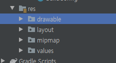
     
---

### Logcat을 이용한 디버깅 방법.

* `art + enter`를 통해 필요한 클래스 import

  ```java
  // Logcat을 이용해 보자.
          Log.i("MYTEST","이것은 소리없는 아우성!!!");
  ```

* App 실행하면.

  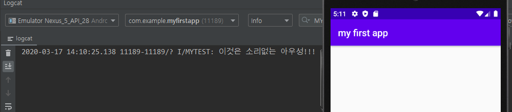

---

### 화면구성

* `activity_main.xml`

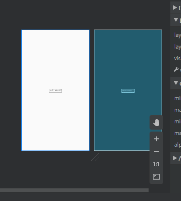

* 오른쪽 창 : Blue print

  * 겹치는 컴포넌트도 보일수 있게 해주는 창.

* 세부적인 제어는 xml코드로.

  ```xml
  <?xml version="1.0" encoding="utf-8"?>
  <androidx.constraintlayout.widget.ConstraintLayout xmlns:android="http://schemas.android.com/apk/res/android"
      xmlns:app="http://schemas.android.com/apk/res-auto"
      xmlns:tools="http://schemas.android.com/tools"
      android:layout_width="match_parent"
      android:layout_height="match_parent"
      tools:context=".MainActivity">
  
      <TextView
          android:layout_width="wrap_content"
          android:layout_height="wrap_content"
          android:text="Hello World!"                             app:layout_constraintBottom_toBottomOf="parent"
          app:layout_constraintLeft_toLeftOf="parent"
          app:layout_constraintRight_toRightOf="parent"
          app:layout_constraintTop_toTopOf="parent" />
  
  </androidx.constraintlayout.widget.ConstraintLayout>
  ```

1. View 와 ViewGroup . 

   * ViewGroup은 View를 상속받음.
   * View는 통상적으로 눈에 보이는 컴포넌트.
   * ViewGroup은 View를 크기와 위치를 조절해서 설정해주는 것.
     * 대표적인 것 : `Layout`

   ```xml
   android:textSize="10pt" 
   android:background="@color/colorRed"
   ```

* textView에서 위와 태그 사용가능.

  * `@` : 다른 xml 파일에서 가져올때 사용.
  * `color` : 다른 xml 파일에서 가져올 tag
  * `/colorRed` : 다른 xml 에서 지정한 tag name

  

* 크기조절.

  * `"wrap_content"` : 컨텐츠를 wrap하여 크기지정.

  * `"match_parent"` : 부모클래스의 크기와 같게 만드는것.

  * 속성을 아래와 같이 바꾸면..

    ```xml
    android:layout_width="match_parent"
            android:layout_height="match_parent"
    ```

  * 결과

    

> 저장된 Java 파일 경로
>
> C:\Users\student\AndroidStudioProjects\myfirstapp\app\src\main\java\com\example\myfirstapp

### Activity life cycle

* Activity는 사용자에 의해서 이벤트가 발생되면 그 상태가 변한다.
* 그에 따라 call back method가 호출되는데 그 callback에 대해서 알아야 한다.

* Life Cycle
  1. `Activity`는 `class` 상태로 존재.
  2. `Activity`가 화면에 나타나려면 일단 객체화가 되어야함. (`instance` 화)
  3. `onCreate() mothod` 가 `callback` 된다. => 화면구성을 주로 함.
  4. 화면구성 이후 `onStart() method` 가 `callback` => `Activity`의 초기화 작업 진행.
  5. `Activity`가 `foreground`로 나타나면서 사용자와 `interaction`이 가능해짐.
  6. `onResume() method` 가 바로 `callback`됨.
  7. `Activity`의 상태가 `Running` 상태가 됨. (App이 실행되고 있는 상태.)
  8.  다른 `Activity`로 인해 `Activity`의 일부분이 보이지 않는상태가 될수 있다. (`Pasue`상태)  
     * `Pause` 상태는 기존 `Activity`가 살짝이라도 가려진 상태이다.
  9. `Pasue`상태가 되면 `onPause() method`가 `callback`
  10. `Activity`의 전체가 완전히 가려져서 보이지 않는 상태가 됨. (`Stop`상태)
  11. `Stop`상태가 되면 `onStop() method`가 `callback` 
  12. 만약 `Stop`상태에서 다시 `Running`상태가 되면
  13. `OnRestart() -> OnStart() -> OnResume() method` 순서로 `callback`
  14. 사용하고 있는 `Activity`를 종료하게 되면 `Killed`상태로 진입.
  15. `Killed`상태 진입하기 전에 `onDestroy() method` 를 `callback`.

* `MainActivity.java` : call back 순서 확인.

  ```java
  @Override
      protected void onCreate(Bundle savedInstanceState) {
          super.onCreate(savedInstanceState); 
   Log.i("MYTEST","onCreate() 가 호출되었어요.");
  }
  // onStart매서드 추가. 순서확인.
  @Override
      protected void onStart() {
          super.onStart();
          Log.i("MYTEST","onStart() 가 호출되었어요.");
      }
  @Override
      protected void onResume() {
          super.onResume();
          Log.i("MYTEST","onResume() 가 호출되었어요.");
          
      }
  @Override
      protected void onPause() {
          super.onPause();
          Log.i("MYTEST","onPause() 가 호출되었어요.");
      }
  @Override
      protected void onStop() {
          super.onStop();
          Log.i("MYTEST","onStop() 가 호출되었어요.");
      }
  @Override
      protected void onRestart() {
          super.onRestart();
          Log.i("MYTEST","onRestart() 가 호출되었어요.");
      }
  ```

  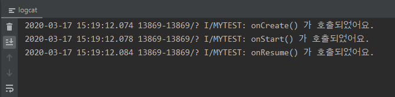

  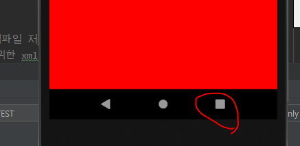

* 버튼을 누르면

  

* 그후 원래 Activity로 다시 돌아오면

  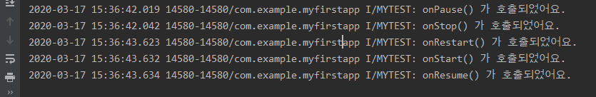

  * `onPause()` 와 `onStop()`은 위에서 진행된 `callback`

* 종료하면?!

  

* 여러화면(`Activity`)을 번 갈아 가면서 이동하기 때문에 이 순서를 확인해야함.


