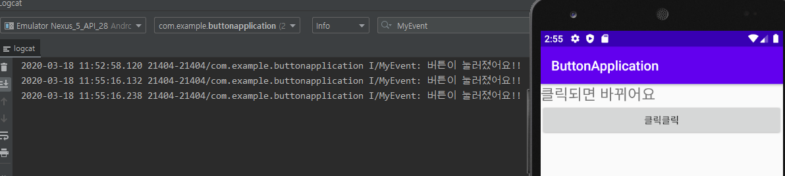
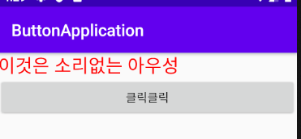
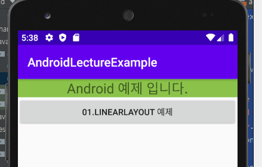

# 2020-03-18

---

## Activity

* `Activity`는 App을 구성하고 있는 화면을 지칭
* 화면을 표현하고 관리하기 위한 `class`
* 화면을 표현할 때는 `Activity`하나와 하나 이상의 `XML`파일이 필요.
* `Activity`내에서 자바코드로 화면구성을 다 할 수는 있으나 권장되지 않는다.
  * 표현과 구현이 분리되지 않기 때문이다.
* 우리의 App은 일반적으로 여러개의 Activity로 구성


* XML에 여러가지 widget을 넣어서 사용자 component를 표현할 수 있다.
* widget을 내가 원하는 크기로 원하는 위치에 표현하려면...
  * widget을 관리해주는 component가 따로 필요하다. => `LayoutManager`

### Activity 추가

* 메뉴를 이용하여 `Activity`를 추가한다.

  * 우리 패키지내에서 new 에서 Activity를 이용하여 생성.

    

  * 오류 있을때..

    * File 에서 Invalidate Caches / Restart로 진행.

* 추가후 `AndroidManifest.xml`에 새로운 `Activity`가 추가됨.

  

### Launcher Activity

* 시작 했을때 뜨는 `Activity`


## Layout Manager

* 종류
  * Linear Layout
  * Grid Layout
  * Constraint Layout
  * 기타등등.....

### 1. Linear Layout

* 기본적으로 위에서 아래로 좌측에서 우측으로 붙임. -> `Waterfall방식`

* 기본 스크롤 기능이 없다. 

  * 스크롤 기능을 위해서는 Linear Layout을 scrollView로 감싸줘야함.

  ```xml
  <?xml version="1.0" encoding="utf-8"?>
  <ScrollView xmlns:android="http://schemas.android.com/apk/res/android"
      android:layout_width="match_parent"
      android:layout_height="match_parent">
      <LinearLayout xmlns:android="http://schemas.android.com/apk/res/android"
      android:layout_height="match_parent"
      android:layout_width="match_parent"
      android:orientation="vertical">
          <EditText
              android:id="@+id/editText"
              android:layout_width="match_parent"
              android:layout_height="80dp"
              android:ems="10"
              android:inputType="textPassword" />
  
          <EditText
              android:id="@+id/editText3"
              android:layout_width="match_parent"
              android:layout_height="wrap_content"
              android:ems="10"
              android:inputType="date" />
  
          <Switch
              android:id="@+id/switch1"
              android:layout_width="match_parent"
              android:layout_height="wrap_content"
              android:text="Switch" />
  
          <CalendarView
              android:id="@+id/calendarView"
              android:layout_width="match_parent"
              android:layout_height="wrap_content" />
  
          <ProgressBar
              android:id="@+id/progressBar"
              style="?android:attr/progressBarStyle"
              android:layout_width="match_parent"
              android:layout_height="wrap_content" />
  
          <RatingBar
              android:id="@+id/ratingBar"
              android:layout_width="match_parent"
              android:layout_height="wrap_content" />
      </LinearLayout>
  </ScrollView>
  
  ```

  

* 필수속성

  * `layout height` , `layout width`
    * `match_parent` : 부모의 크기와 같게 크기를 잡는다. (`Linear Layout` 의 `parent` 는 `Activity`)
    * `wrap_content` : 해당 content사이즈 만큼만 크기를 잡는다.
  * `orientation` : 컴포넌트를 놓는 위치 (default=hrizontal => 좌에서 우로 위치.)

  > 외부 xml 을 쓸때는 `@` 을 이용하여 사용.
  >
  > ex) `background = "@color/colorYellow"`

* Component

  * `TextView` : 글자를 넣는 컴포넌트

  ```xml
  <?xml version="1.0" encoding="utf-8"?>
  <LinearLayout xmlns:android="http://schemas.android.com/apk/res/android"
      xmlns:tools="http://schemas.android.com/tools"
      android:layout_height="match_parent"
      android:layout_width="match_parent"
      android:background="@color/colorGreen">
  
      <TextView
          android:layout_width="match_parent" 
          android:layout_height="match_parent"
          android:text="@string/sampleString"
          android:textColor="@color/colorBlue"
          android:textSize="30dp"
          android:background="@color/colorYellow"
          android:textAlignment="center"
          android:gravity="center_vertical"
          tools:ignore="RtlCompat" />
  
  
  </LinearLayout>
  ```

  
  
  * `Button` : 버튼추가.

    ```xml
  <Button
            android:layout_width="match_parent"
          android:layout_height="wrap_content"
            android:background="@color/colorBlue"
          android:text="@string/btnString"
            />
    ```
  
    
  
  ---
  
#### - Linear Layout 이용한 화면구성

* Linear Layout 을 이용한 Linear Layout

  ```xml
  <LinearLayout xmlns:android="http://schemas.android.com/apk/res/android"
      android:layout_height="match_parent"
      android:layout_width="match_parent"
      android:orientation="vertical">
      <LinearLayout
          android:layout_height="match_parent"
          android:layout_width="match_parent"
          android:layout_weight="1"
          android:background="@color/colorYellow">
      </LinearLayout>
  
      <LinearLayout
          android:layout_height="match_parent"
          android:layout_width="match_parent"
          android:layout_weight="1"
          android:background="@color/colorRed">
      </LinearLayout>
  
  
  </LinearLayout>
  ```

* `LinearLayout` 안에 `LinearLayout` 넣은후 모두 `match_parent` 로 지정했지만..

* `weight` 속성을 주어 나눠줄수 있다.(1:1) (`weight` 속성이 있으면 `height`속성이 무시가 됨.) 

  * 속성마다 우선순위가 있다.

  

* 버튼추가

  * 위쪽에는 가로방향으로 아랫쪽에는 세로방향으로 버튼을 나열하기.

  ```xml
  <LinearLayout xmlns:android="http://schemas.android.com/apk/res/android"
      android:layout_height="match_parent"
      android:layout_width="match_parent"
      android:orientation="vertical">
      <LinearLayout
          android:layout_height="match_parent"
          android:layout_width="match_parent"
          android:layout_weight="1"
          android:background="@color/colorYellow"
          android:orientation="horizontal">
          <Button
              android:layout_width="match_parent"
              android:layout_height="match_parent"
              android:layout_weight="1"
              android:text="Button1"
              />
          <Button
              android:layout_width="match_parent"
              android:layout_height="match_parent"
              android:layout_weight="1"
              android:text="Button2"
              />
          <Button
              android:layout_width="match_parent"
              android:layout_height="match_parent"
              android:layout_weight="1"
              android:text="Button3"
              />
      </LinearLayout>
  
      <LinearLayout
          android:layout_height="match_parent"
          android:layout_width="match_parent"
          android:layout_weight="1"
          android:background="@color/colorRed"
          android:orientation="vertical">
          <Button
              android:layout_width="match_parent"
              android:layout_height="match_parent"
              android:layout_weight="1"
              android:text="Button1"
              />
          <Button
              android:layout_width="match_parent"
              android:layout_height="match_parent"
              android:layout_weight="1"
              android:text="Button2"
              />
          <Button
              android:layout_width="match_parent"
              android:layout_height="match_parent"
              android:layout_weight="1"
              android:text="Button3"
              />
      </LinearLayout>
  
  
  </LinearLayout>
  ```

  

  ---

## Event 처리

* Event : 사용자에 의해서 발생되는 혹은 시스템에 의해서 발생되는 모든것.
* Event Handling을 해야 한다.
* Java는 Event delegation Model을 이용해서 event를 처리
* Event 처리에 관련된 3가지 객체
  1. Event Source객체 : Event가 발생한 객체.
  2. Event Handler객체(Listener) :  Event를 처리하는 객체.
  3. Event 객체 : 발생된 Event에 대한 세부정보를 가지고 있는 객체.
* Event Source에 Event Handler를 부착시켜서 Event가 발생되면 부착된 Handler를 통해서 Event를 처리.


1. xml에서 버튼에 id를 부여함.

   ```xml
   <?xml version="1.0" encoding="utf-8"?>
   <LinearLayout android:layout_height="match_parent"
       android:layout_width="match_parent"
       xmlns:android="http://schemas.android.com/apk/res/android"
       android:orientation="vertical">
       <TextView
           android:layout_width="match_parent"
           android:layout_height="wrap_content"
           android:textSize="10pt"
           android:text="클릭되면 바뀌어요"/>
       <Button
           android:id="@+id/Button"  
           android:layout_width="match_parent"
           android:layout_height="wrap_content"
           android:text="@string/buttonString"/> <!--@+는 아이디를 추가하겠다는 의미-->
   
   </LinearLayout>
   ```

2. 부여한 id를 java에서 사용.

   ```java
   package com.example.buttonapplication;
   
   import androidx.appcompat.app.AppCompatActivity;
   
   import android.os.Bundle;
   import android.widget.Button;
   
   import java.util.EventListener;
   
   public class ButtonActivity extends AppCompatActivity {
       @Override
       protected void onCreate(Bundle savedInstanceState) {
           super.onCreate(savedInstanceState);
           setContentView(R.layout.activity_button);
   
           // 1. Event Source 객체 얻어오기. (id를 이용)
           Button myBtn = (Button)findViewById(R.id.eventBtn); 
           // findViewById 의 return type = object. downcasting 해줌.(jdk 버전이 오르면서 필요없어지긴 함.)
   
       }
   }
   ```

3. EventListener 생성

   > 우리가 원하는 것은 일반 클래스의 객체가 아니라
   > 이벤트를 처리할 수 있는 특수한 능력을 갖고 있는 리스너 객체가 필요하다.
   >
   > 다시말하면, 우리가 작성하는 class는 특수한 interface를 구현한 클래스가 되어야 한다.
   >
   > 특수한 interface는 여러개가 존재한다. (이벤트 종류에 따라서 여러개가 존재한다.)

   ```java
   class MyEventHadler implements View.OnClickListener { // 클릭에 대한 이벤트 interface
       @Override
       public void onClick(View v) {
       }
   } // 클래스를 만들어야 Handler객체 사용가능.
   ```

   ```java
   @Override
   protected void onCreate(Bundle savedInstanceState) {
           super.onCreate(savedInstanceState);
           setContentView(R.layout.activity_button);
   
           // 1. Event Source 객체 얻어오기. (id를 이용)
           Button myBtn = (Button)findViewById(R.id.eventBtn); // return type = object. downcasting 해줌.(jdk 버전이 오르면서 필요없어지긴 함.)
           // 2. Event Handler 객체생성
           MyEventHadler handler = new MyEventHadler();
       }
   ```

4. Event Source에 Event Handler를 부착.

   ```java
   @Override    
   protected void onCreate(Bundle savedInstanceState) {
           super.onCreate(savedInstanceState);
           setContentView(R.layout.activity_button);
   
           // 1. Event Source 객체 얻어오기. (id를 이용)
           Button myBtn = (Button)findViewById(R.id.eventBtn); // return type = object. downcasting 해줌.(jdk 버전이 오르면서 필요없어지긴 함.)
           // 2. Event Handler 객체생성
           MyEventHadler handler = new MyEventHadler();
           // 3. Event Source에 Event Handler를 부착.
           myBtn.setOnClickListener(handler);
       }
   ```

5. 이벤트 코드는 Handler객체 안에서 작성.

   ```java
   class MyEventHadler implements View.OnClickListener {
   
       @Override
       public void onClick(View v) { // View v : 이벤트 객체.
           // 여기서 이벤트 처리코드를 작성
           Log.i("MyEvent","버튼이 눌러졌어요!!");
       }
   }
   ```

   

6. Text 객체 가져오기.

   * Text 값을 가져오기 위해 TextView 태그에 id를 부여.

     ```xml
     <TextView
             android:id="@+id/myText"
             android:layout_width="match_parent"
             android:layout_height="wrap_content"
             android:textSize="10pt"
             android:text="클릭되면 바뀌어요"/>
     ```

   * java 파일에서 `id`값을 통해 읽어오기.

     ```java
     @Override
         protected void onCreate(Bundle savedInstanceState) {
             super.onCreate(savedInstanceState);
             setContentView(R.layout.activity_button);
             // 0. TextView 객체에 대한 reference를 얻어오기.
             TextView tv = (TextView)findViewById(R.id.myText) ;
     
             // 1. Event Source 객체 얻어오기. (id를 이용)
             Button myBtn = (Button)findViewById(R.id.eventBtn); // return type = object. downcasting 해줌.(jdk 버전이 오르면서 필요없어지긴 함.)
             // 2. Event Handler 객체생성
             MyEventHandler handler = new MyEventHandler();
             // 3. Event Source에 Event Handler를 부착.
             myBtn.setOnClickListener(handler);
         }
     ```

   * `그러나` `TextView` 값을 바뀌는 진행은 `Handler`안에서 진행되어야 함.

   * 따라서 Handler 객체에서 TextView값을 받아서 사용해야함.

   * 위의 코드를 아래와 같이 핸들러 생성시 TextView객체 인자를 넣어줌.

     ```java
     MyEventHandler handler = new MyEventHandler(tv);
     ```

   * 위의 코드를 실행하려면 `Handler` 객체 안에 오버로딩을 이용해 생성자 함수를 만들어 줘야함.

     ```java
     class MyEventHandler implements View.OnClickListener {
         private  TextView tv; // 받은 TextView객체를 넣을 변수.
         MyEventHandler(){
     
         }
     
         MyEventHandler(TextView tv){ //오버로딩을 이용한 생성자 함수
             this.tv = tv;
         }
         
         @Override
         public void onClick(View v) { // View v : 이벤트 객체.
             // 여기서 이벤트 처리코드를 작성
             //Log.i("MyEvent","버튼이 눌러졌어요!!");
             tv.setText("소리없는 아우성");
         }
     }
     ```

     클릭전

     

     클릭후

     
     
   * Color 객체를 이용해 색변경 가능
   
     ```java
     @Override
         public void onClick(View v) { // View v : 이벤트 객체.
             // 여기서 이벤트 처리코드를 작성
             //Log.i("MyEvent","버튼이 눌러졌어요!!");
             tv.setText("이것은 소리없는 아우성");
             tv.setTextColor(Color.parseColor("#ff0000"));
         }
     ```
   
     클릭전
   
     
   
     클릭후
   
     
   
   > 위와 같은 방식으로 코드작성시..
   >
   > 받을 컴포넌트를 Listen에게 다 넘겨야 사용이 가능한 불편함이 있다.
   >
   > 따라서 Inner class 형태로 사용한다.
   
### Inner class 이용

```java
@Override
    protected void onCreate(Bundle savedInstanceState) {
        super.onCreate(savedInstanceState);
        setContentView(R.layout.activity_button);
        // 0. TextView 객체에 대한 reference를 얻어오기.
        TextView tv = (TextView)findViewById(R.id.myText) ;

        // 1. Event Source 객체 얻어오기. (id를 이용)
        Button myBtn = (Button)findViewById(R.id.eventBtn); // return type = object. downcasting 해줌.(jdk 버전이 오르면서 필요없어지긴 함.)
        // 2. Event Source에 Event Handler 객체생성,부착.
        myBtn.setOnClickListener(new View.OnClickListener(){
            @Override
            public void onClick(View v) {
                tv.setText("이것은 소리없는 아우성");
            }
        });
    }
```

* 여기서 이너클래스 안 tv객체 사용에서 오류가 생김.

  * 이유 : tv객체는 `지역변수`로 onCreate함수가 호출 된 순간(어플을 시작한 순간) 생성 되었다가 사라지기 떄문임.
  * 여기서 tv변수를 상수처리로 한다면 메모리 Heap영역에 들어가서 계속 사용이 가능함.
  * **`final` 로 선언하여 변수를 상수처리!**

  ```java
  @Override
      protected void onCreate(Bundle savedInstanceState) {
          super.onCreate(savedInstanceState);
          setContentView(R.layout.activity_button);
          // 0. TextView 객체에 대한 reference를 얻어오기.
          final TextView tv = (TextView)findViewById(R.id.myText);
  
          // 1. Event Source 객체 얻어오기. (id를 이용)
          Button myBtn = (Button)findViewById(R.id.eventBtn); // return type = object. downcasting 해줌.(jdk 버전이 오르면서 필요없어지긴 함.)
          // 2. Event Source에 Event Handler 객체생성,부착.
          myBtn.setOnClickListener(new View.OnClickListener(){
              @Override
              public void onClick(View v) {
                  tv.setText("이것은 소리없는 아우성");
              }
          });
      }
  ```

## 통합 Application 만들기

* 버튼 이벤트를 통해 새로운 Activity가 화면에 띄워지도록 생성.

### 1. explicit 방식

- `Intent` 객체를 이용한다.

  ```java
  Intent i = new Intent(); // explicit 방식.
  ```

- 다른 클래스를 가져올때는 `ComponentName` 클래스를 이용하여 가져온다.

  ```java
  ComponentName cname = new ComponentName("com.example.androidlectureexample",
                          "com.example.androidlectureexample.Example01_LayoutActivity");
                  //ComponentName(패키지명,클래스이름(패키지풀name으로))
  ```

- `Intent` 객체에 클래스 명을 부착

  ```java
  i.setComponent(cname); // Intent에 클래스 부착
  startActivity(i); // Intent 시작!
  ```

- 전체코드.

  ```java
  package com.example.androidlectureexample;
  
  import androidx.appcompat.app.AppCompatActivity;
  
  import android.content.ComponentName;
  import android.content.Intent;
  import android.os.Bundle;
  import android.view.View;
  import android.widget.Button;
  
  public class MainActivity extends AppCompatActivity {
  
      @Override
      protected void onCreate(Bundle savedInstanceState) {
          super.onCreate(savedInstanceState);
          setContentView(R.layout.activity_main);
  
          Button _01_linearlayoutBtn =
                  (Button)findViewById(R.id._01_linearlayoutBtn);
          _01_linearlayoutBtn.setOnClickListener(new View.OnClickListener(){
              @Override
              public void onClick(View v) {
                  // 버튼이 눌리면 이 부분이 실행되요!!
                  // 새로운 activity를 찾아서 실행!!
                  // 2가지 방식으로 activity를 찾을 수 있다.
                  // explicit 방식과 implicit 방식이 있다.
                  Intent i = new Intent(); // explicit 방식.
                  ComponentName cname = new ComponentName("com.example.androidlectureexample",
                          "com.example.androidlectureexample.Example01_LayoutActivity");
                  //ComponentName(패키지명,클래스이름(패키지풀name으로))
                  i.setComponent(cname); // Intent에 클래스 부착
                  startActivity(i); // Intent 시작!
  
              }
          });
      }
  }
  
  ```

- 결과

  

- 버튼을 클릭하면?!

  


### 2. implicit 방식

* 나중에 할 예정.


---

## 연습

* `ScrollView` 컴포넌트 연습.

  ```xml
  <?xml version="1.0" encoding="utf-8"?>
  <LinearLayout xmlns:android="http://schemas.android.com/apk/res/android"
      android:layout_width="match_parent"
      android:layout_height="match_parent"
      android:orientation="vertical">
  
      <LinearLayout
          android:layout_width="match_parent"
          android:layout_height="match_parent"
          android:layout_weight="1"
          android:background="@color/colorGreen">
  
          <ScrollView
              android:layout_width="match_parent"
              android:layout_height="match_parent"
              android:scrollbarStyle="outsideOverlay">
  
              <LinearLayout
                  android:layout_width="match_parent"
                  android:layout_height="match_parent"
                  android:orientation="vertical">
  
                  <Button
                      android:layout_width="match_parent"
                      android:layout_height="match_parent"
                      android:layout_weight="1"
                      android:text="1" />
  
                  <Button
                      android:layout_width="match_parent"
                      android:layout_height="match_parent"
                      android:layout_weight="1"
                      android:text="2" />
  
                  <!--이하 생략-->
  
              </LinearLayout>
          </ScrollView>
      </LinearLayout>
  
      <LinearLayout
          android:layout_width="match_parent"
          android:layout_height="match_parent"
          android:layout_weight="10"
          android:background="@color/colorOrange"
          android:orientation="horizontal">
  
          <HorizontalScrollView
              android:layout_width="wrap_content"
              android:layout_height="match_parent">
  
              <LinearLayout
                  android:layout_width="match_parent"
                  android:layout_height="match_parent"
                  android:orientation="horizontal">
  
                  <Button
                      android:layout_width="match_parent"
                      android:layout_height="match_parent"
                      android:layout_weight="1"
                      android:text="@string/buttonString" />
  
                  <Button
                      android:layout_width="match_parent"
                      android:layout_height="match_parent"
                      android:layout_weight="1"
                      android:text="@string/buttonString" />
  
                  <!--이하 생략-->
              </LinearLayout>
          </HorizontalScrollView>
      </LinearLayout>
  
  </LinearLayout>
  ```

* 결과

  

* 배운점

  * `ScrollView` 컴포넌트는 2종류가 있다.
    1. `ScrollView` : `vertical`방향으로 스크롤이 생김.(상하 스크롤)
    2. `HorizontalScrollView` : `hrizontal`방향으로 스크롤이 생김.(좌우 스크롤)
  * `ScrollView` 컴포넌트 안에 `LinearLayout` 컴포넌트를 부착한후 그 `Layout`에 버튼을 넣어야 어플이 정상동작한다. -> `ScrollView` 컴포넌트 안에 `LinearLayout` 컴포넌트를 사용하지 않고 바로 `Button` 컴포넌트를 넣었을때 어플이 정상동작하지 않았음. (강제종료됨)
  * `ScrollView`를 위 그림처럼 두 부분으로 나누기 위하여 각각의 `ScrollView` 컴포넌트를 서로다른`LinearLayout`으로 감싸 두 공간으로 나눔. -> `ScrollView` 컴포넌트를 포함하는 `LinearLayout`에 `weight`를 주어 화면 분리.-> 위 그림같이 포현하려면 `weight`를 위쪽은 `1`, 아랫쪽은 `10` 으로 주었음.
  * `weight` 숫자가 작을수록 화면에서 차지하는 크기가 큼. 위와 같은경우는 10:1의 비율로 주어진 것과 같다.

* 수정

  * 위에서 `ScrollView` 를 `LinearLayout`으로 감싸 `weight`를 주었으나 그럴 필요없이 `ScrollView`에 직접 `weight`를 주는 방식으로 변경. 배경색도 마찬가지.

  ```xml
  <?xml version="1.0" encoding="utf-8"?>
  <LinearLayout xmlns:android="http://schemas.android.com/apk/res/android"
      android:layout_width="match_parent"
      android:layout_height="match_parent"
      android:orientation="vertical">
  
  
  
          <ScrollView
              android:layout_width="match_parent"
              android:layout_height="match_parent"
              android:scrollbarStyle="outsideOverlay"
              android:layout_weight="1"
              android:background="@color/colorGreen">
  
              <LinearLayout
                  android:layout_width="match_parent"
                  android:layout_height="wrap_content"
                  android:orientation="vertical">
  
                  <Button
                      android:layout_width="match_parent"
                      android:layout_height="wrap_content"
                      android:layout_weight="1"
                      android:text="1" />
  
                  <Button
                      android:layout_width="match_parent"
                      android:layout_height="wrap_content"
                      android:layout_weight="1"
                      android:text="2" />
                 <!--이하 생략-->
  
              </LinearLayout>
          </ScrollView>
  
  
  
  
          <HorizontalScrollView
              android:layout_width="wrap_content"
              android:layout_height="match_parent"
              android:layout_weight="10"
              android:background="@color/colorYellow">
  
              <LinearLayout
                  android:layout_width="wrap_content"
                  android:layout_height="match_parent"
                  android:orientation="horizontal">
  
                  <Button
                      android:layout_width="wrap_content"
                      android:layout_height="match_parent"
                      android:layout_weight="1"
                      android:text="@string/buttonString" />
  
                  <Button
                      android:layout_width="wrap_content"
                      android:layout_height="match_parent"
                      android:layout_weight="1"
                      android:text="@string/buttonString" />
  
                  <!--이하 생략-->
              </LinearLayout>
          </HorizontalScrollView>
  
  
  </LinearLayout>
  ```

* 결과

  

