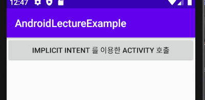
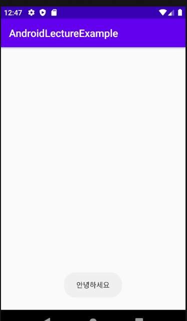
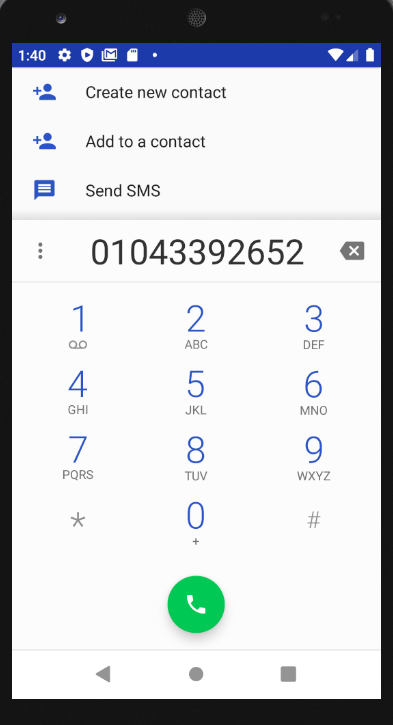
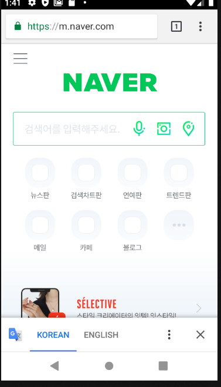
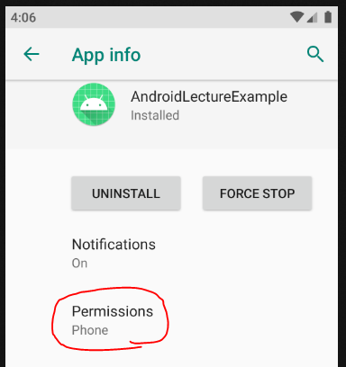
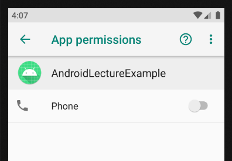
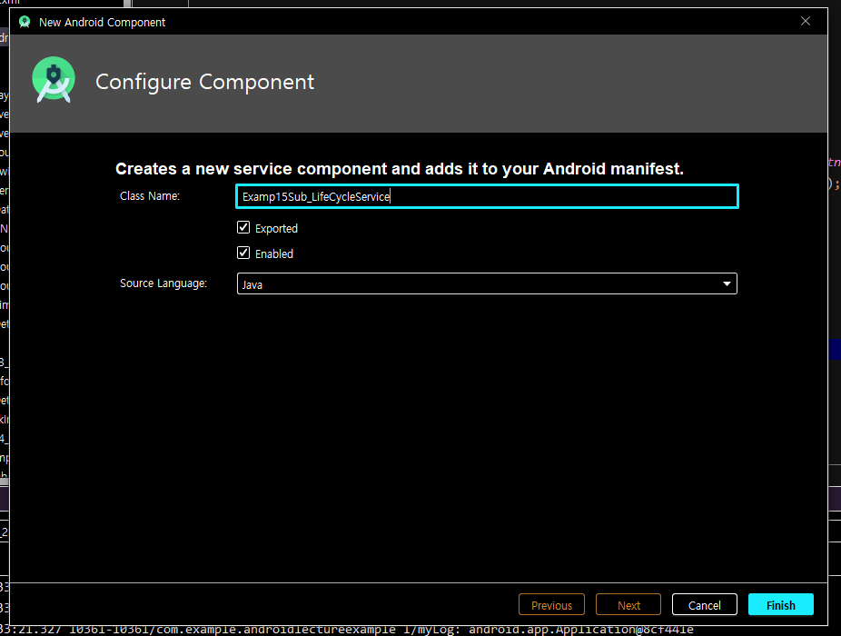
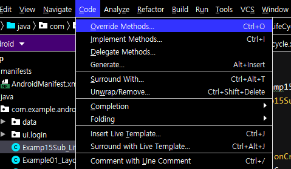
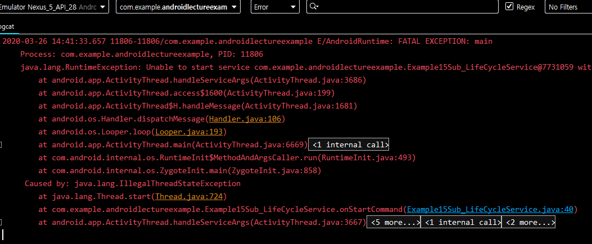
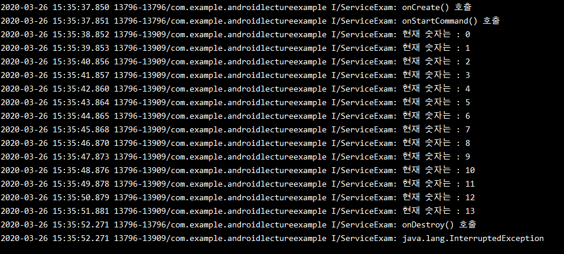

# 2020-03-26

---

## Activity

> 보안관련부분은 차후에 다시 진행.

### Implicit Intent

* 기존에 사용했던 `Intent`는 `Explicit Intent` 방법이다. (명시적 인텐트)

  ```java
  _14_ImplicitIntentBtn.setOnClickListener(new View.OnClickListener() {
              @Override
              public void onClick(View v) {
                  // Explicit Intent (명시적 인텐트)
                  Intent i = new Intent();
                  ComponentName cname = new ComponentName("com.example.androidlectureexample",
                          "com.example.androidlectureexample.Example14_ImplicitIntentActivity");
                  i.setComponent(cname);
                  startActivity(i);
              }
  ```

* `AndroidManifest` 에서 설정.

  * `intent-filter` Tag를 이용.
  * Tag 안에서 `android:name` 과 `android:category` 를 설정.
  * `android:name` : 이름부여 1개 밖에 사용 불가능.
  * `android:category`  : 이름 지정 . 여러개 사용가능. `DEFAULT` 는 반드시 존쟇야함.

  ```xml
  <activity android:name=".Example14Sub_ImplicitIntentActivity">
              <intent-filter>
                  <action android:name="MY_ACTION"/>
                  <category android:name="android.intent.category.DEFAULT"/> <!-- 반드시 있어야함.-->
                  <category android:name="INTENT_TEST"/>
              </intent-filter>
          </activity>
  ```

* `Implicit Intent` 방식이용

  ```java
  public class Example14_ImplicitIntentActivity extends AppCompatActivity {
  
      @Override
      protected void onCreate(Bundle savedInstanceState) {
          super.onCreate(savedInstanceState);
          setContentView(R.layout.activity_example14_implicit_intent);
  
          Button btn = (Button)findViewById(R.id._14_1_1_implicitIntentBtn);
          btn.setOnClickListener(new View.OnClickListener() {
              @Override
              public void onClick(View v) {
                  // 버튼을 클릭했을 때 새로운 Activity 를 실행 (묵시적 Intent를 이용)
                  // implicit Intent(묵시적 인텐트)
                  // 방금 생성한 Activity 를 호출하려고 한다.
                  Intent i = new Intent();
                  // Manifest 에서 지정한 Action 을 찾는다.
                  i.setAction("MY_ACTION");
                  // category 도 찾기. (DEFAULT 말고 직접 설정했던 name)
                  i.addCategory("INTENT_TEST");
                  i.putExtra("SEND DATA","안녕하세요");
                  startActivity(i);
              }
          });
      }
  }
  ```

* 이동한 `Activity`

  ```java
  public class Example14Sub_ImplicitIntentActivity extends AppCompatActivity {
  
      @Override
      protected void onCreate(Bundle savedInstanceState) {
          super.onCreate(savedInstanceState);
          setContentView(R.layout.activity_example14_sub_implicit_intent);
  
          Intent i = getIntent();
          Toast.makeText(getApplicationContext(),
                  i.getExtras().getString("SEND DATA"),
                  Toast.LENGTH_SHORT).show();
      }
  }
  
  ```

* 결과

  

  * 버튼을 클릭하면

  

* 다른앱의 Activity 도 호출이 가능하다.(예) 전화거는 Activity

  * 전화걸기 Activity를 호출하려면 2가지 중 1 가지를 알아야함.
    1. 클래스명을 알면 호출이 가능 (Explicit intent)
    2. 묵시적 Intent 를 이용해서 알려져 있는 Action을 통해서 이용.

  ```java
  Button btn2 = (Button)findViewById(R.id._14_1_2_dialBtn);
          btn2.setOnClickListener(new View.OnClickListener() {
              @Override
              public void onClick(View v) {
                  // 전화걸기 Activity 를 호출하려면 2가지 중 1가지를 알아야 한다.
                  // 1. 명확한 class 명을 알면 호출이 가능하다. (Explicit intent 이용)
                  // 2. 묵시적 Intent 를 이용해서 알려져 있는 Action을 통해서 이용.
                  Intent i = new Intent();
                  i.setAction(Intent.ACTION_DIAL);
             // 전화걸기 화면에서 사용할 데이터. 전화번호가 들어감.
             // Uri 객체를 이용하여 문자열을 넣어 주어야 한다.
             // 번호가 바로 들어가는 것이 아닌 접두어 tel 이 있어야 번호에 대한정보라는 것을 전달할 수 있다.
                  i.setData(Uri.parse("tel:01043392652"));
                  startActivity(i);
              }
          });
  ```

  

> 전화를 걸어주는 `Intent.ACTION_CALL` 이 존재함.
>
> 그러나 ACTION_CALL 을 사용하기 위해서는 보안이슈를 해결해야 처리 할 수 있다.

* `Browser`를 특정 URL로 열기.

  * Action name : `Intent.ACTION_VIEW`

  ```java
  Button btn3 = (Button)findViewById(R.id._14_1_3_browserBtn);
          btn3.setOnClickListener(new View.OnClickListener() {
              @Override
              public void onClick(View v) {
                  // 특정 URL을 이용해서 browser를 실행.
                  Intent i = new Intent();
                  // ACTION_VIEW => 브라우저를 찾아줌.(모든 브라우저)
                  i.setAction(Intent.ACTION_VIEW);
                  i.setData(Uri.parse("http://www.naver.com"));
                  startActivity(i);
              }
          });
  ```

  

  * 여러개의 브라우저가 설치되어 있는경우 다음과 같이 결과가 나타남.

  

  * 인터넷 사용에 대한 permission이 있어야 사용이 가능함.

  ```xml
  <uses-permission android:name="android.permission.INTERNET" />
  ```

### 권한설정 (보안)

* `ACTION_CALL`

* 전화걸기 기능을 사용하려면 `AndroidManifest.xml` 파일에 권한설정을 해야한다.

  ```xml
  <uses-permission android:name="android.permission.CALL_PHONE"/> <!--마쉬멜로 이전 버전에선 이것만 있어도 통화가 가능했다.-->
  ```

* 안드로이드 6.0(마쉬멜로우) 이상에서는 `manifest` 파일에 기술하는것 이외에 사용자에게 권한을 따로 요청해야한다.

* 권한자체가 크게 2가지로 분류되서 관리된다.

  1. 일반권한 (`normal permission`) : `Manifest` 에서 작업한것
  2. 위험 권한 (`dangerous permission`) : `위치정보, 전화걸기기능, 카메라, 마이크, 문자, 일정, 주소록, 센서`

* 특정 앱을 사용할 때 앱이 사용자에게 권한을 요구하고 사용자가 권한을 허용하면 그 기능을 이용할 수 있다.

* 설정 > 어플리케이션 > 앱 > 권한 부분을 이용하면 이미 허용한 권한을 취소할 수 있다.


* 절차

  1. 사용자가 사용하는 안드로이드 버전이 "M(마쉬멜로우)" 버전 이상인지 확인.

     * `Build.VERSION.SDK_INT` 이용 : 현재 핸드폰의 안드로이드 버전체크.
     * 비교할 상수는 `Build.VERSION_CODES`에 있는 상수 이용. : `Build.VERSION_CODES.M` - > 마쉬멜로우 버전.

  2. `Static method`를 이용해 어플이 권한이 설정되었는지 확인.

     * `ActivityCompat.checkSelfPermission()` 매서드 이용.
     * 매서드 인자값 (컨텍스트, 확인할 권한상수).
     * 비교할 상수는 `PackageManager.PERMISSION_DENIED` : 권한이 허용되지 않은 상수 (값 : -1)

  3. 권한이 없는경우 권한 설정을 거부한 적이 있는지 없는지 확인.

     *  `shouldShowRequestPermissionRationale()` 매서드를 이용하여 권한 설정 거부여부 확인.
     * 매서드 인자로 권한에 대한 상수가 들어감. `Ex) Manifest.permission.CALL_PHONE`

  4. 권한을 거부한 적이 없는경우 권환 물어보는 창을 실행

     * `requestPermissions()` 매서드를 이용하여 권한 허용 창 띄워준다.
     * 권한은 여러개가 들어갈 수 있기에 문자열 배열로 사용.
     * 매서드 인자값 (권한 상수값이 저장된 문자열 배열,`requestCode`)
     * `requestPermissions()` 매서드로 인해 권한 허용 또는 거부 를 눌렀을때 Activity 내의 `onRequestPermissionsResult()` 매서드가 실행됨.

     1. `onRequestPermissionsResult()` 매서드 안에서 요청코드를 확인하여 로직처리.
        * `requestCode`를 확인한다.
        * 확인후 grantResult 변수에 이전 권한에 대한 정보가 넘어오는데  길이를 check 한후 n번째의 권한들을 각 상수와 비교하여 권한 허용을 비교한다.

     

  5. 권한을 거부한 적이 있는경우 

     * 따로 코드를 작성하지 않으면 아무것도 작동하지 않는다.


* 앱의 허용권한 확인

  

  * 들어가보면

  

  * 위와 같이 체크가 해제되면 권한이 허용 되지 않은것.
  * 허용되지 않게되면 아무일도 일어나지 않음. (거절에 대한 코드가 없는경우)

  6. 권한이 거절되어 있을 때.

     * `Dialog` 를 이용하여 권한을 다시 설정할지 만듬.

     * 승인시 처음 진행했던 `requestPermission`매서드를 다시 실행.

  

  ```java
  public class Example14_ImplicitIntentActivity extends AppCompatActivity {
  
      @Override
      protected void onCreate(Bundle savedInstanceState) {
          super.onCreate(savedInstanceState);
          setContentView(R.layout.activity_example14_implicit_intent);
  
          Button btn = (Button) findViewById(R.id._14_1_1_implicitIntentBtn);
          btn.setOnClickListener(new View.OnClickListener() {
              @Override
              public void onClick(View v) {
                  // 버튼을 클릭했을 때 새로운 Activity 를 실행 (묵시적 Intent를 이용)
                  // implicit Intent(묵시적 인텐트)
                  // 방금 생성한 Activity 를 호출하려고 한다.
                  Intent i = new Intent();
                  // Manifest 에서 지정한 Action 을 찾는다.
                  i.setAction("MY_ACTION");
                  // category 도 찾기. (DEFAULT 말고 직접 설정했던 name)
                  // i.addCategory("INTENT_TEST");
                  i.putExtra("SEND DATA", "안녕하세요");
                  startActivity(i);
              }
          });
  
          Button btn2 = (Button) findViewById(R.id._14_1_2_dialBtn);
          btn2.setOnClickListener(new View.OnClickListener() {
              @Override
              public void onClick(View v) {
                  // 전화걸기 Activity 를 호출하려면 2가지 중 1가지를 알아야 한다.
                  // 1. 명확한 class 명을 알면 호출이 가능하다. (Explicit intent 이용)
                  // 2. 묵시적 Intent 를 이용해서 알려져 있는 Action을 통해서 이용.
                  Intent i = new Intent();
                  i.setAction(Intent.ACTION_DIAL);
                  // 전화걸기 화면에서 사용할 데이터. 전화번호가 들어감.
                  // Uri 객체를 이용하여 문자열이 들어감.
                  // 번호가 바로 들어가는 것이 아닌 접두어 tel 이 있어야 번호에 대한정보라는 것을 전달할 수 있다.
                  i.setData(Uri.parse("tel:01043392652"));
                  startActivity(i);
              }
          });
  
          Button btn3 = (Button) findViewById(R.id._14_1_3_browserBtn);
          btn3.setOnClickListener(new View.OnClickListener() {
              @Override
              public void onClick(View v) {
                  // 특정 URL을 이용해서 browser를 실행.
                  Intent i = new Intent();
                  i.setAction(Intent.ACTION_VIEW);
                  i.setData(Uri.parse("http://www.naver.com"));
                  startActivity(i);
              }
          });
  
          /*
          먼저 전화걸기 기능을 사용하려면 AndroidManifext.xml 파일에 권한설정을 해야한다.
          안드로이드 6.0(마쉬멜로우) 이상에서는 `manifest` 파일에 기술하는것 이외에 사용자에게 권한을 따로 요청해야한다.
          권한자체가 크게 2가지로 분류되서 관리된다.
          1. 일반권한 (`normal permission`) : `Manifest` 에서 작업한것
          2. 위험 권한 (`dangerous permission`) : `위치정보, 전화걸기기능, 카메라, 마이크, 문자, 일정, 주소록, 센서`
          특정 앱을 사용할 때 앱이 사용자에게 권한을 요구하고 사용자가 권한을 허용하면 그 기능을 이용할 수 있다.
          설정 > 어플리케이션 > 앱 > 권한 부분을 이용하면 이미 허용한 권한을 취소할 수 있다.
           */
          Button callBtn = (Button) findViewById(R.id._14_1_4_callBtn);
          callBtn.setOnClickListener(new View.OnClickListener() {
              @Override
              public void onClick(View v) {
                  // 사용자가 사용하는 안드로이드 버전이 "M(마쉬멜로우)" 버전 이상인지 확인.
                  if (Build.VERSION.SDK_INT >= Build.VERSION_CODES.M) {
                      // 사용자의 Android version 이 6이상인 경우
                      // 사용자 권한 중 전화걸기 권한이 설정되어 있는지 확인.
                      int permissionResult =
                          ActivityCompat.checkSelfPermission(getApplicationContext(),
                              Manifest.permission.CALL_PHONE);
                      // 권한을 이미 허용했는지 그렇지 않은지 비교해서 다르게 처리.
                      if (permissionResult == PackageManager.PERMISSION_DENIED) {
                          // 권한이 없는 경우
                          // 권한 설정을 거부한 적이 있ㄴ느닞 그렇지 않은지 확인.
                          if (shouldShowRequestPermissionRationale(Manifest.permission.CALL_PHONE)) {
                              // 임의로 app의 권한을 끄거나 혹은
                              // 권한을 거부한 기록이 있는경우
                              AlertDialog.Builder dialog = 
                                  new AlertDialog.Builder(Example14_ImplicitIntentActivity.this);
                              dialog.setTitle("권한요청에 대한 Dialog");
                              dialog.setMessage("절화걸기 기능이 필요합니다. 수락 하시겠습니까?");
                              dialog.setPositiveButton("네", new DialogInterface.OnClickListener() {
                                  @Override
                                  public void onClick(DialogInterface dialog, int which) {
                                      // 권한 설정을 다시진행.
                                      requestPermissions(
                                          new String[]{Manifest.permission.CALL_PHONE},
                                              1000);
  
                                  }
                              });
                              dialog.setNegativeButton("아니오", 
                                                       new DialogInterface.OnClickListener() {
                                  @Override
                                  public void onClick(DialogInterface dialog, int which) {
                                      // 할일이 없음.
                                  }
                              });
                              dialog.create().show();
                          } else {
                              // 권한을 거부한 적이 없는경우 (처음 어플에 들어온 경우)
                              // 권한설정 허용창에 대한 method 여러개의 권한을 물어볼 수 있다.
                              // method 인자 : 문자열 배열(권한상수), requestCode.
                              requestPermissions(new String[]{Manifest.permission.CALL_PHONE},
                                      1000);
                          }
  
                      } else {
                          // 권한이 있는 경우
                          Intent i = new Intent();
                          i.setAction(Intent.ACTION_CALL);
                          i.setData(Uri.parse("tel:01043392652"));
                          startActivity(i);
                      }
  
                  } else {
                      // 사용자의 Android version 이 6미만인 경우
                      Intent i = new Intent();
                      i.setAction(Intent.ACTION_CALL);
                      i.setData(Uri.parse("tel:01043392652"));
                      startActivity(i);
                  }
              }
          });
      } // End of onCreate()
  
      // 권한 허용 창에서 선택된 후 실행되는 method
      @Override
      public void onRequestPermissionsResult(int requestCode, @NonNull String[] permissions, @NonNull int[] grantResults) {
          super.onRequestPermissionsResult(requestCode, permissions, grantResults);
          // 위에서 수행한 권한 요청에 대한 응답인지를 확인.
          if (requestCode == 1000) {
              // 권한 요청의 응답개수가 1개 이상이고
              // 지금 상황에서 전화걸기 기능 1개만 물어봤으니 첫번째 배열에 그 결과가 담겨온다.
              if (grantResults.length > 0 &&
                      grantResults[0] == PackageManager.PERMISSION_GRANTED) {
                  // 권한 허용을 누른경우
                  Intent i = new Intent();
                  i.setAction(Intent.ACTION_CALL);
                  i.setData(Uri.parse("tel:01043392652"));
                  startActivity(i);
              } else {
  
              }
          }
      }
  }
  ```

## Service

* Service : Activity와 유사하게 진행.
* Layout이 없다.
* 카톡, 멜론과 같은 것들.

### 1. Service Lifecycle

   * Activity lifecycle
     - `onCreate() → onStart() → onResume() → onPause → onStop()`
   * Service lifecycle
     - `onCreate() → onStartCommand() → onDestroy()`

### 2. Service 생성.

   

   * `Exported` : 다른 App에서도 사용할 수 있게 만들어 줌.
   * `Enabled` :  해당 `Service` 가 사용이 가능한 형태로 만들어 줌.

### 3. Activity에서 Service를 Intent로 연결

   * `Intent` 를 생성할 때 실행할 Service의 class 이름을 넣어 객체에 주입.

   ```java
   _15_01_StartServiceBtn.setOnClickListener(new View.OnClickListener() {
               @Override
               public void onClick(View v) {
                   // Service Component 를 시작.
                   // Activity 와 유사함.
                    Intent i = new Intent(getApplicationContext(),
                           Examp15Sub_LifeCycleService.class);
                   i.putExtra("MSG","소리없는 아우성");
                   startService(i); 
               }
           });
   ```

### 4. Service 작성.

   * Service LifeCycle 을 확인하기 위해 아래 메뉴를 이용하여 메소드 생성

   

   ```java
   public class Examp15Sub_LifeCycleService extends Service {
       public Examp15Sub_LifeCycleService() {
       }
   
        @Override
       public void onCreate() {
           super.onCreate();
           // 객체가 생성될 때 호출.
           Log.i("ServiceExam","onCreate() 호출");
       }
   
       @Override
       public int onStartCommand(Intent intent, int flags, int startId) {
           // 실제 서비스 동작을 수행하는 부분.
           // onCreate() -> onStratCommand()
           Log.i("ServiceExam","onStartCommand() 호출");
           return super.onStartCommand(intent, flags, startId);
       }
   
       @Override
       public void onDestroy() {
           super.onDestroy();
           // stopService() 가 호출되었을 때 onDestroy() 가 호출됨
           Log.i("ServiceExam","onDestroy() 호출");
       }
   
       // 현재 코드에서는 사용 안함.
       @Override
       public IBinder onBind(Intent intent) {
           // TODO: Return the communication channel to the service.
           throw new UnsupportedOperationException("Not yet implemented");
       }
   }
   ```

   1. onCreate()
      * 객체가 생성될 때 호출.
   2. onStartCommand()
      * 실제 서비스 동작을 수행하는 부분.
      * onCreate() -> onStratCommand()
   3. onDestroy()
      * 서비스 객체가 메모리에서 사라질 때 호출.

   * 서비스 처음 시작할 떄는 onCreate() -> onStartCommand() 로 진행이 됨.
   * 서비스가 시작한 상태에서 다시 서비스를 시작할 경우 onStartCommand() 만 호출이 됨.

   

> 서비스는 기본적으로 Thread 를 사용한다

* 서비스 안에서 Field 변수로 Thread를 생성

  ```java
  public class Example15Sub_LifeCycleService extends Service {
  	private Thread myThread = new Thread(new Runnable() {
          @Override
          public void run() {
  			// Thread 가 시작되면 1초동안 잤다가 깨서 Log 를 이용해서 숫자 출력.
              for (int i = 0; i < 10; i++) {
                  try {
                      Thread.sleep(1000); // 1초 동안 정지 후 실행
                      Log.i("ServiceExam","현재 숫자는 : " + i);
                  }catch (Exception e){
                      Log.i("ServiceExam",e.toString());
                  }
              }
          }
      });
  ```

* onStartCommand() 에서 Thread를 실행.

  ```java
  @Override
      public int onStartCommand(Intent intent, int flags, int startId) {
          
          myThread.start();
  
          Log.i("ServiceExam", "onStartCommand() 호출");
          return super.onStartCommand(intent, flags, startId);
      }
  ```

  

* 여기서 !! 버튼을 다시누르면 튕긴다.

  

* 원인 : `Thread` 특징때문.

  * `start()` 실행시 `Thread` 에서 `run() method` 가 실행.
  * 언젠가는 `run() method` 의 실행이 끝남.
  * 끝난 후 `Thread `의 상태가 `DEAD` 상태가 된다.
  * 이 DEAD 상태에서 `Thread`를 다시 실행 시킬 수 있는 방법이 없다.
  * 유일하게 다시 실행 시키는 방법은 `Thread` 를 다시 생성해서 실행해야 한다.

* 코드 수정.

  * `Thread` 생성을 `Field` 에서 하는 것이 아닌 onStartCommand() 안에서 객체 생성.
  * (이 코드도 문제가 있긴함. 누를때 마다 Thread가 생성됨.)

  ```java
  public int onStartCommand(Intent intent, int flags, int startId) {
          
          myThread = new Thread(new Runnable() {
              @Override
              public void run() {
                  // Thread 가 시작되면 1초동안 잤다가 깨서 Log 를 이용해서 숫자 출력.
                  for (int i = 0; i < 10; i++) {
                      try {
                          Thread.sleep(1000); // 1초 동안 정지 후 실행
                          Log.i("ServiceExam", "현재 숫자는 : " + i);
                      } catch (Exception e) {
                          Log.i("ServiceExam", e.toString());
                      }
                  }
  
              }
          });
          myThread.start();
          
  
          Log.i("ServiceExam", "onStartCommand() 호출");
          return super.onStartCommand(intent, flags, startId);
      }
  ```

* 만약 Thread 없이 그냥 수행한다면..
  
* `UI` 가 `block` 상태가 됨. (`UI Activity` 가 `for`문이 끝날 때까지 멈춤)
  
* 굳이 `Service`를 만들어서 `Logic` 처리를 하는 이유는.....
  * `Service`는 나름대로 장점이 있다.
  * `Service`는 강제로(의도치 않게) 종료되었을 때 `Background`에서 구동이 될 수 있다. (`Broadcast` 를 이용.)

### 5. Service 종료방법.

   * `stopService()` 매서드를 이용한다.
   * `stopService()` 매서드 실행시 `Service`에서 `onDestroy()` 매서드가 실행 된다.

   ```java
   myThread = new Thread(new Runnable() {
               @Override
               public void run() {
                   // Thread 가 시작되면 1초동안 잤다가 깨서 Log 를 이용해서 숫자 출력.
                   for (int i = 0; i < 30; i++) {
                       try {
                           Thread.sleep(1000); // 1초 동안 정지 후 실행
                           // sleep 을 하려고 할때 만약 이 Thread 가 interrupt 가 걸려있으면
                           // Exception 이 발생한다.
                           Log.i("ServiceExam", "현재 숫자는 : " + i);
                       } catch (Exception e) {
                           Log.i("ServiceExam", e.toString());
                           break; // 가장 가까운 LOOP 벗어나는 키워드.
                       }
                   }
   
               }
           });
   ```

   ```java
   public void onDestroy() {
           super.onDestroy();
           // stopService() 가 호출되었을 때 onDestroy() 가 호출됨
           // 현재 Service 에 의해서 동작하고 있는 모든 Thread 를 종료
           if(myThread != null && myThread.isAlive()){
               // Thread 가 존재하고 현재 Thread 가 실행중일때
               //myThread.stop(); // 옛날에는 이렇게 썼으나 지금은 불가능. deplicated
               myThread.interrupt(); // Thread 에게 멈추라는 명령을 주는 의미.
           }
           Log.i("ServiceExam", "onDestroy() 호출");
   
       }
   ```

 