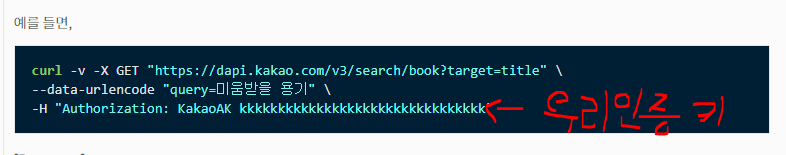
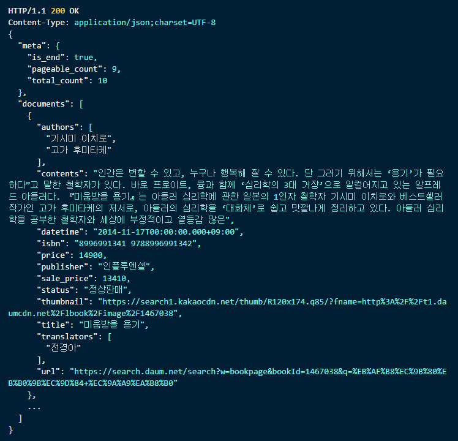
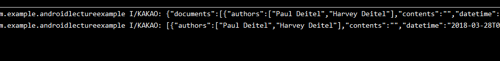
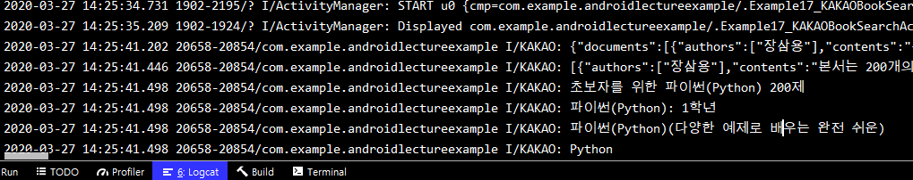
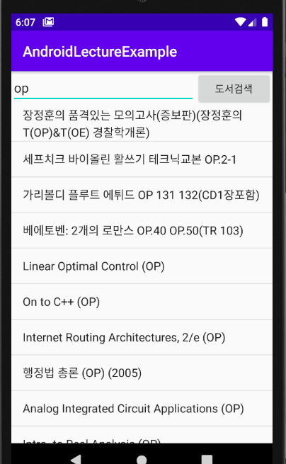

# 2020-03-27

---

# Serviecd

* 오늘 할 일.
  * Activity 와 Service 간의 데이터 전달.
  * Activity 와 Service 를 이용해서 외부 API 를 이용한 APP 을 구현.
  * 지금까지 우리가 Android 에서 배운 내용을 정리하는 APP 을 작성.

## 1. Activity 와 Service 간의 데이터 전달.

1. 화면구성

   ```xml
   <?xml version="1.0" encoding="utf-8"?>
   <LinearLayout xmlns:android="http://schemas.android.com/apk/res/android"
       android:layout_width="match_parent"
       android:layout_height="match_parent"
       android:orientation="vertical"
       >
       <TextView
           android:layout_width="match_parent"
           android:layout_height="wrap_content"
           android:text="서비스의 결과가 출력"
           android:textSize="10pt"
           android:id="@+id/_16_01_dataFormServiceTv"/>
       <EditText
           android:layout_width="match_parent"
           android:layout_height="wrap_content"
           android:hint="Servcie에 전달할 내용"
           android:id="@+id/_16_02_dataToServiceEt"/>
       <Button
           android:layout_width="match_parent"
           android:layout_height="wrap_content"
           android:text="Service 시작"
           android:id="@+id/_16_03_dataToServiceBtn"/>
   
   </LinearLayout>
   ```

   

2. `Activity` 이벤트 처리.

   1. 버튼 클릭으로 서비스를 호출

   ```java
   public class Example16_ServiceDataTransferActivity extends AppCompatActivity {
       TextView _16_01_dataFormServiceTv;
   
       @Override
       protected void onCreate(Bundle savedInstanceState) {
           super.onCreate(savedInstanceState);
           setContentView(R.layout.activity_example16_service_data_transfer);
   
           // 사용할 Component 의 Reference 를 획득.
           _16_01_dataFormServiceTv =
                   (TextView) findViewById(R.id._16_01_dataFormServiceTv);
           final EditText _16_02_dataToServiceEt =
                   (EditText) findViewById(R.id._16_02_dataToServiceEt);
           Button _16_03_dataToServiceBtn =
                   (Button) findViewById(R.id._16_03_dataToServiceBtn);
   
           // Button 에 대한 click evnet 처리
           // (anonymous inner class 를 이용하여 event 처리)
   
           _16_03_dataToServiceBtn.setOnClickListener(new View.OnClickListener() {
               @Override
               public void onClick(View v) {
                   // EditText 안에 사용자가 입력한 데이터를 가지고
                   // Service 를 호출.
                   Intent intent = new Intent(getApplicationContext(),
                           Example16Sub_Service.class);
                   // Service 에게 데이터를 전달하려면
                   // Intent 를 이용하여 데이터를 전달해야 한다.
                   // key, value 의 형식으로 데이터를 Intent 에 붙인다.
                   intent.putExtra("DATA",
                           _16_02_dataToServiceEt.getText().toString());
                   startService(intent);
               }
           });
   
   
       }
   }
   ```

3. 서비스 작성.

   ```java
   
   ```

4. 서비스에서 받아온 데이터 onNewIntent 를통해 받아짐.

   * 최종 결과처리는 onNewIntent() 매서드에서 진행해줌.

   ```java
   
   ```

   


## 2. 외부 API 사용

1. `Activity` 생성

   * `Activity` 에는 책을 검색하기 위한 `EditText`가 존재.
   * 키워드를 ㄴ허고 버튼을 클릭하면 `Service` 가 시작.
   * 화면(`Layout`)

   ```xml
   <?xml version="1.0" encoding="utf-8"?>
   <LinearLayout xmlns:android="http://schemas.android.com/apk/res/android"
       android:layout_width="match_parent"
       android:layout_height="match_parent"
       android:orientation="vertical">
   
       <LinearLayout
           android:layout_width="match_parent"
           android:layout_height="wrap_content"
           android:orientation="horizontal">
           <EditText
               android:layout_width="wrap_content"
               android:layout_height="wrap_content"
               android:layout_weight="5"
               android:hint="검색어를 입력하세요."
               android:id="@+id/_17_01_KAKAOEt"/>
           <Button
               android:layout_width="wrap_content"
               android:layout_height="wrap_content"
               android:layout_weight="1"
               android:text="도서검색"
               android:id="@+id/_17_02_KAKAOSearchBtn"/>
   
       </LinearLayout>
   
       <ListView
           android:layout_width="match_parent"
           android:layout_height="wrap_content"
           android:id="@+id/_17_03_KAKAOBookList"/>
   
   </LinearLayout>
   ```

   

   * 버튼 이벤트 처리 작성

   ```java
   public class Example17_KAKAOBookSearchActivity extends AppCompatActivity {
   
       @Override
       protected void onCreate(Bundle savedInstanceState) {
           super.onCreate(savedInstanceState);
           setContentView(R.layout.activity_example17_kakao_book_search);
           // Widget 에 대한 reference 얻어오기.
           final EditText kakaoEt = (EditText) findViewById(R.id._17_01_KAKAOEt);
           Button KAKAOSearchBtn = (Button) findViewById(R.id._17_02_KAKAOSearchBtn);
           ListView KAKAOBookList = (ListView) findViewById(R.id._17_03_KAKAOBookList);
           // Button 에 대한 이벤트 처리
           KAKAOSearchBtn.setOnClickListener(new View.OnClickListener() {
               @Override
               public void onClick(View v) {
                   Intent intent = new Intent(getApplicationContext(),
                           Example17Sub_KAKAOBookSearchService.class);
                   intent.putExtra("KEYWORD", kakaoEt.getText().toString());
                   startService(intent);
               }
           });
       }
   }
   ```

2. `Service` 가 하는 일.

   * `Network`을 통해서 `KAKAO` 가 제공하는 `OPEN API` 를 호출
   * 결과가 `JSON `형태로 나옴.
   * `JACKSON library`를 이용해서 `JSON` 처리.
   * 도서정보중에 책 제목만 추려서 `Activity` 에게 전달
   * 서비스 코드 작성.

   ```java
   public class Example17Sub_KAKAOBookSearchService extends Service {
       public Example17Sub_KAKAOBookSearchService() {
       }
   
       @Override
       public IBinder onBind(Intent intent) {
           // TODO: Return the communication channel to the service.
           throw new UnsupportedOperationException("Not yet implemented");
       }
   
       @Override
       public void onCreate() {
           super.onCreate();
       }
   
       @Override
       public int onStartCommand(Intent intent, int flags, int startId) {
           // Activity 로 부터 전달된 intent 를 이용하여 keyword 를 얻어내기.
           String keyword = intent.getExtras().getString("KEYWORD");
           KakaoBookSearchRunnable runnable = new KakaoBookSearchRunnable(keyword);
           Thread t = new Thread(runnable);
           t.start();
           // Network 연결을 통해 Oepn API 를 호출하는 시간이 걸리는 작업을 수행.
           // Thread 를 이용하여 처리해야 한다.
           return super.onStartCommand(intent, flags, startId);
       }
   
       @Override
       public void onDestroy() {
           super.onDestroy();
       }
   }
   ```

3. `Service` 안에서 사용할 `Runnable`객체를 하나 정의.

   ```java
   
   ```

4. 외부 API 받아오기.

   1. `KAKAO Developer` 홈페이지에서 가입후 `key`값을 할당 받는다. (`REST API` 이용할 예정)

      

   2. 사용할 API 찾기

      

   3. 아래 문을 이용하여 `url` 을 알아냄.

      

      아랫쪽에 예시가 있음

      

      실제 코드로 사용하면 (Runnable 객체의 run 매서드에서 진행.)

      ```java
      String url = "https://dapi.kakao.com/v3/search/book?target=title";
              url += ("&query="+keyword); // & 를 이용하여 url 에서 전달 객체 구분
      ```

   4. 네트워크 연결을 이용한 연결

      * Java 에서 network 연결은 예외상황이 발생할 여지가 있다.
      * Java 는 network 처리에 대해서 Exception Handling 을 강제하고 있다.
      * `try catch` 문을 이용한다.

      ```java
       try {
                  // 1. HTTP 접속을 하기 위해 URL 객체를 생성.
                  URL obj = new URL(url);
                  // 2. URL Connection 을 연다.
                  HttpURLConnection con = (HttpURLConnection) obj.openConnection();
                  // 3. 연결에 대한 설정이 들어가야 한다.
                  // 대표적인 설정 : 호출방식(GET,POST), 인증에 대한 처리
                  con.setRequestMethod("GET"); // API 를 보고 결정.
                  con.setRequestProperty("Authorization",
                          "KakaoAK 56503484476b1750deebd867d290f618"); // 인증처리.
      ```

      * 인증키는

        

   5. 가져온 데이터는 `JSON` 형슥으로 받아오게 되고, 이 받아온 `JSON` 을 `Stream` 을 통해 읽어온다.

      * `BufferReader` 를 이용하여 `con` 객체에서 스트림을 받아와 모두 읽어서 `StringBuffer` 객체에 저장해 준다.

      ```java
      		   // 일단 접속이 성공(정상적으로 처리가 되면)
                  // 접속이 성공하면 결과 데이터를 JSON 으로 보내주게 되고
                  // 데이터 연결통로(Stream)을 열어서 데이터를 읽어온다.
                  // 데이터 연결통로는 기본적인 Stream 을 먼저 얻고 일르 이용해서
                  // 조금 더 사용하기 편한 통로로 변경해서 사용한다..
                  BufferedReader br = new BufferedReader(
                          new InputStreamReader(con.getInputStream()));
                  String line ;
                  StringBuffer sb = new StringBuffer();
      
                  // 반복적으로 서버가 보내준 데이터를 읽는다.
                  while((line = br.readLine()) != null){ // 끝까지 읽으면 null 이나옴.
                      sb.append(line);
                  }
                  Log.i("KAKAO",sb.toString());
              } catch (Exception e) {
                  Log.i("KAKAO", e.toString());
              }
      }
      ```

   6. 가져온 데이터의 형식

      

      * 여러개의 `JSON` 배열로 이루어져 있다.
      * `documents : [ {책1권}, {책1권}, {책1권}, ...]`
      * `JSON` 문자열을 자바의 객체화 시켜서 가져올 예정이다.
      * `JSON` 을 처리해서 `documents` 라고 되어있는 `key` 값에 대해 `Value` 값을 객체화 하여 가져온다.

      ```java
      ObjectMapper mapper = new ObjectMapper();
                  // 먼저 JSON 을 읽어서 Map 객체화 시킨다. key : documents, value : 뒤 배열.
                  Map<String,Object> map =
                          mapper.readValue(sb.toString(),
                                  new TypeReference<Map<String,Object>>(){});
      
      ```

      > TypeReference() 객체는 JACKSON library 에 존재하는 객체.
      >
      > readVavlue 에서 가져올 JSON String 을 내가 원하는 객체의 형태로 만들어준다.
      >
      > 객체의 위치는 TypeReference<원하는 객체>(){} 형식으로 사용해 준다.

      * 위와 같은 코드를 수행하면 책의 정보배열을 객체로 가져올 수 있다.
      * 이제 가져온 객체를 다시 JSON  String 으로 만들어 준다.
      * `writeValueAsString()` 매서드를 이용.

      ```java
             Object jsonObject = map.get("documents");
             // jsonObject => [ {책1권}, {책1권}, {책1권}, ...] 의 객체화.
      
             String jsonString = mapper.writeValueAsString(jsonObject);
             // jsonString => "[ {책1권}, {책1권}, {책1권}, ...] "
      ```

      * 이렇게 만든 `jsonString`을 출력해보면.. `JSON` 문자열이 다시 나온다.
      * (위 처음 JSON(br로 가져온 String) 아래 : jsonString)

      

      * 이제 `jsonString`을 처리할 `VO` 객체가 필요하다.

      ```java
      class KAKAOBookVO {
          private ArrayList<String> authors;
          private ArrayList<String> translators;
          private String contents;
          private String datetime;
          private String isbn;
          private String price;
          private String publisher;
          private String sale_price;
          private String status;
          private String thumbnail;
          private String title;
          private String url;
          // 기본 constructor
          public KAKAOBookVO() {
      
          }
          // ahems field 를 이용하는 constructor
          public KAKAOBookVO(ArrayList<String> authors, ArrayList<String> translators, String contents, String datetime, String isbn, String price, String publisher, String sale_price, String status, String thumbnail, String title, String url) {
              this.authors = authors;
              this.translators = translators;
              this.contents = contents;
              this.datetime = datetime;
              this.isbn = isbn;
              this.price = price;
              this.publisher = publisher;
              this.sale_price = sale_price;
              this.status = status;
              this.thumbnail = thumbnail;
              this.title = title;
              this.url = url;
          }
          // getter & setter
          public ArrayList<String> getAuthors() {
              return authors;
          }
      
          public void setAuthors(ArrayList<String> authors) {
              this.authors = authors;
          }
      
          public ArrayList<String> getTranslators() {
              return translators;
          }
      
          public void setTranslators(ArrayList<String> translators) {
              this.translators = translators;
          }
      
          public String getContents() {
              return contents;
          }
      
          public void setContents(String contents) {
              this.contents = contents;
          }
      
          public String getDatetime() {
              return datetime;
          }
      
          public void setDatetime(String datetime) {
              this.datetime = datetime;
          }
      
          public String getIsbn() {
              return isbn;
          }
      
          public void setIsbn(String isbn) {
              this.isbn = isbn;
          }
      
          public String getPrice() {
              return price;
          }
      
          public void setPrice(String price) {
              this.price = price;
          }
      
          public String getPublisher() {
              return publisher;
          }
      
          public void setPublisher(String publisher) {
              this.publisher = publisher;
          }
      
          public String getSale_price() {
              return sale_price;
          }
      
          public void setSale_price(String sale_price) {
              this.sale_price = sale_price;
          }
      
          public String getStatus() {
              return status;
          }
      
          public void setStatus(String status) {
              this.status = status;
          }
      
          public String getThumbnail() {
              return thumbnail;
          }
      
          public void setThumbnail(String thumbnail) {
              this.thumbnail = thumbnail;
          }
      
          public String getTitle() {
              return title;
          }
      
          public void setTitle(String title) {
              this.title = title;
          }
      
          public String getUrl() {
              return url;
          }
      
          public void setUrl(String url) {
              this.url = url;
          }
      }
      ```

      * 이제 다시 `jsonString` 을 VO ArrayList 형태로 바꾸어 변수로 저장.

      ```java
      ArrayList<KAKAOBookVO> searchBooks =
                          mapper.readValue(jsonString,
                                  new TypeReference<ArrayList<KAKAOBookVO>>() {
                                  });
                  for(KAKAOBookVO vo : searchBooks){
                      Log.i("KAKAO",vo.getTitle());
                  }
      ```

      * 결과

      

      * Runnable 객체에서 getApplicationContext() 를 사용하기 위해서는 Runnable 객체가 Activity 안에 Inner class 형태로 있어야 사용이 가능하다.ㅇ
      * 이제 Intent를 이용하여 Activity 에게 보내기

      ```java
      // for each 문에서 이제 Log를 찍는것이 아닌 보낼 데이터 객체에 저장.
      ArrayList<String> resultData = new ArrayList<String>();
      
                      for (KAKAOBookVO vo : searchBooks) {
                          resultData.add(vo.getTitle());
                      }
                      Intent i = new Intent(getApplicationContext(),
                              Example17_KAKAOBookSearchActivity.class);
                      i.putExtra("BOOKRESULT",resultData);
                      i.addFlags(Intent.FLAG_ACTIVITY_NEW_TASK);
                      i.addFlags(Intent.FLAG_ACTIVITY_SINGLE_TOP);
                      i.addFlags(Intent.FLAG_ACTIVITY_CLEAR_TOP);
                      startActivity(i);
      
      ```

      * 전체 코드

      ```java
      package com.example.androidlectureexample;
      
      import android.app.Service;
      import android.content.Intent;
      import android.os.IBinder;
      import android.util.Log;
      
      import com.fasterxml.jackson.core.type.TypeReference;
      import com.fasterxml.jackson.databind.ObjectMapper;
      
      import java.io.BufferedReader;
      import java.io.InputStreamReader;
      import java.net.HttpURLConnection;
      import java.net.URL;
      import java.util.ArrayList;
      import java.util.Map;
      
      public class Example17Sub_KAKAOBookSearchService extends Service {
          public Example17Sub_KAKAOBookSearchService() {
          }
      
          @Override
          public IBinder onBind(Intent intent) {
              // TODO: Return the communication channel to the service.
              throw new UnsupportedOperationException("Not yet implemented");
          }
      
          @Override
          public void onCreate() {
              super.onCreate();
          }
      
          @Override
          public int onStartCommand(Intent intent, int flags, int startId) {
              // Activity 로 부터 전달된 intent 를 이용하여 keyword 를 얻어내기.
              String keyword = intent.getExtras().getString("KEYWORD");
              KakaoBookSearchRunnable runnable = new KakaoBookSearchRunnable(keyword);
              Thread t = new Thread(runnable);
              t.start();
              // Network 연결을 통해 Oepn API 를 호출하는 시간이 걸리는 작업을 수행.
              // Thread 를 이용하여 처리해야 한다.
      
              return super.onStartCommand(intent, flags, startId);
          }
      
          @Override
          public void onDestroy() {
              super.onDestroy();
          }
      
          class KakaoBookSearchRunnable implements Runnable {
              private String keyword;
      
              KakaoBookSearchRunnable() {
              }
      
              KakaoBookSearchRunnable(String keyword) {
                  this.keyword = keyword;
              }
      
              @Override
              public void run() {
                  // Network 접속을 통해 Open API 를 호출.
                  // KAKAO Developer 사이트에서 OEPN API 의 호출방식을 알아내야 한다.
                  String url = "https://dapi.kakao.com/v3/search/book?target=title";
                  url += ("&query=" + keyword);
      
                  // 주소를 완성했으면 이 주소를 이용하여 network 연결을 해야한다.
                  // Java 에서 network 연결은 예외상황이 발생할 여지가 있다.
                  // Java 는 network 처리에 대해서 Exception Handling 을 강제하고 있다.
                  try {
                      // 1. HTTP 접속을 하기 위해 URL 객체를 생성.
                      URL obj = new URL(url);
                      // 2. URL Connection 을 연다.
                      HttpURLConnection con = (HttpURLConnection) obj.openConnection();
                      // 3. 연결에 대한 설정이 들어가야 한다.
                      // 대표적인 설정 : 호출방식(GET,POST), 인증에 대한 처리
                      con.setRequestMethod("GET"); // API 를 보고 결정.
                      con.setRequestProperty("Authorization",
                              "KakaoAK 56503484476b1750deebd867d290f618"); // 인증처리.
                      // 일단 접속이 성공(정상적으로 처리가 되면)
                      // 접속이 성공하면 결과 데이터를 JSON 으로 보내주게 되고
                      // 데이터 연결통로(Stream)을 열어서 데이터를 읽어온다.
                      // 데이터 연결통로는 기본적인 Stream 을 먼저 얻고 일르 이용해서
                      // 조금 더 사용하기 편한 통로로 변경해서 사용한다..
                      BufferedReader br = new BufferedReader(
                              new InputStreamReader(con.getInputStream()));
                      String line;
                      StringBuffer sb = new StringBuffer();
      
                      // 반복적으로 서버가 보내준 데이터를 읽는다.
                      while ((line = br.readLine()) != null) { // 끝까지 읽으면 null 이나옴.
                          sb.append(line);
                      }
                      br.close();
                      Log.i("KAKAO", sb.toString());
                      // 데이터가 JSON 으로 정삭적으로 온걸 확인할 수 있다.
                      // `documents : [ {책1권}, {책1권}, {책1권}, ...]`
                      // JSON 을 처리해서 documents 라고 되어있는 key 값에 대해
                      // Value 값을 객체화 하여 가져온다.
                      ObjectMapper mapper = new ObjectMapper();
                      // 먼저 JSON 을 읽어서 Map 객체화 시킨다. key : documents, value : 뒤 배열.
                      // 뒤에 책 배열을 문자열로 꺼내올 방법이 없기 때문에 Map 객체화 하여 가져오는 것.
                      Map<String, Object> map =
                              mapper.readValue(sb.toString(),
                                      new TypeReference<Map<String, Object>>() {
                                      });
      
                      Object jsonObject = map.get("documents");
                      // jsonObject => [ {책1권}, {책1권}, {책1권}, ...] 의 객체화.
      
                      String jsonString = mapper.writeValueAsString(jsonObject);
                      // jsonString => "[ {책1권}, {책1권}, {책1권}, ...] "
      
                      Log.i("KAKAO", jsonString);
                      // ArrayList 안에 책 객체가 들어있는 형태로 만든다. ( VO 를 만들어야 한다.)
      
                      ArrayList<KAKAOBookVO> searchBooks =
                              mapper.readValue(jsonString,
                                      new TypeReference<ArrayList<KAKAOBookVO>>() {
                                      });
      
                      ArrayList<String> resultData = new ArrayList<String>();
      
                      for (KAKAOBookVO vo : searchBooks) {
                          resultData.add(vo.getTitle());
                      }
                      Intent i = new Intent(getApplicationContext(),
                              Example17_KAKAOBookSearchActivity.class);
                      i.putExtra("BOOKRESULT",resultData);
                      i.addFlags(Intent.FLAG_ACTIVITY_NEW_TASK);
                      i.addFlags(Intent.FLAG_ACTIVITY_SINGLE_TOP);
                      i.addFlags(Intent.FLAG_ACTIVITY_CLEAR_TOP);
                      startActivity(i);
      
      
      
                      // 책 제목만 들어있는 ArrayList를 만들어 Activity 에게 보내주면 된다.
      
                  } catch (Exception e) {
                      Log.i("KAKAO", e.toString());
                  }
              }
      
          }
      }
      
      
      class KAKAOBookVO {
          private ArrayList<String> authors;
          private ArrayList<String> translators;
          private String contents;
          private String datetime;
          private String isbn;
          private String price;
          private String publisher;
          private String sale_price;
          private String status;
          private String thumbnail;
          private String title;
          private String url;
      
          // 기본 constructor
          public KAKAOBookVO() {
      
          }
      
          // ahems field 를 이용하는 constructor
          public KAKAOBookVO(ArrayList<String> authors, ArrayList<String> translators, String contents, String datetime, String isbn, String price, String publisher, String sale_price, String status, String thumbnail, String title, String url) {
              this.authors = authors;
              this.translators = translators;
              this.contents = contents;
              this.datetime = datetime;
              this.isbn = isbn;
              this.price = price;
              this.publisher = publisher;
              this.sale_price = sale_price;
              this.status = status;
              this.thumbnail = thumbnail;
              this.title = title;
              this.url = url;
          }
      
          // getter & setter
          public ArrayList<String> getAuthors() {
              return authors;
          }
      
          public void setAuthors(ArrayList<String> authors) {
              this.authors = authors;
          }
      
          public ArrayList<String> getTranslators() {
              return translators;
          }
      
          public void setTranslators(ArrayList<String> translators) {
              this.translators = translators;
          }
      
          public String getContents() {
              return contents;
          }
      
          public void setContents(String contents) {
              this.contents = contents;
          }
      
          public String getDatetime() {
              return datetime;
          }
      
          public void setDatetime(String datetime) {
              this.datetime = datetime;
          }
      
          public String getIsbn() {
              return isbn;
          }
      
          public void setIsbn(String isbn) {
              this.isbn = isbn;
          }
      
          public String getPrice() {
              return price;
          }
      
          public void setPrice(String price) {
              this.price = price;
          }
      
          public String getPublisher() {
              return publisher;
          }
      
          public void setPublisher(String publisher) {
              this.publisher = publisher;
          }
      
          public String getSale_price() {
              return sale_price;
          }
      
          public void setSale_price(String sale_price) {
              this.sale_price = sale_price;
          }
      
          public String getStatus() {
              return status;
          }
      
          public void setStatus(String status) {
              this.status = status;
          }
      
          public String getThumbnail() {
              return thumbnail;
          }
      
          public void setThumbnail(String thumbnail) {
              this.thumbnail = thumbnail;
          }
      
          public String getTitle() {
              return title;
          }
      
          public void setTitle(String title) {
              this.title = title;
          }
      
          public String getUrl() {
              return url;
          }
      
          public void setUrl(String url) {
              this.url = url;
          }
      }
      ```

      

      

5. `Activity` 가 이 책 제목 정보를 받아서 `ListView`에 출력

   * `onNewIntent()` 이용.

   ```java
   protected void onNewIntent(Intent intent) {
           super.onNewIntent(intent);
           ArrayList<String> booksTitle =
                   (ArrayList<String>)intent.getExtras().get("BOOKRESULT");
   
           ArrayAdapter adpter = new ArrayAdapter(getApplicationContext(),
                   android.R.layout.simple_list_item_1,
                   booksTitle);
   
           KAKAOBookList.setAdapter(adpter);
       }
   ```

> layout 에서 weight 를 줄때..
>
> width height 를 wrap_content로 주었을때는 정비율
>
> match_parent 로 주었을때는 반대로 적용

