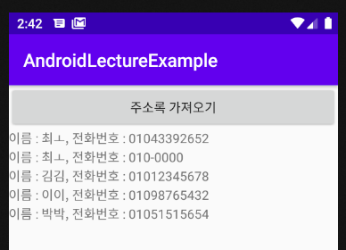

# 2020-04-08

# Android

## Content provider

### select 구문.

* query() 매소드를 이용. (Activity 안에서 사용.)

  ```java
  // 1. DB 처리 기능을 제공하는 Content Provider 를 찾아야 한다.
   // Content Provider 를 찾기 위한 URI 가 있어야 한다.
   String uriString = "content://com.exam.person.provider/person";
   Uri uri = new Uri.Builder().build().parse(uriString);
   // 2. Uri 를 이용해서 Content Provider 를 찾아서 특정 method 를 호출한다.
   // column 을 표현하기 위한 String[] 을 생성 (2번째 인자.)
   // "select name, age, mobile from person where ~~~
   String[] colums = new String[]{"name", "age", "mobile"};
   // 3번째 인자는 where 절 조건. 조건이 없으면 null 작성.
   // 4번째 인자는 조건에 대한 argument. 없으면 null.
   // 5번째는 정렬방향.
  
  
  Cursor cursor =  getContentResolver().query(
          uri, colums,null,null,
          "name ASC");
  ```

* 실제 Content Provider 내부 코드

  ```java
  @Override
      public Cursor query(Uri uri, String[] projection, String selection,
                          String[] selectionArgs, String sortOrder) {
          // TODO: Implement this to handle query requests from clients.
          Log.i("DBTest", "query() 실행");
          // 1번째 인자 : table 명
          // 2번째 인자 : projection : select 에서 가져올 컬럼명을 문자배열로 표현.
          // 3번째 인자 : selection : where 절 조건을 명시.
          // 4번째 인자 : selection 의 In Parameter 의 값.
          // 5번째 인자 : Group by 방법
          // 6번째 인자 : having 절
          // 7번째 인자 : 정렬방법
          Cursor cursor = database.query("person",
                  projection, selection, selectionArgs,null,null, sortOrder);
  
          return cursor;
      }
  ```

  


> 원리
>
> `Content Provider` 와 `Content Resolver`를 이용해서 데이터공유를 하는 방법을 알아 보았다.
>
> 그러나 우리는 `Content Provider` 를 직접 만들일이 거의 없다. 
>
> URI 를 이용하여 내가 만든 `Database` 를 다른사람에게 제공해 주는 것 뿐이다. 
>
> 일반적으로 `Google` 에서 제공하는 `Content Provider` 를 이용하여 사용한다.
>
> `Content Resolver` 를 이용하여 `Google` 이 제공하는 다른 `App` 의 `Content Provider` 를 찾아서 사용한다.

---

## Android 기본 주소록 접근.

* `Android` 기본 주소록에 접근할 수 있는 `Content Provider` 를 찾아서 이것을 이용하여 주소록 데이터베이스를 우리 프로그램에서 이용하는 예제.

* 주소록은 상당히 개인정보 이므로, 주소록 접근시 보안설정이 필요하다.!

* AndroidManifest.xml 에서 설정. (1차 권한)

  ```xml
  <uses-permission android:name="android.permission.READ_CONTACTS" />
  <uses-permission android:name="android.permission.WRITE_CONTACTS" />
  ```

* Oreo 이상에서 사용자에게 접근권한을 직접 물어보아야 한다.

* 기존에 설정했던 방식과 같은 방식.

  * `in onCreate()`

  ```java
   if (Build.VERSION.SDK_INT >= Build.VERSION_CODES.M) {
              // 만약 우리가 사용하는 기기가 M 이상이면
              // 사용자 권한 중 주소록읽기 권한이 설정되어 있는지 Check
              int permissionResult = ActivityCompat.checkSelfPermission(
                      getApplicationContext(),
                      Manifest.permission.READ_CONTACTS);
              if (permissionResult == PackageManager.PERMISSION_DENIED) {
                  // 권한이 없으면
                  // 1. App 을 처음 실행해서 권한을 물어본 적이 없는경우.
                  // 2. 권한 허용에 대해서 사용자에게 물어는 봤으나 사용자가
                  // 거절을 선택한 경우
  
                  // 왜 권한이 없을까? (2가지 Case)
                  if (shouldShowRequestPermissionRationale(android.Manifest.permission.READ_CONTACTS)) {
                      // true => 권한을 거부한 적이 있는 경우.
                      // 일반적으로 dialog 같은걸 이용하여 다시 물어본다.
                      AlertDialog.Builder dialog =
                              new AlertDialog.Builder(Example24_ContactActivity.this);
                      dialog.setTitle("권한이 필요해요!");
                      dialog.setMessage("SMS 수신기능이 필요합니다. 수락할까요?");
                      dialog.setPositiveButton("yes", new DialogInterface.OnClickListener() {
                          @Override
                          public void onClick(DialogInterface dialog, int which) {
                              requestPermissions(
                                      new String[]{android.Manifest.permission.READ_CONTACTS},
                                      200);
  
                          }
                      });
                      dialog.setNegativeButton("no", new DialogInterface.OnClickListener() {
                          @Override
                          public void onClick(DialogInterface dialog, int which) {
                              // 권한설정을 하지 않는다는 의미이므로
                              // 아무런 작업을 할 필요가 없다.
                          }
                      });
                      // 만들어진 dialog 를 화면에 띄운다.
                      dialog.create().show();
  
                  } else {
                      // false => 한번도 물어본적이 없는 경우.
                      // 여러 권한을 동시에 사용자에게 요청할 수 있기때문에
                      // 인자가 String 배열로 들어간다.
                      requestPermissions(
                              new String[]{Manifest.permission.READ_CONTACTS},
                              200);
                  }
  
              } else {
                  // 권한이 있으면
                  Log.i("ContactTest", "보안설정 통과!!");
                  processContact(); // 주소록 가져오는 method.
              }
          } else {
              // 만약 우리가 사용하는 기기가 M 미만이면
              Log.i("ContactTest", "보안설정 통과!!");
          }
  ```

  * `in onRequestPermissionsResult()`

  ```java
  @Override
      public void onRequestPermissionsResult(int requestCode, @NonNull String[] permissions, @NonNull int[] grantResults) {
          super.onRequestPermissionsResult(requestCode, permissions, grantResults);
          // 사용자가 권한을 설정하게 되면 이 부분이 마지막으로 출력된다.
          // 사용자가 권한설정을 하거나 그렇지 않거나 두가지 경우 모두 이 callback 매서드가 호출된다.
          if (requestCode == 200) {
              if (grantResults.length > 0 &&
                      grantResults[0] == PackageManager.PERMISSION_GRANTED) {
                  // 사용자가 권한 허용을 눌렀을 경우.
                  Log.i("ContactTest", "보안설정 통과!!");
                  processContact(); // 주소록 가져오는 method.
              }
          }
      }
  ```

* `processContact()` 이라는 주소록을 가져오는 method를 작성.

  * 사용되는 주소록 접근 `URI : ContactsContract.Contacts.CONTENT_URI`

  ```java
  private void processContact() {
      // 주소록 가져오는 코드를 작성.
      // 1. Content Resolver 를 이용하여 데이터를 가져오면 된다.
      //    Select 계열을 사용.
      //    첫번째 인자 : URI -> Content Provider 를 찾기위함.
      //    주소록 접근 URI : ContactsContract.Contacts.CONTENT_URI
      //    어떻게 select 처리를 할지 인자를 작성.
      Cursor cursor =
              getContentResolver().query(ContactsContract.Contacts.CONTENT_URI,
                      null, // null : 모든 컬럼 다 들고옴.
                      null, // 조건없이 다 들고옴.
                      null, // 조건절에 사용할 값.
                      null);// 정렬방향. 안하고 가져옴.
      
  }
  ```

  * while 문을 이용하여 검색.
  * 검색할때 각 사람의 이름과 ID 를 검색해야한다.
  * 그 이유는 한 사람이 여러개의 전화번호를 갖고 있는 경우도 있어 이름과 ID 를 검색하고 ID에 대한 전화번호를 검색하는 방식으로 진행한다.

  ```java
          while (cursor.moveToNext()) {
              // 각 사람의 이름과 ID 를 가져와야 한다.
              // 전화번호와 사람이름을 따로 관리한다. (한사람이 여러개의 전화번호를 갖고 있을수도 있으므로)
              // ID 를 이용하여 각 사람의 전화번호를 다시 얻어오는 방식으로 수행.
  
              String id = cursor.getString(cursor.getColumnIndex(ContactsContract.Contacts._ID));
              Log.i("ContactTest", "얻어온 ID : " + id);
  
              String name = cursor.getString(cursor.getColumnIndex(ContactsContract.Contacts.DISPLAY_NAME));
              Log.i("ContactTest", "얻어온 이름 : " + name);
              String msg;
              Cursor mobileCursor = getContentResolver().query(
                      ContactsContract.CommonDataKinds.Phone.CONTENT_URI,
                      null,
                      ContactsContract.CommonDataKinds.Phone.CONTACT_ID + " = " + id, //id 값이 일치하는 값 가져옴.
                      null,
                      null);
              while (mobileCursor.moveToNext()) {
                  String mobile = mobileCursor.getString(
                          mobileCursor.getColumnIndex(
                                  ContactsContract.CommonDataKinds.Phone.NUMBER));
                  msg = "이름 : " + name + ", " + "전화번호 : " + mobile;
                  _24_resultTv.append(msg + "\n");
              }
          }
  ```


* 결과

  

