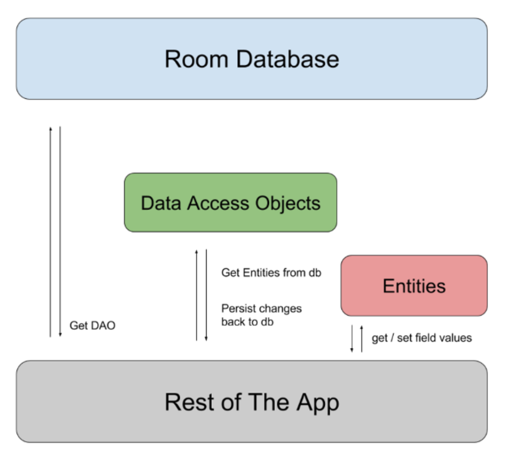

# Room Database

[Android Docs](https://developer.android.com/training/data-storage/room?hl=ko)

## Room Database?

* Room은 SQLite에 대한 추상화 레이어를 제공하여 원활한 데이터베이스 액세스를 지원하는 동시에 SQLite를 완벽히 활용하는 라이브러리이다. ( 일명 ORM )

* 많은 양의 구조화된 데이터를 처리하는 앱은 데이터를 로컬로 유지하여 많은 이점을 얻을 수 있다. 가장 일반적인 사용 사례는 관련 데이터를 캐싱하는 것이다. 이런 방식으로 기기가 네트워크에 액세스할 수 없을 때 오프라인 상태인 동안에도 사용자가 여전히 콘텐츠를 탐색할 수 있다. 나중에 기기가 다시 온라인 상태가 되면 사용자가 시작한 콘텐츠 변경사항이 서버에 동기화 시킬 수 있다.

* Room은 이러한 문제를 자동으로 처리하므로 SQLite 대신 Room을 사용할 것을 **적극적으로 권장**한다. 


## 종속 추가

* `build.gradle`

```groovy
    dependencies {
      def room_version = "2.2.5"

      implementation "androidx.room:room-runtime:$room_version"
      annotationProcessor "androidx.room:room-compiler:$room_version" 
      // For Kotlin use kapt instead of annotationProcessor

      // optional - Kotlin Extensions and Coroutines support for Room
      implementation "androidx.room:room-ktx:$room_version"

      // optional - RxJava support for Room
      implementation "androidx.room:room-rxjava2:$room_version"

      // optional - Guava support for Room, including Optional and ListenableFuture
      implementation "androidx.room:room-guava:$room_version"

      // Test helpers
      testImplementation "androidx.room:room-testing:$room_version"
    }
    
```

## 구성요소

1. 데이터베이스(Database) : 데이터베이스 홀더를 포함하며 앱의 지속적인 관계형 데이터의 기본 연결을 위한 기본 액세스 포인트 역할을 한다.
   * `@Databasae`로 주석이 지정된 클래스는 다음 조건을 충족해야 한다.
     * Roomdatabsae를 확장하는 추상 클래스여야 한다.
     * 주석 내에 데이터베이스와 연결된 항목의 목록을 포함해야 한다.
     * 인수가 0개이며, `@Dao`로 주석이 지정된 클래스를 반환하는 추상 메서드를 포함해야 한다.
   * 런타임 시 `Room.databaseBuilder()` 또는 `Room.inMemoryDatabaseBuilder()` 를 호출하여 Database 인스턴스를 가져올 수 있다.
2. 항목 : 데이터베이스 내의 테이블을 나타낸다.
3. `DAO` : 데이터베이스에 액세스하는 데 사용되는 메서드가 포함되어 있다.

> 앱은 Room 데이터베이스를 사용하여 데이터베이스와 연결된 데이터 액세스 개체 또는 DAO를 가져온다. 
>
> 그런 다음 앱은 각 DAO를 사용하여 데이터베이스에서 항목을 가져오고 항목의 변경사항을 다시 데이터베이스에 저장합니다. 
>
> 마지막으로 앱은 항목을 사용하여 데이터베이스 내의 테이블 열에 해당하는 값을 가져오고 설정합니다.




* 예시코드

  * User

  ```java
      @Entity
      public class User {
          @PrimaryKey
          public int uid;
  
          @ColumnInfo(name = "first_name")
          public String firstName;
  
          @ColumnInfo(name = "last_name")
          public String lastName;
      }
      
  ```

  * UserDao

  ```java
      @Dao
      public interface UserDao {
          @Query("SELECT * FROM user")
          List<User> getAll();
  
          @Query("SELECT * FROM user WHERE uid IN (:userIds)")
          List<User> loadAllByIds(int[] userIds);
  
          @Query("SELECT * FROM user WHERE first_name LIKE :first AND " +
                 "last_name LIKE :last LIMIT 1")
          User findByName(String first, String last);
  
          @Insert
          void insertAll(User... users);
  
          @Delete
          void delete(User user);
      }
      
  ```

  * AppDatabase

  ```java
      @Database(entities = {User.class}, version = 1)
      public abstract class AppDatabase extends RoomDatabase {
          public abstract UserDao userDao();
      }
      
  ```

  * 위의 파일을 생성한 후 다음 코드를 사용하여 생성한 데이터베이스 인스턴스를 가져옵니다.

  ```java
    AppDatabase db = Room.databaseBuilder(getApplicationContext(),
                                          AppDatabase.class, "database-name").build();  
  ```


## Room 항목을 사용하여 데이터 정의

* 개체(Entity) 정의 

  ```java
      @Entity
      public class User {
          @PrimaryKey
          public int id;
  
          public String firstName;
          public String lastName;
      }
  ```

  * 개체의 필드 유지를 위해서는 Room 에서 필드에 접근할 수 있어야 한다.
  * 필드를 public 으로 정의 하거나 getter & setter 를 이용하여 접근이 가능하게 설계한다.

* 기본키(Primary Key) 사용

  * 개체(Entity)는 하나 이상의 필드를 기본키로 정의해야 한다.
  * 필드가 1개인 경우에도 `@PrimaryKey` 를 이용하여 설정한다.