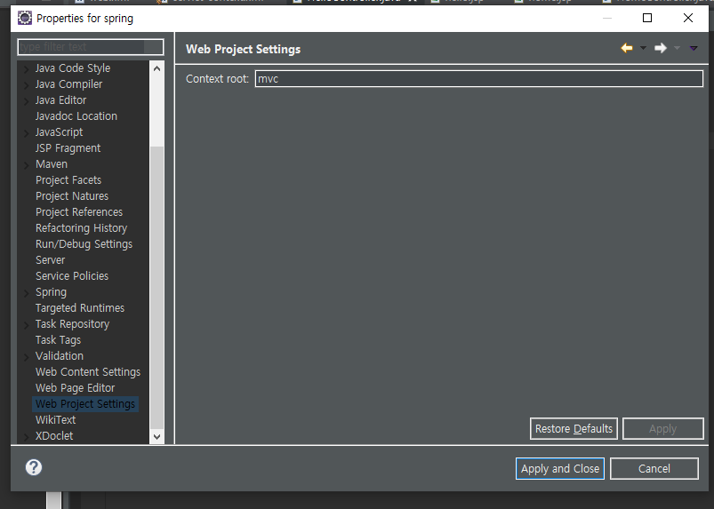
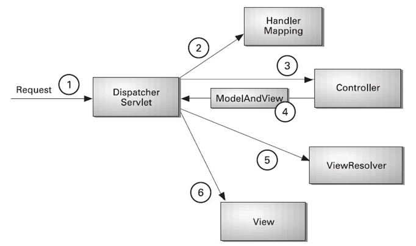
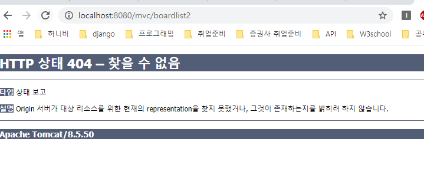
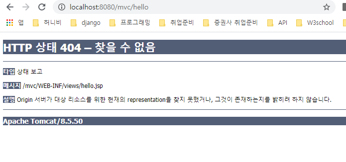

# 2020-02-04

---

## Web Spring MVC

* MVC 패턴

> 자바 디자인패턴 23가지.
>
> 1. singleton
> 2. factory
> 3. commnad - 인터페이스(메소드는 다른 모든 클래스에 공통 정의 되어야 되는 규칙.) / 상송 하위클래스(오버라이딩.)
> 4. proxy
> 5. front controller + mvc

### Dynamic Web 으로 MVC 구현 (FrontControllerServlet)

1. 모든 청이 FrontControllerServlet 호출하게함. ('/'); web.xml
2. HelloController 호출(Controller 역할)
   * Controller 규칙 : handleRequest 메소드를 갖게 약속. > 인터페이스 이용.
3. hello spring 문자열값 생성(model 역할)
4. hello.jsp 가 3번 출력데이터를 브라우저로 출력하게 만듬. (view 역할)

* Controller Interface (모든 Controller가 handleRequest 메소드를 수행하게 만들예정.)

``` java
package test;

import javax.servlet.http.HttpServletRequest;
import javax.servlet.http.HttpServletResponse;

public interface Controller {
	public String handleRequest(HttpServletRequest request, HttpServletResponse response);
}
```

* HelloController.class

```java
package test;

import javax.servlet.http.HttpServletRequest;
import javax.servlet.http.HttpServletResponse;

//Command 패턴 사용함.(Interface Orverriding)
public class HelloController implements Controller {

	@Override
	public String handleRequest(HttpServletRequest request, HttpServletResponse response) {
		System.out.println("HelloController 실행중입니다.");
		
		// servlet ---> jsp 데이터 전달, 공유
		request.setAttribute("model", "Hello Spring"); //(or session.setAtrribute) (이름, 값) "model"이라는 값을 전달받을 예정
		return "/hello.jsp";/* 사용할 view의 이름을 리턴*/
		//받을때 --> request.getAttribute("model");
		//or ${model}
	}

}
```

* FrontControllerServlet.class

```java
package test;

import java.io.IOException;
import java.io.PrintWriter;

import javax.servlet.RequestDispatcher;
import javax.servlet.ServletException;
import javax.servlet.http.HttpServlet;
import javax.servlet.http.HttpServletRequest;
import javax.servlet.http.HttpServletResponse;

public class FrontControllerServlet extends HttpServlet {
	// web.xml:'/' -> FrontControllerServlet
	// 모든 요청 FrontControllerServlet
	/* @WebServlet("/front") */
	protected void doGet(HttpServletRequest request, HttpServletResponse response)
			throws ServletException, IOException {

		response.setContentType("text/html;charset=utf-8");
		PrintWriter out = response.getWriter();
		out.println("<h1> FrontControllerservlet</h1>"); // FrontController패턴 : 모든 요청을 하나의 Controller로 제어하기 위한 패턴.
															// Spring에서 사용하는 패턴.
		out.println(request.getRequestURL());
		out.println(request.getRequestURI());
		String s[] = request.getRequestURI().split("/");
		out.println("<h1>" + s[s.length - 1] + "</h1>");
		// 3. hello - 일 시키자( MVC ) --> SPRING 내부환경 이해 로직.
		HandlerMapping mapping = new HandlerMapping();
		Controller controller = mapping.getController(s[s.length - 1]);
		String viewname = controller.handleRequest(request, response); // model이름으로 "Hello Spring" 문자열을 만들어서 hello.jsp 를 리턴해줌
		
		RequestDispatcher rd = request.getRequestDispatcher(viewname);
		rd.forward(request, response);//(요청변수, 응답변수)
	}

}
```

* HandlerMapping.class

```java
package test;

import java.util.HashMap;

public class HandlerMapping {
	HashMap<String, Controller> mappings;

	public HandlerMapping() {
		mappings = new HashMap<String, Controller>();
		mappings.put("hello", new HelloController()); // hello가 오면 HelloController를 수행하게 mapping
	}

	public Controller getController(String name) {
		return mappings.get(name);
	}
}
```

* hello.jsp

```jsp
<%@ page language="java" contentType="text/html; charset=UTF-8"
	pageEncoding="UTF-8"%>
<!DOCTYPE html>
<html>
	<head>
		<meta charset="EUC-KR">
		<title>스프링 MVC 테스트</title>
	</head>
	<body>
	
		<h1>
			컨트롤러에서 전달받은 값: ${model}
		</h1>
		<h1>
			컨트롤러에서 전달받은 값: <%= request.getAttribute("model")%>
		</h1>
	
</body>
</html>
```


### Spring 으로 MVC 구현

* Spring에서  Web-content폴더 : src/main/webapp/WEB-INF/views 에 view파일(.jsp)을 생성해야함.
* Spring에서는 HelloController 이외의 나머지 java source는 모두 Spring API를 이용하여 사용할 예정.


* 먼저 web.xml과 servlet-context.xml 수정이 필요함.
* web.xml


DispatcherServlet : FrontController를 Spring이 만들어준 것. (FrontController를 만들어줄 필요가 없다. 단, 각 jsp를 불러올 Controller들은 작성해야함.)

* HelloController

```java
package test;

import javax.servlet.http.HttpServletRequest;
import javax.servlet.http.HttpServletResponse;

import org.springframework.web.servlet.ModelAndView;
import org.springframework.web.servlet.mvc.Controller; // Spring API import

public class HelloController implements Controller {

	@Override 
	  public ModelAndView handleRequest(HttpServletRequest request,
	  HttpServletResponse response) {
	  System.out.println("HelloController 실행중입니다.");
	  ModelAndView mv = new ModelAndView();
	  //Controller ---> jsp 데이터 전달 = 공유 = Model(뷰에 보여줄 데이터) : 용어
	  mv.addObject("model", "Hello Spring"); // Model Setting
	  mv.setViewName("hello"); // View Setting (확장자 빼고 작성.)
	  return mv; 
	}

}

```

* servlet-context.xml 
  * HandlerMapping.java를 대체할 xml 코드를 작성함.

```xml
<?xml version="1.0" encoding="UTF-8"?>
<beans:beans xmlns="http://www.springframework.org/schema/mvc"
	xmlns:xsi="http://www.w3.org/2001/XMLSchema-instance"
	xmlns:beans="http://www.springframework.org/schema/beans"
	xmlns:context="http://www.springframework.org/schema/context"
	xsi:schemaLocation="http://www.springframework.org/schema/mvc https://www.springframework.org/schema/mvc/spring-mvc.xsd
		http://www.springframework.org/schema/beans https://www.springframework.org/schema/beans/spring-beans.xsd
		http://www.springframework.org/schema/context https://www.springframework.org/schema/context/spring-context.xsd">

	<!-- DispatcherServlet Context: defines this servlet's request-processing infrastructure -->
	
	<!-- Enables the Spring MVC @Controller programming model -->
	<annotation-driven />

	<!-- Handles HTTP GET requests for /resources/** by efficiently serving up static resources in the ${webappRoot}/resources directory -->
	<resources mapping="/resources/**" location="/resources/" />

	<!-- Resolves views selected for rendering by @Controllers to .jsp resources in the /WEB-INF/views directory -->
	<beans:bean class="org.springframework.web.servlet.view.InternalResourceViewResolver">
        <!-- Spring이 알아서 경로와 확장자를 지정해 주는것.-->
		<beans:property name="prefix" value="/WEB-INF/views/" /><!-- view 앞에 붙는 요소. -->
		<beans:property name="suffix" value=".jsp" /> <!-- view 뒤에 붙는 요소.-->
	</beans:bean>
	
	<context:component-scan base-package="edu.multi.mvc" />
	<!-- handler mapping이 하는일 작성. -->
	
	<beans:bean id="hc" class="test.HelloController"/>
	
		<beans:bean id="urlMapping" 							class="org.springframework.web.servlet.handler.SimpleUrlHandlerMapping">
		<beans:property name="mappings">
			<beans:props>
				<beans:prop key="/hello">hc</beans:prop>
			</beans:props>
		</beans:property>
	</beans:bean>	
	
	
</beans:beans>

```

> xml 파일은 대소문자 꼭 구분! Tag 시작끝 잘 확인하여 작성.

* DI 에서 xml 파일 : spring bean configuration file => di, aop
  * <bean~~
  * <aop~~
* MVC 에서 xml 파일 : spring mvc configuration file => do, aop, mvc
  * <beans:bean ~~ id ="~~" class="대부분 스프링 제공 클래스."(ex "org.springframework.~")
  * <aop~~
* WEB 에서 xml 파일  : web server configuration file => spring mvc, servlet, jsp : 이름 변경 불가능 무조건 web.xml


* xml 우선순위 

1. web.xml -> servlet-context.xml 로 mvc이름 가져옴.
2. servlet-context.xml


Spring 의 Context 확인.

* 해당 Spring project의 properties에서.



* spring MVC 에서 하나의 요청에 대한 Life Cycle



* web.xml은 Dispatcher Servlet을 설정.
* servlet-context.xml 은 나머지 것들을 설정.

#### Spring 라이브러리 등록하는방법.

1. src / main / webapp / WEB-INF/ 아래에 lib생성하여 ojdbc6.jar 옮기기.(현재 프로젝트에만 적용.)
2. 또는 톰캣의 lib에 ojdbc6.jar를 옮겨도 됨. (그러나 jdbc안쓸때는 쓸모없는 lib를 포함하고 있는것.)


#### annotation 설정

* 많이 바뀜.

1. test 패키지의 객체들을 스프링 생성시 만들어진 패키지에 복사(edu.multi.mvc)
2. 기존 context tag는 @Repository, @Autowired, @Componet, @Service에 대한 어노테이션만 해당.
3. @Controller, @RequestMapping을 사용하려면 아래의 태그가 필요함.(스프링 프로젝트 만들때 이미 작성되어 있음.)

```xml
<!--in servlet-context-->
<!-- @Controller @RequestMapping 응 사용하게 해주는 Tag-->	
<annotation-driven />
```

* BoardlistController 어노테이션 사용.

```java
package edu.multi.mvc;

import java.util.ArrayList;

import javax.servlet.http.HttpServletRequest;
import javax.servlet.http.HttpServletResponse;

import org.springframework.beans.factory.annotation.Autowired;
import org.springframework.stereotype.Controller;
import org.springframework.web.bind.annotation.RequestMapping;
import org.springframework.web.servlet.ModelAndView;

@Controller
public class BoardlistController  {
	@Autowired// 1.<beans:bean id="dao" class="xxx.BoardDAO.class"> 2. @Repository("dao") class BoardDAO
	BoardDAO dao;
	
	@RequestMapping("/boardlist") // url/boardlist 가 요청되었을때 사용될 메서드를 mapping
	public ModelAndView handleRequest(HttpServletRequest request, HttpServletResponse response) throws Exception {
		 System.out.println("HelloController 실행중입니다.");
		  ModelAndView mv = new ModelAndView();
		/* BoardDAO dao = new BoardDAO(); */ 
		  ArrayList<BoardVO> list = dao.getList();
		  mv.addObject("list", list); 
		  mv.setViewName("boardlist"); 
		  return mv; 
	}

}

```

* @Controller : 아래의 클래스를 Controller로 지정해준다. servlet-context.xml 에서 아래 코드와 같은 의미이다.

```xml
<beans:bean id="bc" class="test.BoardlistController" /><!--이름 지정해 주지 않으면 자동으로 소문자로 바뀐 클래스의 이름으로 지정됨.-->
```

* @RequestMapping("/--") : 컨트롤러에 의해 mapping되어질 jsp를 연결해주는 것. "--"는 url/--의 --부분. --이 요청되면 아래의 @RequestMapping 아래의 메서드(위 코드의 handleRequest())가 수행됨. xml에서 아래 코드와 같은의미이다.

```xml
<beans:bean id="urlMapping"
		class="org.springframework.web.servlet.handler.SimpleUrlHandlerMapping">
		<beans:property name="mappings">
			<beans:props>
				<beans:prop key="/boardlist">bc</beans:prop>
			</beans:props>
		</beans:property>

	</beans:bean>
```


### GET, POST방식 사용

* @RequestMappint("/hello", method=RequestMethod)

> get방식
>
> 1. url 에서 http:...login?name1=value1&name2=value2
> 2. ?이후의 작성된것 : 클라이언트가 서버에 전송한 데이터(요청파라미터). &를 이용하여 여러개 연결
>
> url?변수명1=값1&...
>
> 3. 값: 영문자는 그대로 전송. 특수문자나 한글은 인코딩 전송.
> 4. url은 공백을 포함하면 안된다.(+,%xxx)
>    1. ex) https://search.daum.net/search?w=tot&DA=YZR&t__nil_searchbox=btn&sug=&sugo=&q=spring
>    2. https://search.daum.net/search : search로 mapping된 url
>    3. q: 검색어 전달 변수.
> 5. 웹서버 url 제한.

> post방식
>
> 1. post는 보이지 않는다.(url 에서 http:...login?name1=value1&name2=value2)
> 2. ?이후의 작성된것 : 클라이언트가 서버에 전송한 데이터(요청파라미터). &를 이용하여 여러개 연결
>
> url?변수명1=값1&...
>
> 3. 값: 영문자는 그대로 전송. 특수문자나 한글은 인코딩 전송.
> 4. url은 공백을 포함하면 안된다.(+,%xxx)
>    1. ex) https://search.daum.net/search?w=tot&DA=YZR&t__nil_searchbox=btn&sug=&sugo=&q=spring
>    2. https://search.daum.net/search : search로 mapping된 url
>    3. q: 검색어 전달 변수.
> 5. 전달 길이 무제한.
> 6. 파일 업로드, 암호 전송 용으로 사용하기 용이함.


> 코드 
>
> ```html
> <!-- get방식-->
> url에 ?id=키보드입력값 으로 나타남.
> <form action="url" method="get">
> 	<input type="text" name = "id"/>
>     <input type="submit" value="로그인"/>
> </form>
> url에 나타나지 않는다.
> <!--post 방식-->
> <form action="url" method="post">
> 	<input type="text" name = "id"/>
>     <input type="submit" value="로그인"/>
> </form>
> 
> <a href="/hello?id=spring">이동</a> a태그로 링크할때는 get방식을 이용함. (post는 form태그로만 가능. 그외에 것은 모두 get방식이다.)
> 
> 브라우저 url에 직접 입력할시 -> get방식으로 입력하는것.
> 
> 
> ```
>
> 


### 404 에러 판단.

* Controller가 없을때



* jsp 가 없을때



브라우저 아무것도 없고 콘솔 오류도 없을때.

jsp를 확인해볼것.