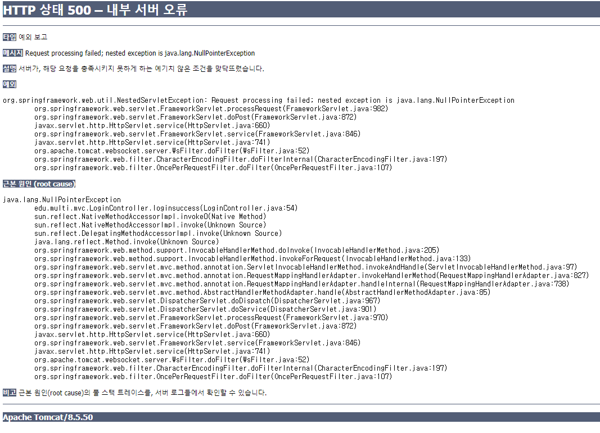
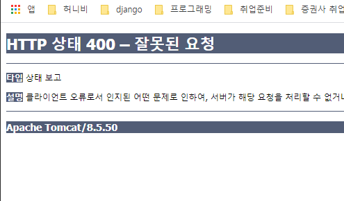
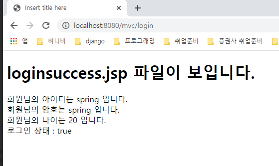

# 2020-02-05

*  java 외의 파일들은 webapp에 저장.


## MVC 관련 어노테이션

* @Controller : Controller 클래스로 만들어줌.
  * Controller 인터페이스 상속 받았으면 public ModelAndView handleRequest(Httpser.... request, ..... response) 무조건 작성해야함.
  * 어노테이션을 사용하면 필요가 없다. 매서드 선언이 자유롭다.
* @RequestMapping : 컨트롤러가 사용할 메서드 위에 작성. (value or name = "/url표시",method=RequestMethod.POST or GET) (클래스 위에도 사용가능.)
* @RequestParam(value="" , required= true or false, defaultValue="") : 메소드 매개변수에 parameter값 지정.
* @ModelAttribute("") : 메소드 입력 객체에 parameter값 지정.  (또는 메소드)
* @RestController


* 스프링 프로젝트는 jsp를 바로 불러올수 없다.

## Spring 로그인 처리.

* LoginController

  ```java
  package edu.multi.mvc;
  
  import javax.servlet.http.HttpServletRequest;
  
  import org.springframework.stereotype.Controller;
  import org.springframework.web.bind.annotation.RequestMapping;
  import org.springframework.web.bind.annotation.RequestMethod;
  import org.springframework.web.servlet.ModelAndView;
  
  @Controller
  public class LoginController {
  	@RequestMapping(name = "/login", method = RequestMethod.GET)
  	public String loginform() { // 1. 매핑 메소드 리턴타입이 String일때 : 자동으로 View의 이름이 됨. 모델없이 뷰만 필요할때 사용함.
  		// 로그인폼 출력=html태그=jsp
  		// model, view 가 필요하나 여기선 model이 필요없음. view만 만들면됨.
  
  		return "loginform";
  	}
  
  	//<form action="" method=POST>
  	// 폼 입력 내용 전달받아서 처리.
  	@RequestMapping(name = "/login", method = RequestMethod.POST)
  	public ModelAndView loginsuccess(HttpServletRequest request) {
  		//id pw 입력 전달 상태
  		String id = request.getParameter("id");
  		String pw = request.getParameter("pw");
  		
  		//id, pw - db member테이블 에서 조사.
  		
  		ModelAndView mv = new ModelAndView();
  		mv.addObject("loginresult", true);
  		mv.setViewName("loginsuccess");
  		return mv;
  	}
  }
  ```

  * login.jsp

  ```jsp
  <%@ page language="java" contentType="text/html; charset=UTF-8"
  	pageEncoding="UTF-8"%>
  <!DOCTYPE html>
  <html>
  <head>
  <meta charset="UTF-8">
  <title>Insert title here</title>
  </head>
  <body>
  	<h1>loginform.jsp 파일이 보입니다.</h1>
  	<form action="http://localhost:8080/mvc/login" method="post">
  		아이디 <input type="text" name="id"><br>
  		암호 <input type="password" name="pw"><br>
  		<input type="submit" value="로그인">
  	</form>
  </body>
  </html>
  ```

  * loginsuccess.jsp

  ```jsp
  <%@ page language="java" contentType="text/html; charset=UTF-8"
  	pageEncoding="UTF-8"%>
  <!DOCTYPE html>
  <html>
  <head>
  <meta charset="UTF-8">
  <title>Insert title here</title>
  </head>
  <body>
  	<h1>loginsuccess.jsp 파일이 보입니다.</h1>
  	${loginresult}
  </body>
  </html>
  ```

  * post 한글깨질때
    * web.xml에 아래 코드 추가.

  ```xml
  	<filter>
  		<filter-name>f</filter-name>
  		<filter-class>org.springframework.web.filter.CharacterEncodingFilter</filter-class>
  		<init-param>
  			<param-name>encoding</param-name>
  			<param-value>UTF-8</param-value>
  		</init-param>
  	</filter>
  		
  	<filter-mapping>
  		<filter-name>f</sfilter-name>
  		<url-pattern>/*</url-pattern> <!-- 현재 컨텍스트의 모든 요청들 -->
  	</filter-mapping>
  ```

  

* 웹 프로젝트 예시.
  * 게시판관리
    * 게시물조회 / 저장 / 수정 / 삭제 + @
  * 회원관리
    * 회원조회 / 등록 / 수정 / 삭제 + @
  * 상품관리 
    * 삭품등록 / 수정 / 삭제 / 조회 + @
  * 기본적으로 ~~관리 : 조회 / 저장 / 수정 / 삭제 기능은 기본.
  * crud : create(저장) / read(조회) / update / delete


* board 테이블 - BoardVO, BoardDAO, BoardController(4개이상 RequestMappng  메소드-crud) + (BoardService)
* member 테이블
* product 테이블

> 여러 컨트롤러의 RequestMapping url이 중복되지 않게 되어야함.
>
> Spring Elements / Beans 안에 servlet-context.xml 오른쪽 클릭후 showRequestMapping showRequestMapping을 클릭하면 아래와 같은 창으로 확인이 가능하다.


## 컨트롤러 메소드 리턴타입.

1.  ModelAndView : Model + View(명시 or url자동)
2. String : View 이름 (명시)
3. void : View(url 값으로 자동.)
4. Map : Model + View(url 값으로 자동.)

> View이름을 지정하지 않으면 자동으로 RequestMapping의 url로 자동결정.

## 컨트롤러 메소드 매개변수 타입.

1. HttpServletRequest : parameter를 읽을때 Request변수 필요함. Servlet요청

```java
@RequestMapping(name = "/login", method = RequestMethod.POST)
	public ModelAndView loginsuccess(HttpServletRequest request) {	
		// id pw 입력 전달 상태
		String id = request.getParameter("id");
		String pw = request.getParameter("pw");

		// id, pw - db member테이블 에서 조사.
		// id spring 이고 pw spring 일 때만 로그인상태 : true
		ModelAndView mv = new ModelAndView();

		if (id.equalsIgnoreCase("spring") && pw.equalsIgnoreCase("spring")) {
			mv.addObject("loginresult", true);
		} else {
			mv.addObject("loginresult", false);
		}

		mv.setViewName("loginsuccess");
		return mv;
	}
```


2. String, int, double, boolean타입 + 변수명 : jsp 에서 form input name="id" : 클라이언트가 요청파라미터 이름 id를 전송한다. 그 때 요청파라미터 이름과 컨트롤러 메소드 매개변수 이름이 동일하면 자동으로 저장함.

```java
	@RequestMapping(name = "/login", method = RequestMethod.POST)
	public ModelAndView loginsuccess(String id, String pw) {
		ModelAndView mv = new ModelAndView();

		if (id.equalsIgnoreCase("spring") && pw.equalsIgnoreCase("spring")) {
			mv.addObject("loginresult", true);
		} else {
			mv.addObject("loginresult", false);
		}

		mv.setViewName("loginsuccess");
		return mv;
	}
```

* 파라미터 이름이 다르면..



> 500오류 : NullPointerException

* @RequestParam("~~") : 변수에 파라미터를 지정해주는 어노테이션.
  * @RequestParam(value="id",required = true, defaultValue="spring") String id2
    * value : parameter값 지정해주는것
    * required : 필수입력(true)
    * defaultValue : 입력 안되었을때 

```java
@RequestMapping(name = "/login", method = RequestMethod.POST)
	public ModelAndView loginsuccess(@RequestParam("id")String id2, String pw) { //id2 변수 요청파라미터 id 자동저장.
	
		ModelAndView mv = new ModelAndView();

		if (id2.equalsIgnoreCase("spring") && pw.equalsIgnoreCase("spring")) {
			mv.addObject("loginresult", true);
		} else {
			mv.addObject("loginresult", false);
		}

		mv.setViewName("loginsuccess");
		return mv;
	}
```

> 모든 받아오는 값은 String.. 

* 만약 타입이 맞지 않는다면.
  * 나이를 int로 매개변수로 준후 jsp에서 "20세" 를 입력한후 결과.



> 400 오류 : 데이터 타입이 잘못된것. 
>
> Spring 에선 jsp 에서 input type="text" 여도 숫자만 입력되면 int로 바꿔줄수 있음.

* @RequestParam 어노테이션

```java
@RequestMapping(name = "/login", method = RequestMethod.POST)
	public ModelAndView loginsuccess(@RequestParam(value="id",required = true, defaultValue="spring")
	String id2, String pw, int age) // 매개변수의 int로 사용하였을때.
```

3. vo로 받기. (매개변수가 java 객체일때.)

* 요청파라미터이름과 컨트롤러 메소드 매개변수 자바객체일때.
* 객체 내부 멤버변수들 이름 동일 자동 저장. get메서드 사용.
* 컨트롤러 메소드 매게변수 객체일 때 자동 모델형태로 사용됨.
* 모델 이름("",???) 모델 이름은 자동으로 결정됨. : LoginVO -> loginVO로 생성. (맨 앞글자 대문자를 소문자로 바꾼.)
*  mv.addObject("loginVO", vo);와 같은 의미.

```java
@RequestMapping(name = "/login", method = RequestMethod.POST)
	public ModelAndView loginsuccess(LoginVO vo) { 
		
		//요청파라미터이름과 컨트롤러 메소드 매개변수 자바객체일때.
		//객체 내부 멤버변수들 이름 동일 자동 저장.
		//get메서드 사용.
		ModelAndView mv = new ModelAndView();
		
		if (vo.getId().equalsIgnoreCase("spring") && vo.getPw().equalsIgnoreCase("spring")) {
			mv.addObject("loginresult", true);
```

* loginsuccess.jsp

```jsp
<%@ page language="java" contentType="text/html; charset=UTF-8"
	pageEncoding="UTF-8"%>
<!DOCTYPE html>
<html>
<head>
<meta charset="UTF-8">
<title>Insert title here</title>
</head>
<body>
 <!-- LoginController - ...... - loginsuccess.jsp -->
	<h1>loginsuccess.jsp 파일이 보입니다.</h1>
	회원님의 아이디는 ${loginVO.id} 입니다. <br>
	회원님의 암호는 ${loginVO.pw} 입니다. <br>
	회원님의 나이는 ${loginVO.age} 입니다. <br>

	로그인 상태 : ${loginresult} <br>
	

</body>
</html>
```

* 결과



* @ModelAttribute 어노테이션
  * 객체에 이름을 부여하고 싶을때.
  *  @ModelAttribute("login") 이렇게 작성하면, 모델의 이름을 login(" " 사이값) 으로 지정함. 

## Tag 경로.

### html Tag

	* action ="/project/list" /앞에 포트번호 생략된것.

### Spring Annotation

* / 앞에 context가 생략되어있는것.