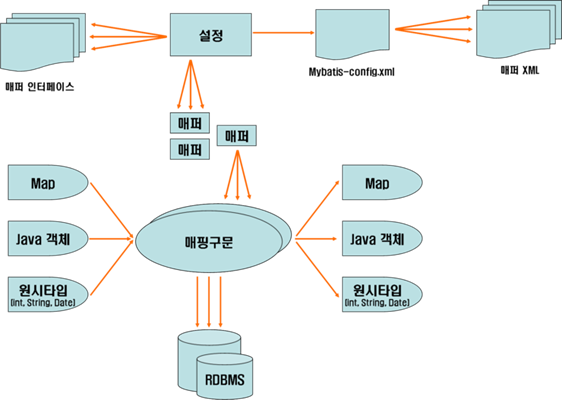
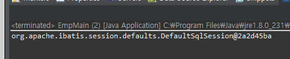
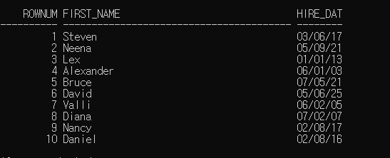
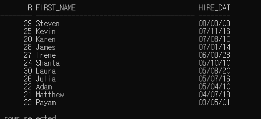

# 2020-02-07

## Mybatis

* DB 프레임 워크.

* spring dao ==> jdbc ==> mybatis : bean 없음.
* 나중에 mybatis + spring mvc 연동.
* spring (main) + mybatis


모든 db는 jdbc Driver, jdbc url, account, passwor 가 필요함.(필수정보)

ex) "jdbc:oracle:thin:@ip:port:xe" ->mybatis 에서는 이런한 정보 또한 자바 소스에서 분리될 예정.(xml파일에 작성할 예정.)

설정파일 : xml

sql을 java source와 분리하여 별도의 xml파일에 sql만 따로 정리해야함.

sql 의 tag id 를 기억해야한다.

```xml
<select id="a">
	select * from board
</select>
```

> 결합도 낮추는 법. java source와 sql을 분리시켜 관리.

jdbc 문장.

try{

1. Class.forName("...")

2. Connection c = DriverManager.getConnection(jdbc url, account password)

3. sql - 실행 결과

4. c.close()

 }catch(Exception e){

}

* jdbc 단점

  1. 코드 반복이 많음. : db-config.xml로 따로 정의.
  2. java 언어 내부에 sql 언어가 포함이 된다. : sql-mapping.xml로 따로 정의.
  3. db연결하기 위한 복잡한 정보 매번 java에 작성해야함. : db-config.xml로 따로 정의.

  

  

* Mybatis 이용을 위해선 최소 2개 xml 파일이 필요함. : db-config.xml, sql-mapping.xml

  * db-config.xml : db종류에 따라 여러개 존재할수 있음.
  * sql-mapping.xml : 테이블 별로 정의하는것이 좋음.


* Mybatis 실행 과정.

1. xml 설정 읽기
2. db연결, 객체 가져오기
3. sql정보 가져와서 실행 - 결과 (BoardVO, Spring, ArrayList 결과 정의) 설정
4. 출력



## 환경설정.

* mybatis.jar 필요함 : porm.xml 에 dependency 테그를 이용해 작성.(mvn Repository 에서 다운)

```xml
<!-- https://mvnrepository.com/artifact/org.mybatis/mybatis -->
		<dependency>
			<groupId>org.mybatis</groupId>
			<artifactId>mybatis</artifactId>
			<version>3.4.6</version>
		</dependency>
```

* ojdbc6.jar 필요함 : oracle에 접속하기 위함.(oracle jdbc driver 파일)
  * 스프링 프로젝트 - properties - java build path - library - add external Jars 로 ojdbc6.jar 추가.


### xml 설정.


mybatis java peckage 아래에 탬플릿 xml 옮겨놓기.

* mybatis-config.xml

```xml
<?xml version="1.0" encoding="UTF-8" ?>
<!DOCTYPE configuration
  PUBLIC "-//mybatis.org//DTD Config 3.0//EN"
  "http://mybatis.org/dtd/mybatis-3-config.dtd">
  
<configuration>
	<typeAliases>
		<typeAlias type="mybatis.EmpVO" alias="emp"/><!-- mapping 파일 안에서 mybatis.EmpVO를 emp로 대체 -->
	</typeAliases>
	<environments default="mydb"> <!-- 기본으로 연결할 계정을 default에 적어주면됨.-->
		<environment id="mydb"><!--id : con 정보 tag 여러개 주면 여러 개정 사용가능.-->
			<transactionManager type="JDBC"/>
			<dataSource type="POOLED"><!--connection pool 이용-->
				<property name="driver" value="oracle.jdbc.driver.OracleDriver"/> 
				<property name="url" value="jdbc:oracle:thin:@localhost:1521:xe"/>
				<property name="username" value="hr"/> <!--db사용할 계정-->
				<property name="password" value="hr"/> <!--계정암호-->
			</dataSource>
		</environment>
	</environments>
	<mappers>
		<mapper resource="mybatis/emp-mapping.xml"/> <!--sql정의한 파일 경로-->
	</mappers>
</configuration>
```

* emp-mapping.xml

```xml
<?xml version="1.0" encoding="UTF-8" ?>
<!DOCTYPE mapper PUBLIC "-//mybatis.org//DTD Mapper 3.0//EN"
  "http://mybatis.org/dtd/mybatis-3-mapper.dtd">
<mapper namespace="emp">
	<!-- crud 기능 : insert select update delete sql -->
	
	<select id="allemp" resultType="emp"> <!-- resultType : 1개 레코드 - EmpVO 자바 객체 타입 매핑. -->
		select * from employees <!--; 있으면 안됨. -->
	</select>
	
	<select id="oneemp" resultType="emp" parameterType="int">  
		select * from employees where employee_id = #{id}
	</select>
	
	<select id="nameemp" resultType="emp" parameterType="String">  
		select * from employees where first_name = #{name}
	</select>
	
	<!-- session.selecList("namelikeemp","P%") -->

	<select id="namelikeemp" resultType="emp" parameterType="String">  
		select * from employees where first_name LIKE #{name}
	</select>


	<select id="idemp" resultType="emp">  <!-- 부등호 사용할때 > 는 상관없으나 <는 테그로 인식함. -->
		<![CDATA[select employee_id,first_name,
		to_char(hire_date,'mm/dd/yyyy hh"시"mi"분"ss"초"') as hire_date from employees where employee_id < 150]]>  <!-- xml태그 안에서 문자열로 인식시켜주는 태그.  -->
	</select>
	
		<!-- insert into employees(특정컬럼) values 전달받는 parameter가 객체일떄는 객체의 변수명으로 #{}안에 작성해야한다.-->
	<insert id="newemp" parameterType="emp">
		insert into employees(employee_id,first_name,last_name,email,job_id,hire_date)
		 values (#{employee_id},#{first_name},#{last_name},#{email},#{job_id},sysdate) 
	</insert>
	
	<update id="updateemp" parameterType="emp">
		update employees set first_name = #{first_name}, email = #{email} where employee_id = #{employee_id}
	</update>
	 
</mapper>
```

* EmpMain.java

```java
package mybatis;

import java.util.List;

import org.apache.ibatis.io.Resources;
import org.apache.ibatis.session.SqlSession;
import org.apache.ibatis.session.SqlSessionFactory;
import org.apache.ibatis.session.SqlSessionFactoryBuilder;


public class EmpMain{

	public static void main(String[] args) throws Exception {
		
		//1.
		SqlSessionFactoryBuilder builder = new SqlSessionFactoryBuilder();
		//2. SqlSessionFactory = 연결 설정파일 읽어라.
		// sql 매핑 파일명.
		SqlSessionFactory factory = 
				builder.build(Resources.getResourceAsReader("mybatis/mybatis-config.xml"));
		//3. SqlSession = jdbc Connection 유사 SqlSession = 연결 생성.
		SqlSession session = factory.openSession();
		System.out.println(session);//null이면 문제있음.
//		<select id="allemp" resultType="mybatis.EmpVO">
		
		//test1 : 여러개 레코드 리턴 조회.
//		List<EmpVO> list = session.selectList("allemp");//session.selectxxx
//		for(EmpVO vo:list) {
//			System.out.println(vo.getEmployee_id()+" : "+vo.getFirst_name());
//		}
		
		//test2 : 한개 레코드 리턴 조회.
//		EmpVO vo = session.selectOne("oneemp",200);//session.selectxxx
//			System.out.println(vo.getEmployee_id()+" : "+vo.getFirst_name());
		
		//test3 : 뒤에 parameter 추가
//		List<EmpVO> list = session.selectList("nameemp","Kelly");//session.selectxxx
//		for(EmpVO data:list) {
//			System.out.println(data.getEmployee_id()+" : "+data.getFirst_name());
//		}
		
		//test4: 부등호 사용한 sql 문장 실행 (cdata 색션 실행)
		List<EmpVO> list = session.selectList("idemp");//session.selectxxx
		for(EmpVO data:list) {
			System.out.println(data.getEmployee_id()+" : "+data.getFirst_name());
		}
	}

}
```

* main 실행시 아래와 같이 결과가 나오면 정상.



* Spring mvc

  * form atcion="/mvc/test" input name="a" --> 요청파라미터 변수

  * @RequestMapping("/test")

    public String test(EmpVO vo){

    EnpVO : 멤버변수 a: setA() 자동으로 매칭.

    }

* mybatis

  * select if="" resultType="test.A"

    select * from employees : 컬럼의 이름과 resultType의 맴버변수가 같으면 자동으로 넣어 저장.

* 날짜 데이터 사용시.
  * 기본 db에서는 yy/mm/dd로 표현
  * java나 mybatis 는 yyyy/mm/dd hh:mm:ss로 표현됨.

```xml
<select id="idemp" resultType="emp"> 
		<![CDATA[select employee_id,first_name,
		to_char(hire_date,'mm/dd/yyyy hh"시"mi"분"ss"초"') as hire_date from employees where employee_id < 150]]> 
	</select>
```

* colum에 포멧이 적용되었다면, alias를 다시주어 sql colum과 vo의 맴버변수를 맞춰야 한다.


* Spring MVC 이용할때. Mybatis code는 결국 DAO에서 사용하게 됨.


## 결합도 낮추기.

* DAO를 이용하여 sql 위의 main문에서 사용하였던 session.selectxxx를 dao의 메서드로 만듬.
* main문에서는 이 메서드의 리턴값을 이용하여 출력한다.

```java
package mybatis;

import java.util.List;

import org.apache.ibatis.session.SqlSession;

public class EmpDAO {
	SqlSession session;
	public void setSession(SqlSession session) {
		this.session = session;
	}
	
	// test1 : 여러개 레코드 리턴 조회.
	public List<EmpVO> getAllEmp() {
		List<EmpVO> list = session.selectList("allemp");// session.selectxxx
		return list;
	}


	// test2 : 한개 레코드 리턴 조회.
	public EmpVO getOneEmp(int id) {
		EmpVO vo = session.selectOne("oneemp", id);// session.selectxxx
		return vo;
	}
//		

	// test3 : 뒤에 parameter 추가
	public List<EmpVO> getNameEmp(String name) {
		List<EmpVO> list = session.selectList("nameemp", name);// session.selectxxx
		return list;
	}
//	

	// test4: 부등호 사용한 sql 문장 실행 (cdata 색션 실행)
	public List<EmpVO> getIdEmp() {
		List<EmpVO> list = session.selectList("idemp");// session.selectxxx
		return list;
	}
	//insert는 리턴할 값이 없다.
	public void insertEmp(EmpVO vo) {
		//<insert id="newemp" parameterType="emp"> insert...</insert>
		session.insert("newemp", vo);
	}
	public int updateEmp(EmpVO vo) {
		int row = session.update("updateemp",vo); //행 갯수가 리턴됨.
		return row;
	}

}
```

* main

```java
package mybatis;

//브라우저 내부 여러 서블릿/jsp 객체 공유 : session(HttpSession타입)
//spring mvc : session 같은 방법으로 사용.

//mybatis : SqlSession타입. 웹과는 다른 session(jdbc Connection과 같음) (session은 기본 연결이라는 의미로 갖는다.)

import java.util.List;

import org.apache.ibatis.io.Resources;
import org.apache.ibatis.session.SqlSession;
import org.apache.ibatis.session.SqlSessionFactory;
import org.apache.ibatis.session.SqlSessionFactoryBuilder;

public class EmpMain {

	public static void main(String[] args) throws Exception {

		// 1.
		SqlSessionFactoryBuilder builder = new SqlSessionFactoryBuilder();
		// 2. SqlSessionFactory = 연결 설정파일 읽어라.
		// sql 매핑 파일명.
		SqlSessionFactory factory = builder.build(Resources.getResourceAsReader("mybatis/mybatis-config.xml"));
		// 3. SqlSession = jdbc Connection 유사 SqlSession = 연결 생성.
		SqlSession session = factory.openSession(true);
		// mybatis는 자동으로 트랜잭션 처리 안함.(commit 안해줌.)
		System.out.println(session.getConnection().getAutoCommit());// null이면 문제있음.
/////////////////여기까지는 메인 역할.
		EmpDAO dao = new EmpDAO();
		dao.setSession(session);

		// test1
//		List<EmpVO> list = dao.getAllEmp();
//		for (EmpVO vo : list) {
//			System.out.println(vo.getEmployee_id() + " : " + vo.getFirst_name());
//		}
//		// test2
//		EmpVO vo = dao.getOneEmp(200);
//		System.out.println(vo.getEmployee_id()+" : "+vo.getFirst_name());
//		// test3
//		List<EmpVO> list = dao.getNameEmp("Steven");
//		for(EmpVO data:list) {
//			System.out.println(data.getEmployee_id() + " : " + data.getFirst_name());
//		}
		//test4
//		List<EmpVO> list = dao.getIdEmp();
//		for (EmpVO data : list) {
//			System.out.println(data.getEmployee_id() + " : " + data.getFirst_name() + "---" + data.getHire_date());
//		}
		//test5 : 새로운 사원 등록. : insert sql 문장 수행.
		// 1000, 홍, gil@multi.com, sysdate, 'IT_PROG' 
		// insert into employees(employee_id,last_name,email,hire_date,job_id) values(1000,'홍','email',sysdate,'IT_PROG') 
		EmpVO vo = new EmpVO();
		vo.setEmployee_id(1000);
		vo.setFirst_name("길동");
		vo.setLast_name("홍");
		vo.setEmail("gil@multi.com");
		vo.setJob_id("IT_PROG");//SQL 키워드는 대소문자구분X(값은 대소문자 구분.)
		
		//DML구문 insert/delete/update/
		//dao.insertEmp(vo);//insert문 수행
		System.out.println("신규사원등록");
		
	}

}
```


## 트랜잭션.

* DDL : Data Definition Language(데이터 정의언어)
  * CEREATE / ALTER / DROP
  * (자동반영)
* DML :  Data Manipulate Language(데이터 조작언어)
  * 테이블 데이터 저장 / 수정 / 삭제
  * INSERT UPDATE DELETE
  * (자동 반영X) : commit 명령이 필요함. 복구는 rollback
* DCL : 
  *  
* TCL : 
  * 

``` java
// 기본적으로 mybatis는 트랜잭션 처리 안함. Autocommit x
SqlSession session = factory.openSession(true); //이렇게 선언하면 트랜잭션 처리함.
SqlSession session = factory.openSession(); // 매개변수 없으면 commit처리 x. commit 필요함.
session.commit(); // 자동commit 아닐때 수행.
```

## SQL page당 10명씩 출력.

```sql
select first_name, hire_date
from employees;
where employee_id >= 100 and employee_id <=109 이건 잘못된 표현
rownum 이용.

select rownum, first_name, hire_date
from employees where rownum >=1 and rownum <=10;
```



rownum 함수 제한점. > , >= 연산을 못한다. (단 1제외) 

* 방법. 여러단계로 나눠서 조회.(서브쿼리 이용.)

```sql
select r,first_name,hire_date from (select rownum r, first_name,hire_date from employees) where r>=11 and r<=20;
```


> rownum 내장함수는 subQuery를 이용하여 사용.

* SQL page당 10명씩 출력. 입사일이 빠른사원 부터.

```sql
select r,first_name,hire_date from (select rownum r, first_name,hire_date from employees) where r>=20 and r<=30 order by hire_date desc;
```

이렇게 출력하면...




이유 : 실행 순서가 1. from 2.where 3.select 4.order by 순으로 실행되기 떄문이다.

```sql
select r,first_name,hire_date from (select rownum r, first_name,hire_date from (select * from employees order by hire_date desc)) where r>=1 and r<=10;
```

from 절 안에 서브쿼리를 이용하여 3단계로 진행.


1. 날짜별로 먼저 정렬
2. 그후 rownum을 부여
3. rownum 의 범위로 select.