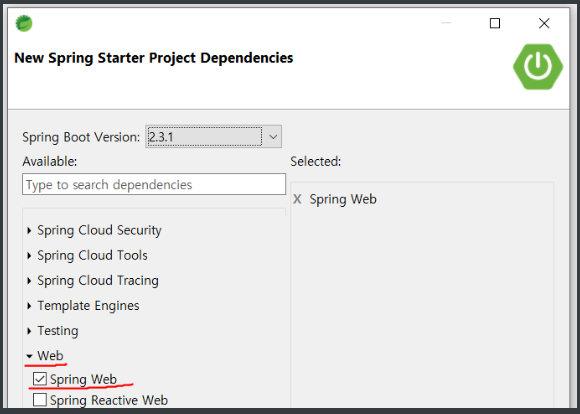
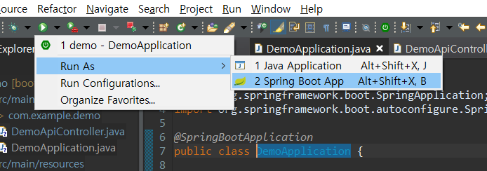
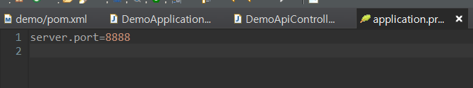
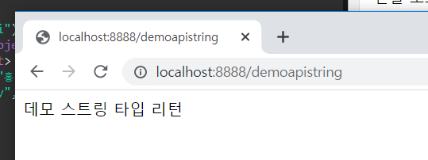

# Spring Boot Day 01

## STS 에서 Boot 설정하기

1. STS에서 프로젝트 생성하기.

   * File - New - Other - Spring Boot - Spring Starter Project 로 프로젝트 생성.

     

     

     

2. Demo Controller 사용해보기.

   * com.example.demo 패키키지 안에 DemoApiController class를 새로 작성해 준다.

     ```java
     package com.example.demo;
     
     import java.util.HashMap;
     import java.util.Map;
     
     import org.springframework.web.bind.annotation.GetMapping;
     import org.springframework.web.bind.annotation.RestController;
     
     @RestController
     public class DemoApiController {
     	@GetMapping("/demoapistring")
     	public String demoapistring() {
     		return "데모 스트링 타입 리턴";
     	}
     	
     	@GetMapping("/demoapi")
     	public Map<String, Object> demoapi(){
     		Map<String,Object> map = new HashMap<>();
     		map.put("name", "홍길동");
     		map.put("birthday",15920505);
     		return map;
     	}
     }
     
     ```

3. 실행

   * DemoApplication.java 파일에서 아래 버튼으로 실행

     

   * 콘솔에 아래와 같이 뜨면서 실행

     

   * 위가 귀찮으면 window > show view > Other > Other > Boot Dashboard를 선택해 주면 바로 실행이 가능

     

   * 

     

   * 포트가 겹쳤다.. 포트를 바꾸자.

4. 포트번호 바꾸기

   * 파일중 ` src/main/resources/application.properties` 에서 변경이 가능하다.

     

5. 서버 접속하기

   * 크롬 또는 웹 브라우저로 해당 url로 접속해면 화면이 뜸!

     

     

   * 해당 url 은 Controller 에서 매핑한 값으로 지정됨!


[출처 -  https://suyou.tistory.com/159 [수유산장]](https://suyou.tistory.com/159)