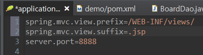

# Spring Boot Day 02


## Spring boot 특징

* 스프링 부트는 2014년 개발된 스프링의 하위 프로젝트 중 하나이다. 스프링 프레임워크를 기반으로 개발을 할 때 기존 일반 스프링 환경에 비해서 개발 환경을 쉽게 구축 할 수 있다.

1. 단독 실행(stand-alone)이 가능한 수준의 스프링 어플리케이션 개발 가능
2. 내장된(Embed) 톰캣, jetty, UnderTow 등의 서버를 이용해서 별도의 서버설치 없이 실행이 가능.
3. 자동화(Automatically)된 설정방식을 제공. 코드 생산성이 뛰어나다.
4. 기존 스프링 환경에서 설정했던 XML 없이 단순 자바수준의 설정방식을 제공.
5. mavne, gradle의 환경을 제공해준다.
6. NoSQL, AWS 등의 환경도 자동으로 제공된다.

* Spring Boot는 위에 설명처럼 xml 설정이 필요없이 자바코드로 설정이 가능하다. 


[출처-꿈구는 개발자 블로그](https://m.blog.naver.com/PostView.nhn?blogId=scw0531&logNo=221066404723&proxyReferer=https:%2F%2Fwww.google.com%2F)

> 스프링 부트환경은 개발자에게 편리함을 주는 대신 기본적인 내부 원리는 스프링 프레임워크를 따르기에 스프링 프레임워크에 대한 기초지식이 튼튼해야함! 
>
> 스프링 부트 환경을 이용해서 개발을 하기 전 반드시 스프링 프레임워크를 먼저 선학습 한후 사용해야 문제가 없다.
>
> 빠르게 프로토타입 환경을 구축할 수 있는 대신 내부원리는 확실히 이해 하고 있어야 한다.


### porm.xml

* 각종 라이브러리를 dependency를 통해 설정 해 줄수 있다.

* 부트는 기본적으로 jsp 페이지를 로딩하는 기능을 제공하지 않는다. 따라서 jsp 를 사용하기 위해서는 아래와 같이 추가해 주어야 한다.

  ```xml
  		<dependency>
  			<groupId>javax.servlet</groupId>
  			<artifactId>jstl</artifactId>
  		</dependency>
  		
  		<dependency>
  			<groupId>org.apache.tomcat.embed</groupId>
  			<artifactId>tomcat-embed-jasper</artifactId>
  		</dependency>
  		
  		<dependency>
  			<groupId>org.codehaus.jackson</groupId>
  			<artifactId>jackson-mapper-asl</artifactId>
  			<version>1.4.2</version>
  		</dependency>
  ```

### application.properties 설정

* 해당 설정에서 jsp 페이지의 위치를 정의해 주어야 한다.

* 해당 설정은 추후 데이터베이스 설정이라던지 Security 설정 등 중요한 정보들이 작성되는 중요한 파일이다.

* 저번 정리에서 해당 파일에서 tomcat의 포트번호 또한 변경이 가능하다!

  

* 근데 뭔가 문제가있음.. 

  

* 당분간 jsp를 쓰지 않고 Thymeleaf 를 이용해서 부트를 이용해보자...


---

### `AOP` ( Aspect Oriented Programming )

* DI 가 결합도와 관련된 기능이라면 `AOP`는 응집도와 관련된 기능.

* 부가적인 코드들 모두 엔터프라이즈 애플리케이션에서 비즈니스 로직만큼이나 중요한 기능들이다. 

  새로운 메소드를 구현하는 가장 일반적인 방법은 기존에 잘 만들어진 메소드를 복사해서 구현하는 것이다.

  그러나 이는 비즈니스 메소드에 부가적인 코드들이 반복되어 등장하므로 유코드 분석과 유지보수가 어려워 진다.

#### 관심분리

* `AOP`를 이해하는 데에 가장 중요한 핵심개념

* 횡단 관심 ( Crosscutting Concerns )

  * 메소드마다 공통으로 등장하는 로깅이나 예외, 트랜잭션 처리 같은 코드

* 핵심 관심 ( Core Concerns )

  * 사용자의 요청에 따라 실제로 수행되는 핵심 비즈니스 로직.

  ![Spring AOP의 이해 - [종료]구루비 Dev 스터디 - 개발자, DBA가 함께 ...](QaL8FiiZVTiXdcL2QZISXoYnteYhIKoUtAfBqz59K2M_LliJ9Pe1Jwa0LNv1akPraW8bttka2xilrtm0BUBIy0piHRr6fdY0wnHbhMhjanCjuRj2qGAWG47FKzdzQqkk2pdSXjPyRmo)

* 기존의 OOP 언어에서는 횡단 관심에 해당하는 공통 코드를 완벽하게 독립적인 모듈로 분리해내기가 어렵다.

#### 기존 OOP 프로그램에서의 관심분리 문제

* 공통으로 사용될 `LogAdvice`

  ```java
  package com.example.demo;
  
  public class LogAdvice {
  	public void printLog(){
  		System.out.println("[공통로그] 비즈니스 로직 수행 전 동작");
  	}
  }
  
  ```

* 이 컴포넌트를 Service에서 사용할 시 아래와 같이 사용하게 됨..

  ```java
  
  ```

  

