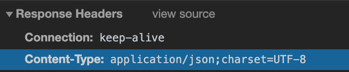

# Spring Controller의 리턴타입

## 1. String

* Controller 에서 return 값으로 String을 주었을 경우 해당 스트링값을 jsp 파일의 경로와 파일이름으로 나타내어 해당 jsp를 호출한다.
* 특별한 키워드 사용 가능
  * "redirect" 
  * "forward"

## 2. void

* void의 경우 호출하는 URL과 동일한 이름의 jsp를 화면으로 반환한다.

## 3. VO,DTO Type

* 주로 JSON 타입의 데이터를 만들어서 반환하는 용도로 사용한다.

* JSON 반환을 위해 Jackson dataBind lib를 maven에 추가해야 한다. (안그러면 500 에러발생)

  ```xml
  <!--in pom.xml-->
  		<!-- jackson lib -->
  		<!-- https://mvnrepository.com/artifact/com.fasterxml.jackson.core/jackson-databind -->
  		<dependency>
  		    <groupId>com.fasterxml.jackson.core</groupId>
  		    <artifactId>jackson-databind</artifactId>
  		    <version>2.9.4</version>
  		</dependency>
  ```

* 반환된 page 정보 - json 으로 처리됨!

  

## 4. ResponseEntity Type

* reponse 할 때 Http 해더 정보와 내용을 가공하는 용도로 사용한다.
* 스프링 MVC의 사상은 HttpServletRequest 나 HttpServletReponse를 직접 핸들링하지 않아도 이런 작업이 가능하도록 작성됨.

## 5. Model, ModelAndView

* Model로 데이터를 반환하거나 화면까지 같이 지정하는 경우에 사용한다
* 최근에는 많이 사용하지 않는다.

## 6. HttpHeaders

* 응답에 내용 없이 Http 헤더 메시지만 저달하는 용도로 사용한다.

