# CD & CI

* CI( Continuous Integration ): 코드 버전 관리를 하는 VCS 시스템(git,SVN등)에 push가 되면 자동으로 테스트와 빌드가 수행되어 안정적인 배포 파일을 만드는 과정.
* CD ( Continuous Deployment ): 빌드 결과를 자동으로 운영 서버에 무중단 배포까지 진행되는 과정.

## CI 규칙

1. 모든 소스 코드가 살아 있고(현재 실행되고 ) 누구든 현재의 소스에 접근할 수 있는 단일 지점을 유지할 것.
2. 빌드 프로세스를 자동화해서 누구든 소스로부터 시스템을 빌드하는 단일 명령어를 사용할 수 있게 할 것.
3. 테스팅을 자동화해서 단일 명령어로 언제든지 시스템에 대한 건전한 테스트 수트를 실행할 수 있게 할 것.
4. 누구나 현재 실행 파일을 얻으면 지금까지 가장 완전한 실행 파일을 얻었다는 확신을 하게 할 것.


## Travis CI

* 깃허브에서 제공하는 무료 CI서비스.

* 젠킨스와 같은 CI도구도 있지만, 젠킨스는 설치형이기 때문에 이를 위한 EC2인스턴스가 하나 더 필요하다.

* 사이트 - [https://travis-ci.org/](https://travis-ci.org/) 에서 깃허브 로그인을 한다

* 로그인 이후 Setting 에서 사용할 Repository를 설정하여 활성화 시켜준다.

  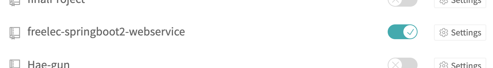

* 이후 프로젝트에서 yml을 이용하여 설정을 진행한다.

  ```yml
  language: java
  jdk:
    - openjdk8
  branches:
    only:
      - master
  # Travis Ci 서버의 home
  cache:
    directories:
      - '$HOME/ .m2/repository'
      - '$HOME/ .gradle'
  
  script: "./gradlew clean build"
  
  # CI 실행 완료 시 메일로 알람
  notifications:
    email:
      recipients:
        - newchk610@gmail.com
  ```

  1. branches
     * Travis CI를 어느 브랜치가 푸시될 때 수행할지 지정한다.
     * 현재 옵션은 오직 master 브랜치에 push될 때만 수행된다.
  2. cache
     * gradle을 통해 의존성을 받게 되면 이를 해당 디렉토리에 캐시하여, 같은 의존성은 다음 배포 때부터 다시 받지 않도록 설정한다.
  3. script
     * master 브렌치에 푸시되었을 때 수행하는 명령어이다.
     * 여기서는 프로젝트 내부에 둔 gradlew을 통해 clean & build 를 수행한다.
  4. notifications
     * Travis CI 실행 완료 시 자동으로 알람이 가도록 설정한다.

> YAML ( *YAML* Ain't Markup Language )
>
> YAML은 XML, C, 파이썬, 펄, RFC2822에서 정의된 e-mail 양식에서 개념을 얻어 만들어진 '사람이 쉽게 읽을 수 있는' 데이터 직렬화 양식이다.
>
> 즉, 간단히 말해 JSON에서 괄호를 제거한 것이다.
>
> YAML의 이념이 "기계에서 파싱하기 쉽게, 사람이 다루기 쉽게" 이다보니 익숙하지 않은 독자라도 읽고 쓰기가 쉽다.

* 작성후 commit을 진행하면 travis CI 설정이 완료되면 해당 이메일로 결과 메일이 나온다.

  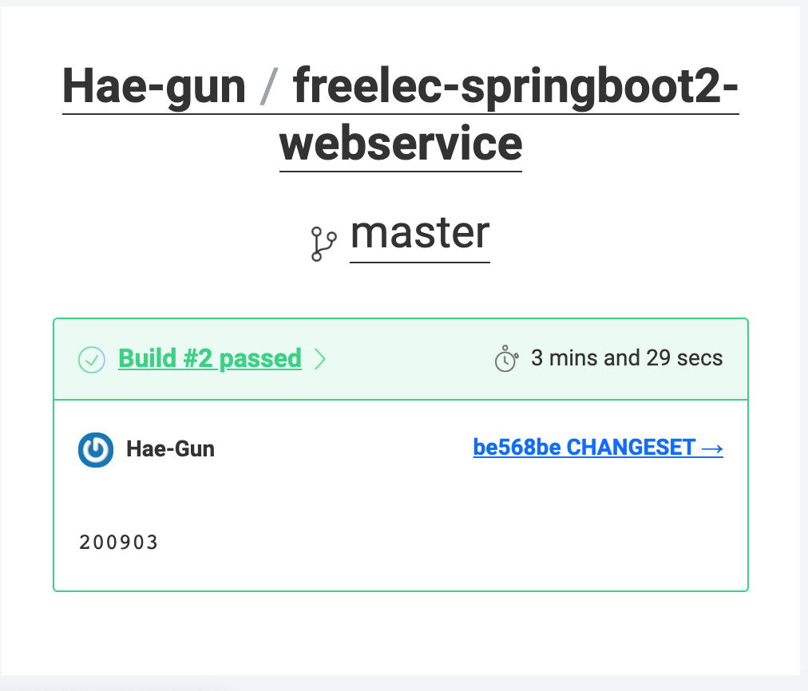


# Travis CI 와 AWS S3 연동하기

* 실제 배포는 AWS CodeDeploy라는 서비스를 사용한다.
* S3 연동이 먼저 필요한 이유는 Jar 파일을 전달하기 위해서!
* CodeDeploy는 저장 기능이 없어, Travis CI가 빌드한 결과물을 받아서 가져갈 수 있도록 보관할 공간이 필요하다.
* 이 공간을 AWS S3를 이용한다.


## AWS Key 발급

* 일반적으로 AWS 서비스에 외부 서비스가 접근할 수 었다.
* 접근 가능한 권한을 가진 Key를 생성해서 사용해야 한다. -> IMA(Identity and Access Management)

* AWS 에서 IAM 탭으로 이동

* 해당 화면에서 사용자 - 사용자 추가 선택

  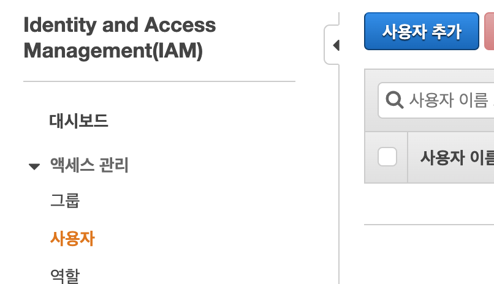

* 사용자 이름과 유형 선택

  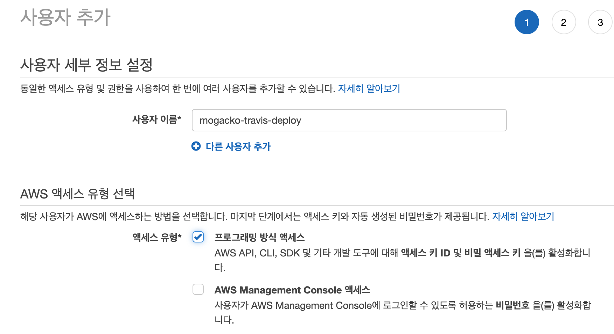

* 권한 설정

  

* 정책 필터로 AmazonS3FuulAccess와 `AWSCodeDeployFullAccess` 를 추가

  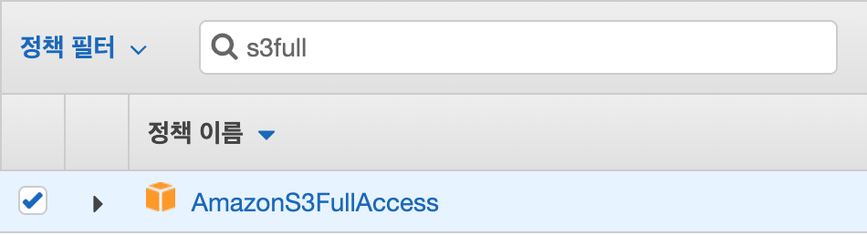

  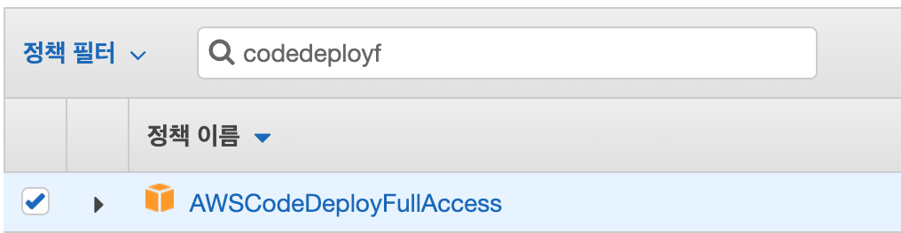

* 태그 Name 값 지정. 본인이 인지 가능한 정도의 이름.

  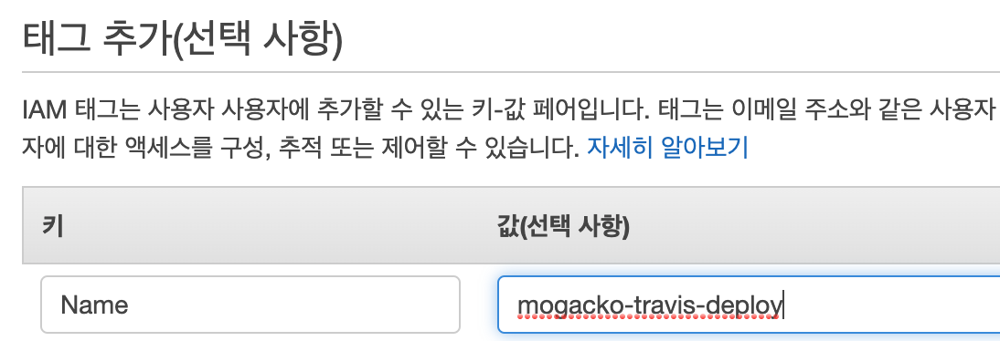

* 키 생성 완료

  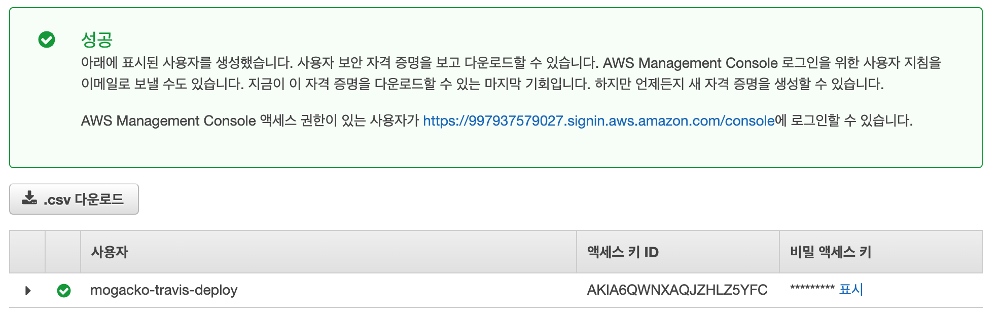


## Travis CI에 키 등록


* TravisCI의 설정 화면으로 이동.

  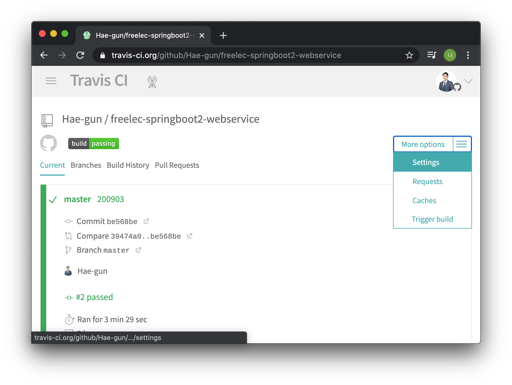

* Environment Variables 항목에 IAM을 통해 받은 키값 입력.

  * AWS_ACCESS_KEY : 엑세스 키 ID
  * AWS_SECRET_KEY : 비밀 엑세스 키

  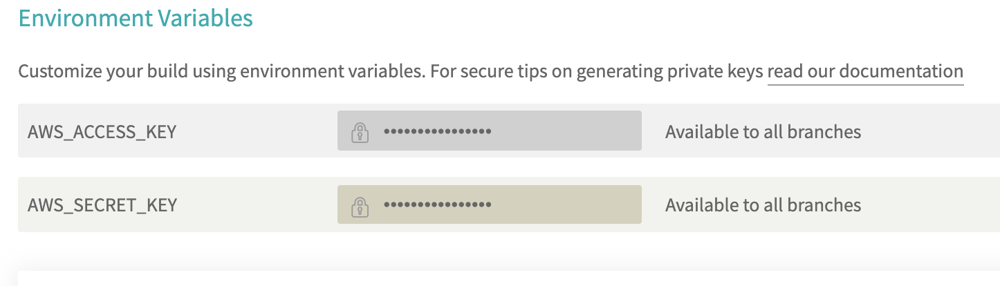

* 위와 같이 등록하면 이제 `.travis.yml` 에서 `$AWS_ACCESS_KEY, $AWS_SECRET_KEY` 란 이름으로 사용이 가능함.


## S3 버킷 생성

* AWS 에서 S3서비스는 일종의 파일 서버임.
* 파일들을 저장하고 접근 권한을 관리, 검색 등을 지원하는 파일 서버의 역할을 한다.
* S3는 보통 게시글을 쓸 때 나오는 첨부파일 등록을 구현할 때 많이 이용한다. - 파일 서버의 역할


* Build 파일을 저장하도록 구성한다.

* AWS 에서 S3 탭으로 이동하여 버킷 만들기 선택.

  

* 이름설정

  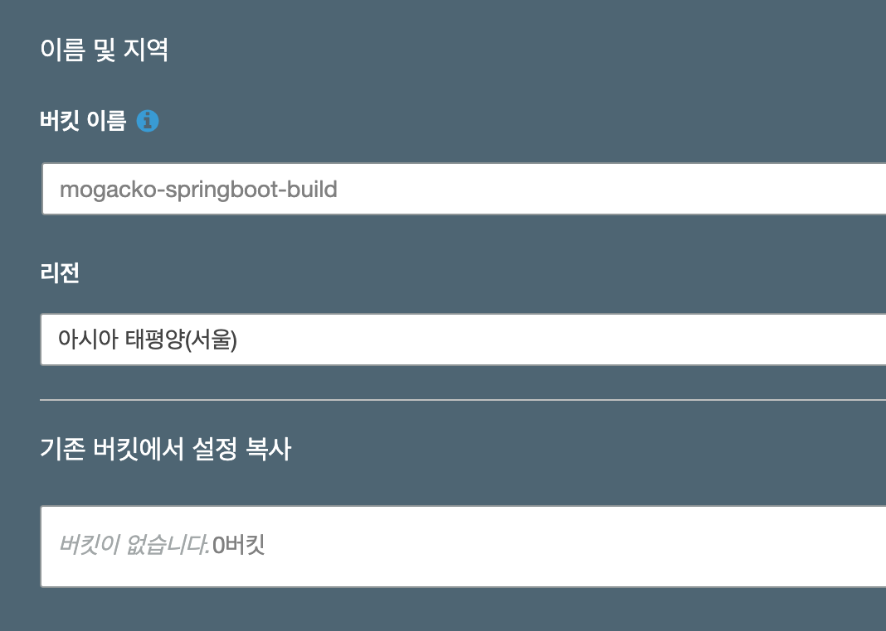

* 다음은 버전관리 설정. 별다른 설정 하지 않음

  

* 다음은 버킷의 보안과 권한 설정.

  * 모든 퍼블릭 엑세스 차단을 선택
  * 차단하지 않으면 실제 서비스 운영시 Jar 파일이 퍼블릭일 경우 누구나 내려받을 수 있어 코드나 설정값, 주요 키값들이 모두 탈취될 수 있다.

  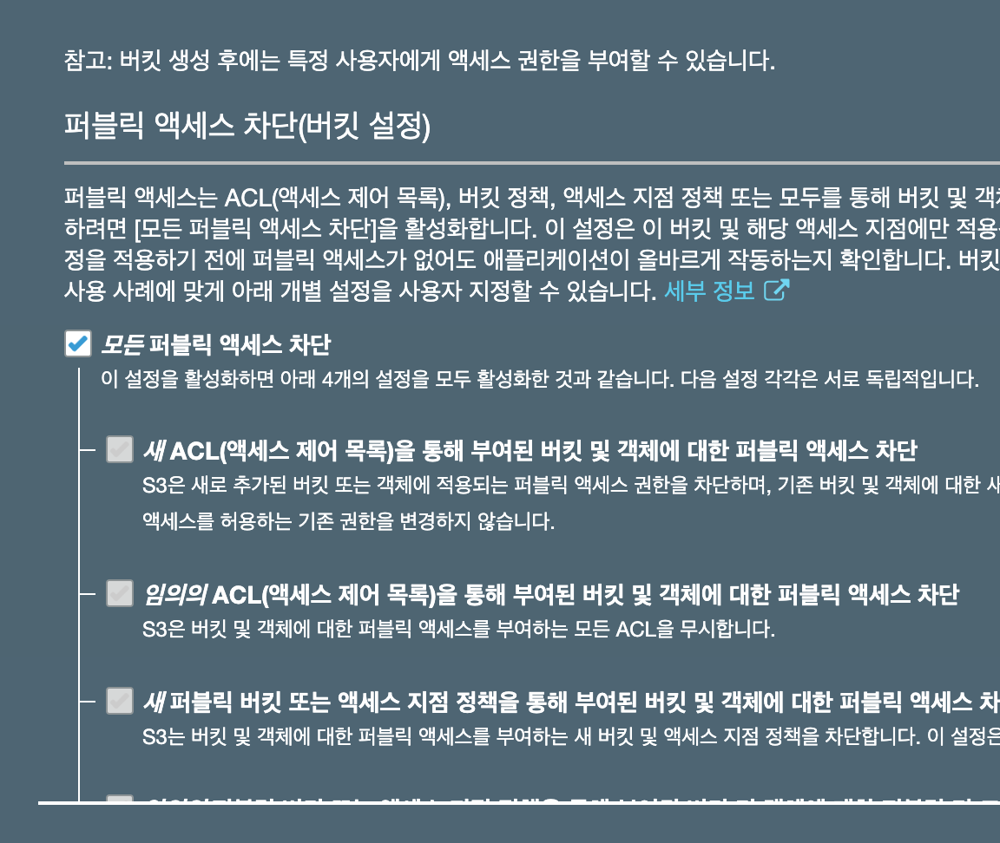

* 버킷 생성완료!

  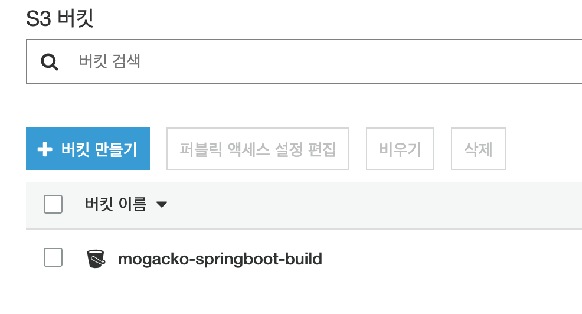


## .travis.yml 추가

* Travis CI에서 빌드하여 만든 Jar 파일을 S3에 올릴 수 있도록 만든 yml파일에 다음 코드를 추가한다.

  ```yaml
  language: java
  jdk:
    - openjdk8
  branches:
    only:
      - master
  # Travis Ci 서버의 home
  cache:
    directories:
      - '$HOME/.m2/repository'
      - '$HOME/.gradle'
      
  script: "./gradlew clean build"
  
  
  before_deploy:
    - zip -r freelec-springboot2-webservice *
    - mkdir -p deploy
    - mv freelec-springboot2-webservice.zip deploy/freelec-springboot2-webservice.zip
  
  deploy:
    - provider: s3
      access_key_id: $AWS_ACCESS_KEY # Travis repo settings 에 설정된 값
      secret_access_key: $AWS_SECRET_KEY # Travis repo settings 에 설정된 값
      bucket: mogacko-springboot-build # S3 버킷
      region: ap-northeast-2
      skip_cleanup: true
      acl: private # zip 파일 접근을 private 으로
      local_dir: deploy # before_deploy 에서 생성한 디렉토리
      wait-until-deployed: true
  
  # CI 실행 완료 시 메일로 알람
  notifications:
    email:
      recipients:
        - newchk610@gmail.com
  ```


