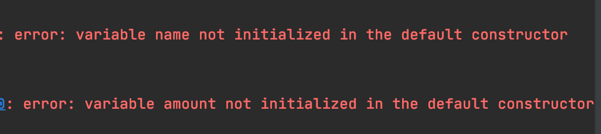
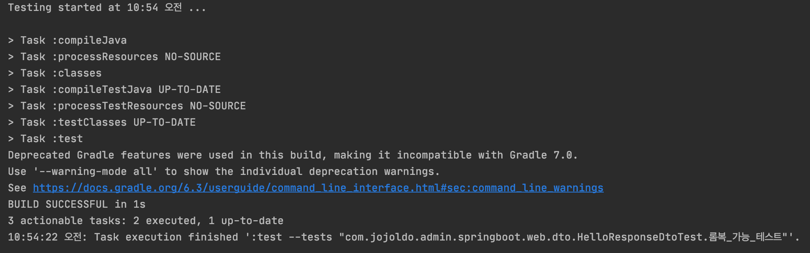

# 스프링 부트와 AWS 로 혼자 구현하는 웹 서비스

## 실습 연습하면서 문제 있던점.

1. Lombok `@RequiredArgsConstructor` 테스트 코드 에러

   * 테스트 코드 실행시 다음 에러가 발생함.

   

   

   * variable name not initialized in the default constructor
   * 해결방법으로  Test 실행을 위한 gradle 이 필요함.

   ```groovy
    //기존
       compile('org.projectlombok:lombok')
    // 추가
    // test를 위한 lombok
       testCompile "org.projectlombok:lombok"
       annotationProcessor('org.projectlombok:lombok')
       testAnnotationProcessor('org.projectlombok:lombok')
   ```

   * gradle 추가 한후 해결!

   

   

