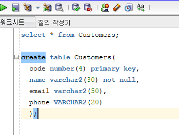
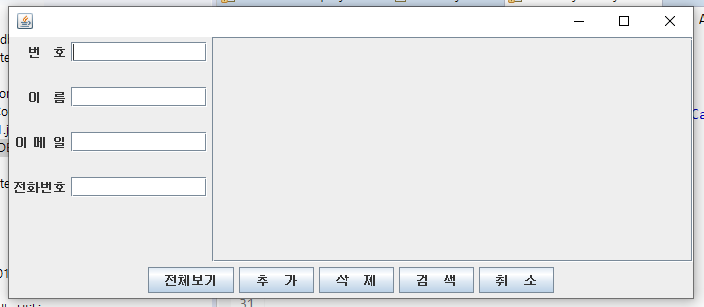
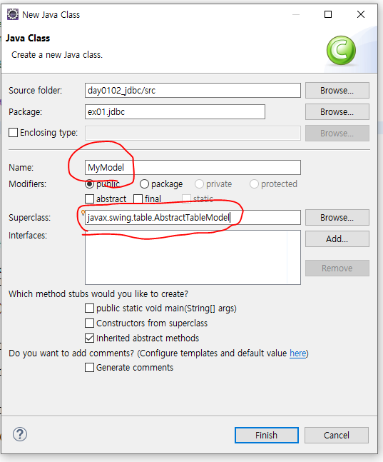

## 20/01/02 정리

---

1. 자바 / 오라클 정리
2. 웹 -HTML5, CSS, JS, jQuery
3. Jsp & Servlet 
4. Spring

---

### 사이트

[DB](http://www.dbguide.net/)

[SQLER](http://www.sqler.com/)

[구루비](http://www.gurubee.net/)


DB계정생성

* sqlplus "/as sysdba" 관리자 접속

system 계정 비번 변겅가능. -> alter user system identified by ***


admin 빨간 테두리로 설정함.


새로운 테이블 생성

---



---

### 이 위치에 jar를 옮겨놓기


* 외부 jar를 옮겨 놓는다.
* 
* _g는 리눅스용

## Java GUI



* JPannel


## DB Setting

```java
Connection conn;
	Statement stmt;
	PreparedStatement pstmtInsert, pstmtDelete;
	PreparedStatement pstmtTotal, pstmtTotalScroll;
	PreparedStatement pstmtSearch, pstmtSearchScroll;
	
	private String sqlInsert="INSERT INTO CUSTOMERS VALUES(?,?,?,?)"; //ctrl + shift + x 대문자 변경.
	private String sqlDelete="DELETE FROM CUSTOMERS WHERE NAME = ?";
	private String sqlTotal="SELECT * FROM CUSTOMERS";
	private String sqlSearch="SELECT * FROM CUSTOMOERS WHERE NAME = ?";
	
	public void dbConnect() {
		try {
			conn = ConnectionHelper.getConnection("oracle"); //alt 왼쪽 방향키 -> ctrl클릭 복귀.
			pstmtInsert = conn.prepareStatement(sqlInsert);
			pstmtDelete = conn.prepareStatement(sqlDelete);
			pstmtTotal = conn.prepareStatement(sqlTotal);
			pstmtSearch = conn.prepareStatement(sqlSearch);
			
			pstmtTotalScroll = conn.prepareCall(sqlTotal,
					ResultSet.TYPE_SCROLL_SENSITIVE, // 커서 이동을 자유롭게하고 업데이트 내용을 반영한다.
					ResultSet.CONCUR_UPDATABLE // resultset object의 변경이 가능.
	//				ResultSet.CONCUR_READ_ONLY // CONCUR_UPDATABLE 의 반대.
					); // 반환값 있음 execute query
			pstmtSearchScroll = conn.prepareCall(sqlSearch,
					ResultSet.TYPE_SCROLL_SENSITIVE,
					ResultSet.CONCUR_UPDATABLE
					);
			
		} catch (Exception e) {
			e.printStackTrace();
		}
	}
```

## MyModel



```java
package ex01.jdbc;

import java.sql.ResultSet;
import java.sql.ResultSetMetaData;

import javax.swing.table.AbstractTableModel;

public class MyModel extends AbstractTableModel {
	Object[][] data;
	String[] columnName;
	int rows, cols; //레코드 행과 열의 개수를 저장하는 변수

	@Override
	public int getColumnCount() { // 필드(열)의 개수
		return columnName.length;
	}

	@Override
	public int getRowCount() { // 레코드 개수 알아내기
		return data.length;
	}
	
	// 레코드 개수 알아내기 - user method
	public void getRowCount(ResultSet rsScroll) {  // 커서이동 메서드.
		try {
			rsScroll.last(); //레코드의 마지막 행으로 커서 이동
			rows = rsScroll.getRow();
			
		} catch (Exception e) {
			e.printStackTrace();
		}
	}

	@Override
	public Object getValueAt(int rowIndex, int columnIndex) {
		return data[rowIndex][columnIndex];
	}
	
	//DB에 저장된 데이터를 채움
	public void setData(ResultSet rs) {
		try {
			
			String title;
			// 데이터에 대한 정보 얻어옴
			ResultSetMetaData rsmd = rs.getMetaData(); 
			cols = rsmd.getColumnCount(); //열의 개수 얻어옴
			columnName = new String[cols];
			
			for (int i = 0; i < cols; i++) {
				columnName[i] = rsmd.getColumnName(i + 1); // 필드 번호는 1부터 시작함.
			}
			
			data = new Object[rows][cols];
			int r =0;
			
			while( rs.next() ) {
				
				for (int i = 0; i < cols; i++) {
					
					if( i != 1 ) data[r][i] = rs.getObject(i + 1); // number type
					else data[r][i] = Util.toKor((String)rs.getObject(i + 1)); // varchar2 type <-- 한글깨짐처리 
				} // for end
				
				r++; // 
				
			} //while end
			
		} catch (Exception e) {
			e.printStackTrace();
		}
	}

}
```


[oracle](https://docs.oracle.com/javase/8/docs/api/)

