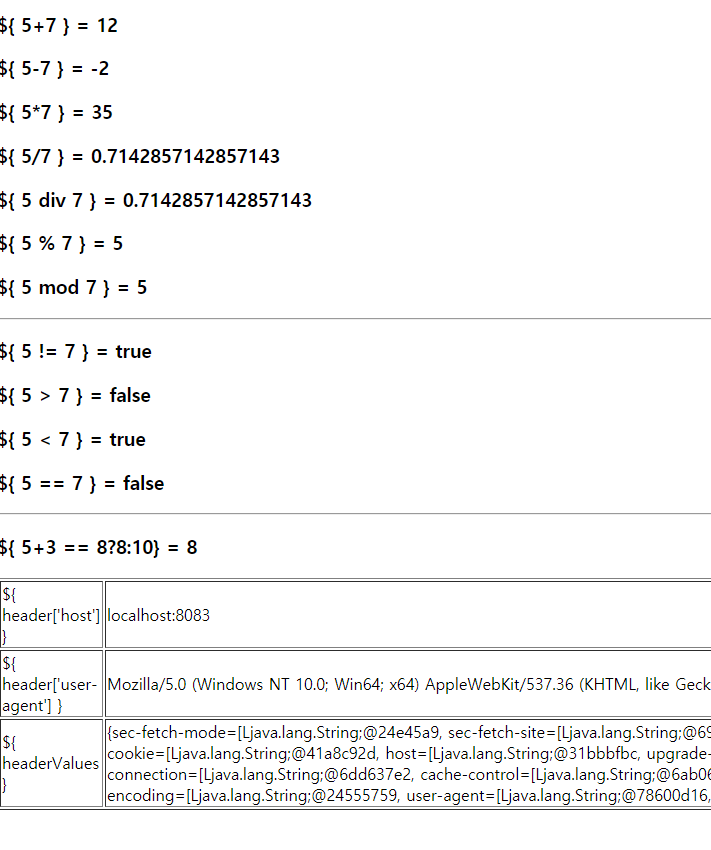
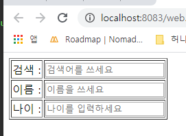
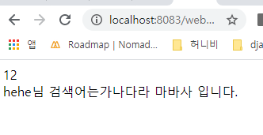
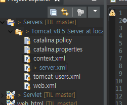

# 2020-01-20

---

> 지난주 정리.
>
> JSP는 HTML에 java. 서버 올렸다 내림. 번거로움. (Model 1)
>
> Servlet은 JAVA에 html. 
>
> 위를 대체할 MVC(model 2)의 등장
>
> 태그는 놔두고 자바는 모두 Servlet으로 처리

---

## Model 2 방식 (MVC)

---

* View page : HTML or JSP

* Controler : View 와 Model을 연결. Servlet으로 작성.

* Model 단: class, DB

> MVVC 도 존재함. Open source가 포함된 것.

---

### JSP Type

스크립트릿 : "<% %>" 함수사용 불가능. 변수선언

함수식 : "<%! %>"

표현식 : "<%= %>" : out.print를 대체하는 형태.

<b>JSTL : 이 3개를 대체할 것</b>

el 이 "<%%>"를 대체함.

---

개념

* Servlet  =  java.

* src(java source)에 Controler와 Model이 들어감.

* servlet 만들 때 <b>반드시 전송방식이 있어야함(Get,Post)</b> -> HTTPServlet 추상클래스 필요!(상속 받아야함.)

* Client, Server 데이터 주고 받을 때.

  *  request, response 내장객체 존재함. 반드시 하나씩 갖고 있어야 함.
  * 주고 받는 data type은 text(String)\
  * 연산이 필요한 data는 <b>형변환</b> 필수.

> UML: 개발자간 대화하기 위한 도형.

* Abstract Class. : Abstract Method존재함. 무조건 Override 해야함.
* Servlet 사용시 등록이 꼭 필요함. 대부분 예전 파일들은 web.xml에 등록됨. 요즘은 어노테이션 방식(버전 2.5 이상에서)으로 등록.
* 둘중 하나를 선택해서 사용해야함. (동시에 사용 불가능.)

* MVC 형태로 갈때는 결국 web.xml을 사용할 수 밖에 없다.

### web.xml 등록방식.

```xml
<servlet>
    <servlet-name></servlet-name>
    <servlet-class></servlet-class>
</servlet>
<servlet-mapping>
    <servlet-name></servlet-name>
    <url-pattern><</url-pattern>
</servlet-mapping>
```

[참고](https://gmlwjd9405.github.io/2018/10/29/web-application-structure.html)

---

  ## JSTL_EL

---

Dynamic web module version : Servlet Verison. 3.1 사용

* Model 2 방식으로 만들때. WEB-INF에 View page를 만듬.
* JSP에서 필수 폴더.
  * lib
  * web.xml (Model 2 방식을 위해 사용.)
  * 아래는 잘 안씀.
  * classes -- bundle -- testBundle.properies, testBundle_ko.properties (default language : us)
  * tld
* <%= 변수,객체,수식,....%>  >>>  ${변수, 객체, 수식,...} :el 표현식
* taglib 필요함.

### JSTL 예제

```jsp
<%@ page language="java" contentType="text/html; charset=UTF-8"
    pageEncoding="UTF-8"%>

<!DOCTYPE html>
<html>
	<head>
		<meta charset="UTF-8">
		<title>ex01_el.jsp EL 연산자 사용 예제</title>
	</head>
	<body>
	<!-- \문자 ===> 해당 문자 표현, \\, \" -->
	
	<h3>\${ 5+7 } = ${5+7}</h3>
	<%-- <h3>\${ 5+7 } = <%=5+7%></h3> --%>
	<h3>\${ 5-7 } = ${5-7}</h3>
	<h3>\${ 5*7 } = ${5*7}</h3>
	<h3>\${ 5/7 } = ${5/7}</h3>
	<h3>\${ 5 div 7 } = ${5 div 7}</h3>
	<h3>\${ 5 % 7 } = ${5 % 7}</h3>
	<h3>\${ 5 mod 7 } = ${5 mod 7}</h3>
	<hr>	
	
	<h3>\${ 5 != 7 } = ${5 != 7}</h3>
	<h3>\${ 5 > 7 } = ${5 > 7}</h3>
	<h3>\${ 5 < 7 } = ${5 < 7}</h3>
	<h3>\${ 5 == 7 } = ${5 == 7}</h3><hr>
	
	<h3>\${ 5+3 == 8?8:10} = ${ 5+3 == 8?8:10}</h3>
	
	<table border="1" width = "100%">
		<tr>
			<td>\${ header['host'] }</td>
			<td>${ header['host'] }</td>
		</tr>
		<tr>
			<td>\${ header['user-agent'] }</td>
			<td>${ header['user-agent'] }</td>
		</tr>
		<tr>
			<td>\${ headerValues }</td>
			<td>${ headerValues }</td>
		</tr>
	</table>
	
</html>
```

* 결과



### EL 사용.

* 입력페이지

```jsp
<%@ page language="java" contentType="text/html; charset=UTF-8"
    pageEncoding="UTF-8"%>

<!DOCTYPE html>
<html>
	<head>
		<meta charset="UTF-8">
		<title>ex02_el.jsp EL Test</title>	
	</head>
	
	<body>
		
		<form action="ex02_result.jsp" method="post">
			<table border="1">
			
				<tr>
					<td>검색 : </td>
					<td><input type="text" name="search" placeholder="검색어를 쓰세요"></td>
				</tr>

				<tr>
					<td>이름 : </td>
					<td><input type="text" name="name" placeholder="이름을 쓰세요"></td>
				</tr>
				
				<tr>
					<td>나이 : </td>
					<td><input type="number" name="age" placeholder="나이를 입력하세요"></td>
				</tr>
				
			</table>
		</form>
		
	</body>
	
</html>
```



* jsp 사용시..

```jsp
<%@ page language="java" contentType="text/html; charset=UTF-8"
    pageEncoding="UTF-8"%>

<!DOCTYPE html>
<html>
	<head>
		<meta charset="UTF-8">
		<title>ex02_result.jsp 결과 받아줄 페이지</title>	
	</head>
	
	<body>
		<%
		
			request.setCharacterEncoding("UTF-8"); /* 한글깨짐 방지 */
			String name = request.getParameter("name");
			String search = request.getParameter("search");
			int age = Integer.parseInt(request.getParameter("age")); /* 받아오는 값은 모두 String 문자열. */
			out.print(age);
		%><br>
		
		<%=name %>님 검색어는<%=search %> 입니다.
		
		

	</body>
	
</html>
```

* 결과



* JSTL 사용

```jsp
<%@ page language="java" contentType="text/html; charset=UTF-8"
    pageEncoding="UTF-8"%>
<%@taglib prefix="c" uri="http://java.sun.com/jstl/core" %> <!-- 별칭등록. -->
<%@taglib prefix="fmt" uri="http://java.sun.com/jstl/fmt" %> 

<!DOCTYPE html>
<html>
	<head>
		<meta charset="UTF-8">
		<title>ex02_result.jsp 결과 받아줄 페이지</title>	
	</head>
	
	<body>
		
		
		
		<h3>이름 : ${ param.name } or ${ param['name'] }</h3> <%-- 표현식(<%= %>)을 대체하는 EL --%> 
		
		<h3>검색어 : ${ param.search }</h3> <%-- 표현식(<%= %>)을 대체하는 EL --%> 
		<h3>나이 : ${ param.age }</h3> <%-- 표현식(<%= %>)을 대체하는 EL --%> 
		

	</body>
	
</html>
```

param 예약어 이용.

1. param.name
2. param.['name']

기타 내장객체.

>  session : 웹의 서버에 저장하는 곳. cf) cookie : 클라이언트(로컬pc)를 저장하는 곳.
>
> ex) 네이버 로그인후 로그인 정보 화면에 표시.

```jsp
<% session.setAttribute("msg", "Session Test"); %>  ("변수명","변수값")
```

* 결과창에서 불러오는 방법.

```jsp
${ sessionScope.msg }
```

* 내부객체.
  * Session : 클라이언트 한명당 생기는 것. (로그인,로그아웃.)
  * Aplication : 하나의 패키지. 방문자수 나타내기 가능.
  * Page : web page.
    * 웹에서 page를 만드는 것. 응용프로그램에서는 모듈

> 내장객체 위치.
>
> C:\Users\student\Desktop\새 폴더\TIL\Web\200106\.metadata\.plugins\org.eclipse.wst.server.core\tmp0\work\Catalina\localhost\web06_jstl_el\org\apache\jsp\el
>
> 사용자마다 다를수 있음.
>
> JSP 를 컴파일 하면 이 위치에 컴파일러로 인해 Servlet(Java code)으로 변환됨.

##  DBCP & Pool & JNDI (커넥션 풀)

자원 연결, 사용, 닫기. : 성능과 연결이 됨.

### 커넥션 풀

* 연결객체 default : 8개. -> 미리 만들고 연결된 상태.
* 접속시 비어있는 연결객체 잡고 접속, 나갈때 반납.
* 자원성능 향상.

#### 제공해주는 회사

* tomcat or commons.apache3

### DBCP 설정.

* 요즘 추세는 tomcat 사용.

* [1.commons.apache](http://commons.apache.org/)

  * [DBCP](http://commons.apache.org/proper/commons-dbcp/download_dbcp.cgi)
  * [Pool](https://commons.apache.org/proper/commons-pool/download_pool.cgi)

* 2.tomcat

  * 설정!

  * 아래 tomcat-dbcp.jar lib가 있어야 사용가능.

  * [tomcat 파일의 lib에 있음.](C:\app\apache-tomcat-8.5.50\lib)

    

  * [JNDI Resources How-To](https://tomcat.apache.org/tomcat-8.5-doc/jndi-resources-howto.html)

    1. web.xml

       ```xml
       <?xml version="1.0" encoding="UTF-8"?>
       <web-app xmlns:xsi="http://www.w3.org/2001/XMLSchema-instance" xmlns="http://xmlns.jcp.org/xml/ns/javaee" xsi:schemaLocation="http://xmlns.jcp.org/xml/ns/javaee http://xmlns.jcp.org/xml/ns/javaee/web-app_3_1.xsd" version="3.1">
         <display-name>web06_jstl_el</display-name>
         
         <!-- jdbc:dbcpTestDB DBCP setting -->
         <resource-ref>
         	<description>jdbc:dbcpTestDB DBCP setting</description><!-- 설명 -->
         	<res-ref-name>jdbc:dbcpTestDB</res-ref-name> <!-- 3곳에 다 맞아야 함. -->
         	<res-type>javax.sql.DataSource</res-type>
         	<res-auth>Container</res-auth> <!-- Container : 자신의 위치 -->
         </resource-ref>
         <!-- 여기까지 작성.-->
         
         <welcome-file-list>
           <welcome-file>index.html</welcome-file>
           <welcome-file>index.htm</welcome-file>
           <welcome-file>index.jsp</welcome-file>
           <welcome-file>default.html</welcome-file>
           <welcome-file>default.htm</welcome-file>
           <welcome-file>default.jsp</welcome-file>
         </welcome-file-list>
       </web-app>
       ```

       

    2. context.xml

       

       * 이곳에서 수정할 때 모든 프로젝트에 영향.. (수정되면 모든 프로젝트에 적용됨.)
       * 하나의 프로젝트에만 적용할때 다른위치에서 수정. 

       

       * META-INF에 저장할 예정.

       ```xml
       <?xml version="1.0" encoding="UTF-8"?>
       <Context reloadable="true"> <!-- reloadable : 자동갱신 -->
       	<WatchedResource>WEB-INF/web.xml</WatchedResource>
       	<Resource 
       			name = "jdbc:dbcpTestDB"
       			auth = "Container"
       			type = "javax.sql.DataSource"
       			username="kingsmile"
       			password="oracle"
       			driverClassName="oracle.jdbc.OracleDriver"
       			url="jdbc:oracle:thin:@localhost:1521:xe"
       			
       			maxActive="20"	<!-- 접속수 default 8-->
       			maxIdle="10"	<!-- 대기시간 -->
       			maxWait="-1"
       	/>
       </Context>
       ```

       

    3. JDBC Data Sources

       * 사용할 source setting.

       ```jsp
       <%@ page language="java" contentType="text/html; charset=UTF-8"
           pageEncoding="UTF-8"%>
       
       <%@page import="javax.sql.DataSource, javax.naming.*, java.sql.*"%>
       
       <%@page import="javax.sql.DataSource"%>
       <%@page import="javax.naming.*"%>
       <%@page import="java.sql.*"%><!-- 유일하게 한줄에 다 써도됨. -->
       
       <!DOCTYPE html>
       <html>
       	<head>
       		<meta charset="UTF-8">
       		<title>dbcpConnection.jsp</title>	
       	</head>
       	<body>
       	<% 
       		try{
       			Context ctx = new InitialContext();
       			Context envCtx = (Context) ctx.lookup("java:comp/env");
       			DataSource ds = (DataSource) envCtx.lookup("jdbc:dbcpTestDB");
       			
       			Connection conn = ds.getConnection();
       			
       			out.println("DBCP Connection success......<br><br>");
       			
       			
       		}catch(Exception e){
       			e.printStackTrace();
       		}
       	%>
       	</body>
       </html>
       ```

       

> 3곳에 이름을 일치 시켜야함. 이름을 맞춰준다.


* 위 셋팅을 맞춘후 보통 name만 바꾸면서 사용한다.

* 용어조사

> Framework : 어플리케이션 개발에서 기본이 되는 틀.(뼈대)\
>
> Spring Framework : IoC와 AOP를 지원하는 경량의 컨테이너 프레임워크.
>
> DI(Dependency Injection) -IoC IoC(Inversion of Contro:제어의역행.-> 객체 간의 느슨한 결합, 낮은 결합도유지. IoC 적용되면 객체 생성을 자바 코드로 처리 하지 않고 컨테이너가 대신 처리함.)
>
> IoC : 
>
> 기존 자바기만 어플리케이션 개발할 때, 객체를 생성하고 객체들 사이의 의존관계를 처리하는 것에 대한 책임은 전적으로 개발자에게 있음. 즉, 개발자가 어떤 객체를 생성하맂 판단하고 객체 간의 의존관계 역시 소스코드로 표현해야 함.
>
> 그러나 IoC는 이런 인련의 작업들을 소스코드로 처리하지 않고 컨테이너로 처리하는 것을 의미함. 따라서 제어의 역행을 이요하면 소스에서 객체 생성과 의존관계에 대한 코드가 사라져 결과적으로 낮은 결합도의 컴포넌트를 구현할 수 있게 됨. (높은 결합도 -> 유지보수 어려움)
>
> 결합도 낮은 어플리케이션 : Overriding을 이용, [묵시적 형변환 사용](http://egloos.zum.com/mediappro/v/5526049)
>
> AOP(Aspect Oriented Programming) 관점지향 프로그래밍.
>
> POJO(Plain Old Java Object) : 평범한 옛날 자바 객체. POJO가 아닌 class 이해하면 빠름.
>
> Servlet-> 대표적인 Not POJO 클래스.
>
> ​	Servlet 클래스 작성규칙.
>
> 	1. javax.servlet, javax.servlet.http패키지를 import해야 한다.
>  	2. public 클래스로 선언되어야 한다.
>  	3. Servlet, GenericServlet, HttpServlet중 하나를 상송해야 한다.
>  	4. 기본 생성자(Default Constructor)가 있어야 한다.
>  	5. 생명주기에 해당하는 메소드를 재정의(Overriding)한다.  이런 조건이 없는 객체  >  POJO
>
> bean