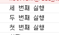

# Nodejs 기초

## javaScript의 함수실행순서.

다음 코드의 실행 순서.

1.

``` js
function first() {
   second()
   console.log('첫 번째 실행')
}
function second() {
   third()
   console.log('두 번째 실행')
}
function third() {
   console.log('세 번째 실행')
}
first()
```

결과



호출 스택의 자료 구조.

stack에 first(), second(), third() 순으로 적재.

LIFO(Last In First Out)(후입선출) 원칙.

2.

```js
function run() {
   console.log(`3초 후 실행함`)
}
console.log(`시작`)
setTimeout(run, 3000)
console.log(`끝`)
```

결과


setTimeout() : 시간을 지연시켜 함수를 실행하는 타이머 함수. 비동기적으로 진행됨.

실제로 동기적인 처리를 할 때는 js는 컨텍스트 상 호출 스택 구조에서 가장 나중에 처리된 문장을 가장 먼저 처리되는 현상을 볼 수 있다. 

이떄 비동기적인 결과에 대한 부분들은 태스크 큐라는 부분에 적재를 하게 된다. (큐는 기본적으로 <b>First In First Out</b> 방식(FIFO_선입선출))

위 코드의 경우 3초뒤에 run() 메소드를 큐에서 저장하다가 3초뒤 스텍으로 넘겨받아 태스크가 실행이 되도록 하게 할 것이냐 라는 문제를 관리하는 것이 바로 <b>이벤트 루프</b>이다.

