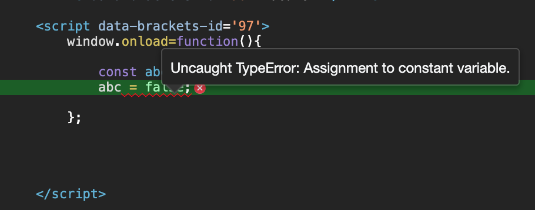
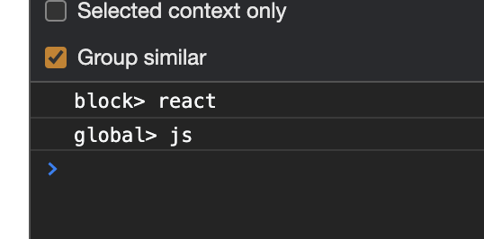
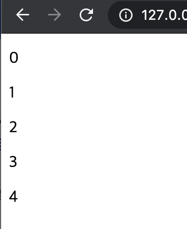
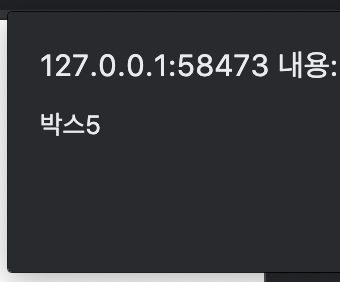
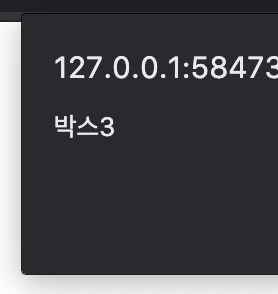
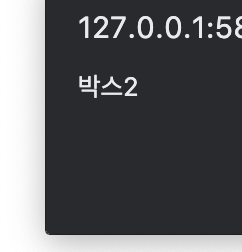
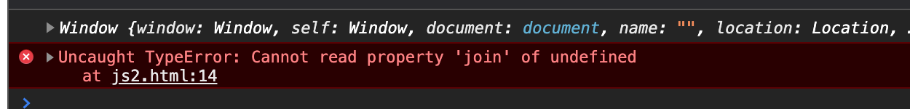
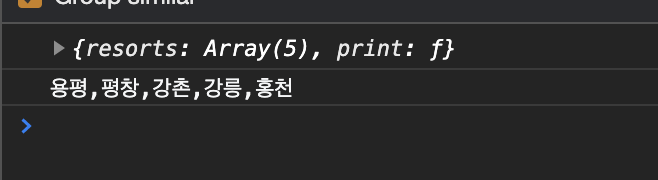

# react 1 일차

## ES6 javascript

### const

* const는 값을 변경할 수 없는 변수이다.

```javascript
var pizza = true
pizza = false
console.log(pizza) // false

const pizza = true
pizza = false // error
```




### let

* 구문적인 변수 영역 규칙을 지원함.

* var 사용의 경우

  * 보통 블록 안에서 생성한 변수는 지역변수로 사용하여 변수 영역을 이룬다.
  * 하지만 if/else 의 경우 별도의 영역을 구성하지 않는다.

  ```javascript
  window.onload=function(){
              var topic = 'js';
              if(topic){
                  var topic = 'react';
                  console.log('block>',topic);
              }
              console.log('global>',topic);
          };
  ```

* let 키워드 사용시 변수 영역을 코드 블록 안으로 한정 가능함.

  ```javascript
  window.onload=function(){
              var topic = 'js';
              if(topic){
                  let topic = 'react';
                  console.log('block>',topic);
              }
              console.log('global>',topic);   
          };
  ```

  

* for 문 안에서도 동일하게 작용..

  ```javascript
  window.onload = function(){
         var div, container = document.getElementById('start');
          
          for(var i=0; i<5; i++){
              div = document.createElement('p');
              div.onclick = function(){
                  alert('박스'+i);
              }
              div.innerHTML = i;
              container.appendChild(div);
          }
      }
  ```

  

* 4개의 태그 모두 아래와 같은 alert창이 뜬다.

  

* for문의 i를 let으로 선언한다면 해결 가능.

  ```javascript
  window.onload = function(){
         var div, container = document.getElementById('start');
          
          for(let i=0; i<5; i++){
              div = document.createElement('p');
              div.onclick = function(){
                  alert('박스'+i);
              }
              div.innerHTML = i;
              container.appendChild(div);
          }
      }
  ```

  

  


### 화살표함수

* function 키워드 없이 함수를 만들 수  있다.
* return을 하지 않아도 식을 계산한 값이 자동으로 반환된다.

```javascript
var lordify = function(firstName){
  return `캔터베리의 ${firstName}`;
}
// 화살표 함수 사용
var lodify = firstName => `캔터베리의 ${firstName}`
```

* 화살표 함수는 this를 새로 바인딩하지 않는다.

```javascript
var gangwon = {
  resorts : ['용평', '평창', '강촌', '강릉', '홍천'],
  print: function(){
    setTimeout(function(){
      console.log(this);
      console.log(this.resorts.join(','))
    },delay)
  }
}
gangwon.print()
```

* 위의 경우 this 는 gangwon 객체가 아닌 window로 바인딩 되어 join 을 사용할 수 없다.



* 안쪽 함수를 화살표 함수로 지정하게 되면 this는gangwon 객체를 가르키게 된다.

```javascript
var gangwon = {
  resorts : ['용평', '평창', '강촌', '강릉', '홍천'],
  print: function(){
    setTimeout(() => {
      console.log(this);
      console.log(this.resorts.join(','))
    },delay)
  }
}
gangwon.print()
```



