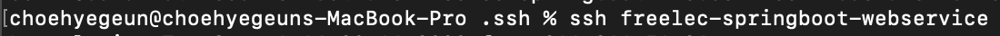
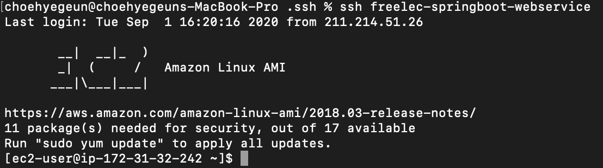

# AWS 이용 배포하기


* EC2 인스턴스를 이용하여 배포함.
  * EC2 : Elastic Compute Cloud
* ec2 중 Amazon Linux 1 AMI 를 이용.
* Amazon Linux 1 AMI 장점
  * 아마존이 개발중이기 때문에 지원받기 쉬움
  * 레드햇 베이스이므로 레드햇 계열의 배포판을 많이 다뤄본 사람일수록 문제없이 사용할 수 있다.
  * AWS의 각종 서비스와 상성이 좋다.
  * Amazon 독자적인 개발 리포지터리를 사용하고 있어 yum이 매우 빠르다.
* 인스턴스 유형 : `t2.micro`
  * t2는 요금 타입을 이야기 하며, micro는 사양을 이야기함.
  * 다른 서비스와 달리 **크레딧**이란 일종의 CPU를 사용할 수 있는 포인트 개념이 있다.
  * 인스턴스 크기에 따라 정해진 비율로 **CPU 크레딧을 계속 받게 되며**, 사용하지 않을 때는 크레딧을 축적하고, 사용할 때 이 크레딧을 사용한다.
  * 크레딧이 모두 상용되면 더이상 EC2를 사용할 수 없다.
* 스토리지 용량은 30GB까지 프리티어로 사용 가능하다.


## 고정아이피 할당하기.

* AWS 이용시 인스턴스도 결국 하나의 서버이기 때문에 IP가 존재한다.
* 인스턴스 생성 시에 항상 새 IP를 할당하는데 , 같은 인스턴스를 중지하고 다시 시작할 때도 새 IP가 할당된다.
* 따라서 변경되지 않고 고정 IP를 가지게 해야 같은 서비스를 계속 이용할 수 있다.
* AWS 의 탄력적 IP를 이용하여 탄력적 IP를 발급한 후 인스턴스와 연결해 주면 해결이 가능하다.
* 단 주의할 점으로 탄력적 IP는 생성하고 EC2 서버에 연결하지 않으면 비용이 발생한다.
* 즉, 생성한 탄력적 IP는 무조건 EC2에 바로 연결해야 하며, 만약 더는 사용할 인스턴스가 없을 때도 탄력적 IP를 삭제해야 한다.


## 터미널로 EC2 접속하기

* 기존 EC2로 접속하기 위해선 아래오 같은 명령어를 작성해야함

  ```cmd
  ssh -i pem 키위치 EC2의 탄력적 IP 주소
  ```

* 위와 같이 실행할 시 매번 탄력적 IP주소와 경로를 알아야 하므로 번거롭기 때문에 아래와 같이 설정.

* AWS 인스턴스 생성시 받은 pem 인증키를 해당 경로로 이동

  

* 인증키의 파일 권한을 변경 

  

* config 파일을 생성.

  

* config 내용 작성

  ```tex
  # freelec-springboot-webservice
  Host freelec-springboot-webservice # 사용할 이름.
          HostName *.*.***.* #탄력적 IP주소
          User ec2-user
          IdentityFile ~/.ssh/freelec-springboot-webservice.pem # pem파일 경로
  ```

* config 권한 변경

  

* 접속 방법

  

* 접속완료!

  

