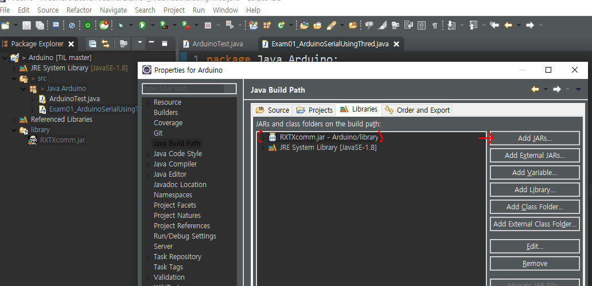
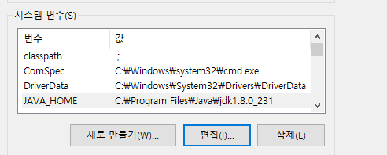

# 2020-04-24

## 아두이노와 자바 통신

* Exam01_ArduinoSerialUsingThred

* 자바에서 시리얼 통신을 위한 라이브러리

  * RXTXcomm.jar (프로젝트에 라이브러리로 등록)
    * 해당 프로젝트에 library folder 만들고 복사.
    * 복사한후 프로젝트에서 properties - Build Path - Library - Add JARs 에서 해당 라이브러리 추가.

  

  * rxtxSerial.dll -> JAVA_HOME path /bin 폴더에 저장하기. (동적라이브러리 파일.)

  


## Java 프로그램에서 Serial 통신

* 자바프로그램에서 Serial 통신을 하는 방법에는 2가지가 있다.
  1. `Thread`를 이용한 통신.
  2. `Event` 처리를 이용한 통신.

### 기본적인 포트설정.

* RXTXcomm 라이브러리를 이용하여 시리얼 통신을 위한 스트림을 열수있다.

* 기본적인 Serial 통신을 위한 Template

  ```java
  package Java.Arduino;
  
  import java.io.InputStream;
  import java.io.OutputStream;
  
  import gnu.io.CommPort;
  import gnu.io.CommPortIdentifier;
  import gnu.io.SerialPort;
  
  public class Exam01_ArduinoSerialUsingThred {
  
  	public static void main(String[] args) {
  		CommPortIdentifier portIdentifier = null;
  		try {
  			// 1. Serial 통신을 하기 위한 COM 포트 설정.
  			// 아두이노의 포트번호를 가져옴.
  			portIdentifier = 
  					CommPortIdentifier.getPortIdentifier("COM8");
  
  			// 2. 포트가 사용되고 있는지 확인해야 한다.
  			if (portIdentifier.isCurrentlyOwned()) {
  				System.out.println("포트가 사용중입니다...");
  			} else {
  				// 인자 2개 : (identifier) 문자열, int
  				// Port 객체를 얻어온다.
  				CommPort commPort = 
  						portIdentifier.open("PORT_OPEN", 2000);
  
  				// Port객체를 얻어온 후 우리가 사용하려고 하는 Port 는 SerialPort 이다.
  				// Port 에는 ParallelPort도 있다.
  				if (commPort instanceof SerialPort) {
  					// SerialPort 로 형변환 (type casting)
  					SerialPort serialPort = (SerialPort)commPort;
  					// 포트 설정 (통신속도같은걸 설정)
  					// 첫번째 : 보드레이트
  					// 나머지는 정해져 있는것들 이용.
  					serialPort.setSerialPortParams(
  							9600, 
  							SerialPort.DATABITS_8, 
  							SerialPort.STOPBITS_1, 
  							SerialPort.PARITY_NONE);
  					// 데이터 통신을 하기 위해서 Stream을 연다.
  					InputStream in = serialPort.getInputStream();
  					OutputStream out = serialPort.getOutputStream();
                        // 아래부분에서 Thread or Event 로 처리.
                      
  					}else {
  					// parallel port로 열렸을 경우
  					System.out.println("Serial Port만 이용가능합니다...");
  				}
  			}
  
  		} catch (Exception e) {
  			System.out.println(e);
  		}
  
  	}
  
  }
  
  ```

* 스트림을 각각 만든후 아래에서 아래의 두개의 처리를 이용하여 데이터를 받을 수 있다.

### Thread 이용

* Thread 객체에서 Runnable 객체를 inner class로 선언해주면서 데이터를 받도록 코드를 작성.

```java

Thread t = new Thread(new Runnable() {
			@Override
			public void run() {
				byte[] buffer = new byte[1024];
				// 받은 바이트 길이를 저장하기 위한 변수.
				int len = -1;
				try {
					while((len = in.read(buffer))!=-1) {
				// 아두이노에서 보낸 데이터를 읽을때 바이트 단위로 들어와서 얼마나 들어오는지 알 수 없다.
						System.out.print(new String(buffer,0,len));
					}
				} catch (Exception e) {
					System.out.println(e);
				}
			}
		});
		t.start();
```


### Event 처리 이용


## 확장

* `Android` 에서 `ON/OFF` 버튼을 눌렀을 때 `Arduino` 회로의 `LED`에 불이 켜지고 꺼지도록 만들기.

> 구성
>
> Android에서 서비스를 만들어서 Thread를 이용하여 Network Server와 연결
>
> -> Java Network Server (ServerSocket)
>
> -> 아두이노와 Serial 통신