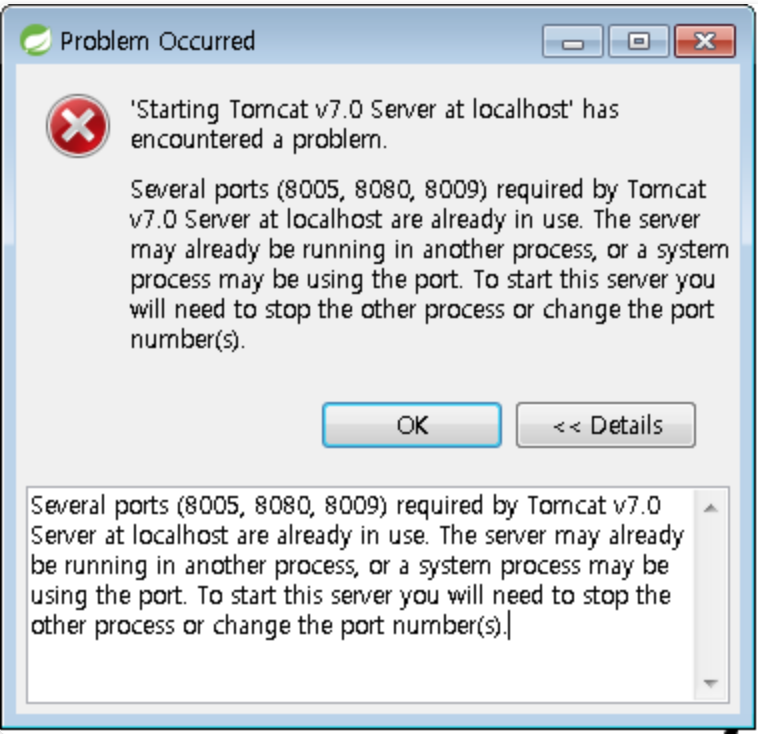
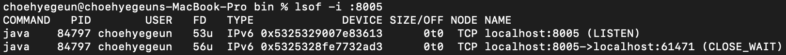
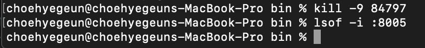

# tomcat 충돌문제 해결

* 톰켓을 실행하지 않았는데도 tomcat admi port 8005 가 계속 사용중에 있었음.

* 포트 충돌을 없애기 위해 해당 포트의 PID 값을 확인한다.

  

* `kill -9 pid번호` 명령어로 해당 포트를 강제로 종료시켜 준다.

* 강제종료후 다시 확인하여 확실하게 종료 되었는지 확인 하였다.

  

* 이후 톰캣 실행시 정상적으로 실행됨.

* javaScript는 클라이언트 단에서 화면을 만들고 jsp는 서버단에서 만든다. 즉 jsp 코드가 먼저 수행된다.