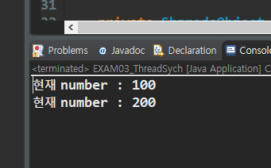
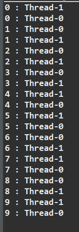

# 2020-04-09

## Thread

### Thread State (상태전이)

> Thread State 
>
> NEW(객체) -> Runnable -> Running -> DEAD
>
> ​																-> Otherwise Blocked -> Runnable


> `Program`  의 시작 `Point 는 Main Method`
> `main method` 를 호출하는 주체는 `main thread` 이다.
> `JVM` 이 하나의 `Thread(main)` 를 내부적으로 생성한다.
> `static method` 인 `main()` 을 호출해서 프로그램이 시작된다.

* Main method 에서 Thread 사용 ( `New(객체)` 상태)

  1. `Thread` class 사용

     *  `Thread` class 를 상속받아서 class 를 define -> 생성한 후 실행.

     * 1번 방식은 상속개념을 사용하여 객체사용에 제한이 생김.

  2. `Runnable interface` 를 구현
* `Runnable interface` 를 구현한 객체를 만든다.
     * 생성한 객체를 인자로 Thread를 생성한 후 사용한다.

  ```java
  	class myRunnable implements Runnable{
  		@Override
  		public void run() {
  		
  		
  		}
  	}
  
  	public class Thread_State {
  
  		public static void main(String[] args) {
  			myRunnable runnable = new myRunnable();
  			Thread t1 = new Thread(runnable);
  			Thread t2 = new Thread(runnable);
  			System.out.println(Thread.currentThread().getName());
  		
  			t1.start();
  			t2.start();
  			
  		}
  
  	}
  ```
  
  

>* class 를 만들때..
>  * class 안에 class 가 존재하는 inner class 형태로 class 정의할 수 있다. (Android 에서는 흔한일.)
>   * Inner class 형태는 재사용성이 좋지않음.
>   * 일반적인 Java 프로그램에서는 지양하도록..

* 생성한 Thread 를 실행시키려면..(`Runnable` 상태)
  * 생성한 Thread 객체의 `start()` 매서드를 호출해야한다.
  * `start()` 매서드를 호출하면 Thread의 상태가 `Runnable` 상태로 바뀐다.
  * `Runnable` 상태는 아직 실행은 되지 않은 상태이다.
* JVM 내부에 Thread Scheduler 가 존재함.
  * Thread scheduler 의 역할 : Runnable 상태의 여러개의 Thread 중 하나를 선택하여 수행 (내부적으로 알고리즘이 정해져 있다. 개발자가 관여 할수 없다.)
  * Thread가 실행되는 순서는 코드에 작성된 순서대로 진행되지 않을 수도 있다. (보장이 안됨.)
  * scheduler 에 의해 선택된 Runnable 상태의 Thread는 Runnning 상태로 변함.
  * Running 상태는 CPU core 를 점유하고 있는 상태이다. (실제 `run()` 매서드가 수행되는 과정)
  * Running 하지 않고 기다리는 나머지 Thread는 starvation 현상이 나타나지 않도록 수행되는 Running 상태의 Thread 를 끝까지 수행하지 않고 Runnable 로 바꾼후 다른 Thread 를 다시 선택함. (매우 빠른 속도로)
* `run()` 매서드 수행이 종료되었을 때..(`DEAD` 상태)
  * Thread 가 종료되어 DEAD 상태가 되면 해당 Thread 는 다시 사용할수가 없다.
  * 같은 로직의 Thread를 다시 사용하려면 객체를 다시 만들어 사용해야 한다.

* Thread sleep (Otherwise Blocked 상태) 
  * `sleep`은 일정시간동안 Thread의 수행을 중지시키는 역할.
  * Exception handling 처리를 반드시 해줘야 한다.(`try catch`문)
  * sleep 이 된후 Thread 는 다시 Runnable 상태로 돌아간다.
  * Runnable 상태로 돌아가게 되면 다시 다른 Thread 와 경쟁해야한다.
  * 따라서 sleep 에 작성한 시간 이후에 다시 실행되는 보장이 없다.


### Thread 수행 확인.

* 해당 코드는 JAVAFX 를 이용하여 TextArea 에 5개의 Thread 를 동시에 실행하는 코드

* 각 코드는 1초동안 sleep 한후 i 와 해당 Thread 이름을 출력한다.

  ```java
  package javaThread;
  
  import javafx.application.Application;
  import javafx.application.Platform;
  import javafx.scene.Scene;
  import javafx.scene.control.Button;
  import javafx.scene.control.TextArea;
  import javafx.scene.layout.BorderPane;
  import javafx.scene.layout.FlowPane;
  import javafx.stage.Stage;
  
   
  
  public class Exam02_ThreadSleep extends Application {
  
  	private TextArea ta;
  	private Button btn;
  
  	private void printMSG(String msg) {
  		Platform.runLater(() -> {
  			ta.appendText(msg + "\n");
  		});
  		
  	}
  
  	@SuppressWarnings("unchecked")
  	@Override
  	public void start(Stage primaryStage) throws Exception {
  		BorderPane root = new BorderPane();
  		root.setPrefSize(700, 500);
  
  		ta = new TextArea();
  
  		root.setCenter(ta);
  
  		btn = new Button("버튼클릭");
  		btn.setPrefSize(250, 50);
  		// Button 을 누르면 Thread 를 5개 생성.
  		// 각 Thread 는 1초 sleep 하면서 숫자를 하나 출력.
  		btn.setOnAction(e -> {
  
  			// 5개의 Thread 생성 -> for 문이용
  			for (int i = 0; i < 5; i++) {
  				// Lambda 식 이용. (Inner class : Runnable interface)
  				Thread t = new Thread(() -> {
  					try {
  						for (int k = 0; k < 3; k++) {
  							Thread.sleep(1000);
  							printMSG(k + "-" + Thread.currentThread().getName());
  						}
  					} catch (InterruptedException e1) {
  						e1.printStackTrace();
  					}
  				});
  				t.start();
  			}
  		});
  
  		FlowPane flowpane = new FlowPane();
  		flowpane.setPrefSize(700, 50);
  		flowpane.getChildren().add(btn);
  
  		root.setBottom(flowpane);
  
  		Scene scene = new Scene(root);
  		primaryStage.setScene(scene);
  		primaryStage.setTitle("예제용 JavaFX");
  
  		primaryStage.setOnCloseRequest(e -> {
  			System.exit(0);
  		});
  
  		primaryStage.show(); 
  	}
  
  	public static void main(String[] args) {
  		
  		launch(); 
  
  	}
  
  }
  
  ```

* 결과

  

* 이 실습을 통해 Thread 수행 순서를 알수 없을을 알았다.

* 각각의 Thread 는 모두 1초동안 sleep 하는 것은 모두 같지만 시작되는 순서는 JVM Thread scheduler 가 선택한 순서대로 출력이된다.

### Thread 동기화 (Synchronization)

> 일반적으로 Thread 를 작성할 때.. 공유자원에 대한 처리가 없으면 (동기화가 되지 않으면) 문제가 생긴다!

* 하나의 자원을 여러 Thread 가 사용하려고 할 때, 한시점에 하나의 Thread 만 사용할 수 있도록 하는 것을 의미.
* 그러나 이 처리를 잘못 진행하게 되면 순차처리가 되어버려 Thread 의 의미가 없어진다.


* `Monitor` : Thread 가 공유객체(instance)에 접근하는것을 제어해 주는 것.
  * 공유객체는 각자의 Monitor를 하나씩 갖고 있다.
  * 하나의 Thread가 접근했을때 Monitor 를 주어 공유객체사용권한을 준다.(가장 먼저 접근한 Thread)
  * Monitor 를 부여받지 못한 Thread 는 blocked  처리가 된다.
  * Monitor 받은 Thread 처리가 끝나면 Monitor 를 다시 반납한다.
  * 자바에서는 키워드를 이용하여 Monitor 를 획득, 반납 할수 있다. -> `synchronized keyword`


* `synchronized`에 의한 `Object Lock`에 의한 `Blocked` 상태는 Monitor 를 획득할때 까지 Lock이 된다.
  * Monitor 를 얻으면 바로 `Runnable` 상태가 아닌 `Running` 상태가 된다.
  * Monitor 를 끝까지 받지 못하면 starvation 상태가 되어버림.


* 예제

  * 일반적으로 공유객체는 class 로부터  객체가 딱 1개만 생성되는 형태로 만들어진다
  * 위와 같은 Design pattern 을 `Singletone pattern` 이라고 한다.

  ```java
  package javaThread;
  
  // 공유객체를 만들기 위한 class. 일반적으로 Singleton 으로 작성.
  class SharedoObject {
  	// Thread가 공유해서 사용하는 공유객체는
  	// Thread가 사용하는 데이터와 로직을 포함하고 있다.
  	private int number;
  	// Thread에 의해서 공유되는 field.
  	// 일반적으로 private으로 처리되기 때문에 이 field 를 이용하기 위해 Setter,Getter 가 필요함.
  
  	public int getNumber() {
  		return number;
  	}
  
  	public void setNumber(int number) {
  		this.number = number;
  		try {
  			// 현재 공유객체를 사용하는 Thread를 1초간 재워요!
  			Thread.sleep(1000);
  			System.out.println("현재 number : " + getNumber());
  		} catch (Exception e) {
  
  		}
  
  	}
  
  }
  
  class NumberRunnable implements Runnable {
  
  	private SharedoObject obj;
  	private int number;
  
  	// 기본생성자는 항상 존재해야 한다.
  	NumberRunnable() {
  
  	}
  
  	// 공유객체를 받아들여서 저장하는 생성자를 작성한다.
  	// Constructor injection
  	NumberRunnable(SharedoObject obj, int number) {
  		this.obj = obj;
  		this.number = number;
  	}
  
  	@Override
  	public void run() {
  		// 공유객체가 가지는 기능을 이용해서 숫자를 출력
  		obj.setNumber(number);
  	}
  }
  
  public class EXAM03_ThreadSych {
  
  	// 프로그램 entry point
  	public static void main(String[] args) {
  
  		// Thread 에 의해 공유되는 공유객체 1개 생성
  		// 일반적으로 공유객체는 class 로부터 객체가 딱 1개만 생성되는 형태로 만들어진다.
  		// => Singleton Pattern
  		// Thread 는 로직처리를 공유객체를 이용해서 로직처리를 하고
  		// 데이터 처리 역시 공유객체를 통해서 처리한다.
  		// 공유객체를 만들기 위한 class define
  
  		// Thread 에 의해서 공유되는 객체를 하나 생성
  		SharedoObject obj = new SharedoObject();
  
  		// Thread 를 생성하기 위해서 Runnable interface 를 구현한 객체가 있어야한다.
  		// 그래서 "Runnable interface" 를 구현할 객체를 만들기위한 class define.
  		NumberRunnable r1 = new NumberRunnable(obj, 100);
  		NumberRunnable r2 = new NumberRunnable(obj, 200);
  
  		// Thread 2개를 생성.
  		Thread t1 = new Thread(r1);
  		Thread t2 = new Thread(r2);
  
  		// Thread 시작.
  		t1.start();
  		t2.start();
  
  	}
  
  }
  ```

* 결과

  

* 주입에 오류가 생김.

  * 첫번째 Thread가 실행되고 setNumber() 매서드 진행에서 공유객체의 number변수를 100으로 셋팅하고 1초 동안 sleep 하는동안 두번째 Thread 가 실행되어 매서드가 실행되고 number변수를 200으로 셋팅하므로 둘다 200이 나오게 된다.

1. 첫번째 해결방법 : method 호출을 순차적으로 처리하면 된다.

   * 각 Thread 가 갖고 있는 공유객체의 method호출을 순차적으로 호출하게끔 처리. synchronized keyword 이용

   ```java
   public synchronized void setNumber(int number) {
   		this.number = number;
   		try {
   			// 현재 공유객체를 사용하는 Thread를 1초간 재워요!
   			Thread.sleep(1000);
   			System.out.println("현재 number : " + getNumber());
   		} catch (Exception e) {
   
   		}
   
   	}
   ```

   * 결과

   

   * 위와 같이 코딩하면 method 자체가 동기화 처리가 되서 프로그래밍 하기는 쉽다.
   * 그러나 해당 method의 실행이 만약 오래걸리게 되면 performance 에 문제가 발생한다.

2. 두번쨰 해결방법 : 전체 method를 동기화 하는것이 아닌 필요한 부분만 동기화 처리를 진행.

   ```java
   class SharedoObject {
   // 생략 ... 
   private Object monitor = new Object(); // monitor 용 객체. 객체만 있으면됨.
   
   // 생략...
   
   public void setNumber(int number) {
   		System.out.println("소리없는 아우성");
   		synchronized (monitor) { // block 의 인자 : Monitor객체
   			this.number = number;
   			try {
   				// 현재 공유객체를 사용하는 Thread를 1초간 재워요!
   				Thread.sleep(1000);
   				System.out.println("현재 number : " + getNumber());
   			} catch (Exception e) {
   			}
   		}
   	}
   }
   ```

   * 결과

   

   * "소리없는 아우성"문자열은 동시에 출력이 된다.
   * 아래 number 를 찍는 출력은 1초간격으로 각각의 숫자가 출력이 된다. (synchronized block 에 의한 동기화 때문이다.)
   * synchronized block 에서 사용되는 인자는 Monitor 객체이다.
   * Monitor 객체는 객체의 형태는 상관없이 존재만 하면 되는 객체이다. 따라서 해당 class에서 Field 변수로 객체를 하나 만들어 주면 된다.


* 일반적인 방식으로 Thread 를 사용하면 Thread 실행 순서는 Thread scheduler 로 제어되기 땜누에 Thread 의 순서를 제어할 수 없다.

  ```java
  class nameRunnable implements Runnable {
      @Override
  	public void run() {
  
  		for (int i = 0; i < 10; i++) {
  			System.out.println(i + " : " + Thread.currentThread().getName());
  			try {
  				Thread.sleep(1000);
  			} catch (InterruptedException e) {
  			}
  		}
      }
  }
  
  public class Exam04_ThreadWaitNotify {
  	public static void main(String[] args) {
  
  		nameRunnable r1 = new nameRunnable();
  		nameRunnable r2 = new nameRunnable();
  
  		Thread t1 = new Thread(r1);
  		Thread t2 = new Thread(r2);
  
  		t1.start();
  		// start() blocking 방식으로 동작하면??
  		// 만약 blocking 방식의 method 라면 순차처리가 된다.
  		// start() method 는 non-blocking method이다
  		t2.start();
  
  	}
  }
  ```

* 결과

  

  * 순서 제어가 안됨..
  * 그러나 특수한 method를 이용해서 Thread 실행 순서를 제어할 수 있다.
  * `wait(), notify(), notifyAll() method` 를 이용해서 제어한다.
  * 그러나 이 method 들은 반드시 `Critical Section` 에서만 사용이 가능하다.
  * `Critical Section(임계영역)` : 동기화 코드가 적용된 부분. => `synchronized block 안.`
  * 따라서 block 을 사용하기 위해서 공용객체가 필요하다.

  ```java
  class Shared {
  	// Thread 가 공용으로 사용하는 데이터와
  	// Thread 가 공용으로 사용하는 method 가 존재 => 로직처리.
  	public void printNum() {
  		// Thread 의 이름과 숫자를 찍어주는 로직 처리. 위 예제에서 run 이 수행한 로직가져옴.
  		for (int i = 0; i < 10; i++) {
  			System.out.println(i + " : " + Thread.currentThread().getName());
  			try {
  				Thread.sleep(1000);
  			} catch (InterruptedException e) {
  			}
  		}
  	}
  
  }
  
  class PrintRunnable implements Runnable {
  
  	private Shared obj;
  
  	PrintRunnable() {
  	}
  
  	PrintRunnable(Shared obj) {
  		this.obj = obj;
  	}
  
  	@Override
  	public void run() {
  
  		obj.printNum();
      }
  }
  ```

* 이제 여기서 printNum() method 에 synchronized keyword 를 작성하면..

  * 하나의 Thread의 printNUm() 이 끝날때 까지 다른 Thread는 printNum() 매서드는 수행되지 않는다.

* 순차적으로 하기 위해서 wait과 notify 매서드를 사용한다.

  * `wait()` : 동기화된 해당 Thread의 Monitor 를 반납하고 자신은 wait block 시키는 method
  * `notify()` : wait() 으로 block 되어있는 Thread 를 깨우는 method

  ```java
  class Shared {
  	// Thread 가 공용으로 사용하는 데이터와
  	// Thread 가 공용으로 사용하는 method 가 존재 => 로직처리.
  	// synchronized keyword 를 이용하면 monitor 를 가져오게 된다.
  	public synchronized void printNum() {
  		// Thread 의 이름과 숫자를 찍어주는 로직 처리.
  		for (int i = 0; i < 10; i++) {
  			System.out.println(i + " : " + Thread.currentThread().getName());
  			try {
  				Thread.sleep(1000);
  				notify(); // wait으로 Block 되어 있는 Thread 를 깨우는 method
  				wait();// 갖고있는 강제로 monitor를 반납한 후 자기 자신을 wait block 시키는 method
  			} catch (InterruptedException e) {
  			}
  		}
  	}
  
  }
  ```

* 결과

  

  

  