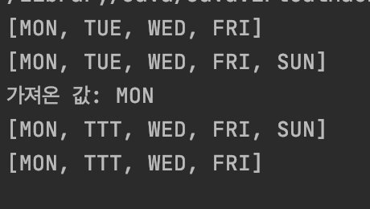
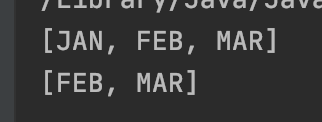
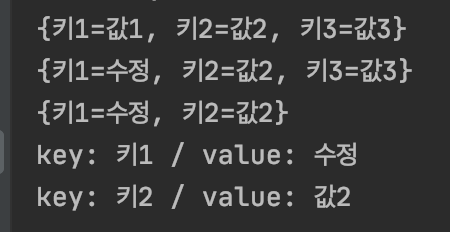
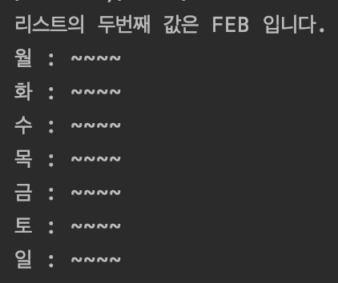

# Array & Collection

## Array

```kotlin
fun main(){
  var students = IntArray(10)
  var longArray = LongArray(10)
  
  var CharArray = CharArray(10)

   for(i in CharArray.indices){
       CharArray[i] = 'a'+i
   }
    println(CharArray)
}
```


* 문자 배열에 빈 공간 할당하기

  ```kotlin
  var stringArray = Array(10, {item->""})
  ```

* 문자 배열에 같은문자로 배열 초기화

  ```kotlin
  var stringArray = Array(10, {item->"a"})
      for(x in stringArray.indices){
          println(stringArray[x])
      }
  ```

  

* 배열에 값넣기
  * 배열명 [ 인덱스 ] = 값
  * 배열명.set ( 인덱스 , 값)
* 배열 값 가져오기
  * 배열명 [ 인덱스 ]
  * 배열명.get( 인덱스 )


## Collection

### List

```kotlin
var list = mutableListOf("mon","tue",'wed')
```

* 중복값 입력 가능.
* 동적 리스트(컬랙션) 이용시 mutable 접두어 붙은 함수 사용.


* 리스트에 값 넣기 : `변수명.add(값)`
* 리스트 값 가져오기 : `변수명.get(인덱스)`
* 리스트 값 수정하기 : `변수명.set(인덱스, 값)`
* 리스트 값 제거 : `변수명.removeAt(인덱스)`
* 빈 리스트 생성 : `var 변수명 = mutableListOf<String>()`
* 리스트 크기 : `변수명.size`

```kotlin
    var mutableList = mutableListOf("MON","TUE","WED","FRI")
    println(mutableList)

    mutableList.add("SUN")
    println(mutableList)

    println("가져온 값: ${mutableList.get(0)}")

    mutableList.set(1,"TTT")
    println(mutableList)

    mutableList.removeAt(mutableList.size-1)
    println(mutableList)
```



### Set

* 중복된 값을 넣을수 없다.

* 중복된 값이 없어 요소 제거시 값으로 제거가능.

  ```kotlin
      var set = mutableSetOf<String>()
  
      set.add("JAN")
      set.add("FEB")
      set.add("MAR")
      set.add("JAN") // 중복 불가능
  
      println(set)
  
      set.remove("JAN") // 중복값이 없으므로 값으로 삭제가능.
      println(set)
  ```

  

### Map

* Key 와  Value의 쌍으로 입력되는 컬렉션.

* `put(key,value)` 함수를 이용하여  값 입력가능.

* 이미 존재하는 key로 put() 함수 사용시 해당 key 값의 value를 갱신함.

* 삭제시에는 `remove(key)` 함수를 이용함.

  ```kotlin
      var map = mutableMapOf<String, String>()
  
      map.put("키1","값1")
      map.put("키2","값2")
      map.put("키3","값3")
  
      println(map)
  
      map.put("키1","수정") // 이미 존재하는 key로 put 매서드 실행시 value 갱신됨.
      println(map)
  
      map.remove("키3")
      println(map)
  		for(m in map){ // for 문을 이용한 map 출력
          println("key: ${m.key} / value: ${m.value}")
      }
  ```

  


### Immutable Collection

* 컬랙션 생성시 상수변수에 해당값을 대입시키면 `Immutable Collection` 으로 사용가능.

* `get()` 함수만 사용가능하다.

  ```kotlin
      val IMMUTABLELIST = listOf("JAN","FEB","MAR")
  //    IMMUTABLELIST.add() // 불가능.
  //    IMMUTABLELIST.removeAt() // 불가능.
  //    IMMUTABLELIST.set() // 불가능.
      println("리스트의 두번째 값은 ${IMMUTABLELIST.get(1)} 입니다.") // get 함수만 사용가능.
  
      val DAY_LIST = listOf("월","화","수","목","금","토","일") // java 에서 enum class 처럼 사용가능.
  
      for(s in DAY_LIST){
          println("$s : ~~~~")
      }
  ```

