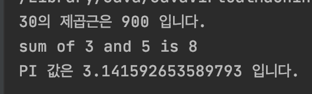
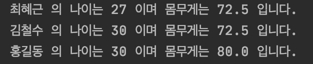

# Function

## 함수이용

* 반환값은 변수에 담아서 사용.

* 반환값이 없을때는 바로 호출해서 사용.

* 입력값이 없는 함수는 매개변수 없이 사용.

  ```kotlin
  fun main(){
  
      var squareResult = square(30)
      println("30의 제곱근은 $squareResult 입니다.")
  
      printSum(3,5)
  
      var PI = getPi()
      println("PI 값은 $PI 입니다.")
  }
  
  fun getPi(): Double {
      return Math.PI
  }
  ```

  

## 함수의 기본값 정의와 호출

* 파라미터를 정의할 때 default 값을 `=` 을 통해 설정할 수 있다.

  ```kotlin
  fun main(){
    newFunction("최혜근")
    newFunction("김철수",30)
    newFunction("홍길동",30,80.0)
  }
  // 파라미터 정의
  fun newFunction(name:String,age:Int = 27, weight:Double = 72.5){
      println("$name 의 나이는 $age 이며 몸무게는 $weight 입니다.")
}
  ```
  
  
  
  
  
  

