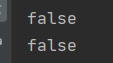
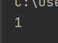

# Kotlin Day02

## Idioms - 관용구

* 자주 사용하는 코딩 형태로 같은 결과를 내는 프로그램을 다른 모양으로 작성할 수 있는데, 관용구는 주로 사용되는 형태를 말한다. 
* 여기에는 Kotlin에서 자주 사용되어지는 관용구(idioms)를 무작위로 모아둔 내용이다.

## DTO 만들때 (POJOs/POCOs)

* `data` 작성.

  ```kotlin
  data class Customer(val name: String, val email: String)
  ```

* data 를 붙여주면 아래 매서드들이 자동으로 생성해 준다. (DTO)

  * getters (and setters in case of *var*s) for all properties
  * `equals()`
  * `hashCode()`
  * `toString()`
  * `copy()`
  * `component1()`, `component2()`, …, for all properties (see [Data classes](https://kotlinlang.org/docs/reference/data-classes.html))

* 여기서 의문점이 든것이 DTO의 의미였다.

* 다음 코드를 실행

  ```kotlin
  class Custommer (val name: String, val email: String)
  fun main(){
      var a = Customer("aa","aa@aa.aa")
      var b = Customer("aa","aa@aa.aa")
      println(a==b)
      println(a.equals(b))
  }
  ```

  * 위의 코드를 실행하면 둘은 객체의 내용은 갖지만, 각각 서로 메모리를 할당하여 객체를 생성하였으므로 결과는 아래와 같이 나온다.

  

  * 그러나 이를 DTO 형태로 만들어 준다면

    ```kotlin
    data class Custommer (val name: String, val email: String)
    fun main(){
        var a = Customer("aa","aa@aa.aa")
        var b = Customer("aa","aa@aa.aa")
        println(a==b)
        println(a.equals(b))
    }
    ```

    

  * 두 객체가 같은 객체가된다.

  * 그래서 나는 이게 Singleton 패턴을 이용하여 같은 객체로 받는줄 알고 아래와 같이 코드를 수행해 보았다.

    ```kotlin
    data class Customer(val name: String, val email: String){
        var a=0;
        fun plusA(){
            a++
        }
    }
    
    fun main(){
        var a = Customer("a", "b")
        var b = Customer("a", "b")
    
        println("a.a: "+a.a)
        println("b.a: "+b.a)
        a.plusA()
        println("a.a: "+a.a)
        println("b.a: "+b.a)
        b.plusA()
        println("a.a: "+a.a)
        println("b.a: "+b.a)
    }
    ```

  * 만일 싱글톤 객체라면 plusA() 매서드를 실행할 때마다 두객체 모두 `.a`가 1씩 증가해야 한다. 하지만 결과는

    

  * 결국 싱글톤은 아니라는 것! 하지만 객체타입은 같다. 이정도로 기억하면 될듯하다.

## 함수 매개변수를 Default로 지정

* 함수의 매개변수를 지정할때 대입연산자`=`를 통해 값을 직접 넣어준다면 default값으로 지정할 수 있다.

  ```kotlin
  fun foo(a:Int = 0,b:String=""){...}
  ```

* 매개변수의 Default 값을 정해주면 객체 생성시 기본생성자로 생성할 수 있다. (없으면 기본생성자 사용 불가능!)

  ```kotlin
  class Customer(val name: String="", val email: String=""){}
  
  fun main(){
  	val customer = Customer() // 생성가능
  }
  ```

* default값이 없으면 불가능하다.

  ```kotlin
  class Customer(val name: String, val email: String){}
  
  fun main(){
  	val customer = Customer() // 생성가능
  }
  ```

  

  

## Filtering a list

```kotlin
val positives = list.filter { x -> x > 0 } // list 변수에서 0 이상인 숫자만 받아서 positives에 리스트로 저장.

val positives = list.filter { it > 0 }
```


## Checking element presence in a collection.

```kotlin
if ("john@example.com" in emailsList) { ... }

if ("jane@example.com" !in emailsList) { ... }
```

* 문자열 체크할 때는 비교될 객채는 뒤쪽으로 내가 체크해 보고 싶은 문자열은 앞쪽으로 사용
*  java 에서도 문자열객체.equals("문자열") 보단 "문자열"

.equals(문자열객체) 로 사용하는 것이 더 가독성이 좋고, `NullPorintException` 을 피할수 있다.


## String Interpolation

```kotlin
println("Name $name")
```

* 문자열 블록 `""` 안에서 변수를 사용할 때는 `$변수명` 으로 사용할 수 있다. 
* 위 문자는 `"Name " + name`와 같은의미이다.

## Instance Checks..?

* 객체의 인스턴스를 확인할 때 `is` 연산자를 이용하며 다음과 같이 사용 가능함.

* lambda식을 이용할 수 있다.

  ```kotlin
  when (x) {
      is Foo -> ...
      is Bar -> ...
      else   -> ...
  }
  ```

## Traversing a map/list of pairs

* map 객체 전체를 출력할 때

  ```kotlin
  for ((k, v) in map) {
      println("$k -> $v")
  }
  ```

  

## Using ranges

* `in` 을 이용하여 루프 또는 조건문의 범위를 설정가능.

  ```kotlin
  for (i in 1..100) { ... }  // closed range: includes 100
  for (i in 1 until 100) { ... } // half-open range: does not include 100
  for (x in 2..10 step 2) { ... }
  for (x in 10 downTo 1) { ... }
  if (x in 1..10) { ... }
  ```


## Read-only list

* 읽기만 가능한 List - python 에서의 튜플?

  ```kotlin
  val list = listOf("a", "b", "c")
  ```

## Read-only map

* 읽기전용 Map

```kotlin
val map = mapOf("a" to 1, "b" to 2, "c" to 3)
```

## Accessing a map

* Map 객체에 Key값 출력, value 값 설정.

```kotlin
println(map["key"])
map["key"] = value
```


## Lazy property

* 문자열을 블록 형태로 만들어 넣는 방법.

  ```kotlin
  fun main(){
  
      val p: String by lazy {
          "asdf" + 
          "aabcd"
      }
      println(p)
  }
  ```

  

## Extension Functions

* 기본 타입(객체) 에 함수를 만들어 주는 형태

  ```kotlin
  fun main(){
  
      val p: String by lazy {
          "asdf" +
          "aabcd"
      }
      println(p)
      p.potPot()
  }
  
  //Extension Functions
  fun String.potPot() {
      println("!!")
  }
  ```

  

## Creating a singleton

* Singleton 객체로 객체 만드는 방법!

* object로 생성시 Singleton 객체로 생성됨.

  ```kotlin
  object Resource {
      val name = "Name"
  }
  
  object Singleton{
      var a=0
      var b=0
  
      fun getInstance():Singleton{
          return this
      }
  }
  
  fun main(){
       var single1 = Singleton.getInstance()
      var single2 = Singleton.getInstance()
      single1.a++
      println(single2.a)
  }
  ```

  

* 