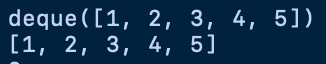
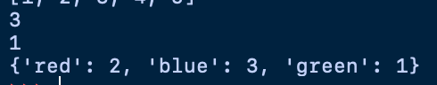

# Collections

* 파이썬에서 제공하는 자료구조 라이브러리

* 많은 자료구조 중 가장 많이 쓰일 클래스
* `deque`
* `Counter`


## deque

* `Queue` 자료구조를 이용하기 위해 사용하는 클래스이다.

* deque 클래스는 리스트 자료형과는 다르게 인덱싱, 슬라이싱등의 기능은 사용할 수 없다.

* deque method

  * `popleft()` : 첫 번째 원소를 제거.
  * `pop()` : 마지막 원소를 제거
  * `appendleft(x)` : 첫번째 인덱스에 원소삽입
  * `append(x)`: 마지막 인덱스에 원소 삽입.

* deque 선언방법

  * `변수 = deque(iterable 객체)`

  ```python
  # deque
  from collections import deque
  
  data = deque([2,3,4])
  
  data.appendleft(1)
  
  data.append(5)
  
  print(data)
  print(list(data))
  ```

  

## Counter

* iterable 객체에서 각 요소의 등장 횟수를 구해주는 클래스이다.

*  `변수 = Counter(iterable객체)`

* `변수[요소]` -> 해당 요소의 등장 횟수를 반환함.

  ```python
  from collections import Counter
  
  counter = Counter(['red','blue','red','green','blue','blue'])
  
  print(counter['blue'])
  print(counter['green'])
  print(dict(counter))
  ```

  

