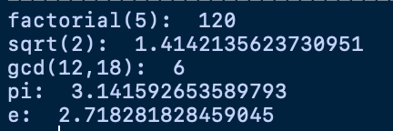

# Math

* 수학적인 기능을 포함하고 있는 라이브러리.

## 포함 함수들

* factorial : factorial 값 반환
* sqrt : 제곱근 반환
* gcd : 최대 공약수 반환
* pi : pi값 반환
* e : 자연상수 e 반환


```python
import math

print('factorial(5): ',math.factorial(5))

print('sqrt(2): ',math.sqrt(2))

print('gcd(12,18): ',math.gcd(12,18))

print('pi: ',math.pi)

print('e: ',math.e)

```

