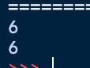

# bisect

* python 에서 이진 탐색을 쉽게 구현할 수 있도록 bisect 라이브러리를 제공한다.

* bisect 라이브럴는 **정렬된 배열** 에서 특정 원소를 찾아야 할 때 매우 효과적으로 사용된다. 


## 메서드

  * `bisect_left(a, x)` : 정렬된 순서를 유지하면서 리스트 a에 데이터 x를 삽입할 가장 왼쪽 인덱스를 찾는 메서드.
  * `bisect_right(a, x)` : 정렬된 순서를 유지하도록 리스트 a에 데이터 x를 삽일할 가장 오른쪽 인덱스를 찾는 메서드.

  ```python
  from bisect import bisect_left,bisect_right
  
  a = [1,2,4,4,6]
  
  x = 4
  
  print('list: ',a)
  
  print('4 left index: ',bisect_left(a,x))
  
  print('4 right index: ',bisect_right(a,x))
  
  
  ```


## 정렬된 리스트에서 값이 특정 범위에 속하는 원소의 개수 구하기

```python
from bisect import bisect_left, bisect_right

def count_by_range(List, left_value, right_value):

    # left right 값을 실수로 반대로 넣었을 때 바꿔주는 로직
    if(left_value > right_value):
        temp = left_value
        left_value = right_value
        right_value = temp
    
    right_index = bisect_right(List, right_value)
    left_index = bisect_left(List, left_value)
    return right_index - left_index

a = [1,2,3,3,3,4,4,8,9]

print(count_by_range(a,2,4))
print(count_by_range(a,4,2))
```




