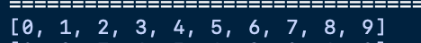
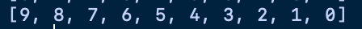

# heapq


* 파이썬에서 힙 기능을 위해 제공하는 라이브러리.
* `heapq` 는 다익스트라 최단 경로 알고리즘을 포함해 다양한 알고리즘에서 우선순위 큐 기능을 구현하고자 할 때 사용된다.
* 파이썬의 힙은 최소 힙으로 구성되어 있어 단순히 원수를 힙에 전부 넣었다가 빼는 것만으로도 시간 복잡도가 `O(NlogN)`에 오름차순 정렬이 완료된다.
* 매서드
  * 원소를 넣을 때: `heappush()`
  * 원소를 뺄때 : `heappop()`

## heqpq 로 구현하는 힙정렬

```python
import heapq

def heapsort(iterable):
    h = []
    result = []

    # 모든 원소를 차례대로 힙에 삽입
    for value in iterable:
        heapq.heappush(h,value)

    # 힙에 삽입된 모든 원소를 차례대로 꺼내어 담기
    for i in range(len(h)):
        result.append(heapq.heappop(h))

    return result

  
  
  myList = [1,3,5,7,9,2,4,6,8,0]

	result = heapsort(myList)
	print(result)

```



* 최대 힙(Max heap)은 python에서 제공해 주지 않는다.
* 하지만! 위에 정의한 힙정렬에서 값을 넣을때 부호를 바꾸어 넣은후 다시 꺼낼때 부호를 바꾸어 꺼내면 최대힙 구현이 가능하다.

```python
  import heapq
  def maxHeapsort(iterable):
      h=[]
      result=[]

      for value in iterable:
          heapq.heappush(h,-value)

      for i in range(len(h)):
          result.append(-heapq.heappop(h))

      return result
    
  myList = [1,3,5,7,9,2,4,6,8,0]

	result = maxHeapsort(myList)
	print(result)

```




