# 2020-03-12

---

## 데이터 조작

* SQL과 유사한 방법.

### 기본적인 함수

* `ggplot2` 패키지 : 그래프를 그리는 package

  * 이 패키지 안에 `mpg data set()`이 존재함.`(자동차 연비 데이터셋)`

  ```R
  install.packages("ggplot2")
  library(ggplot2)
  
  mpg
  ```

  

  * asdf

* 기본적인 함수

  1. `class()` : 데이터의 자료구조를 알고 싶을때.
  2. `ls()` : data frame에 대해서 적용되면 컬럼명을 출력.
  3. `head()` : 데이터의 앞쪽 6개만 출력.
  4. `tail()` : 데이터의 뒤쪽 6개만 출력.
  5. `View()` : View창을 이용해서 데이터를 출력.
  6. `dim()` : 행과 열의 갯수를 알려줌.
  7. `nrow()` : 행의 갯수.
  8. `ncol() : 열의 갯수.`
  9. `str() : data frame의 전반적인 정보를 출력함`
  10. `length()` : 개수를 구하는 함수. but data frame에게 적용하면 column의 갯수를 알려줌.
  11. `summary()` : 간단한 통계치를 보여준다.(숫자에 대하여)

### Data frame 제어 package

#### dplyr

* `dplyr` 패키지

  * 가장 많이 사용되는 package

    ```R
    install.packages("dplyr")
    library(dplyr)
    ```

* dplyr을 이용한 data frame 제어.

  * 먼저 사용할 데이터를 ecxel 파일을 통해 받아옴.

    ```R
    library(xlsx)# excel 파일을 이용하기 위한 package
    
    excel_data <- read.xlsx(file.choose(),
                            sheetIndex = 1,
                            encoding = "UTF-8")
    ```

  * `dplyr`은 data frame을 제어하는데 특화된 함수를 제공한다.

  * chaining을 지원하기 떄문에 편하게 data frame을 제어할수 있다.

  * `chaining : ( %>%)`

* 함수들

  1. `rename()` : 컬럼명 변경

     ```R
     rename(excel_data,Y17_AMT = AMT17) #(data frame, 바꿀컬럼명 = 바꾸기 전 컬럼명.)
     # 실제값은 변하지 않는다. 
     ```

     

  2. `filter()` : SQL에서 where 과 비슷한 구문

     ```R
     # 2. filter(data frame, 조건1,조건2,....)
     df = filter(excel_data, SEX == "M")
     # 조건 여러개도 가능.
     df = filter(excel_data, 
                 SEX == "M",
                 AREA == "서울")
     # 하나의 속성에 여러 조건 쓸 경우. %in% 사용.
     df = filter(excel_data, 
                 SEX == "M",
                 AREA %in% c("서울","경기"))
     ```

     

     

     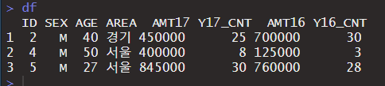

  3. `arrange()` : 정렬

     ```R
     # 3. arrange(data frame,column명 ,desc(column명)) -> 두번째 컬럼명은 동률이 있을때 비교하는 컬럼작성
     #     기본적으로 정렬은 오름차순 정렬
     #     내림차순 정렬시에는 desc() 를 이용
     df = arrange(excel_data,
                  SEX,desc(AGE))
     ```

     

  4. chaining : `%>%` 사용. 뒤에오는 함수에는 data frame 생략.

     ```R
     ## 성별이 남자인 사람들만 찾아서 나이순으로 정렬해서 출력
     df = arrange(filter(excel_data,SEX=="M"),desc(AGE)) # chaining 안쓴것.
     df = filter(excel_data,SEX=="M") %>% arrange(desc(AGE)) # chaining 사용함.
     df
     ```

     

  5. `select()` : 보고싶은 속성만 가져오기.

     ```R
     # select(data frame, 컬럼명, 컬럼명, ........)
     df = filter(excel_data,
                 SEX=="M") %>% 
          arrange(desc(AGE)) %>%
          select(ID,SEX,AREA)
     df
     
     df = filter(excel_data,
                 SEX=="M") %>% 
          arrange(desc(AGE)) %>%
          select(-SEX) # 성별 빼고 나머지 모두
     df
     ```

     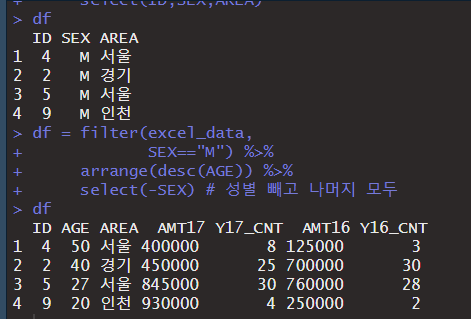

  6. `mutate()` : 컬럼 새롭게 생성.

     ```R
     # 5. mutate(data frame, column명=수식, column명=수식...)
     # 남자중에 AMT17이 10만 이상인사람 VIP로 설정.
     df = filter(excel_data,
                 SEX=="M") %>%
           mutate(VIP =AMT17>500000)
     df
     ```

     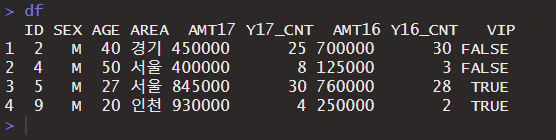

  7. `summarise()` : 집계함수 표현.

     ```R
     # 6. summarise(data frame,추가할 column명=함수, column명=함수) sum():특정컬럼 합 n(): 특정 컬럼수.
     df = summarise(excel_data,
                    SUM17AMT=sum(AMT17),cnt=n())
     df
     ```

     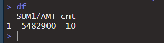

  8. `group_by()` : 범주에 나눠주는 함수. -> `summarise()`와 같이 사용된다.

     ```R
     df = group_by(excel_data,
                   SEX) %>%
          summarise(SUM17AMT=sum(AMT17),cnt=n())
     df
     ```

     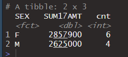

  9. `bind_rows()` : 두개의 data frame을 연결. -> 컬럼형태가 같아야함.

     ```R
     df1 <- data.frame(x=c(1:4))
     df2 <- data.frame(x=c(5:8))
     bind_rows(df1,df2)
     ```

     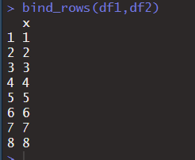

* 

## 데이터조작 이용한 예제

* 사용되는 data frame : `ggplot2` 패키지 내에 있는 `mpg` 를 이용.

* 데이터 조작을 위해 `dplyr` 패키지를 이용.

  ```R
  install.packages("ggplot2")
  install.packages("dplyr")
  # EDA : 탐색적 데이터 분석
  library(ggplot2)
  library(dplyr)
  mpg = as.data.frame(mpg)   # mpg data frame
  
  View(mpg)
  # 주요컬럼
  # manufacturer : 제조회사
  # displ : 배기량
  # cyl : 실린더 개수
  # drv : 구동 방식
  # hwy : 고속도로 연비
  # class : 자동차 종류
  # model : 자동차 모델명
  # year : 생산연도
  # trans : 변속기 종류
  # cty : 도시 연비
  # fl : 연료 종류
  ```

  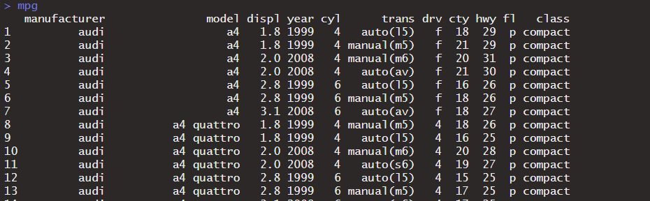

1. 자동차 배기량에 따라 고속도로 연비비교

   ```R
   # 1. 자동차 배기량에 따라 고속도로 연비가 다른지 알아보려 한다. 
   # displ(배기량)이 4 이하인 자동차와 4 초과인 자동차 중 
   # 어떤 자동차의 hwy(고속도로 연비)가 평균적으로 더 높은지 확인하세요. 
   mpg
   df <- mutate(mpg,
                DISPL_DIFF = ifelse(displ <= 4,"Low","High")) %>%
         group_by(DISPL_DIFF) %>%
         summarise(AVG_DISPL = mean(hwy))
   df
   ```

   

2. "chevrolet", "ford", "honda" 자동차의 고속도로 연비 평균 비교.

   ```R
   # 2. 자동차 제조 회사에 따라 도시 연비가 다른지 알아보려고 한다. 
   # "audi"와 "toyota" 중 어느 manufacturer(제조회사)의 cty(도시 연비)가 
   # 평균적으로 더 높은지 확인하세요.
   
   df <- filter(mpg,manufacturer %in% c("audi","toyota")) %>%
         group_by(manufacturer) %>%
         summarise(AVG_CTY = mean(cty))
   df
   ```

   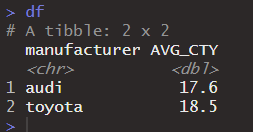

3. "chevrolet", "ford", "honda" 자동차의 고속도로 연비 평균비교

   ```R
   # 3. "chevrolet", "ford", "honda" 자동차의 고속도로 연비 평균을 알아보려고 한다. 
   # 이 회사들의 데이터를 추출한 후 hwy(고속도로 연비) 전체 평균을 구하세요.
   df <- filter(mpg,manufacturer %in% c("chevrolet","ford","honda")) %>%
         group_by(manufacturer) %>%
         summarise(HWY_CTY = mean(hwy))
   df
   ```

   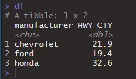
   
4. "audi"에서 생산한 자동차 중에 어떤 자동차 모델의 hwy(고속도로 연비) 비교

   ```R
   # 4. "audi"에서 생산한 자동차 중에 어떤 자동차 모델의 hwy(고속도로 연비)가 
   # 높은지 알아보려고 한다. "audi"에서 생산한 자동차 중 hwy가 1~5위에 해당하는 
   # 자동차의 데이터를 출력하세요.
   
   df <- filter(mpg,manufacturer == "audi") %>%
         arrange(desc(hwy)) %>% head(5)
   df
   ```

   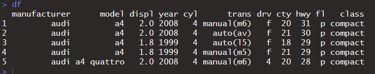

5. 회사별로 "suv" 자동차의 평균 연비

   ```R
   # 5. mpg 데이터는 연비를 나타내는 변수가 2개입니다. 
   # 두 변수를 각각 활용하는 대신 하나의 통합 연비 변수를 만들어 사용하려 합니다. 
   # 평균 연비 변수는 두 연비(고속도로와 도시)의 평균을 이용합니다. 
   # 회사별로 "suv" 자동차의 평균 연비를 구한후 내림차순으로 정렬한 후 1~5위까지 데이터를 출력하세요.
   df <- mutate(mpg,avgy=(cty+hwy)/2) %>%
         filter(class=="suv") %>%
         group_by(manufacturer) %>%
         summarise(AVGY = mean(avgy)) %>%
         arrange(desc(AVGY)) %>% head(5)
   df
   ```

   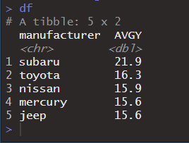

6. class별 cty 평균비교

   ```R
   # 6. mpg 데이터의 class는 "suv", "compact" 등 자동차의 특징에 따라 
   # 일곱 종류로 분류한 변수입니다. 어떤 차종의 도시 연비가 높은지 비교하려 합니다. 
   # class별 cty 평균을 구하고 cty 평균이 높은 순으로 정렬해 출력하세요.
   df <- group_by(mpg,class)%>%
         summarise(avg_cty=mean(cty))%>%
         arrange(desc(avg_cty))
   df
   ```

   

7. 회사별 hwy(고속도로 연비) 비교

   ```R
   # 7. 어떤 회사 자동차의 hwy(고속도로 연비)가 가장 높은지 알아보려 합니다. 
   # hwy(고속도로 연비) 평균이 가장 높은 회사 세 곳을 출력하세요.
   df <- group_by(mpg,manufacturer) %>%
         summarise(avg_hwy=mean(hwy)) %>%
         arrange(desc(avg_hwy)) %>% head(3)
   df
   ```

   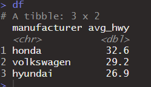

8. 각 회사별 "compact" 차종 수 비교

   ```R
   # 8. 어떤 회사에서 "compact" 차종을 가장 많이 생산하는지 알아보려고 합니다. 
   # 각 회사별 "compact" 차종 수를 내림차순으로 정렬해 출력하세요.
   df <- filter(mpg,class=="compact") %>%
         group_by(manufacturer) %>%
         summarise(count=n()) %>%
         arrange(desc(count))
   df
   ```

   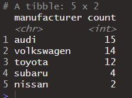

   

   