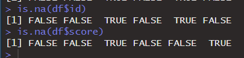
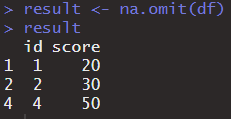
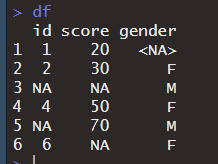
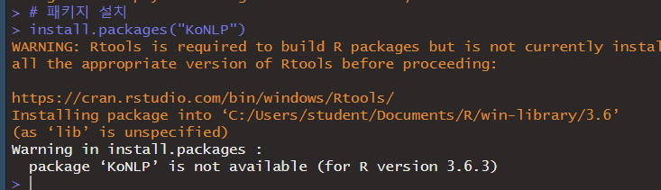
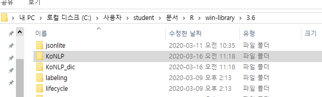
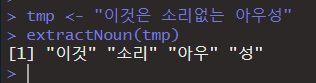
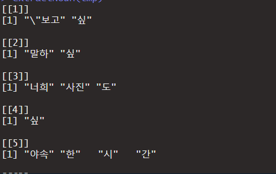
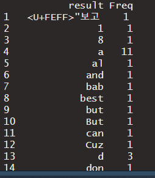
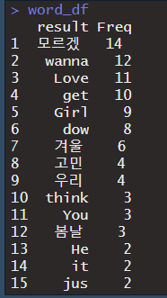

# 2020-03-16

---

## 데이터 정제

- 데이터 분석이전에 raw데이터 (현장에서 수집한 데이터)를 분석이 가능한 형태로 가공하는 작업이 선행되어야 한다.
- 데이터 셋을 만드는 것이 가장 어렵다.

* `PreProcessing (전처리)`

### 1. NA처리(결측치 처리)

* NA를 처리하기 위해 사용하는 함수

* `is.na()`

  ```R
  df <- data.frame(id=c(1,2,NA,4,NA,6),
                   score=c(20,30,NA,50,70,NA))
  is.na(df)
  is.na(df$id)
  is.na(df$score)
  ```

  

  

  * 데이터프레임 제어할때는 `dplyr`

    1. `NA` 삭제 : `NA`가 들어가 있는 데이터가 전체 데이터크기에 비해 상대적으로  아주 작을때는 삭제하는게 좋을 수 있다.

       ```R
       # id가 NA인 row를 data frame에서 삭제하기.
       result <- df %>% 
                 filter(!is.na(df$id)) # chaining을 이용한 데이터 정제.
       result <- df %>% 
                 filter(!is.na(df$id),
                        !is.na(df$score))
       ```

       

       

       * `na.omit()` 함수를 통해 더 간단하게 처리할 수 있다. 

       ```R
       result <- na.omit(df) # na.omit() : 모든 NA 찾아서 삭제
       ```

       

       * NA값을 무작정 삭제하는건 그다지 바람직한 방법이 아님.
       * `NA` 값 다른 값으로 대체하는 것이 좋음.
       * NA값을 해당컬럼의 평균값, 최소값, 최대값, 등등 이용해서 적절한 값으로 대체.

    2. 평균으로 대체

       ```R
       df <- data.frame(id=c(1,2,NA,4,NA,6),
                        score=c(20,30,NA,50,70,NA))
       df
       
       mean(df$score)
       mean(df$score, na.rm = TRUE)
       ```

       

       

       * NA가 포함되어 있으면 수학적 계산이 불가능.
       * `na.rm` 속성을 통해 `NA`를 무시하고 평균 취할 수 있다.
       * score의 NA값을 score안에 있는 NA를 제거한 모든 값의 평균으로 대체해서 새로운 data frame을 만들어 사용해보자.

       ```R
       df$score <- ifelse(is.na(df$score),
                          mean(df$score, na.rm = TRUE),
                          df$score) # 3항 연산자를 이용.
       ```

### 2. 이상치 처리

1. 사용할 수 없는 값이 포함된 경우.

  ```R
  df <- data.frame(id=c(1,2,NA,4,NA,6),
                   score=c(20,30,NA,50,70,NA),
                   gender=c("^^","F","M","F","M","F")) # ^^ : 이상치
  
  ```

* 이상치는 먼저 NA로 변환한 후 NA를 처리하는 방식으로 진행.

  ```R
  df$gender <- ifelse(df$gender %in% c("M","F"),
                      df$gender,
                      NA)
  df
  ```

  

2. 극단치값이 포함되어 있는 경우 이 값을 해결.
   1. 극단치 값은 나중에 가중치를 많이 받게되어 처리해 줘야 한다.
   2. 극단치에 대한 기준을 우리가 설정해야 한다.
   3. 이 기준을 잡는 방법은 논리적으로 이상적인 범위를 설정 통계적인 방법으로 이상적인 범위를 설정.

---

## 그래프

* `ggplot2` 패키지를 이용하여 그래프를 그리기.
* `mpg` table을 이용하여 그래프 그려보기.

  ```R
  df <- as.data.frame(mpg)    # table 형식의 데이터를 data frame으로 변환.
  ```
> ggplot2의 그래프 그리는 방식
>
> 1. 배경설정 (x축과 y축 설정).
> 2. 실제 그래프를 추가 (선, 막대, 점).
> 3. 축범위, 색과 같은 설정을 추가.


### 1. 산점도(scatter plot)

* 2차원 평면 (x축,y축)에 점으로 표현한 그래프.

* 변수간에 상관관계에 대해 알아볼 때 사용하기 유용한 그래프.

* 예시 ) 배기량과 고속도로 연비의 관계를 알기위해서 산점도를 그려보기.

  ```R
  ## 1)축설정
  ggplot(data = df, #사용할 데이터 프레임
          aes(x=displ, y=hwy)) # x,y축 지정
  
  ## 2)그릴 그래프 설정.
  ## + ggplot2에서 이어간다는 의미.
  ggplot(data = df, 
          aes(x=displ, y=hwy)) + 
    geom_point()   # 산점도 그리는 함수.
  ```

  

  ```R
  ## 3) 그래프 설정
  
  ggplot(data = df, 
          aes(x=displ, y=hwy)) + 
    geom_point() + 
    xlim(3,6) + 
    ylim(20,40) # 그래프 범위 정해서 보기.
  ```

  

  

### 2. 막대그래프

- 일반적으로 두 집단간의 차이를 볼때 사용하는 그래프.

- 예제) 우리가 갖고 있는 자동차 데이터를 이용해서 구동방식별 고속도로 연비차이 비교

  ```R
  ## 모든 차량 데이터를 구동방식별로 grouping.
  result <- df %>%
          group_by(drv) %>%
          summarise(mean_hwy = mean(hwy))
  ```

  

  ```R
  ggplot(data = result,
         aes(x=drv,y=mean_hwy))+
    geom_col() # col : 막대그래프
  ```

  

### 3. boxplot

* 구동방식에 따른 고속도로 연비를 boxplot으로 그려보고 어떤 의미를 내포하고 있는지 알아보자.

  ```R
  ggplot(data=df,
         aes(x=drv,y=hwy)) +
    geom_boxplot()
  ```

  

* `boxplot` : 4분위 개념으로 그래프를 그린것. 

* 1사분위 3사분위 사이의 값을 박스로 표현.

  1. 박스 : 데이터가 주로 모여있는 범위
     * 박스 안에 굵은 선 > 2사분위.
  2. 맨위 : 최댓값, 맨아래 : 최소값
  3. 점 : 이상치(극단치)

> 사분위 개념.
> data <- c(1,2,3,4,5,6,7,8,9,10,11,12,50)
> mean(data)
> 2사분위 : 데이터의 중간에 있는 값. 중위수.
>
> 평균의 맹점을 해결하는 방법.

---

  ## 워드 클라우드

* 한글 형태소 분석 
* 형태소 : 뜻을 가진 가장 작은 단위.


* `영화댓글사이트에서 특정 영화에 대한 댓글을 모아서 형태소를 분석한 후 해당 내용을 이용해서 워드 크라우드를 만들기.`

* 한글 형태소를 분석하기 위해서는 특수한 package가 필요.

* `KoNLP(Korean Natural Language Process)`

  ```R
  ## 한글 형태소를 분석하기 위해서는 특수한 package가 필요.
  ## KoNLP(Korean Natural Language Process)
  
  # 패키지 설치
  install.packages("KoNLP")
  ```

  

  * 안됨...(현재는 불가능. 아마 업데이트 예정.)

* `KoNLP` [KoNLP다운로드.zip](..\..\KoNLP다운로드.zip) 

* 다운받은 패키지를 `.libPaths()`함수를 이용해 라이브러리 경로를 찾아서 넣기.

  

* 첫번째 경로에 붙여넣기.

  

* 디팬던시 걸린 패키지 다운....(제발 빨리 업데이트 해줘 개귀찮..)

  ```R
  install.packages("Sejong")
  install.packages("hash")
  install.packages("tau")
  install.packages("RSQLite")
  install.packages("devtools")
  
  library(KoNLP)
  ```

  

* Load 완료!


### `KoNLP`

* 한글 형태소 분석 패키지.

* 사전을 등룍하여 한글 단어를 알려줘야함.

* 사용가능한 사전 

  1. 시스템
  2. 세종 : 약 40만개 단어
  3. NIADIC : 가장 사이즈가 큼. 약 90만개

  ```R
  useNIADic() # NIADIC 사용하는 함수.
  
  tmp <- "이것은 소리없는 아우성"
  
  extractNoun(tmp)
  ```

  

* 문자열 여러개일때..

  * 각 라인에 대해 형태소 분석을 따로 하게됨.
  * 리스트 형태로 출력

  ```R
  library(stringr) # package 로딩
  
  tmp <- readLines(file.choose(),encoding = "UTF-8")
  tmp
  
  
  extractNoun(tmp)
  ```

  

* 리스트 안에 요소로 각 줄에 대한 형태소 분석 결과가 출력됨.

* 처리하기 어려움. -> 리스트를 풀어서 벡터로 만들기. `unlist()` 함수이용

  ```R
  words <- extractNoun(tmp)
  
  
  result <- unlist(words) # 하나의 벡터안에 모든 값을 저장.
  result
  ```

  


### 글자 빈도 구하기

* 똑같은 단어가 몇개 나오는지 확인

* `table()` : 빈도 구하는 함수.

  ```R
  wordcount <- table(result)
  wordcount
  ```

  
  
* 구한 빈도수를 data frame으로 만듬

  ```R
  wordcount_df <- as.data.frame(wordcount,
                                stringsAsFactors = FALSE)
  
  wordcount_df
  ```

  

* 만든 data frame에서 필요한 정보만 추출하기

  ```R
  word_df <- wordcount_df %>%
             filter(nchar(result) >= 2) %>%# nchar 글자수 출력함수.
             arrange(desc(Freq)) %>%       # 내림차순으로 정렬
             head(20)                      # 상위 20개 출력
  word_df
  ```

  

### 워드클라우드 이미지 만들기

* 사용되는 패키지 `wordcloud`

  ```R
  install.packages("wordcloud")
  library(wordcloud)
  # 팔레트 설정. (색상 설정.)
  # 단어 색상 목록 설정.
  pal <- brewer.pal(8,"Dark2") # Dark2 목록에서 8개 색상 지정.
  # wordcloud는 생성할 때 마다 다르게 생성.
  # 내부적으로 랜덤하게 만들어짐.
  # 만약 같은 형태의 wordcloud를 생성하고 싶으면
  # random에 대한 seed값을 설정.
  
  set.seed(1)  # 초기숫자 설정.
  
  wordcloud(words = word_df$result, # 사용할 단어
            freq = word_df$Freq,    # 단어 빈도수
            min.freq = 2,           # 최소 빈도수
            max.words = 200,        # 최대 단어수
            random.color = F,       # 고빈도 단어 중앙위치.(T이면 랜덤)
            rot.per = .1,            # 글자 살작 회전해여 만듬
            colors = pal)           # 색상 
  ```

  

### 

* 

