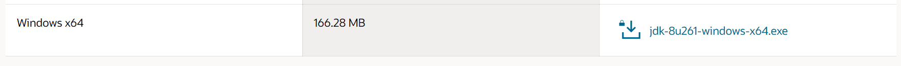
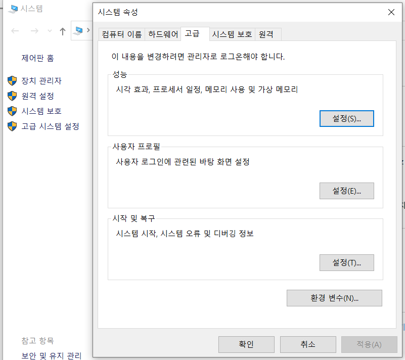
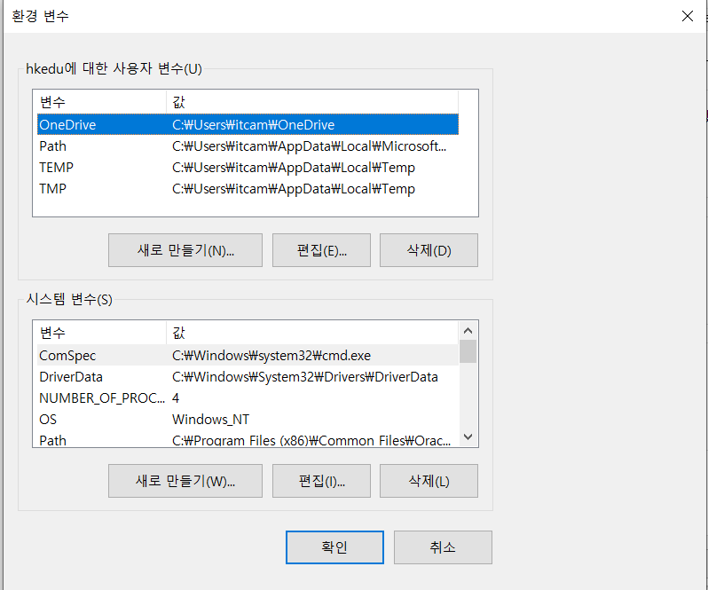
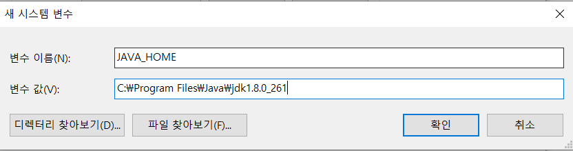
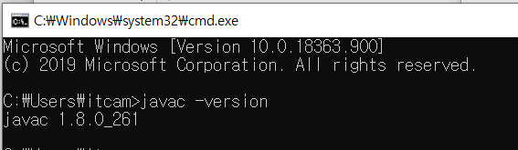
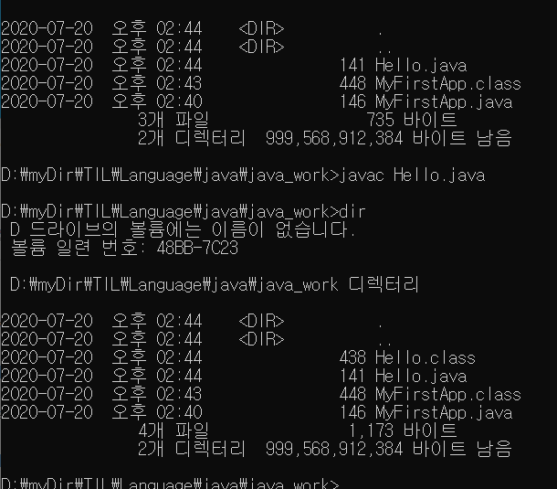
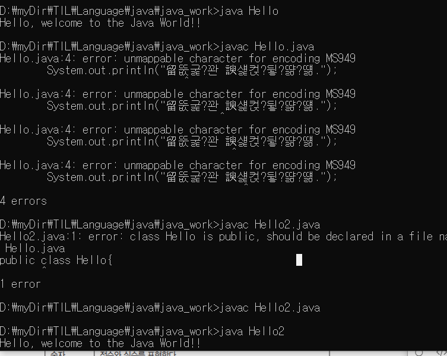
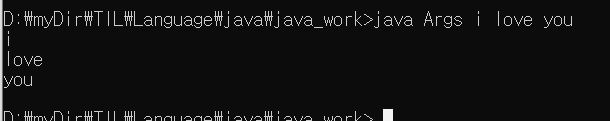

# Java Day01

## jdk download


* java JDK (Java Development Kit) - Library
* java JRE - Java로 만든 프로그램을 돌게 만들어주는 것.



## Install

* 설치 위치 잘 확인하기

  

* 설치완료

## 환경설정(Path설정)

* 자바를 실행해 주는 프로그램 : `java.exe`

* 자바 Vm을 만들어 주는 프로그램(Java를 컴파일 해주는 프로그램) : `javac.exe`

  

* 환경 변수 클릭

* 시스템 환경을 설정하는 창

  

* `JAVA_HOME` 시스템 변수와 경로 지정.

  

* Path 변수에 `%JAVA_HOME%\bin` 추가

  

* 위와 같이 설정하면 `javac`의 경로를 확인 할 수 있다.

  


## cmd 에서 java 실행하기

* cmd 창에서 해당 폴더로 이동한 후 `javac 파일명.java` 로 명령어를 입력 해 준다.

  

* `javac` 명령어를 실행하면 `해당파일.class` 파일이 생성된다.

* 실행은 `java 파일명` 으로 실행해 준다.

  

* 한글 입력시 깨질때는 저장 인코딩을 ANSI로 저장해 준다.

  

* 메모장에 여러 클래스가 있을때!

  * 한 곳에 class가 여러개가 존재해도 컴파일 해주면 `.class`는 각각 만들어 준다.

    ```java
    public class Greet{
    	public static void main(String[] args){
    		System.out.println("Say Hi~");
    		Hi hi = new Hi();
    		hi.print();
    		hi.print();
    		hi.print();
    	}
    }
    
    class Hi{
    	public void print(){
    		System.out.println("Hi, I'm the King of JAVA~");
    	}
    }
    ```

  * 컴파일하기

    

  * 해당폴더 (`Greet.class` 와 `Hi.class` 두개가 생성됨)

    

## args 의 의미

* 해당 java 파일을 실행할 때 매개변수를 입력시켜줄 때 args 배열에 저장이 된다.

  ```java
  public class Args{
  	public static void main(String[] args){
  		System.out.println(args[0]);
  		System.out.println(args[1]);
  		System.out.println(args[2]);
  	}
  }
  ```

* cmd

  


## Eclipse

* 자바를 개발 할 수 있는 IDE (Integrated Development Enviroment)

* java 폴더 설정

  

* 자동으로 해준다 여기 건드리면 큰일남~!

* 기본적인 메서드나 파일들 자동완성은 `Ctrl+space`

* src 폴더의 파일들은 실제 java 코드이고 bin 파일안에 들어있는 파일은 .class 파일로 실제 실행되는 java 프로그램이다.


### 주석

* 주석은 실제 프로그램 코드에 코드로 실행되지 않고 개발자의 설명을 작성해 주는 도구(?) 이다.

* 코딩에 있어서 주석(Comment) 는 중요하다!
  1. `/** */- javadoc comment` : javadoc 형식이 이 문서로 되어있음!
  2. `//`: 이 기호 뒤쪽 문장은 모두 주석
     * 단축키는 `Ctrl + /` 를 이용하여 해당 줄을 모두 주석처리 가능
     * 텍스트 블록도 가능!
  3. `/**/` : 다행주석, 단축키는 `Ctrl + Shift + /`

### 단축키

* `Ctrl + d` : 한줄삭제
* `Ctrl + 방향키` : 줄 복사
* `Alt + 방향키` : 해당줄 이동


---

## Java

### 변수

* 값을 저장할 수 있는 메모리 공간
* 변수를 만든다 = 메모리 공간을 만든다.
* 정확히 말하면 변수에 값을 넣으면 해당 값의 메모리의 주소가 변수에 들어가게 된다.
* 변수 사용시 해당 메모리의 주소를 참조하여 사용한다!

#### 사용하는 이유

* 값을 재활용 할 수 있다.
* 일괄 수정이 편하다.

#### 변수 명명 규칙

* 대소문자 구분
* 숫자로 시작할 수 없다.
* 영문자, $, _ 로 시작할 수 있다.
* 예약어 사용 못한다.
* 상수는 모두 대문자
* CamelCase를 이용하여 작성한다.

#### 선언

* java 에서는 변수 선언시 타입 부여

  ```java
  int num1;
  ```

* 선언후 해당 타입에 맞는 값을 `=` 를 통해 저장할 수 있다.

  ```java
  num1 = 7;
  ```

* 선언과 동시에 초기화 가능.

  ```java
  int num1 = 7;
  ```

> 컴퓨터에서 `=`의 의미는 수학에서 처럼 같다는 것이 아닌 `=`의 오른쪽에 있는 것을 왼쪽에 넣는다는 의미이다.


# 참고사항

> 메모장 사용시 Notepad++를 이용하자 훨씬 좋다
>
> 

>cmd 창에서 자동완성 안될때.
>
>윈도우키 + R 누른후 regedit 를 실행
>
>여기서 Ctrl + F 로 `completionChar` 를 찾기
>
>`CompletionChar` 와, `PathCompletionChar`를 9로 수정하면 cmd 창에서 tab키(자동완성)를 사용할 수 있다!
>
>

> 자바는 운영체제에 독립적이다
>
> [Java 8 Document](https://docs.oracle.com/javase/8/docs/api/) - 언어를 배울 때 가장 중요한 문서이다. 언어의 사용 방법이 적혀있다.
>
> 띵언 에러를 내는것은 멋 고치는 것은 실력이다!ㅋㅋㅋㅋㅋㅋ

