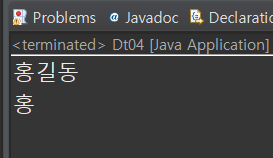

# Java Day02

## 변수

### 종류

1. Field 변수
   * int 를 field로 선언하면 자동으로 0으로 초기화된다.
   * 데이터 타입별로 초기화 되는 값이 정해져 있다.
2. Local 변수
   * 로컬 변수는 메소드 안에서 선언하는 변수이다.
   * 로컬 변수는 초기화 해야 사용이 가능하다.


* `scope` : 변수 사용 범위

## 자료형

### 기본형

* number type

  * 정수타입 : byte, char(문자형), short, int, long
  * byte 수  :   1    /     2          /            2   /   4   /  8

  > byte 란? 
  >
  >  1byte = 8bit
  >
  > bit 란?
  >
  >  0 or 1 을 담을 수 있는 공간(메모리에 담는 최소단위)
  >
  >  1 byte : 0000 0000 (2) -> 2^8 = 256가지 => -128~127 까지 숫자 가능.
  >
  >  첫 번째 bit를 부호비트 라고 한다. 0 : 양수 1 : 음수

  * 각 타입별 범위
    * byte(8bit) : -128 ~ 127
    * int(32bit) : -2^31~ 2^31-1
    * long(64bit) : -2^63~ 2^63-1   -> 숫자뒤에 `l or L`을 표시해줌

> 데이터 타입의 범위는 중요하다. 의도치 않은 자료가 나올 수 있다.

* 실수 타입

  * `float / double` : 소숫점 있는 숫자
  * byte 수 : float - 4 / double - 8
  * float 타입은 숫자뒤에 `f or F` 를 표시해준다.

  ```java
  	float var7 = 3.14f;
  	float var8 = 3e6f; // 3000000.0f
  	double var9 = 3e6; // 3000000.0
  		
  	double var10 = 2e-3; // 0.002
  		
  	System.out.println(var7);
  	System.out.println(var8);
  	System.out.println(var9);
  	System.out.println(var10);
  ```

### 문자형

* `char` : 사실상 `char`도 알고보면 정수형이지만 그 정수는 바로 아스키(ASCII) 코드이다!

  ```java
  char c1 = 'A';
  		char c2 = 65;
  		char c3 = '\u0041';
  		
  		System.out.println("c1: " + c1);
  		System.out.println("c2: " + c2);
  		System.out.println("c3: " + c3);
  		
  		// ASCII code 0A0D : 개행문자 \n
  		
  		int ic = c1; // char 타입의 변수값을 int 타입으로 형변환 - 자동형변환 : 크기가 작은 타입에서 큰 타입으로 형변환됨.
  		System.out.println(ic);
  		
  		char c4 = '가';
  		System.out.println(c4);
  		
  		ic = c4;
  		System.out.println(ic); // 한글은 유니코드값으로 저장됨 가 -> 44032
  		
  		char c5 = 44033;
  		System.out.println(c5);
  ```

###  Boolean Type

* 1 byte 로 표현되는 논리타입이다.

* 값은 True, False 밖에 없다.

  ```java
  public class Dt03 {
  	public static void main(String[] args) {
  		boolean stop = false;
  		
  		if(stop) {
  			System.out.println("Stop!!");
  		}else{
  			System.out.println("Go!!");
  		}
  	}
  }
  
  ```

## 문자열

* `String` 으로 문자열 형태의 변수를 사용할 수 있다.

* String은 참조변수 이다. 그러나 기본 데이터 타입처럼 사용이 가능하다.

* 문자열 저장은 쌍 따옴표 `""`로 초기화가 가능하다.

  ```java
  public class Dt04 {
  	public static void main(String[] args) {
  		
  		String str = "홍길동";
  		System.out.println(str);
  		
  		System.out.println(str.charAt(0));
  	}
  }
  ```

  

​	

## 형변환 (type conversion)

* data type을 바꿈

* 자동형변환 (작은타입 -> 큰타입)

* 강제형변환 => `()` 안에 바꿔줄 타입을 명시해 줌.

  * 데이터 손실을 감소 할 수 밖에 없다.

  ```java
  public class Dt05 {
  
  	public static void main(String[] args) {
  		
  		int num1 = 200;
  		System.out.println(num1);
  		
  		double num2 = num1; // int type의 값을 double type 변수에 대입 - 자동형변환 (작은타입 -> 큰타입)
  		System.out.println(num2);
  		
  //		int num3 = num2; - Type mismatch: cannot convert from double to int
  		int num3 = (int)num2; // 강제 형변환 - 데이터 손실을 감소 할 수 밖에 없다.
  	}
  }
  ```

* 연산에 의한 형변환

  * 자동형변환 : int + double -> double
  * 변수를 정수와 연산하면 int값으로 반환된다. 따라서 (char)를 해줘야 함
  * char는 빈 문자로 초기화 할 수 없다.
  * int 보다 작은 타입을 연산하면 자동으로 int로 형변환된다.

  ```java
  public class Dt06 {
  
  	// field (전역변수)
  	String name; // 자동 초기화
  
  	public static void main(String[] args) {
  		int intV = 10;
  		double doubleV = 5.5;
  
  		double result1 = intV + doubleV; // 자동형변환 : int + double -> double
  		int result2 = (int) (intV + doubleV); // 강제형변환
  		int result3 = intV + (int) doubleV; // 강제형변환
  
  		System.out.println(result1 + " : " + result2 + " : " + result3);
  
  		char a = 'A';
  		char b = 'A' + 1; // 'B'
  		System.out.println(a + " : " + b);
  
  		int c = a + 1;// => 65 + 1
  
  		char d = (char) (a + 1); // 변수를 정수와 연산하면 int값으로 반환된다. 따라서 (char)를 해줘야 함
  
  		System.out.println(c + " : " + d);
  
  		// 필드 변수 자동 초기화 값
  		String str = ""; // 빈 문자열로 초기화
  		int num = 0;
  		float fl = 0.0f;
  //		char e = ''; // char는 빈 문자로 초기화 할 수 없다.
  
  		byte b1 = 10;
  		byte b2 = 20;
  		byte result = (byte) (b1 + b2); // int 보다 작은 타입을 연산하면 자동으로 int로 형변환된다.
  		System.out.println(result);
  
  	}
  
  }
  ```

## 타입 지정 및 이스케이프 문자

* 타입 지정

  * `%c` - char
  * `%s` - String
  * `%d` - Integer
  * `%f` - 실수
  * `%b` - boolean

  ```java
  public class Printf {
  	public static void main(String[] args) {
  		
  		// printf : 출력 타입 지정하고 뒤에 순서대로 붙여줌
  		/*
  		 * 타입 지정 : %c - char/ %s - String/ %d - Integer
  		 * 			%f - 실수 / %b - boolean
  		 *  \(이스케이프 문자) : \n - 줄바꿈 (enter키)
  		 *  				 \t - tab
  		 *  				 \\ -  백슬레시
  		 */
  		System.out.println("문자" + 'A'+" 의 유니코드 값은 "+(int)'A');
  		System.out.printf("문자%c 의 유니코드 값은 %d\n",'A',(int)'A');
  		System.out.printf("문자%c 의 유니코드 값은 %d\n",'글',(int)'글');
  		
  		System.out.printf("3자리 숫자: %d는 %s다 => %b\n",379,"짝수",false);
  		System.out.printf("열 자리에 3자리 숫자 %10d를 오른쪽 정렬\n",379);
  		System.out.printf("열 자리에 3자리 숫자 %-10d를 왼쪽 정렬\n",379);
  		System.out.printf("열 자리에 3자리 숫자 %010d를 오른쪽 정렬 빈자리 0\n",379);
  		System.out.printf("%f를 소숫점 2째자리까지 반올림 하면 %.2f 가 됩니다.\n",3.14512,3.14);
  		System.out.printf("%f를 정수 다섯자리, 소숫점 2째자리까지 반올림하면 &7.2f가 됩니다.\n",3423.1415920,3423.1415920);
  	}
  }
  ```

## 입력값 받기

### System.in을 이용한 입력받기

* 기본적으로 System 은 Console을 가르키는 객체로 본다.

* 해당 객체에서 Input스트림인 in에서 read 매서드를 이용하여 1개의 문자를 가져올 수 있다.

* 여기서 입력후 엔터를 치게되면 `\r\n`이란 문자가 같이 들어와 해당 값을 GC를 이용하여 처리 하여준다.

  ```java
  public class SyscCharInput {
  
  	public static void main(String[] args) throws IOException {
  
  		char a = '0';
  		System.out.println(a);
  		System.out.println((int) a);
  
  		System.out.println("2부터 9사이의 숫자를 입력하세요>>> ");
  //		int num = System.in.read() - 48;
  		int num = System.in.read() - '0';
  		System.out.printf("입력한 숫자는 %d입니다. \n", num);
  		
  		// enter 값 발생 : 다음입력을 위해 처리
  		// \r\n : 엔터키 값. 13 10
  		// 두 값을 받아서 변수에 저장하지 않으면 쓰레기 처리반 (garbage collector 가 처리)
  //		System.in.read(); // \r
  //		System.in.read(); // \n
  		
  		System.in.skip(2); // 입력 2개 건너뛰기
  		
  		System.out.println("a~z 사이의 문자 하나를 입력하세요>>> ");
  		char input = (char) System.in.read();
  
  		System.out.printf("입력한 문자는 %c입니다. \n", input);
  
  	}
  
  }
  ```

### Scanner 객체이용

```java
import java.io.IOException;

public class SyscCharInput {

	public static void main(String[] args) throws IOException {

		char a = '0';
		System.out.println(a);
		System.out.println((int) a);

		System.out.println("2부터 9사이의 숫자를 입력하세요>>> ");
//		int num = System.in.read() - 48;
		int num = System.in.read() - '0';
		System.out.printf("입력한 숫자는 %d입니다. \n", num);
		
		// enter 값 발생 : 다음입력을 위해 처리
		// \r\n : 엔터키 값. 13 10
		// 두 값을 받아서 변수에 저장하지 않으면 쓰레기 처리반 (garbage collector 가 처리)
//		System.in.read(); // \r
//		System.in.read(); // \n
		
		System.in.skip(2); // 입력 2개 건너뛰기
		
		System.out.println("a~z 사이의 문자 하나를 입력하세요>>> ");
		char input = (char) System.in.read();

		System.out.printf("입력한 문자는 %c입니다. \n", input);

	}

}
```


#### 예제

* 온도 변화기

```java
import java.util.Scanner;

// 온도 변화기 : 화씨, 섭씨 온도를 입력받아 변환하여 출력
public class TempConverter {
	public static void main(String[] args) {

		Scanner scan = new Scanner(System.in);

		System.out.println("화씨->섭씨: 1, 섭씨 -> 화씨: 2 선택 >>>");
		String kind = scan.nextLine();
		int select = Integer.parseInt(kind);
		
		if (select == 1) {
		
			System.out.println("화씨 온도를 입력하세요. >>>");
			String tmp = scan.nextLine();
			int ft = Integer.parseInt(tmp);
			float ct = (ft - 32) * 5 / (float)9;
			System.out.printf("화씨 %d도는 섭씨 %.2f입니다.", ft, ct);
		
		} else if (select == 2) {
		
			System.out.println("섭씨 온도를 입력하세요. >>>");
			String tmp = scan.nextLine();
			int ct = Integer.parseInt(tmp);
			float ft = (float)ct*9/5 + 32;
			System.out.printf("섭씨 %d도는 화씨 %.2f입니다.", ct, ft);
		
		}else {
		
			System.out.println("정신 차려라, 1 or 2를 쓰셈 ㅋㅋㅋ");
	
		}

	}
}

```


## 연산자

### 1. 산술 연산자

* `+, -, *, /, %`

```java
public class Op01 {

	public static void main(String[] args) {
		// 산술 연산자
		// +, -, *, /, %
		
		int n1 = 33;
		int n2 = 10;
		int result;
		
		result = n1+n2;
		System.out.printf("%d %c %d = %d \n",n1,'+',n2,result);
		result = n1-n2;
		System.out.printf("%d %c %d = %d \n",n1,'-',n2,result);
		result = n1*n2;
		System.out.printf("%d %c %d = %d \n",n1,'*',n2,result);
		result = n1/n2;
		System.out.printf("%d %c %d = %d \n",n1,'/',n2,result); // '/' 는 몫만 반환
		result = n1%n2;
		System.out.printf("%d %c %d = %d \n",n1,'%',n2,result); // '%' 는 나머지를 반환
	}

}
```

### 2. 비교 연산자

* 결과값을 `boolean type( true, false )`로 반환한다.

  ```java
  public class Op02 {
  	public static void main(String[] args) {
  		// 비교 연산자 : 결과값을 boolean type(true, false)로 반환한다.
  		// <, >, <=, >=, ==, !=
  		int n1 = 33;
  		int n2 = 10;
  		boolean result;
  		
  		result = n1>n2;
  		System.out.printf("%d %c %d = %b \n",n1,'>',n2,result);
  		result = n1<n2;
  		System.out.printf("%d %c %d = %b \n",n1,'<',n2,result);
  		result = n1>=n2;
  		System.out.printf("%d %s %d = %b \n",n1,">=",n2,result);
  		result = n1<=n2;
  		System.out.printf("%d %s %d = %b \n",n1,"<=",n2,result);
  		result = n1==n2;
  		System.out.printf("%d %s %d = %b \n",n1,"==",n2,result);
  		result = n1!=n2;
  		System.out.printf("%d %s %d = %b \n",n1,"!=",n2,result);
  	}
  }
  ```

### 3. 논리 연산자

* 좌항 우항을 비교하여 논리값(boolean)반환.
* `&& (and), || (or), ! (not), ^ (xor)`