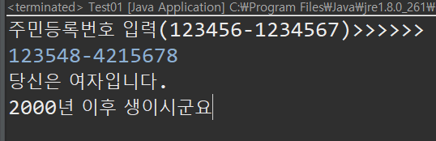
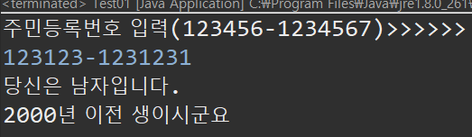

# Java Day 03

## 제어문

### If

* if 문은 속한 값이 참인지 거짓인지를 판정한다.
* 해당 if 문에 걸리지 않았을 때 계속 아래로 진행된다.
* else if 는 앞선 if 값이 거짓이여서 해당되지 않을 때 실행된다.

```java
import java.util.Scanner;

public class If01 {
	public static void main(String[] args) {
		Scanner sc = new Scanner(System.in);
		
		System.out.println("정수입력>>");
		int num = sc.nextInt();
		
		if(num>0) {
			System.out.println("양수");
		}else if(num<0) {
			System.out.println("음수");
		}else {
			System.out.println("0");
		}
	}
}

```

* if 문을 이용한 예제

  ```java
  public class If05 {
  	public static void main(String[] args) {
  		int score;
  		String grade = "";
  		Scanner sc = new Scanner(System.in);
  		
  		System.out.println("점수입력: ");
  		score = sc.nextInt();
  		
  		//7보다 크면 +, 4보다 작으면 -, 둘다 아니면 0
  		
  		if(score>=0&&score<=59) {
  			grade = "F";
  		}else if(score>=60&&score<=69){
  			grade = "D";
  		}else if(score>=70&&score<=79){
  			grade = "C";
  		}else if(score>=80&&score<=89){
  			grade = "B";
  		}else if(score>=90&&score<=100){
  			grade = "A";
  		}
  		
  		if(!grade.equals("F")) {
  			int checkScore = score - (score/10*10);
  			if(checkScore<4) {
  				grade += "-";
  			}else if(checkScore>7) {
  				grade += "+";
  			}else {
  				grade +="0";
  			}
  		}
  		
  		
  		System.out.printf("성적은 %d 점이고, 학점은 %s 입니다.",score,grade);
  	}
  }
  ```

  

### switch

* switch의 매개변수의 case를 따져 제어가 가능하다.

  ```java
  public class Sw01 {
  
  	public static void main(String[] args) {
  		// Scanner로 입력받아 숫자에 맞는 단어 출력
  		// msg 1: "Love", 2: "Belief", 3: "Hope", 4: "Money" 그 이외의 수 : "Hate"
  		System.out.println("1~4 사이의 숫자 입력>>>>>.");
  		Scanner scan = new Scanner(System.in);
  		int msg = scan.nextInt();
  		
  		switch (msg) {
  		case 1:
  			System.out.println("Love");
  			break;
  		case 2:
  			System.out.println("Belief");
  			break;
  		case 3:
  			System.out.println("Hope");
  			break;
  		case 4:
  			System.out.println("Money");
  			break;
  
  		default:
  			System.out.println("Hate");
  			break;
  		}
  		scan.close();
  		
  	}
  
  }
  ```

* switch 문을 이용하여 아래와 같이 권한 부여도 가능하다.

  ```java
  public class Sw03 {
  
  	public static void main(String[] args) {
  
  		String level = "member";
  
  		// switch를 이용한 권한부여
  		switch (level) {
  		case "admin":
  			grantDelete();// break를 사용하지 않는다. 3개의 권한을 모두 갖게 하기위함.
  		case "member":
  			brantWrite();
  		default:
  			grantRead();
  			break;
  		}
  
  	}
  
  	private static void grantRead() {
  		System.out.println("읽기가능");
  	}
  
  	private static void brantWrite() {
  		System.out.println("쓰기가능");
  	}
  
  	private static void grantDelete() {
  		System.out.println("삭제가능");
  	}
  }
  ```

* switch 문을 이용한 예제

  * 주민등록번호 입력받은후 7번째 자리 숫자가
    * 1: 2000년 이전 남자
    * 2: 2000년 이후 남자
    * 3: 2000년 이전 여자
    * 4: 2000년 이후 여자
    * 이외의 경우 "go to see a doctor!"

  ```java
  public class Test01 {
  
  	public static void main(String[] args) {
  		// 주민등록번호 입력받아
  		// 1: 2000년 이전 남자
  		// 2: 2000년 이후 남자
  		// 3: 2000년 이전 여자
  		// 4: 2000년 이후 여자
  		// 이외의 경우 "go to see a doctor!"
  		
  		System.out.println("주민등록번호 입력(123456-1234567)>>>>>>");
  		Scanner scan = new Scanner(System.in);
  		String idNo = scan.nextLine();
  		
  		char gender = idNo.charAt(7);
  		
  		switch (gender) {
  		case '1':
  		case '3':
  			System.out.println("당신은 남자입니다.");
  			switch (gender) {
  			case '1':
  				System.out.println("2000년 이전 생이시군요");
  				break;
  			case '3':
  				System.out.println("2000년 이후 생이시군요");
  				break;
  			default:
  				break;
  			}
  			break;
  		case '2':
  		case '4':
  			System.out.println("당신은 여자입니다.");
  			switch (gender) {
  			case '2':
  				System.out.println("2000년 이전 생이시군요");
  				break;
  			case '4':
  				System.out.println("2000년 이후 생이시군요");
  				break;
  			default:
  				break;
  			}
  			break;
  
  		default:
  			System.out.println("go to see a doctor!");
  			break;
  		}
  	}
  
  }
  ```

  

  