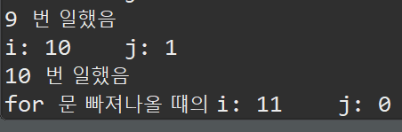
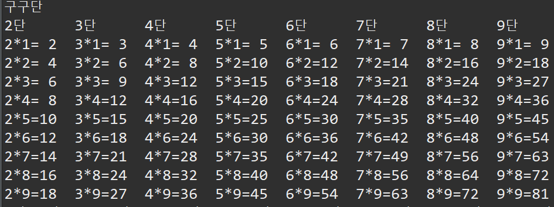
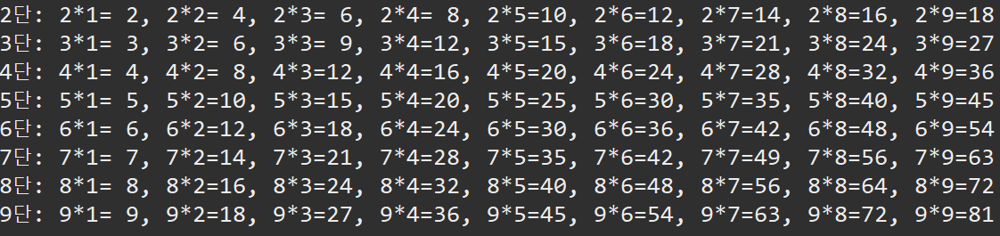
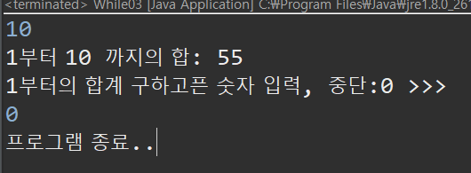

# Java Day 04

## 반복문

### for

* 기본적인 반복문

* 문법 포멧

  ```java
  for(초기식; 반복조건; 증감식){
   		수행할 명령; 
    }
  ```

* 중첩해서 사용도 가능하다.

* for문의 증감식에는 다음과 같이 다양하게 사용이 가능하다.

  ```java
  public class For01 {
  	public static void main(String[] args) {
  		// 0/1/2/3/4/5/6/7/8/9/
  		System.out.println("0/1/2/3/4/5/6/7/8/9/"); // for문을 이용하면
  		System.out.println("---------------");
  		for(int i=0; i<10; i++) {
  			System.out.print(i+"/");
  		}
  		System.out.println();
  		for(int i=5; i>0 ; i--) {
  			System.out.print(i+"/"); // 0/1/2/3/4/5/6/7/8/9
  		}
  		System.out.println();
  		for(int i=2; i<=10; i+=2) {
  			System.out.print(i+"/"); // 2/4/6/8/10/
  		}
  		System.out.println();
  		for (int i = 1; i < 10; i*=3) {
  			System.out.println(i+"/"); // 1/3/9/
  		}
  		
  	}
  }
  ```

* for문에서 시작값 끝값은 숫자 뿐만 아니라 변수도 사용이 가능하다.

  ```java
  import java.util.Scanner;
  
  public class For03 {
  	public static void main(String[] args) {
  		
  		// 시작값과 끝값을 입력받아 합계를 구하기
  		int start, end;
  		int sum=0;
  		
  		Scanner sc = new Scanner(System.in);
  		
  		System.out.println("시작값 입력>>>");
  		start = sc.nextInt();
  		System.out.println("끝값 입력");
  		end = sc.nextInt();
  		
  		for(int i=start; i<=end;i++) {
  			sum += i;
  		}
  		System.out.printf("%d부터 %d 까지의 합: %d",start,end,sum);
  		
  		sc.close();
  		
  	}
  }
  ```

* 단, 반복문을 쓸때 무한루프가 되지 않도록 설계해야 한다.

  ```java
  public class For04 {
  	public static void main(String[] args) throws InterruptedException {
  		
          // 무한루프
  		for(int i=1; i<5; i--) {
  			System.out.println(i);
  		}
  		
  		// 무한루프
  		for(;;) {
  			System.out.println("Wow");
  		}
  		
  	}
  }
  ```

* for문 안에 i,j 변수를 밖에서 사용하기 위해서는 for문 밖에서 i,j를 선언해 주면 된다.

  ```java
  public class For05 {
  	public static void main(String[] args) {
  		int i,j;
  		
  		for (i=1, j=10;i<=10; i++,j--) {
  			System.out.printf("i: %d \t j: %d \n",i,j);
  			System.out.println(i + " 번 일했음");
  			
  		}
  		
  		System.out.printf("for 문 빠져나올 떄의 i: %d \t j: %d",i,j);
  		
  	}
  }
  ```

* 또한 for 문의 마지막 증감식은 반복의 마지막에 실행된다. 따라서 아래의 결과는 다음과 같다.

  

#### For 문의 꽃 - 별찍기 (중첩 for문)

* 다음과 같이 `*` 이 찍히도록 출력!

  ```java
  /*
   출력
   ********** 
   ********** 
   **********
   **********
   ********** 
   
   */
  
  public class For06 {
  	public static void main(String[] args) {
  		
  		for(int i=0; i<5; i++) {
  			for(int j=0; j<10; j++) {
  				System.out.print("*");
  			}
  			System.out.println();
  		}
  	}
  }
  ```

  ```java
  /*
   출력
   *****
   ****
   ***
   **
   * 
   
   */
  
  public class For07 {
  	public static void main(String[] args) {
  		char ast = '*';
  
  		for (int i = 5; i > 0; i--) {
  			for (int j = 0; j < i; j++) {
  				System.out.print(ast);
  			}
  			System.out.println();
  		}
  		
  	}
  }
  ```

  ```java
  /*
   출력
       * 
      ** 
     *** 
    **** 
   ***** 
  */
  public class For08 {
  	public static void main(String[] args) {
  		char ast = '*';
  		for(int i=0; i<5; i++) {
  			
  			for(int j=0; j<4-i; j++) {
  				System.out.print(" ");
  			}
  			for(int j=0; j<i+1; j++) {
  				System.out.print(ast);
  			}
  			System.out.println();
  		}
          
      /*
      
  		 *
  		***
  	   *****
  	  *******
  	 *********
  	 
  	*/
  		for(int i=0; i<5; i++) {
  			
  			for(int j=0; j<4-i; j++) {
  				System.out.print(" ");
  			}
  			
  			for(int j=0; j<2*i+1; j++) {
  				System.out.print(ast);
  			}
  			System.out.println();
  		}
  	}
  }
  ```

* 구구단 출력!

  ```java
  public class For10 {
  	public static void main(String[] args) {
  		System.out.println("구구단");
  
  		for (int i = 2; i < 10; i++) {
  			System.out.print(i + "단\t");
  		}
  		System.out.println();
  		for (int i = 1; i < 10; i++) {
  			for (int j = 2; j < 10; j++) {
  				System.out.printf("%d*%d=%2d  ", j, i, i * j);
  			}
  			System.out.println();
  		}
  
  		for (int i = 2; i < 10; i++) {
  			System.out.print(i + "단: ");
  			for (int j = 1; j < 10; j++) {
  				if (j == 9)
  					System.out.printf("%d*%d=%2d", i, j, i * j);
  				else
  					System.out.printf("%d*%d=%2d, ", i, j, i * j);
  			}
  			System.out.println();
  		}
  	}
  }
  ```

  

  

  

### while

* 문법 `while(조건){ 조건문이 참일때 반복! }

  ```java
  public class While01 {
  	public static void main(String[] args) {
  		int i=0;
  		
  		while (i<10) {
  			System.out.println(i++ +"번째 인사: Hi!");
  		}
  
  		System.out.println(i+"번째 인사: Hi!");
  	}
  }
  ```

* while 문을 나가려면 break 를 사용한다!

  ```java
  public class While03 {
  	public static void main(String[] args) {
  		
  		Scanner sc = new Scanner(System.in);
  		int num,sum=0;
  		boolean flag = true;
  		
  		while(flag) {
  			sum=0;
  			
  			
  			System.out.println("1부터의 합계 구하고픈 숫자 입력, 중단:0 >>>");
  			num = sc.nextInt();
  			
  			if(num==0) {
  				break;
  			}
  			
  			for(int i=1; i<=num; i++) {
  				sum += i;
  			}
  			System.out.printf("1부터 %d 까지의 합: %d\n",num,sum);
  		}
  		
  		System.out.println("프로그램 종료..");
  		sc.close();
  		
  	}
  }
  ```

  

* 원하는 구구단 출력

  ```java
  
  import java.util.Scanner;
  
  public class While04 {
  	public static void main(String[] args) {
  		
  		Scanner sc = new Scanner(System.in);
  		
  		int num = 0;
  		boolean flag = true;
  
  		while (flag) {
  			System.out.println("보고싶은 구구단>>>  (2~9사이 입력,0:중단)");
  			num = sc.nextInt();
  
  			if (num == 0) {
  				flag = false;
  			} else if (num >= 2 && num <= 9) {
  				System.out.printf("%d단 출력\n", num);
  				for (int i = 1; i < 10; i++) {
  					System.out.printf("%d * %d = %d\n", num, i, num * i);
  				}
  			} else {
  				System.out.println("Error");
  			}
  		}
  		
  		System.out.println("시스템 종료...");
  
  	}
  }
  ```

* continue 를 이용하면 해당 continue 밑에 문장은 처리하지 않고 바로 반복문을 다시 실행한다.

  ```java
  public class While_05 {
  	public static void main(String[] args) {
  		int me, com;
  		int myWin = 0, comWin = 0;
  		boolean flag = true;
  		Scanner sc = new Scanner(System.in);
  		while (flag) {
  			System.out.println("가위(1) 바위(2) 보(3) >> (1~3만 입력)");
  			System.out.printf("현제 스코어 나(%d) : 컴(%d)", myWin, comWin);
  
  			me = sc.nextInt();
  			
  			if(me>3 && me <1) {
  				System.out.println("잘못된 입력");
  				continue; // 1~3이 아닌숫자는 오류
  			}
  			com = (int) (Math.random() * 3) + 1;
  
  			System.out.printf("나: %d vs com: %d \n", me, com);
  			/*
  			 * 가위(1)바위(2)보(3) com-me 값으로 판정 내가낸값 승(com-me) 패(com-me) 비김(com-me) 1 3(2) 2(1)
  			 * 1(0) 2 1(-1) 3(1) 2(0) 3 2(-1) 1(-2) 3(0)
  			 */
  			switch (com - me) {
  			case 1:
  			case -2:
  				System.out.println("컴퓨터 승리");
  				comWin++;
  				break;
  			case 2:
  			case -1:
  				System.out.println("내가이김");
  				myWin++;
  				break;
  			case 0:
  				System.out.println("비김");
  				break;
  			default:
  				System.out.println("잘못된 입력");
  				break;
  
  			}
  			if (myWin >= 3 || comWin >= 3) {
  				flag = false;
  			}
  		}
  		
  		System.out.printf("3판 끝 %s 승리", myWin > comWin ? "나" : "컴");
  	
  	}
  }
  ```

* 더 완벽한 가위바위보 게임.

  * 문자열 배열도 이용.
  * 예외처리 진행.
  * 스코어 출력.
  * 판수 출력.

  ```java
  public class While_05 {
  	public static void main(String[] args) {
  		int me, com;
  		int myWin = 0, comWin = 0;
  		int times=0;
  		boolean flag = true;
  		
  		String[] kind = {"가위","바위","보"};
  		Scanner sc = new Scanner(System.in);
  		while (flag) {
  			System.out.println("가위(1) 바위(2) 보(3) >> (1~3만 입력)");
  			
  
  			me = sc.nextInt();
  			
  			if(me>3 || me <1) {
  				System.out.println("잘못된 입력");
  				continue;
  			}
  			com = (int) (Math.random() * 3) + 1;
  
  			System.out.printf("나: %s vs com: %s \n", kind[me-1], kind[com-1]);
  			/*
  			 * 가위(1)바위(2)보(3) com-me 값으로 판정 내가낸값 승(com-me) 패(com-me) 비김(com-me) 1 3(2) 2(1)
  			 * 1(0) 2 1(-1) 3(1) 2(0) 3 2(-1) 1(-2) 3(0)
  			 */
  			switch (com - me) {
  			case 1:
  			case -2:
  				System.out.println("컴퓨터 승리");
  				comWin++;
  				break;
  			case 2:
  			case -1:
  				System.out.println("내가이김");
  				myWin++;
  				break;
  			case 0:
  				System.out.println("비김");
  				break;
  			default:
  				System.out.println("잘못된 입력");
  				break;
  
  			}
  			times++;
  			System.out.printf("나(%d) : 컴(%d)\n",myWin, comWin);
  			if (myWin >= 3 || comWin >= 3) {
  				flag = false;
  			}
  		}
  		System.out.printf(">>>>>>>>총 %d판<<<<<<<<\n",times);
  		System.out.printf("나(%d) : 컴(%d)\n",myWin, comWin);
  		sc.close();
  	
  	}
  }
  ```

  

### do while

* 조건과 상관없이 일단 1번 실행한다.

* 끝나고 조건을 확인한 후 조건이 true 이면 반복되고 조건이 false이면 루프를 벗어난다.

  ```java
  import java.util.Scanner;
  
  // Up Down 게임
  public class DoWhile03 {
  	public static void main(String[] args) {
  
  		int answer, input, num;
  		int times = 0;
  
  		Scanner sc = new Scanner(System.in);
  
  		while (true) {
  			System.out.println("게임을 하려면 1~9 중단하려면 0을 입력하세요>>>");
  			num = sc.nextInt();
  			if (num == 0) {
  				break;
  			} else {
  				answer = (int) (Math.random() * 100) + 1;
  			}
  
  			do {
  				System.out.println("1~100 사이 정수입력>>>>");
  
  				input = sc.nextInt();
  
  				if (answer > input) {
  					System.out.println("Up");
  				} else if (answer < input) {
  					System.out.println("Down");
  				}
  
  				times++;
  
  			} while (input != answer);
  
  			System.out.printf("%d 번만에 맞춤\n", times);
  			times = 0;
  //			while(input != answer) {
  //				
  //			}
  
  		}
  		System.out.println("겜끝");
  		sc.close();
  
  	}
  }
  ```

  