# Day 06

## 클래스와 객체

### Class

* 구성

  * 속성 : 클래스의 특징, 특성 - 객체 집합이 공통적으로 갖는 성격 - 멤버 변수, 전역변수, 필드 - DB table의 컬럼명으로 볼수 있다. 
    * field, attribute, member variable(맴버변수), instance variable(인스턴스)
  * 기능 : 메소드(method), 행위(behavior), 함수(function) - 함수는 살짝 다른 의미.

  ```java
  package ch06_ClassObject;
  // class란? 객체를 정의해 놓은 것 - 객체 생성의 도구 - 객체 찍어내는 툴 - 추상화의 결과.
  public class Person {
  	// 속성 : 클래스의 특징, 특성 - 객체 집합이 공통적으로 갖는 성격 - 멤버 변수, 전역변수, 필드 - DB table의 컬럼 명
  	// field, attribute, member variable(맴버변수), instance variable(인스턴스)
  	// 필드는 초기값 자동으로 설정됨
  	String name; // null
  	int age; // 0
  	String nickName;
  	String nationality;
  	//Car car;
  	
  	// 기능 : 메소드(method), 행위(behavior), 함수(function) - 함수는 살짝 다른 의미.
  	
  	void smile(){
  		System.out.println("깔깔깔");
  	}
  	
  }
  
  ```

  

### 객체의 생성

* 객체는 `new` 키워드를 이용하여 생성할 수 있다.

  ```java
  public class PersonEx {
  	public static void main(String[] args) {
  		
  		Person chk = new Person(); // new - class로 객체를 찍어내는 틀.
  		
  	}
  }
  ```

* `new` 키워드를 사용하면 해당 객체를 힙메모리에 클래스의 object를 등록하는 것이다.

* 메모리에 로드된 object(상태) - instance 라고 한다.

* 또한 여기서 클래스의 변수명으로 chk 를 지정하였는데 이 chk를 참조변수 (reference variable)이라고 부른다.


* 또한 여기서 `.` 연산자는 `.`앞에 있는 객체에 접근할 때 사용하는 연산자이다.

  ```java
  package ch06_ClassObject;
  
  public class PersonEx {
  	public static void main(String[] args) {
  		
  		Person chk = new Person(); // new - class로 객체를 찍어내는 틀. 힙메모리에 Person 클래스의 object를 등록.
  		
  		// 메모리에 로드된 object(상태) - instance.
  		
  		chk.age=27;
  		chk.name = "최혜근";
  		chk.nationality = "Korea";
  		chk.nickName = "근";
  		
  		
  		System.out.println("이름: " + chk.name);
  		System.out.println("나이: " + chk.age);
  		
  		
  		Person kkk = new Person();
  		kkk.age=27;
  		kkk.name = "asdf";
  		kkk.nationality = "Korea";
  		kkk.nickName = "aaa";
  		System.out.println("---------");
  		Person[] ps ={chk,kkk};
  		
  		for(Person p : ps) {
  			System.out.println("이름: " + p.name);
  			System.out.println("나이: " + p.age);
  			System.out.println("---------");
  		}
  		
  		Car car1 = new Car();
  		
  		chk.car = car1;
  		System.out.println(chk.car.brand); // . 의 의미 : '.' 앞에 객체 안을 의미함.
  	}
  }
  
  ```

### Constructor (생성자)

* 클래스로 객체를 만들기 위한 메소드. 클래스 이름과 같은 이름을 사용.

  ```java
  package class02;
  
  // Constructor : 클래스로 객체를 만들기 위한 메소드. 클래스 이름과 같은 이름을 사용.
  public class Car {
  	String brand = "HD";
  	String color = "red";
  	int price=2000;
  	int maxSpeed = 220;
  	int speed;
  
  	// constructor
  	public Car() {
  	} // 기본 생성자. 다른 생성자가 있으면 자동으로 생성되지 않음.
  	
  	// 매개변수(arguments) 1개짜리 생성자. 생성하면서 brand를 받아 객체의 field 값에 입력.
  	public Car(String brand) {
  		this.brand = brand;
  	}
  	
  	public Car(String brand,String color, int price) {
  		this.brand = brand;
  		this.color = color;
  		this.price = price;
  	}
  	
  	// method
  	void print() {
  		System.out.printf("brand: %s, color: %s, price: %d\n", brand, color, price);
  	}
  
  }
  
  ```

* 실행해보기!

  ```java
  package class02;
  
  public class CarEx {
  	public static void main(String[] args) {
  		Car c1 = new Car(); // 기본 생성자를 이용.
  		c1.brand = "porche";
  		c1.color = "yellow";
  		c1.price = 5000;
  		
  		c1.print();
  		
  		Car c2 = new Car("BMW");
  		c2.print();
  		
  		Car c3 = new Car("SM5","black",1000);
  		c3.print();
  	}
  }
  
  ```

  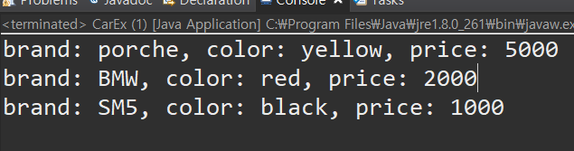

###  Overloading (매서드 오버로딩)

* 매서드를 생성할 때 매서드 명이 같더라도 다음과 같은 조건이면 다른 매서드로 인식한다.

  * 이름이 같지만 매개변수의 갯수가 다를 때.
  * 이름도 같고 매개변수 갯수도 같지만 매개변수의 타입이 서로 다를 때.
  * 이름도 같고 매개변수도 같고 타입도 같지만, 타입의 순서가 서로 다를 때.

* 이러한 Java 객체의 동작을 Method Overloading 이라고 한다.

  ```java
  package class02;
  
  // 생성자 overloading
  public class Score {
  	// field
  	int kor;
  	int eng;
  	int math;
  	String nick;
  
  	public Score() {
  	}
  
  	public Score(int kor) {
  		this.kor = kor;
  	}
  	// 갯수가 같아도 타입이 다르면 다른 매서드로 인식.
  	public Score(String nick) {
  		this.nick = nick;
  	}
  	
  	public Score(int kor, int eng) {
  		this.kor = kor;
  		this.eng = eng;
  	}
  	
  	// 매개변수의 내용이 같아도 타입의 순서가 다르면 다른 생성자이다.
  	public Score(int kor, String nick) {
  		this.kor = kor;
  		this.nick = nick;
  	}
  	
  	public Score(String nick,int kor) {
  		this.kor = kor;
  		this.nick = nick;
  	}
  	
  	// 이름이 같아도 매개변수의 갯수와 타입이 다르면 다른 매서드로 간주한다.
  	void dispaly() {
  		System.out.printf("국어: %d,영어: %d,수학: %d\n",kor,eng,math);
  	}
  	
  	void dispaly(String name) {
  		System.out.printf("이름: %s, 국어: %d,영어: %d,수학: %d\n",name,kor,eng,math);
  	}
  
  }
  
  ```

* 또한 객체 내에서 toString 매서드를 오버라이딩 하게 된다면 객체를 직접 출력시 toString 매서드가 수행되게 된다.

  * 보통 클래스의 맨 아래에 작성한다.

  ```java
  // in Student class
  @Override
  	public String toString() {
  		return "Student [name=" + name + ", school=" + school + ", grade=" + grade + "]";
  	}
  	
  ```

* 출력해보기

  ```java
  package class02;
  
  public class StudentEx {
  	public static void main(String[] args) {
  		Student st1 = new Student("tom","NS",3);
  		
  		System.out.println(st1);
  		
  	}
  }
  
  ```

  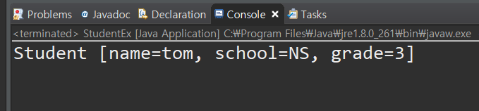


### this 의 의미

* 클래스 안에서 this는 현재 클래스의 래퍼런스를 의미한다.

* 다음과 같이 this를 이용하여 매개변수도 받을 수 있고, 매서드 , 컨스트럭터 모두 받을 수 있다.

  ```java
  public class Car {
  	String brand = "HD";
  	String color = "red";
  	int price=2000;
  	int maxSpeed = 220;
  	int speed;
  
  	// constructor
  	public Car() {
  		this("k3","gold",2000); // 기본생성자로 생성시 매개변수 3개짜리로 진행됨.
  	} // 기본 생성자. 다른 생성자가 있으면 자동으로 생성되지 않음.
  	
  	public Car(String brand,String color, int price) {
  		this.brand = brand; //this.brand 는 해당 클래스의 필드변수
  		this.color = color;
  		this.price = price;
  	}
  }
  ```

* main

  ```java
  package class02;
  
  public class CarEx {
  	public static void main(String[] args) {
  		
  		
  		Car c4 = new Car();
  		c4.print();
  	}
  }
  
  ```

  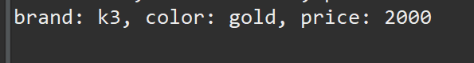

### method (매서드)

* 메서드는 객체내에서 연산을 수행하는 과정이다.

* 매서드는 반환값을 갖는다.

* void 매서드는 반환값이 없는 매서드를 말한다.

  ```java
  package class03_method;
  
  public class Calculator {
  	
  	int memory;
  	
  	// void 는 return 값이 없는 매서드.
  	void powerOn() {
  		System.out.println("power on, welcome!");
  	}
  	
  	// 반환값이 있는 매서드 : 요청을 처리하고 호출한 쪽으로 결과를 반환 - 결과타입 : int 
  	int plus(int a, int b) {
  		this.memory += (a+b);
  		return a+b;
  	}
  	
  	int minus(int a, int b) {
  		this.memory += (a-b);
  		return a-b;
  	}
  	
  	int multi(int a, int b) {
  		this.memory += (a*b);
  		return a*b;
  	}
  	
  	void devide(int a, int b) {
  		this.memory += (a/b);
  		System.out.println(a/b);
  	}
  	
  	void powerOff() {
  		System.out.println("power off, BYE!");
  	}
  
  	@Override
  	public String toString() {
  		return "Calculator [memory=" + memory + "]";
  	}
  	
  }
  
  ```

* main

  ```java
  package class03_method;
  
  public class CalculatorEx {
  	public static void main(String[] args) {
  		Calculator cal = new Calculator();
  
  		cal.powerOn();
  		cal.devide(9, 3);
  		cal.powerOff();
  
  		int result = cal.minus(9, 3);
  
  		System.out.println(result);
  		
  		Calculator cal2 = new Calculator();
  		
  //		if(cal==cal2) {
  //			System.out.println("Y");
  //		}else {
  //			System.out.println("N");
  //		}
  		
  		cal2.plus(123,243);
  		cal2.multi(3, 4);
  		
  		System.out.println(cal);
  		System.out.println(cal2);
  	}
  }
  
  ```

  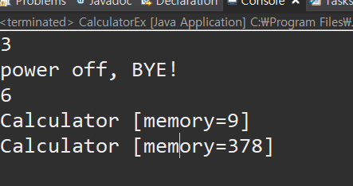

* java 에서 파이썬 처럼 매개변수를 받는 방법이 있다.

  ```java
  package class03_method;
  
  public class Parameter {
  	
  	// 매개변수 2개 받아서 x~y 합계 구하는 매서드.
  	int sum1(int x, int y) {
  		int num = 0;
  
  		for (int i = x; i <= y; i++) {
  			num += i;
  		}
  		return num;
  	}
  	
  	int sum1(int[] values) {
  		int num = 0;
  
  		for (int i = 0; i <values.length; i++) {
  			num += values[i];
  		}
  		return num;
  	}
  	
  	// 매개변수 갯수와 무관하게 받는 경우 values는 배열로 취급. Python 과 비슷한 문법
  	int sum2(int ... values) {
  		int num = 0;
  
  		for (int i = 0; i <values.length; i++) {
  			num += values[i];
  		}
  		return num;
  	}
  	
  }
  
  ```

* 출력

  ```java
  package class03_method;
  
  public class ParameterEx {
  
  	public static void main(String[] args) {
  		Parameter parameter = new Parameter();
  
  		int result = parameter.sum1(3, 9);
  		System.out.println("result: " + result);
  
  		int[] values = { 11, 22, 33, 44, 55, 66, 77 };
  
  		result = parameter.sum1(values);
  		System.out.println("result: " + result);
  
  		System.out.println(parameter.sum2(1, 2, 3, 4, 5));
  
  	}
  
  }
  
  ```

  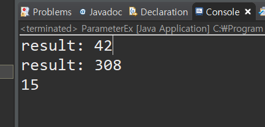

#### Recursion

* 재귀함수(Recursion)은 자기 자신을 호출하게 된다.

* 무한이 돌지 않도록 return을 이용해 루프 탈출을 만들어 주자.

  ```java
  package class03_method;
  
  class Greeting{
  	
  	// recursion : 재귀함수.
  	void greet(int x) {
  		System.out.println("hi, I'm "+x);
  		if(x<1) {
  			return; //method 종료
  		}
  		greet(--x); // 자기 자신을 호출
  	}
  }
  
  public class Recur01 {
  	public static void main(String[] args) {
  		Greeting greeting = new Greeting();
  		
  		greeting.greet(3);
  	}
  }
  
  ```

  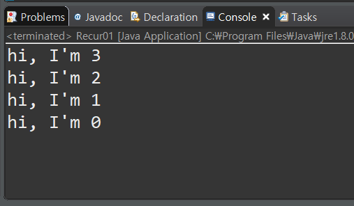

* 그러나 너무 많이 하면.. java.lang.StackOverflowError 애러가 나타난다.

  ```java
  greeting.greet(10000);
  ```

  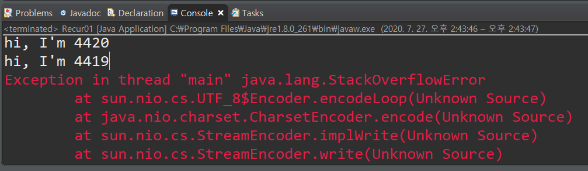


## static variable

* static 변수 (또는 class 변수) 는 클래스에서 생성시 해당 변수를 클래스 생성 여부와 관계 없이 static 메모리 영역에 해당 변수를 할당한다.

* 따라서 객체를 생성하지 않아도 해당 변수를 사용할 수 있다. (접근은 `클래스명.변수명` 으로 가져올 수 있다.)

* 같은 클래스로 만들어진 객체들이 해당 static 변수를 접근하였을때 각 class 의 해당 static 변수는 모두 메모리에 같은 공간을 가르킨다.

* 따라서 서로 다른 클래스간 자원의 공유가 가능하게 된다.

  ```java
  package class04_static;
  
  public class Accumulator {
  
  	int total; // instance 변수, 자동초기화
  	static int grandTotal; // 클래스 변수, 객체들의 공유 공간.
  	
  	public Accumulator() {
  		grandTotal += 10;
  	}
  	void accumulator(int num) {
  		total += num;
  		grandTotal += num;
  	}
  }
  
  ```

* Main

  ```java
  package class04_static;
  
  public class AccumulatorEx {
  	public static void main(String[] args) {
  		
  		System.out.println(Accumulator.grandTotal);
  		
  		Accumulator acc = new Accumulator();
  		System.out.println(acc.grandTotal);
  		System.out.println(acc.total);
  		
  		System.out.println("--------------");
  		Accumulator acc2 = new Accumulator();
  		System.out.println(acc2.grandTotal);
  		System.out.println(acc2.total);
  		System.out.println("--------------");
  
  		
  		acc.accumulator(5);
  		System.out.println(acc.grandTotal);
  		System.out.println(acc.total);
  
  		
  		
  		System.out.println("--------------");
  		acc2.accumulator(15);
  		System.out.println(acc2.grandTotal);
  		System.out.println(acc2.total);
  		
  	}
  }
  
  ```

  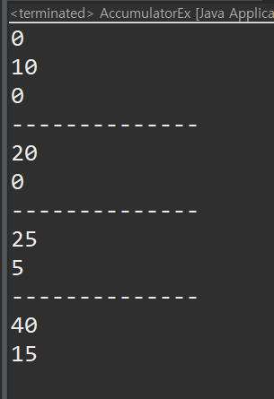

* static 블록을 이용하여 초기화 또한 가능하다.

  * static 블록은 가장 먼저 실행된다.

  ```java
  package class04_static;
  
  public class Static_Careful {
  
  	int field1; //인스턴스 변수
  	//생성된 객체를 통해서만 사용가능한 메소드
  	void method1() {
  		System.out.println("method1");
  	}
  	
  	static int field2;//객체들이 공유하는 변수 - 클래스 변수
  	//객체 생성 없이 쓸 수 있는 메소드
  	static void method2() {
  		System.out.println("method2");
  	}
  	
  	public Static_Careful() {
  		System.out.println("생성자");
  		field1 = 15;
  		method1();
  	}
  	
  	//static 블록(static 초기화 블록)
  	static {
  		System.out.println("static block");
  		field2 =10;
  		method2(); //프로그램 실행시 자동 실행 
  		
  		//field1 = 5; //field1은 아직 없네요. 
  		//method1();
  		
  		//static 블록에서 static이 아닌 변수와 메소드를 다루려면 객체부터 생성
  		Static_Careful sc = new Static_Careful();
  		sc.field1 = 5;
  		sc.method1();
  		System.out.println(sc.field1);
  		
  	}
  }
  
  ```

  ```java
  package class04_static;
  
  public class Static_CarefulEx {
  	public static void main(String[] args) {
  		//Static_Careful.field2;
  		//Static_Careful.method2();
  		Static_Careful sc = new Static_Careful();
  		//System.out.println(sc.field1);
  	}
  }
  
  ```

  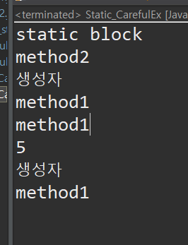

## final variable

* final 변수로 선언된 변수는 초기값만 지정할 수 있고, 변경이 불가능하다.

  ```java
  package class05_final;
  
  public class Final01 {
  	final String nation = "Korea";
  	
  	public static void main(String[] args) {
  		Final01 fi = new Final01();
  		
  		System.out.println(fi.nation);
  		fi.nation = "USA";
  		System.out.println(fi.nation);
  		
  	}
  }
  ```

  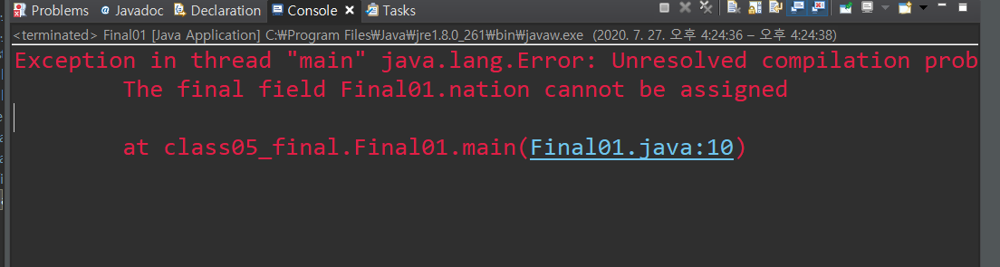

* final 변수 초기화 하는법

  1. 선언하면서 초기화

     ```java
     final String nation = "Korea";
     ```

  2. 생성자를 통한 초기화

     ```java
     final String idNo;
     String name;
     
     public Final01(String idNo,String name) {
     		this.idNo = idNo;
     		this.name = name;
     	}
     
     
     ```

     


### 상수 (constant)

* 상수를 표현할 때는 보통 static final 를 사용한다.
* 관례상 상수는 모두 대문자로 작성한다.
* 상수는 선언과 동시에 초기화는 되지만, 생성자에서 초기화는 불가능하다.
* 생성자 대신 static block에서 선언이 가능하다.

```java
package class05_final;

public class Final02 {
	// instance 변수
	int a;
	
	// static final : 상수 (constant); 수정 불가능, 선언과 동시에 초기화 or static block 에서 초기화한다
	static final double EARTH_RADIUS = 6400;
	static final double EARTH_SURFACE_AREA;
	
//	아래같이 불가능
//	Final02(){
//		EARTH_SURFACE_AREA = 1.0;
//	}
	
	static {
		//인스턴스 변수는 static에서 사용 불가능
		//a=10;
		EARTH_SURFACE_AREA = EARTH_RADIUS * EARTH_RADIUS * Math.PI * 4; 
	}
	
	public static void main(String[] args) {
		System.out.println("지구 반지름: "+EARTH_RADIUS + "km");
		System.out.println("지구 표면적: "+EARTH_SURFACE_AREA + "km^2");
	}
}

```

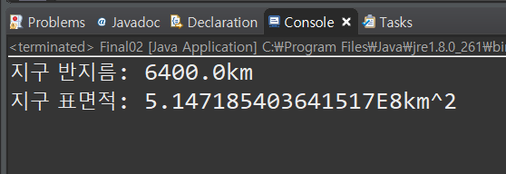


## Singleton 객체


* 객체를 1개를 만들어 여러곳에서 사용하는 디자인 패턴이다.

* 특징으로는 Singleton 객체는 생성자를 private으로 만들어 생성한다.

* 또한 자기 자신의 객체를 static으로 선언해서 사용한다.

  ```java
  package class06_singleton;
  
  // Design Pattern: 객체를 생성하는 방식
  // 싱글톤: 사용자가 여럿이어도 객체를 하나만 반환하는 방식
  public class DBConnection {
  
  	// 미리 클래스의 객체를 생성하여 참조변수 (객체 이름) instance
  	// private: 클래스 내부에서만 보이게 만드는 접근제한자
  	// private: 클래스 내부에서만 보이게 만드는 접근제한자
  	
  //	private static DBConnection instance = new DBConnection();
  	private static DBConnection instance;
  	
  	private DBConnection() {
  		
  	}
  	
  	public static DBConnection getInstance() {
  		if(instance == null) {
  			instance = new DBConnection();
  		}
  		return instance;
  	}
  	
  	
  }
  
  ```

* 싱글톤 객체 확인

  ```java
  package class06_singleton;
  
  public class DBEx {
  	public static void main(String[] args) {
  		
  		// 아래와 같이 사용 불가능.
  //		DBConnection dbk = new DBConnection();
  		
  		// 아래와 같이 싱글톤 객체를 가져옴
  		DBConnection dbk = DBConnection.getInstance();
  		DBConnection dbk2 = DBConnection.getInstance();
  		
  		//두 객체는 같은 객체
  		if(dbk == dbk2) {
  			System.out.println("same singleton object");
  		}else {
  			System.out.println("another object");
  		}
  		
  		
  	}
  }
  
  ```

  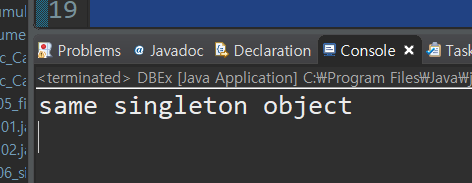