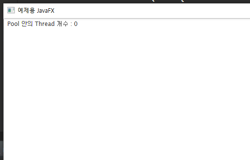
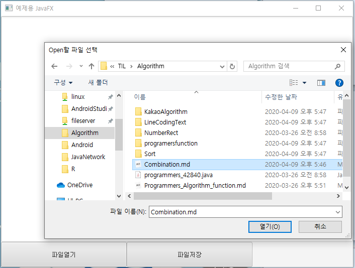

# 2020-04-13

> 앞으로 배울 내용
>
> Thread Pool : Thread 를 조금더 효율적으로 이용하는 방법
>
> Java IO (Input & Output) : Stream
>
> Java Network : 다른 Process (다른 프로그램) 과 데이터 통신을 하려면 어떻게 해야 하는가?


# Thread Pool

* Thread를 효율적으로 사용하는 기법.
* JDBC Pool 과 유사한 기법.

## Pool

* 개념
  * 여러개의 객체를 한곳에 모아놓는 것.
  * Java 는 피료한 객체를 생성하고(new) `Heap 영역`에 메모리가 할당된다.
  * 메모리를 이용해서 여러가지 처리를 한다. (데이터 저장, method호출을 통해 로직처리)
  * 객체를 다 사용하고 더 이상 사용하지 않으면 `Garbage collector` 가 사용하지 않는 객체를 메모리에서 제거한다.
  * 이런 일반적인 방식은 효율면에서 좋지 않다.
  * 따라서 사용할 객체를 일단 미리 많이 생성해 놓은후 Pool 이라고 불리는 공간에 모아놓는다.
  * 필요할때마다 `Pool` 안에서 객체를 가져다 사용하고 사용한 후에는 다시 `Pool`에 반납하는 방식으로 사용한다.
  * 대표적인 활용 : `Database Connection Pool (DBCP) , Object Pool , Thread Pool`
* `ExecutorService`  라는 이름의 Thread Pool (Java에서 제공되는) 를 이용해 보자.

## 실습 구성.

1. Thread Pool 생성

* JavaFX를 이용해 버튼 3개 생성

  * `initBtn` : Thread Pool 생성
  * `startBtn` : Thread Pool 안에서 Thread를 가져다가 사용하는 버튼.
  * `shutdownBtn` : Thread Pool 종료
  * Java 에서 제공되는 ExecuteService 를 이용하여 Pool 생성.

  ```java
  private Button initBtn, startBtn, shutdownBtn;
  private ExecutorService executeService;
  // 생략
  
  
  initBtn = new Button("Thread Pool 생성");
  		initBtn.setPrefSize(250, 50);
  		initBtn.setOnAction(e -> {
  			// java lambda를 이용한 event 처리 코드 작성.
  		});
  		
  		startBtn = new Button("Thread 생성");
  		startBtn.setPrefSize(250, 50);
  		startBtn.setOnAction(e -> {
  			// java lambda를 이용한 event 처리 코드 작성.
  		});
  		
  		shutdownBtn = new Button("Thread Pool 종료");
  		shutdownBtn.setPrefSize(250, 50);
  		shutdownBtn.setOnAction(e -> {
  			// java lambda를 이용한 event 처리 코드 작성.
  		});
  ```

* executeService 를 이용하여 Thread를 생성할 수 있다.

* `ThreadPoolExecutor` 로 casting 을 한후 PoolSize를 알아낼 수 있다.

  ```java
  			// 새롭게 Thread Pool 을 만드는 과정. 숫자는 Thread의 최대 갯수.
  			executeService = Executors.newFixedThreadPool(5);
  			// ThreadPoolExecutor 로 casting 을 한후 PoolSize를 알아낼 수 있다.
  			// execulteService 자체가 interface이기 떄문이다.
  			printMSG("Pool 안의 Thread 개수 : " + 
  					((ThreadPoolExecutor)executeService).getPoolSize());
  ```

  

* 처음에는 0개 부터 시작하여 사용할 때마다 갯수가 증가함. 최대 5개 까지 생성. (코드상으로 작성한것)

2. Thread 생성방법.

   * 기본적인 Runnable 객체를 이용하여 Thread 구동 로직을 작성하는 방법은 같음.
   * 아래의 코드로 Thread 생성과 start() 매서드 까지 수행하게됨.

   ```java
   	startBtn.setOnAction(e -> {
   			// Thread Pool 에서 Thread 를 가져다가 사용하는 코드
   			// 10개의 Thread를 Thread pool 에서 가져다가 사용해 보자.
   			for (int i = 0; i < 10; i++) {
   				// 1. Runnable Interface 구현한 객체를 생성.
   				// 2. Thread Pool 을 이용하여 Thread 생성.
   				Runnable runnable = new Runnable() {
   					@Override
   					public void run() {
   						// 실행될 로직.
                           @Override
   						public void run() {
   						String msg  = "Thread Pool 안의 개수: " + 
   								((ThreadPoolExecutor) executeService).getPoolSize();
   						msg += ", Thread Name : " + Thread.currentThread().getName();
   						printMSG(msg);
   						}
   					}
   				};
   				// Thread 실행방법.
   				// Thread t = new Thread(runnable); 
   				// t.start(); 와 같은 방식.
   				executeService.execute(runnable);
   				
   			}
   
   		});
   ```

   * 결과

   

   * 사용되는 Thread 는 5개만 사용되며 반복적으로 사용됨. 
   * 순서는 임의로 수행이 된다.

3. `CachedThreadPool` : 시스템이 허용하는 만큼 Thread 를 만들어 냄.

   * 일반적으로 만이 이용함.
   * 많은 이용자가 사용되는 Thread 에서 사용된다.
   * 리소스를 최대한 사용하면서 최대의 효율을 내는 방식이다. 

   ```java
   executeService = Executors.newCachedThreadPool();
   ```

   * 결과

   

   

4. Thread Pool 종료

   * ExecutorService 의 shutdownNow() 매서드를 통해 Thread Pool 을 종료할수 있다.

   ```java
   executeService.shutdownNow();
   ```

   

   * Thread Pool 을 종료한 상태에서 Thread 생성 버튼을 클릭하여 오류가 나타난 상황.


# Java IO (Input & Output)

## 기본적인 IO

* `Stream` 으로 사용되는 방식.

  * `Stream` : data 를 받아들이고 보낼 수 있는 통로이다.
  * 우리 자바 프로그램이 표준출력(도스창)에 문자열을 출력하고 싶다면
  * 우리 자바프로그램과 연결된 도스창에 대한 Stream이 존재해야 한다.
  * 이미 사용하고 있었음..

  ```java
  	System.out.println("Hello Java!");
  	// System.out : 도스창(표준출력)에 연결된 우리에게 미리 제공된 Stream 이다.
  	// Stream이 가지는 println() 이라는 method를 이용하여 실제 문자열을 도스창에 전달한것!
  ```

* 구체적인 `Stream` 개념.

  * Stream은 객체로 존재한다. => class가 존재한다.
  * 이 class의 객체를 만들어서 method를 이용해서 데이터의 입출력을 수행한다.
  * Stream은 크게 2가지 종류가 있다. 
    1. 입력스트림
       1. `InputStream` : 가장 기본적인 입력 스트림.
    2. 출력스트림.
       1. `OutputStream` : 가장 기본적인 출력 스트림.
  * 이 데이터 연결 통로는 단방향이다.
  * 기본적인 `InputStream`, `OutputStream`은 성능이 좋지 않음. => 가장큰 이유로 속도가 느리다.
  * Stream 은 결함해서 더 좋은 스트림으로 만들 수 있다.

* `InputStreamReader`

  * `System.in` 이라는 효율이 좋지 않은 Stream을 문자열을 입력받기 좋은 Stream으로 다시 만든것.

  ```java
  InputStreamReader isr = new InputStreamReader(System.in);
  ```

  * 그러나 이 스트림도 사용하는데 별로 유용하지 않아 더 좋은 스트림을 사용한다.

* `BufferedReader`

  * InputStream을 이용하여 BufferedReader를 만들수 있다.
  * 이 스트림은 readLine() 이라는 매서드를 통해 문자열을 받을 수 있다. (라인 단위로 데이터를 받는법.)

  ```java
  	BufferedReader br = new BufferedReader(isr);
  		try {
  			br.readLine();
  		} catch (IOException e) {
  			e.printStackTrace();
  		}
  ```

## File IO

### File Input

* 파일 입출력시 필요한 스트림 : FileReader Stream.

* 해당 파일은 File 객체를 읽을 수 있는 Stream 이다. 

* File을 읽을때는 FileChooser 객체를 이용하여 File 객체를 읽어올수 있다.

  ```java
  			// 2. Open할 파일을 선택. => File Chooser를 이용.
  			FileChooser fileChooser = new FileChooser();
  			fileChooser.setTitle("Open할 파일 선택");
  			// 창을 띄움 매개변수 : primaryStage (javaFx에서 사용하는 방식.)
  			// 파일 선택창에서 원하는 file을 선택한 후 open버튼을 누르면
  			// File 객체가 생성.
  			File file = fileChooser.showOpenDialog(primaryStage);
  		
  ```

* 읽어드린 File 객체를 스트림을 통해 읽어드린다.

* 문자를 읽을 때 읽기 쉬운 BufferedReader를 이용하여 읽어드린다.

* 파일은 여러줄로 되어있는 문자열 이므로 while() 문을 통해 모든 글을 읽어올 수 있다.

  ```java
  	oepnBtn.setOnAction(e -> {
  			// 파일열기 처리.
  			// 1. textarea를 초기화.
  			ta.clear();
  			// 2. Open할 파일을 선택. => File Chooser를 이용.
  			FileChooser fileChooser = new FileChooser();
  			fileChooser.setTitle("Open할 파일 선택");
  			// 창을 띄움 매개변수 : primaryStage (javaFx에서 사용하는 방식.)
  			// 파일 선택창에서 원하는 file을 선택한 후 open버튼을 누르면
  			// File 객체가 생성.
  			File file = fileChooser.showOpenDialog(primaryStage);
  			// Open 할 File을 선택했으면..
  			try {
  				FileReader fr = new FileReader(file);
  				BufferedReader br = new BufferedReader(fr);
  				String line = "";
  
  				while ((line = br.readLine()) != null) {
  					printMSG(line);
  				}
  
  			} catch (FileNotFoundException e1) { // file에 대한 Exception
  			} catch (IOException e1) { // readLine에 대한 Exception
  			}
  
  		});
  ```

* 이때 File 을 읽을 때 나타날수 있는 FileNotFoundException 과 readLine에 대해 일어날수 있는 IOException 이 발생할 수 있으므로 try catch 문으로 해당 예외처리를 처리하여 준다.

  

  

> 복잡한 데이터를 읽고 쓸때는 어떻게 해야하나...
>
> * 단순 문자열 처리는 BufferedReader로 처리하면된다.
> * Ex) 파일에 Hashmap의 데이터를 저장하고 싶을 때..
> * 이러한 자료구조 안에있는 많은 양의 구조화된 데이터를 저장하고 읽어들일 수 있는지 알아보자. (Object Stream)

### File Output

* File 객체를 이용하여 데이터를 저장할 수 있다.

* File() 객체를 생성하면서 매개변수로 경로와 이름으로 데이터 저장이 가능하다.

* 해당 데이터에 데이터를 넣을때는 대표적인 Output Stream 인 `PrintWriter` 를 이용한다.

  ```java
  File file = new File("asset/StringData.txt"); // asset 해당폴더는 해당프로젝트 바로 하단에 위치함.
  		// 대표적인 출력 Stream : PrintWriter
  		// 대표적인 입력 Stream : BufferedReader
  		try {
  			PrintWriter pr = new PrintWriter(file);
  			pr.println("소리없는 아우성");
  			// 출력시에는 꼭 Stream을 닫아주거나 flush를 통해 데이터를 내보내야 한다.
  			pr.flush();
  			pr.close(); // close() 시에 안에 데이터가 있으면 데이터를 내보내고 닫는다.(flush없어도 출력가능.)
  		} catch (FileNotFoundException e) {
  			
  		}
  ```

  

## Object Stream


* 단일문자열과 같은 형태의 간단한 형태의 데이터를 보낼때는 문제가 없으나...

* 저장할 데이터가 자료구조형태로 되어 있다면!

  * 사실상.. 로직을 이용하여 모두 문자열 처리해서 저장할 수도 있지만.....

* 그 구조가 복잡하면 복잡할수록 데이터를 저장하기 쉽지 않다.

* 이러한 문제점을 객체직렬화를 이용하여 객체를 넣어 Writing 할수 있다.

* Stream 을 통해서 일반 문자열이 아닌 객체자체를 전달할 수 있다.

  ```java
  		// asset 해당폴더는 해당프로젝트 바로 하단에 위치함.
  		File file = new File("asset/StringData.txt"); 
  
  		// 대표적인 출력 Stream : PrintWriter
  		// 대표적인 입력 Stream : BufferedReader
  		// FileOutputStream 은 PrintWriter 보다 낮은 수준의 Output Stream.
  		FileOutputStream fos;
  		
  		try {
  			fos = new FileOutputStream(file);
  			ObjectOutputStream oos = new ObjectOutputStream(fos);
  			
  			// 객체 직렬화를 통해 저장하기 원하는 객체를 Stream을 통해서 보낼 수 있다.
  			// Object Serialization
  			// 속도면에서 살작 떨어지나 그것을 상쇄할 만큼 편의성을 제공해 준다.
  			oos.writeObject(map);
  			oos.flush();
  
  			// Stream 사용 역순으로 스트림을 닫아준다.
  			oos.close();
  			fos.close();
          }catch (FileNotFoundException e) {
  		} catch (IOException e) {}
  ```

  


