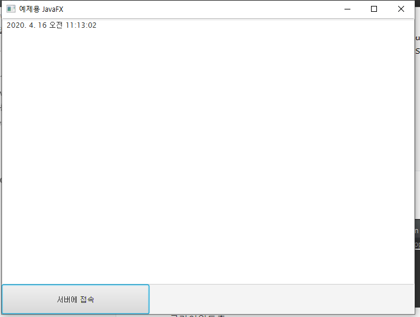

# 2020-04-16

# Java Network Day01

## 기본이론

* `Network` : 유선, 무선을 이용해서 데이터 통신을 하기 위해 컴퓨터를 논리적, 물리적으로 묶어놓은 형태.
* `Network`의 형태 : 크기에 따라서 여러가지 형태로 구분.
  1. `LAN(Local Area Network)` : 우리나라에서 주로 사용.
  2. `WAN(Wide Area Network)`
  3. `MAN(Metropolitan Area Network)` : 대도시
* `Internet` : `Network of Network` (Network를 연결해 놓은 Network) 
  * 물리적인 네트워크의 형태
  * Internet을 사용하기 위해서는 그 위에서 동작하는 Service가 있어야 한다.
  * 가장 대표적인 서비스 : Web, EMAIL, Torrent, Streaming 등...
* `Internet` 위에서 각각의 서비스가 동작하려면 각 컴퓨터들이 서로를 인지할 수 있는 수단이 필요하다.
  * 각 컴퓨터마다 주소를 부여할 필요가 있다.
  * 실제 컴퓨터에 주소를 부여하는 것이 아닌 컴퓨터 부품중 `NIC(Network Interface Card)` (일반적으로 LAN카드라 불리는것) 에 IP Address를 부여한다.
  * `IPv4` (32bit 주소) : 초장기에 사용함.(아직까지도 사용중) 초기에는 문제없이 사용함.
     * 	시간이 지나면서 점점 주소가 모자라게 되었다. => IPv6 (128bit) 로 확장.
     * 	아직까지는 IPv6를 완전하게 사용하지 않음.(경제적인 이유)

## IP Adress (IPv4)

* LAN 카드에 부여된 **`논리적`**인 주소이다.
* 하지만 논리적인 주소만으로는 당연히 컴퓨터간 통신을 할 수 없다.
* 물리적인 주소가 필요하다. => 물리적인 주소 (Unique 한 주소): `MAC Address`
* 따라서 `IP Address`를 이용하여 특정 컴퓨터를 찾을 수 있다.

> IP Adrress 는 숫자라서 기억하기가 쉽지 않다.
>
> => DNS(Domain Name Server) 도입 => ex) www.naver.com

* `IP Address` 를 알아야 통신하고자 하는 상대방 컴퓨터를 인지할 수 있다.
* 통신을 하려면 => `Protocol` 이 필요하다.
* `TCP, IP, ARP, TELNET, FTP, .... HTTP 등.`

## Port

* 숫자 0~65535 범위를 갖는 숫자. 
* 0~1023번 까지는 예약되어 있다. (일반적으로 사용하지 않음)
* 컴퓨터 내에 동작하고 있는 프로그램을 지칭하는 숫자이다.


> 결론적으로 한 컴퓨터와 다른 컴퓨터가 데이터를 주고 받으려면!
>
> 1. `protocol` 을 알아야 한다.
> 2. `IP Address`를 알아야 한다.
> 3. 특정 프로그램의 `Port` 번호를 알아야 한다.


## Socket

* 네트워크 프로그램은 너무 어렵다.

 *  `Socket` 이라는 개념을 만들어냄 (버클리대학)
 *  `Socket`을 만들면 복잡한 네트워크 처리를 `Socket`이 대신 알아서 처리하도록 만듬.
 *  `Socket`은 프로그램간 연결을 위한 논리적인 통로 이다.
 *  `Java` 에서는 데이터 교환은 무조건 `Stream` 형태로 이뤄지므로 `Socket` 안에서 `Stream`을 통해 주고받는다. 
 *  스트림은 단방향 이므로 데이터를 보내는 프로그램에서는 데이터를 보내는 스트림(Output Stream), 받는쪽에서는 데이터를 받는 스트림(Input Stream)을 만든다.


* `Java Network` 프로그램은 `CS(Client Server)`구조를 갖는다.


### 서버 프로그램

1. 서버프로그램은 클라이언트의 접속을 기다려야 한다.

   * 클라이언트의 Socket접속을 기다리는 ServerSocket 이 필요하다.
   * 적당한 prot번호를 이용하여 ServerSocket 객체를 생성.

2. 클라이언트의 접속을 기다리기 위한 method를 호출. : `accept()`

   * `blocking method` 로 클라이언트가 접속할때 까지 대기.
   
3. 스트림을 이용하여 날짜 데이터를 전송.

   * `socket` 객체의 `getOutputStream()` 매서드를 이용.
   * 좀더 좋은 스트림 사용을 위해 `PrintWriter` 스트림을 이용.
   * 마지막으로 사용한 자원을 반납!


   ```java
   // 서버쪽 프로그램
   // 클라이언트가 접속하면 현재 시간을 알아내어 클라이언트에게 전송하는 서버 프로그램
   public class Exam01_DateServer {
   
   	// 프로그램의 entry point
   	public static void main(String[] args) {
   		// 1. 서버프로그램이니 클라이언트의 접속을 기다려야 한다.
   		// 클라이언트의 Socket 접속을 기다리는 ServerSocket을 만들어야 한다.
   		// 포트번호를 임의적으로 지정해서 선언해야함.
   		try {
   			ServerSocket server = new ServerSocket(5556);
   			System.out.println("서버 생성");
   			// 2. 클라이언트의 접속을 기다리기 위한 method를 호출
   			Socket s = server.accept(); // blocking method
      							 // 클라이언트가 접속할때까지 대기.
   			System.out.println("클라이언트 접속");
               // 3. 소켓이 생성되면 데이터 입출력을 하기 위해 Stream 을 생성한다.
   			// 현재시간 구하기.
   			String date = (new Date()).toLocaleString();
   			PrintWriter out = 
   					new PrintWriter(s.getOutputStream());
   			out.println(date);
   			out.flush();
   			out.close();
               // 소켓 닫기
   			s.close();
   			server.close();
   		} catch (IOException e) {
   			e.printStackTrace();
   		}
   	}
   
   }
   
   ```

   

### 클라이언트 프로그램

* JavaFX를 이용하여 창을띄워 데이터를 보내는 프로그램 작성.

1. 클라이언트는 능동적으로 서버에 접속한다.

   * 클라이언트 에서는 `Socket` 객체를 이용하여 `ServerSocket`에 접속을 한다.
   * `Socket("IP정보", port번호)` 형태로 접속.

   * 서버 접속에 성공하면 소켓이 생성된다.

   ```java
   	btn.setOnAction(e -> {
   			// 1. 클라이언트는 능동적으로 서버에 접속한다.
   			//    ServerSocket에 접속
   			try {
   				Socket s = new Socket("localhost",5556);
   			} catch (UnknownHostException e1) {
   			} catch (IOException e1) {
   			}
   		});
   ```

   * 서버소켓에 접속이 성공하면 서버측에서 `server.accept()` 매서드의 결과로 `Socket` 객체가 생성된다.

2. `Socket` 객체의 `getInputStream()`을 통해 값을 받아온다.

   * `InputStreamReader`을 더좋은 `BufferedReader`객체로 감싸서 작성한다.
   * 사용후 스트림과 소켓을 닫는다.

   ```java
   		try {
   				Socket s = new Socket("localhost", 5556);
   				BufferedReader br = 
   						new BufferedReader(
   								new InputStreamReader(
   										s.getInputStream()));
   				
   				String msg = br.readLine();
   				printMSG(msg);
   				br.close();
   				s.close();
   			} catch (UnknownHostException e1) {
   			} catch (IOException e1) {
   			}
   ```

* 결과

  * 서버측

  

  * 클라이언트측

  


## Echo Program

* 앞에 작성한 예제는 일회성으로 끝나는 프로그램.
* 지금부터 에코 프로그램을 작성.
* 이 프로그램은 클라이언트가 1개만 접속가능한 Echo 프로그램.
* 에코 프로그램
  1. 클라이언트가 데이터를 서버에 전송
  2. 서버가 데이터를 받아서 다시 클라이언트에게 전송
  3. 전송받은 데이터를 TextArea에 출력
* 위의 작업을 반복. Client가 `@EXIT` 를 입력할때 까지 반복


* 내가 작성한 코드

  * Server

  ```java
  package javanetwork;
  
  import java.io.BufferedReader;
  import java.io.IOException;
  import java.io.InputStreamReader;
  import java.io.PrintWriter;
  import java.net.ServerSocket;
  import java.net.Socket;
  import java.util.Date;
  
  // 서버쪽 프로그램
  // 클라이언트가 접속하면 현재 시간을 알아내어 클라이언트에게 전송하는 서버 프로그램
  public class Exam01_DateServer {
  
  	// 프로그램의 entry point
  	public static void main(String[] args) {
  		// 1. 서버프로그램이니 클라이언트의 접속을 기다려야 한다.
  		// 클라이언트의 Socket 접속을 기다리는 ServerSocket을 만들어야 한다.
  		// 포트번호를 임의적으로 지정해서 선언해야함.
  		try {
  			ServerSocket server = new ServerSocket(5556);
  			System.out.println("서버 생성");
  			// 2. 클라이언트의 접속을 기다리기 위한 method를 호출
  			String data = "";
  			PrintWriter out = null;
  			Socket s = null;
              BufferedReader br = null;
              // @EXIT 이라는 문자열이 올때까지 계속 소켓을 열어 받는다.
  			while (!data.equals("@EXIT")) {
                  // 클라이언트가 접속할때까지 대기.
  				s = server.accept(); // blocking method
  				
  				System.out.println("클라이언트 접속");
                  
  				// 3. 소켓이 생성되면 데이터 입출력을 하기 위해 Stream 을 생성한다.
  				br = new BufferedReader(new InputStreamReader(s.getInputStream()));
  				
                  // 데이터를 읽어와 String 객체에 저장한다.
  				data = br.readLine();
  				
                  // 클라이언트에서 받아온 데이터를 다시 클라이언트로 보내기 위한 스트림 생성.
  				out = new PrintWriter(s.getOutputStream());
  				System.out.println("받은 데이터 : "+data);
  				
                  스트림을 통해 
  				out.println(data);
  				out.flush();
  			}
  			out.close();
  
  			// 소켓 닫기
  			s.close();
  			server.close();
  			System.out.println("프로그램 종료");
  			
  		} catch (IOException e) {
  			e.printStackTrace();
  		}
  	}
  
  }
  
  ```

* Client

```java
package javanetwork;

import java.io.BufferedReader;
import java.io.IOException;
import java.io.InputStreamReader;
import java.io.OutputStream;
import java.io.PrintWriter;
import java.net.Socket;
import java.net.UnknownHostException;

import javafx.application.Application;
import javafx.application.Platform;
import javafx.scene.Scene;
import javafx.scene.control.Button;
import javafx.scene.control.TextArea;
import javafx.scene.layout.BorderPane;
import javafx.scene.layout.FlowPane;
import javafx.stage.Stage;

public class Exam01_DateClient extends Application {

	private TextArea ta,ta2;
	private Button btn;
	private final double textHeight = 25; 
	public void printMSG(String msg) {
		Platform.runLater(() -> {
			ta.appendText(msg + "\n");
		}

		);
	}

	@SuppressWarnings("unchecked")
	@Override
	public void start(Stage primaryStage) throws Exception {
		BorderPane root = new BorderPane();
		root.setPrefSize(700, 500);

		ta = new TextArea();
		ta2 = new TextArea();
		ta2.setPrefSize(450, textHeight);
		root.setCenter(ta);
		

		btn = new Button("전  송");
		btn.setPrefSize(250, textHeight);
		btn.setOnAction(e -> {
			// 1. 클라이언트는 능동적으로 서버에 접속한다.
			// ServerSocket에 접속
			try {
				
				Socket s = new Socket("localhost", 5556);
				String data = ta2.getText();
				// 전송후 TextArea 초기화
                ta2.setText("");
				
                // 전송을 위한 Stream 생성
				PrintWriter pw = new PrintWriter(s.getOutputStream());
				
                //data 전송
				pw.println(data);
				pw.flush();
				
                // 데이터 받기위한 스트림 열기.
				BufferedReader br = 
						new BufferedReader(
								new InputStreamReader(
										s.getInputStream()));
				
				String msg = br.readLine();
				printMSG(msg);
				
				// 처리가 끝나면 Stream을 닫고 Socket을 닫는다.
				pw.close();
				br.close();
				s.close();
				
                // 서버를 통해 받아온 데이터가 문자열 @EXIT일때 해당 프로세스 종료
				if(msg.equals("@EXIT")) {
					System.exit(0);
				}
				
				
			} catch (UnknownHostException e1) {
			} catch (IOException e1) {
			}
		});

		FlowPane flowpane = new FlowPane();
		flowpane.setPrefSize(700, 50);
		flowpane.getChildren().add(ta2);
		flowpane.getChildren().add(btn);

		root.setBottom(flowpane);

		Scene scene = new Scene(root);
		primaryStage.setScene(scene);
		primaryStage.setTitle("예제용 JavaFX");

		primaryStage.setOnCloseRequest(e -> {
			System.exit(0);
		});

		primaryStage.show();
	}

	public static void main(String[] args) {
		launch();

	}

}


```

* 강의에서 수업한 예제

* 서버

  ```java
  package javanetwork;
  
  import java.io.BufferedReader;
  import java.io.IOException;
  import java.io.InputStreamReader;
  import java.io.PrintWriter;
  import java.net.ServerSocket;
  import java.net.Socket;
  
  // 서버쪽 프로그램
  // 클라이언트가 접속하면 현재 시간을 알아내어 클라이언트에게 전송하는 서버 프로그램
  public class Exam02_EchoServer {
  
  	// 프로그램의 entry point
  	public static void main(String[] args) {
  		// 1. 서버프로그램이니 클라이언트의 접속을 기다려야 한다.
  		// 클라이언트의 Socket 접속을 기다리는 ServerSocket을 만들어야 한다.
  		// 포트번호를 임의적으로 지정해서 선언해야함.
  		try {
  			ServerSocket server = new ServerSocket(7777);
  			System.out.println("서버 생성");
  			Socket s = server.accept(); 
  
  			BufferedReader br = new BufferedReader(new InputStreamReader(s.getInputStream()));
  			PrintWriter pr = new PrintWriter(s.getOutputStream());
  			String msg = "";
  			while (true) {
  				msg = br.readLine();
  				if ((msg == null) || (msg.equals("@EXIT"))) {
  					break;
  				}
  
  				pr.println(msg);
  				pr.flush();
  			}
  			if (br != null)
  				br.close();
  			if (pr != null)
  				pr.close();
  			if (s != null)
  				s.close();
  			if (server != null)
  				server.close();
  			System.out.println("프로그램 종료");
  
  		} catch (IOException e) {
  			e.printStackTrace();
  			System.out.println("오류");
  		}
  	}
  
  }
  
  ```

* 클라이언트

  ```java
  package javanetwork;
  
  import java.io.BufferedReader;
  import java.io.IOException;
  import java.io.InputStreamReader;
  import java.io.PrintWriter;
  import java.net.Socket;
  import java.net.UnknownHostException;
  
  import javafx.application.Application;
  import javafx.application.Platform;
  import javafx.scene.Scene;
  import javafx.scene.control.Button;
  import javafx.scene.control.TextArea;
  import javafx.scene.control.TextField;
  import javafx.scene.layout.BorderPane;
  import javafx.scene.layout.FlowPane;
  import javafx.stage.Stage;
  
  public class Exam02_EchoClient extends Application {
  
  	private TextArea ta;
  	private Button connectBtn; // 서버연결버튼
  	private TextField tf; // 채팅글 입력상자
  
  	private Socket s;
  	private BufferedReader br;
  	private PrintWriter pr;
  
  	public void printMSG(String msg) {
  		Platform.runLater(() -> {
  			ta.appendText(msg + "\n");
  		}
  
  		);
  	}
  
  	@SuppressWarnings("unchecked")
  	@Override
  	public void start(Stage primaryStage) throws Exception {
  		BorderPane root = new BorderPane();
  		root.setPrefSize(700, 500);
  
  		ta = new TextArea();
  		root.setCenter(ta);
  
  		connectBtn = new Button("서버에 접속");
  		connectBtn.setPrefSize(250, 50);
  		connectBtn.setOnAction(e -> {
  			// 연결되면 TextArea 내용 초기화.
  			ta.clear();
  			try {
  				s = new Socket("localhost", 7777);
  				printMSG("서버 접속성공");
  				br = new BufferedReader(new InputStreamReader(s.getInputStream()));
  				pr = new PrintWriter(s.getOutputStream());
  				// 접속 성공후 입력상자 활성화
  				tf.setDisable(false);
  			} catch (UnknownHostException e1) {
  				e1.printStackTrace();
  			} catch (IOException e1) {
  				e1.printStackTrace();
  			}
  
  		});
  
  		tf = new TextField();
  		tf.setPrefSize(400, 50);
  		// 입력상자를 초기에 사용할수 없게 설정.
  		tf.setDisable(true);
  		
  		tf.setOnAction(e -> {
  			String msg = tf.getText();
  			pr.println(msg);
  			pr.flush();
  			tf.clear();
  			
  			if(!msg.equals("@EXIT")) {
  				try {
  					String revString = br.readLine();
  					printMSG(revString);
  				} catch (IOException e1) {
  					e1.printStackTrace();
  				}
  			}else {
  				printMSG("[서버와의 연결 종료]");
  				tf.setDisable(true);
  			}
  		});
  
  
  		FlowPane flowpane = new FlowPane();
  		flowpane.setPrefSize(700, 50);
  		flowpane.getChildren().add(connectBtn);
  		flowpane.getChildren().add(tf);
  
  		root.setBottom(flowpane);
  
  		Scene scene = new Scene(root);
  		primaryStage.setScene(scene);
  		primaryStage.setTitle("Echo Program");
  
  		primaryStage.setOnCloseRequest(e -> {
  			System.exit(0);
  		});
  
  		primaryStage.show();
  	}
  
  	public static void main(String[] args) {
  		launch();
  
  	}
  
  }
  
  ```

* 기본적으로 서버쪽 코드는 클라이언트의 접속을 대기하는 형태로만 사용한다. 로직 처리를 하면 안된다.

* 로직처리는 Thraed를 이용하여 처리해야 한다.

> readLine() 매서드는 blocking method로 데이터가 받아질 때까지 blocking 상태로 유지됨.

## 일반적인 네트워크 프로그램

* 일반적으로는 위처럼 한명만 접속하는 코드가 아닌 여러 사용자가 접속을 하여 사용하여야 한다.


* 그러기 위해선 Thread 를 이용하여 1:N 으로 통신을 진행해야 한다.
* 서버는 Thread 와 Client 사이의 Socket 을 연결해 주는 역할만 한다.


