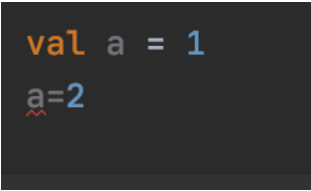
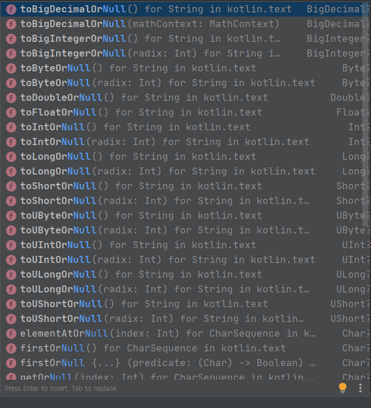
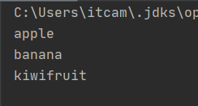
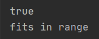
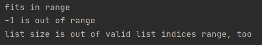

# Kotlin

## 맨땅에 해딩하기.

## Day 01

참고 문헌 - [Kotlin_docs](https://kotlinlang.org/docs/reference/basic-syntax.html)

* 기본적으로 kotlin은 세미콜론 (`;`)을 작성하지 않는다.

* Kotlin에서의 메인문 `(Program entry point)`

  * fun 을 이용하여 함수를 구현

  * 콘솔 디버깅을 위해 사용하는 함수

    ```kotlin
    fun main(){
      // java에서의 main thread 와 같은 문맥
      // Debug 시 해당 블록을 실행한다.
    }
    ```

* Hello world!

  ```kotlin
  fun main(){
    println("Hello, World!")
  }
  ```

  

### 함수 구현

* Kotlin 에서 함수는 다음과 같은 포멧으로 선언이 가능하다

* `fun 함수명(변수:타입, 변수:타입,....):함수반환타입{...}`

* Ex) Int 형 변수 두개를 받아 더하는 값을 반환하는 함수

  ```kotlin
  fun sum(a:Int, b:Int):Int{
    return a+b
  }
  ```

* 함수를 구현과 동시에 선언가능. 

  * 대입연산자(`=`) 를 이용. 이때 함수의 리턴타입은 생략!

  ```kotlin
  fun sum(a:Int,b:Int) = a+b
  ```

* 반환 타입이 없을때!

  1. 반환 타입을 Unit 으로 작성

  ```kotlin
  fun printSum(a: Int, b: Int): Unit {
      println("sum of $a and $b is ${a + b}")
  }
  // 문자열 에서 변수를 사용할때 &변수 로 사용. 함수는 ${함수} 로 사용가능!
  ```

  2. 또는 그냥 생략!

  ```kotlin
  fun printSum(a:Int,b:Int){
    println("sum of $a and $b is ${a + b}")
  }
  ```

### 변수

* 변수는 기본적으로 val 와 var가 있다


1. val : 로컬변수, 처음 선언한 후 변경이 불가능하다. (자바에서 final 과 같은 의미)

   >  docs 에서의 val 정의 : Read-only local variables are defined using the keyword val. They can be assigned a value only once.

   

   ```kotlin
   val a: Int = 1  // immediate assignment
   val b = 2   // `Int` type is inferred
   val c: Int  // Type required when no initializer is provided
   c = 3       // deferred assignment
   ```

   

2. var : 일반적인 변수.

   > Variables that can be reassigned use the `var` keyword

   

   ```kotlin
   var x = 5 // `Int` type is inferred
   x += 1
   ```

### 조건문

* Java 와 동일하게 if, else, else if를 사용!

  ```kotlin
  fun maxOf(a: Int, b: Int): Int {
      if (a > b) {
          return a
      }else if(a==b){
          return 0
      }else{
          return b
      }
  }
  ```

* 위의 함수를 한줄로 선언 가능!

  ```kotlin
  fun maxOf(a:Int,b:Int) = if(a>b) a else if(a<b) b else 0
  ```


### Nullable Value and null checks

*  코틀린에서 `null` 체크는 다음과 같이 `?` 키워드를 사용한다면 해당 값이 널을 허용할 수 있게 된다.

* `?` 키워드가 없다면 해당 값은 `null` 이 될 수 없다.

  ```kotlin
  fun parseInt(str: String): Int?{
      return str.toIntOrNull()
  }
  // 이 함수는 반환값은 Int or null로 될 수 있다. 받은 문자열이 숫자로 반환 될 수 없다면 null 로 반환된다.
  ```

* 문자열 메서드 중에서 `~~OrNull`과 관련된 것들이 상당히 많다.

  

* 위와 같은 매서드 덕분에 Kotlin에서 null point Exception 이 뜰 일이 매우 적을 것 같다!

#### Type Check and automatic casts

* `is` 연산자는 해당 변수의 타입을 체크하여 boolean 값으로 리턴 시켜 준다.

* `변수명 is 체크타입` 

  ```kotlin
  fun getStringLength(obj: Any): Int? {
      if (obj !is String) return null
  
      // `obj` is automatically cast to `String` in this branch
      return obj.length
  }
  
  
  fun main() {
      fun printLength(obj: Any) {
          println("'$obj' string length is ${getStringLength(obj) ?: "... err, not a string"} ")
      }
      printLength("Incomprehensibilities")
      printLength(1000)
      printLength(listOf(Any()))
  }
  ```

  


### loop

#### for

* 파이썬의 for문과 유사함.

  * `listOf()` : 리스트를 만드는 함수

  ```kotlin
  val items = listOf("apple", "banana", "kiwifruit")
  for (item in items) {
      println(item)
  }
  ```

  

#### while

* 일반적인 while문과 동일함.

  ```kotlin
  while(조건){
      조건 참이면 루프진행
  }
  
  	var a = 5
      while(a>0) {
          println(a--)
      }
  ```

  

### when

* `when` 연산자는 Java 에서의 switch 와 같은 구문이다.

* 자바와 다른점은 Type을 굳이 맞출 필요가 없다는 것! (정말 편함..)

  ```kotlin
  fun describe(obj: Any): String =
      when (obj) {
          1          -> "One"
          "Hello"    -> "Greeting"
          is Long    -> "Long"
          !is String -> "Not a string"
          else       -> "Unknown"
      }
  
  fun main() {
      var a: String
      
      a = describe(1)
      println(a)
      a = describe("Hello")
      println(a)
      a = describe(11111111L)
      println(a)
      a = describe(7.55f)
      println(a)
      a = describe("")
      println(a)
  }
  ```

  

### Range

* `in` 연산자 : 해당 변수가 범위안에 있는지 확인 

* 체크하는 변수가 값이 있으면 true or false 체크

  ```kotlin
  var x=10
      var y=9
      println(x in 1..y+1)
      if (x in 1..y+1){
          println("fits in range")
      }
  ```

  

  ```kotlin
  val list = listOf("a", "b", "c")
  
  if (-1 !in 0..list.lastIndex) {
      println("-1 is out of range")
  }
  if (list.size !in list.indices) {
      println("list size is out of valid list indices range, too")
  }
  ```

  

* `in` 으로 체크하는 변수가 비어어있는 경우 대입하여 루프를 돈다.

* 파이썬의 루프와 유사함

  ```kotlin
  for (x in 1..5) {
      print(x)
  }
  ```

  

* 파이썬과 같이 step 을 설정할 수 있다. 

  * `step` : step 설정
  * `downTo` : 감소 범위.
  * `..` : 증가 범위

  ```kotlin
  for (x in 1..10 step 2) {
      print(x)
  }
  println()
  for (x in 9 downTo 0 step 3) {
      print(x)
  }
  ```

  

#### Collections

* 배열에서 반복문을 사용할 때도 `in` 을 이용해서 반복문 사용이 가능하다.

* 자바에서 확장 for 문과 같은 의미이다.

* in Java

  ```java
  Strint[] sets = {"apple", "banana", "kiwifruit"};
  for(String a: sets){
      System.out.println(a);
  }
  ```

* in Kotlin

  ```kotlin
  val items = listOf("apple", "banana", "kiwifruit")
  for(item in items){
      println(item)
  }
  ```

* Collection 에서 해당 객체를 포함을 확인할 떄도 `in` 을 이용한다.

  ```kotlin
  when{
    "orange" in items -> println("juicy")
      "apple" in items -> println("apple is fine too") 
  }
  ```

* Collection 에서는 Java 와 마찬가지로 Stream을 이용할 수 있다.

  ```kotlin
  val fruits = listOf("banana", "avocado", "apple", "kiwifruit")
  fruits
    .filter { it.startsWith("a") }
    .sortedBy { it }
    .map { it.toUpperCase() }
    .forEach { println(it) }
  ```

  